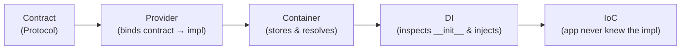

# Lexigram Framework

A comprehensive, structured guide to the Lexigram framework — a **contract-based, async-first, full-stack Python application platform** built on Dependency Injection, Inversion of Control, and the Provider pattern.

---

## 1. Install in 60 Seconds

```bash
pip install lexigram lexigram-web
```

### Hello World — Web API

```python
import asyncio
from lexigram.app import Application
from lexigram.web import Controller, get, WebModule


class HelloController(Controller):
    prefix = "/api"

    @get("/hello")
    async def hello(self) -> dict:
        return {"message": "Hello from Lexigram"}


async def main() -> None:
    async with Application.boot(
        modules=[WebModule.configure(controllers=[HelloController], port=8000)]
    ) as app:
        await asyncio.Event().wait()  # Ctrl+C to stop


asyncio.run(main())
```

### Hello World — Invoker Pattern (non-web)

```python
import asyncio
from lexigram.app import Application
from lexigram.app.invoker import Invoker
from lexigram.di.module import Module, module
from lexigram.logging import get_logger

logger = get_logger(__name__)


@module()
class AppModule(Module):
    pass


async def run(logger) -> None:
    logger.info("doing_work")
    await asyncio.Event().wait()  # keep alive until Ctrl+C


async def main() -> None:
    async with Application.boot(modules=[AppModule]) as app:
        invoker = await app.container.resolve(Invoker)
        await invoker.invoke(run)  # run() receives its deps via DI


asyncio.run(main())
```

> [!NOTE]
> `Application.boot()` is an `@asynccontextmanager` that calls `await app.start()` on entry and `await app.stop()` on exit. For long-running processes you can also use the manual form: `await app.start()` / `await app.stop()`. There is no separate `.serve()` method — the web server starts automatically inside `WebModule`'s provider `boot()` phase.

---

## 2. The Five Pillars — Architecture at a Glance

Everything in Lexigram revolves around five interlocking concepts:

```
Contract    →  "I need something that can cache"              (the interface)
Provider    →  "Here, use Redis for caching"                  (the wiring)
Container   →  "I'll store that and hand it to whoever asks"  (the engine)
DI          →  "I'll inject it into your constructor"         (the delivery)
IoC         →  "You never had to know it was Redis"           (the principle)
```



---

## 3. Package Hierarchy — The Inviolable Rule

```
lexigram-contracts    Zero dependencies. Protocols, types, exceptions only.
    ↑   ↑
    ↑ lexigram           Depends ONLY on lexigram-contracts. Core framework.
    ↑   ↑
    lexigram-*         Extension packages. Depend on lexigram + lexigram-contracts.
```

> [!CAUTION]
> Extension packages **NEVER** import from each other. Cross-extension communication goes through contracts, the container, providers, and IoC.

### The Monorepo — 35+ Packages

| Layer | Representative Packages | Purpose |
|---|---|---|
| **Contracts** | `lexigram-contracts` | Protocols, types, exceptions, domain primitives |
| **Core** | `lexigram` | Container, DI, Result, config, logging, registry |
| **Infrastructure** | `lexigram-sql`, `lexigram-cache`, `lexigram-vector`, `lexigram-nosql`, `lexigram-graph`, `lexigram-storage` | Data and persistence backends |
| **Web** | `lexigram-web`, `lexigram-graphql`, `lexigram-http` | ASGI web, GraphQL, HTTP client |
| **Security** | `lexigram-auth`, `lexigram-security` | JWT/OAuth2, RBAC, encryption |
| **Events & Workflows** | `lexigram-events`, `lexigram-queue`, `lexigram-tasks`, `lexigram-workflow` | CQRS, messaging, workers, orchestration |
| **AI** | `lexigram-ai`, `lexigram-ai-llm`, `lexigram-ai-rag`, `lexigram-ai-agents`, `lexigram-ai-memory`, `lexigram-ai-mcp`, `lexigram-ai-safety`, `lexigram-ai-observability`, `lexigram-ai-platform` | AI/LLM integration, orchestration, and tooling |
| **Operations** | `lexigram-resilience`, `lexigram-monitor` | Circuit breakers, health checks, metrics, monitoring |
| **Productivity** | `lexigram-admin`, `lexigram-cli`, `lexigram-features`, `lexigram-notification`, `lexigram-search`, `lexigram-ui` | Admin UI, CLI, feature flags, notifications, search, UI |
| **Testing** | `lexigram-testing` | Test environments, fakes, clients, harnesses |

### Typical Source Layout

Most packages follow a layout like this, with sub-domains added where needed:

```text
lexigram-<name>/
├── src/lexigram/<name>/
│   ├── __init__.py
│   ├── config.py           ← Package configuration (when the package has runtime config)
│   ├── module.py           ← Module entrypoint for DI composition
│   ├── di/
│   │   └── provider.py     ← Provider(s) and DI wiring
│   ├── exceptions.py       ← Package-specific leaf exceptions
│   └── ...                 ← Implementation modules and sub-packages
├── tests/
└── pyproject.toml
```

---

## 4. Deep Dive: Each Pillar

### 4.1 Contracts (The Interface Boundary)

Contracts are Python `Protocol` classes that define **what** a service does — never **how**. They live exclusively in `lexigram-contracts`.

```python
# lexigram-contracts/src/lexigram/contracts/infra/cache/protocols.py

from typing import Protocol

class CacheBackendProtocol(Protocol):
    """Cache backend contract."""
    
    async def get(self, key: str) -> bytes | None: ...
    async def set(self, key: str, value: bytes, ttl: int | None = None) -> None: ...
    async def delete(self, key: str) -> bool: ...
```

**Where things live in contracts** — organized by domain:

```
lexigram-contracts/src/lexigram/contracts/
├── core/           ← DI, config, health, lifecycle, logging, modules, registry
├── ai/             ← LLM, RAG, memory, agents, routing, governance, guards
├── auth/           ← identities, tokens, policies, auth contracts
├── data/           ← repositories, units of work, SQL/vector/graph-related contracts
├── domain/         ← DDD base classes (Entity, AggregateRoot, ValueObject)
├── events/         ← EventBus, CommandBus, QueryBus, outbox
├── infra/          ← cache, resilience, storage, task/runtime infrastructure
├── notification/   ← inbox, delivery, shared notification types
├── queue/          ← queue protocols and queue-specific types
├── search/         ← search engine contracts and result models
├── web/            ← controller, middleware, request/response abstractions
├── graphql/        ← GraphQL-specific contracts
├── exceptions/     ← base exception hierarchy
└── ...
```

> [!IMPORTANT]
> **The Golden Rule:** If two or more packages need to reference the same type, protocol, or exception, it lives in `lexigram-contracts`. No exceptions.

### 4.2 Container (The Resolution Engine)

The `Container` manages the full dependency graph:

**Source:** `lexigram/src/lexigram/di/container/container.py`

#### Three-Phase Lifecycle

```
┌──────────┐       ┌────────┐       ┌─────────┐
│ REGISTER │ ───►  │ FROZEN │ ───►  │ DISPOSED│
└──────────┘       └────────┘       └─────────┘
  register()        resolve()        (terminal)
  singleton()       create_scope()
  transient()       has()
  scoped()
```

#### Registration Strategies

```python
container = Container()

# Singleton — one instance for the container's lifetime
container.singleton(CacheBackend, RedisCacheBackend(config))

# Transient — new instance on every resolve()
container.transient(RequestContext, RequestContextFactory)

# Scoped — one instance per scope (e.g., per HTTP request)
container.scoped(DatabaseSession, PostgresSessionFactory)

# Factory — callable invoked lazily
container.singleton(UserService, factory=lambda: UserService(deps...))
```

#### Resolution

```python
container.freeze()  # Lock registry, validate dependency graph, enable resolution

service = await container.resolve(UserService)          # Full DI
optional = await container.resolve_optional(UserService) # Returns None if missing
all_impls = await container.resolve_all(BaseHandler)     # All subtypes

# Scoped resolution (per-request)
async with container.scope() as scoped:
    session = await scoped.resolve(DatabaseSession)
    # session is disposed when scope exits
```

#### Validation & Diagnostics

```python
issues = container.validate()         # Missing deps, circular refs, scope violations
orphans = container.validate_no_orphans()  # Dead-code registrations
container.dump_registrations()        # JSON snapshot of all registrations
container.dump_dependency_graph()     # Adjacency map: service → dependencies
```

### 4.3 Provider (The Registration + Lifecycle Unit)

**Source:** `lexigram/src/lexigram/di/provider.py`

```python
from lexigram.di.provider import Provider
from lexigram.contracts.core import ProviderPriority

class CacheProvider(Provider):
    name = "cache"
    priority = ProviderPriority.INFRASTRUCTURE

    async def register(self, container: ContainerRegistrarProtocol) -> None:
        """Bind contracts → implementations. Resolution NOT allowed here."""
        container.singleton(CacheBackend, RedisCacheBackend)

    async def boot(self, container: ContainerResolverProtocol) -> None:
        """Post-registration setup. Resolution IS allowed here."""
        cache = await container.resolve(CacheBackend)
        await cache.connect()

    async def shutdown(self) -> None:
        """Teardown in reverse priority order."""
        await self._cache.disconnect()
        
    async def health_check(self, timeout: float = 5.0) -> HealthCheckResult:
        """Return health status — aggregated by Application.health_check()."""
        return HealthCheckResult(component=self.name, status=HealthStatus.HEALTHY)
```

#### Provider Priority (Boot Order)

| Priority | Value | Examples |
|---|---|---|
| `CRITICAL` | 0 | Logging, configuration, error handling |
| `INFRASTRUCTURE` | 10 | Database, cache, message broker |
| `SECURITY` | 20 | Authentication, encryption, RBAC |
| `NORMAL` | 30 | Default — most application providers |
| `DOMAIN` | 50 | Business logic, domain services |
| `PRESENTATION` | 80 | Web server, API routes, GraphQL |
| `COMMS` | 90 | Email, SMS, push notifications |
| `LOW` | 100 | Analytics, telemetry, monitoring |

#### Lifecycle Phases

| Phase | Order | Container State | What to Do |
|---|---|---|---|
| `register()` | Ascending priority | **Open** (not frozen) | Bind contracts. No resolution. |
| `boot()` | Ascending priority | **Frozen** | Resolve deps, connect to DBs, warm caches |
| `shutdown()` | **Descending** priority | Open | Close connections, flush buffers |

#### Real Extension Example: LLM Provider

**Source:** `lexigram-ai-llm/src/lexigram/ai/llm/di/provider.py`

```python
@inject
class LLMProvider(Provider):
    name = "llm"
    priority = ProviderPriority.DOMAIN

    def __init__(self, config: ClientConfig | None = None, ...) -> None:
        super().__init__(name="llm")
        self.config = config or ClientConfig()  # reads from env by default

    async def register(self, container: ContainerRegistrarProtocol) -> None:
        # Register config
        container.singleton(ClientConfig, self.config)
        
        # Create client from factory
        llm_client = await create_llm_client(self.config, registry)
        
        # Bind to contract — consumers only ever see LLMClientProtocol
        container.singleton(LLMClientProtocol, llm_client)

    async def boot(self, container: ContainerResolverProtocol) -> None:
        # Validate API keys, register in provider registry
        registry = await container.resolve(ProviderRegistryProtocol)
        await registry.register_provider(name=self.config.provider, client=self._llm_client)

    async def shutdown(self) -> None:
        if self._llm_client:
            await self._llm_client.close()
```

### 4.4 DI (Dependency Injection)

The container inspects `__init__` signatures, resolves each parameter by type annotation, and injects automatically:

```python
class OrderService:
    def __init__(
        self,
        repo: OrderRepository,     # ← resolved by type
        events: EventDispatcher,   # ← resolved by type
        logger: LoggerProtocol,    # ← resolved by type
    ):
        self.repo = repo
        self.events = events
        self.logger = logger

# You NEVER write:
order_service = OrderService(repo, events, logger)

# The container does it:
order_service = await container.resolve(OrderService)
```

> [!WARNING]
> **Anti-pattern: Service Locator.** Never pass the container into a constructor. Declare dependencies as typed `__init__` parameters.

### 4.5 IoC (Inversion of Control)

IoC is the governing **principle**: you don't create your dependencies — the framework delivers them.

```python
# ❌ WITHOUT IoC — you control everything
class UserService:
    def __init__(self):
        self.cache = RedisCacheBackend("localhost", 6379)  # coupled to Redis
        self.db = PostgresDB("conn_string")                # coupled to Postgres

# ✅ WITH IoC — framework controls everything
class UserService:
    def __init__(self, cache: CacheBackend, db: DatabaseSession):
        self.cache = cache  # could be Redis, Memcached, or InMemory
        self.db = db        # could be Postgres, SQLite, or a fake
```

---

## 5. The Application — Composition Root

**Source:** `lexigram/src/lexigram/app/base.py`

### Quick Start (Module-Based)

```python
import asyncio
from lexigram.app import Application
from lexigram.di.module import Module, module
from lexigram.web import WebModule

@module(imports=[
    WebModule.configure(controllers=[UserController], port=8000),
])
class AppModule(Module):
    pass

async def main() -> None:
    async with Application.boot(name="my-app", modules=[AppModule]) as app:
        await asyncio.Event().wait()  # web server already running; block until Ctrl+C

asyncio.run(main())
```

### Manual Setup (Provider-Based)

```python
app = Application(name="my-app")
app.add_module(AuthModule.configure(...))
app.add_module(WebModule.configure(controllers=[UserController]))

await app.start()     # compile modules → register providers → boot → RUNNING
await app.stop()      # shutdown providers in reverse priority → dispose container
```

Module-based composition is the primary path. Provider-based bootstrap is available for low-level control.

### Module-Based Composition (Production Style)

```python
@module(imports=[
    WebModule.configure(controllers=[UserController, OrderController]),
    LLMModule.configure(ClientConfig(provider="openai", model="gpt-4o")),
    EventsModule.configure(handler_modules=["myapp.handlers"]),
])
class AppModule(Module):
    pass

async with Application.boot(modules=[AppModule]) as app:
    await asyncio.Event().wait()
```

### Application State Machine

```
CREATED → STARTING → RUNNING → STOPPING → STOPPED
```

Each transition is irreversible. Providers/modules can only be added in `CREATED` state.

---

## 6. The Module System — Encapsulation Boundaries

**Source:** `lexigram/src/lexigram/di/module/base.py`

Modules are the **organizational unit** of a Lexigram application. They group providers and define visibility boundaries.

### Basic Module

```python
from lexigram.di.module import Module, module

@module()
class AuthModule(Module):
    providers = [AuthProvider, TokenProvider, PasswordHasherProvider]
    imports   = [DatabaseModule]                      # we depend on these
    exports   = [AuthServiceProtocol, TokenManager]   # we expose these
```

- Services are **private by default** — only `exports` are visible to importing modules
- `imports` declares which other modules this module depends on
- `is_global = True` makes exports visible to **all** modules

### Common Factory Methods

Many integration modules expose a small factory surface for root composition and testing. `configure()` is the canonical production entry point; `stub()` is the canonical test entry point. `scope()` is reserved for feature-scoped sub-registrations on packages that explicitly support it, such as `EventsModule`.

| Method | Purpose | Example |
|---|---|---|
| `configure(...)` | Production setup with explicit config | `LLMModule.configure(config)` |
| `scope(...)` | Feature-scoped sub-registrations when a package supports them | `EventsModule.scope(Handler1, Handler2)` |
| `stub(...)` | Test-mode with in-memory/noop backends when available | `LLMModule.stub()` |

#### `configure()` — Production Configuration

```python
# lexigram-ai-llm/src/lexigram/ai/llm/module.py

@module()
class LLMModule(Module):
    @classmethod
    def configure(cls, config=None, enable_streaming=True) -> DynamicModule:
        return DynamicModule(
            module=cls,
            providers=[LLMProvider(config=config, enable_streaming=enable_streaming)],
            exports=[LLMClientProtocol],  # only the contract is visible
        )
```

#### `scope()` — Feature-Scoped Registration

```python
# Register handlers for a specific feature without duplicating the module
@module(imports=[
    EventsModule.configure(config),
    EventsModule.scope(
        CreateOrderHandler,
        GetOrderHandler,
        OrderShippedHandler,
    ),
])
class OrderFeatureModule(Module):
    pass
```

#### `stub()` — Test Configuration

```python
# Tests use in-memory backends, no network calls
@module(imports=[
    LLMModule.stub(),          # No-op LLM client
    EventsModule.stub(),       # In-memory event store
    WebModule.stub(),          # No real HTTP server
])
class TestAppModule(Module):
    pass
```

### DynamicModule

`DynamicModule` is the return type of factory methods. It's a data descriptor carrying providers, exports, and imports:

```python
DynamicModule(
    module=cls,               # The module class (identity token)
    providers=[MyProvider()], # Provider instances to register
    exports=[SomeProtocol],   # Contracts to expose
    imports=[OtherModule],    # Dependencies
    is_global=False,          # True = exports visible everywhere
)
```

---

## 7. The Registry Pattern — Extensible Dispatch

**Source:** `lexigram/src/lexigram/primitives/registry/core.py`

The `Registry` replaces `if/elif` chains with a data-driven, extensible collection:

### Base Registry

```python
from lexigram.primitives.registry import Registry

# Type-safe key→value collection
handler_registry = Registry[str, type]("handlers")

handler_registry.register("create_order", CreateOrderHandler)
handler_registry.register("cancel_order", CancelOrderHandler)

# Resolve by key — raises RegistryKeyError if missing
handler_cls = handler_registry.resolve("create_order")

# Decorator registration
@handler_registry.register("ship_order")
class ShipOrderHandler: ...
```

### Three Registry Variants

| Variant | Key→Value | Use Case |
|---|---|---|
| **`Registry[K, V]`** | Generic key→value | General-purpose collections |
| **`BackendRegistry`** | `str → BackendClass` | Swappable backends (cache, storage, DB) — has `select(config)` |
| **`StrategyRegistry`** | `key → StrategyClass` | Pluggable algorithms (chunking, retrieval) — has `instantiate(key)` |

### BackendRegistry

```python
class CacheBackendRegistry(BackendRegistry):
    def __init__(self):
        super().__init__(name="cache.backends")
        self.register("redis", RedisCacheBackend)
        self.register("memory", MemoryCacheBackend)

registry = CacheBackendRegistry()
backend_cls = registry.select({"type": "redis", "url": "redis://..."})
# Returns RedisCacheBackend (first whose can_create(config) returns True)
```

### StrategyRegistry

```python
class ChunkingRegistry(StrategyRegistry):
    def __init__(self):
        super().__init__(name="chunking.strategies")
        self.register("fixed", FixedSizeChunker)
        self.register("semantic", SemanticChunker)

registry = ChunkingRegistry()
chunker = registry.instantiate("fixed", chunk_size=512)
```

### Registry Features

- **Thread-safe**: Internal `Lock` on all mutations
- **Freezable**: `registry.freeze()` prevents further registrations after boot
- **Lazy factories**: `register_factory(key, lambda: expensive())` — instantiated on first `get()`
- **Priority ordering**: `values_ordered()` sorts by a configurable priority key
- **Lifecycle hooks**: `@on_register` and `@on_unregister` decorators for side effects

---

## 8. The Result Pattern — Explicit Error Handling

**Source:** `lexigram/src/lexigram/result/types.py`

### When to Use What

> **Definitive rule:** Use `Result[T, E]` when the failure is a valid caller-handled
> business outcome. Raise an exception when the failure is unexpected
> infrastructure collapse or a programming bug.

| Use `Result[T, E]` | Use Exceptions |
|---|---|
| User not found, validation failed | Database connection lost |
| Payment declined, insufficient permissions | Network timeout, OOM |
| Business rule violation | Serialization bug |
| Any failure the **caller should handle** | Any failure that should **propagate up** |

### Basic Usage

```python
from lexigram.result import Result, Ok, Err

async def find_user(self, user_id: str) -> Result[User, DomainError]:
    user = await self.repo.get(user_id)
    if not user:
        return Err(UserNotFound(user_id))
    return Ok(user)

# Explicit handling:
result = await service.find_user("user-123")
if result.is_ok():
    user = result.unwrap()
else:
    error = result.unwrap_err()
```

### Rich Monadic API

Lexigram's `Result` is **async-first**: the plain method names (`map`, `and_then`, `or_else`) are async and accept awaitables. Methods that take sync callables carry the `_sync` suffix.

```python
# Async transform — awaitable callable
profile = await result.map(load_profile)               # async version
order   = await result.and_then(create_order_for_user) # Result[Order, E]
fallback = await result.or_else(try_secondary_source)  # recover async

# Sync transform — use _sync suffix
email = result.map_sync(lambda user: user.email)       # Ok(email) or Err unchanged
item  = result.and_then_sync(validate_user)            # sync chain

# Exhaustive matching
msg = result.match(
    ok=lambda user: f"Welcome, {user.name}",
    err=lambda error: f"Error: {error.message}",
)

# Safe extraction
user = result.unwrap_or(guest_user)                    # default on Err
user = result.unwrap_or_else(lambda e: create_default(e))

# Conditional filter
active = result.filter(lambda u: u.is_active, UserInactiveError())

# Side-effects without transformation
result.inspect(lambda u: logger.info("found", id=u.id))
result.inspect_err(lambda e: logger.warning("failed", error=str(e)))

# Flatten nested Results
nested: Result[Result[str, E], E] = Ok(Ok("hello"))
flat = nested.flatten()  # Ok("hello")

# Bridge from exceptions
try:
    data = json.loads(raw)
except ValueError as e:
    return Result.from_exception(e)
```

---

## 9. The Web Layer

The `lexigram-web` package provides a full ASGI web framework with controllers, decorators, and automatic DI.

### Controllers

**Sources:** `lexigram-web/src/lexigram/web/routing/controllers.py` and `lexigram-web/src/lexigram/web/routing/controller.py`

```python
from lexigram.web import Controller, get, post, put, delete, json_response
from lexigram.result import Result, Ok

class UserController(Controller):
    prefix = "/api/v1/users"

    def __init__(self, service: UserServiceProtocol) -> None:
        # Dependencies injected via the container
        self.service = service

    @get("/")
    async def list_users(self, limit: int = 20, offset: int = 0) -> Result:
        return await self.service.list_users(limit=limit, offset=offset)

    @get("/{user_id}")
    async def get_user(self, user_id: str) -> Result:
        return await self.service.get_user(user_id)

    @post("/")
    async def create_user(self, data: CreateUserDTO) -> Any:
        result = await self.service.create(data)
        if result.is_ok():
            return json_response(result.unwrap(), status_code=201)
        return result

    @delete("/{user_id}")
    async def delete_user(self, user_id: str) -> Any:
        result = await self.service.delete(user_id)
        if result.is_ok():
            return json_response({}, status_code=204)
        return result
```

### Route Decorators

**Source:** `lexigram-web/src/lexigram/web/routing/decorators.py`

```python
@get("/path")         # GET request
@post("/path")        # POST request  
@put("/path")         # PUT request
@delete("/path")      # DELETE request
@patch("/path")       # PATCH request
@websocket("/ws")     # WebSocket
```

### Result → HTTP Bridge

Controllers can return `Result[T, E]` directly. The framework's `ResultResponseMapper` converts common contract errors automatically:

- `Ok(value)` → **200** JSON response
- `Err(NotFoundError)` → **404**
- `Err(ValidationError)` → **422**
- `Err(ConflictError)` → **409**
- `Err(DomainError)` → **400** by default

```python
from lexigram.contracts.exceptions.domain import DomainError
from lexigram.web import Controller, error_status

class ItemNotFound(DomainError): ...
class DuplicateEmail(DomainError): ...

@error_status(DuplicateEmail, 409)
class UserController(Controller):
    ...
```

### GenericController — CRUD in 5 Lines

```python
class ProductController(GenericController[Product]):
    prefix = "/api/v1/products"

    def __init__(self, service: CRUDServiceProtocol[Product]) -> None:
        super().__init__(service, resource_name="product")
    # Inherits: list_items, get_item, create_item, update_item, delete_item
```

### WebModule Registration

**Source:** `lexigram-web/src/lexigram/web/module.py`

```python
# Explicit controller registration
WebModule.configure(
    controllers=[UserController, OrderController],
    host="0.0.0.0",
    port=8000,
)

# Auto-discover controllers from packages
WebModule.configure(discover=["myapp.api.v1", "myapp.api.v2"])

# Test mode — no real server
WebModule.stub()
```

---

## 10. Configuration System

**Source:** `lexigram/src/lexigram/config/__init__.py`

Configuration is a **service**, not a global constant. It flows through the container like any other dependency.

### Multi-Source Loading

```python
from lexigram.config import LexigramConfig

# Reads from: YAML files → .env files → environment variables → CLI args
config = LexigramConfig.from_env_profile()
```

Sources (in priority order, highest wins):
1. **CLI arguments** (`CliConfigSource`)
2. **Environment variables** (`EnvironmentConfigSource`)
3. **`.env` files** (`DotEnvSource`)
4. **YAML/JSON files** (`FileConfigSource`, `DirectoryConfigSource`)

### Package Configuration Pattern

Every extension package defines its own config class:

```python
# lexigram-ai-llm/src/lexigram/ai/llm/config.py
@dataclass
class ClientConfig:
    provider: str = "openai"
    model: str = "gpt-4o"
    api_key: SecretStr | None = None
    enabled: bool = True
    enable_cache: bool = False
```

Config is registered in the provider and injected via the container:

```python
container.singleton(ClientConfig, self.config)
# Then any service can receive it:
class MyService:
    def __init__(self, config: ClientConfig): ...
```

### Key Config Components

| Component | Purpose |
|---|---|
| `LexigramConfig` | Root config — merges all sources |
| `BaseConfig` | Base class for typed config sections |
| `ConfigLoader` | Loads and merges from multiple sources |
| `ConfigRegistry` | Registry of all config sections |
| `ConfigWatcher` | Hot-reload support (watches files for changes) |

---

## 11. The AI Subsystem

Lexigram includes a full **AI/LLM platform**:

| Package | What it provides |
|---------|-----------------|
| `lexigram-ai` | AI orchestration layer — discovers and wires AI sub-packages via `AIModule` and entry-point discovery |
| `lexigram-ai-llm` | Multi-provider LLM client (OpenAI, Anthropic, Google, Ollama, etc.) |
| `lexigram-ai-rag` | RAG pipelines (document loading, chunking, retrieval, synthesis) |
| `lexigram-ai-agents` | Agent execution (ReAct, plan-and-execute, tool use) |
| `lexigram-ai-memory` | Memory systems (working, episodic, semantic, consolidation) |
| `lexigram-ai-mcp` | Model Context Protocol integration |
| `lexigram-ai-safety` | Guard pipelines, governance controls, and feedback workflows |
| `lexigram-ai-observability` | AI-specific tracing, token metrics, and latency instrumentation |
| `lexigram-ai-platform` | Prompt, session, skills, and worker-oriented platform services |

### Architecture Rules

- All AI packages depend **only** on `lexigram` + `lexigram-contracts`
- AI packages do **NOT** import from each other
- Shared types (`ChatMessage`, `Role`, `Document`, `SearchResult`) live in contracts
- Cross-AI communication goes through protocols resolved via the container
- `lexigram-ai` discovers sub-packages via `lexigram.ai.subsystems` entry points

### LLM Usage Pattern

```python
# Module composition
@module(imports=[
    LLMModule.configure(ClientConfig(provider="anthropic", model="claude-3-5-sonnet"))
])
class AppModule(Module): pass

# Service depends only on the contract
class AnalysisService:
    def __init__(self, llm: LLMClientProtocol) -> None:
        self.llm = llm

    async def analyze(self, text: str) -> Result[Analysis, AIError]:
        response = await self.llm.complete(
            messages=[ChatMessage(role=Role.USER, content=f"Analyze: {text}")],
            model="claude-3-5-sonnet",
        )
        return Ok(Analysis(response.content))
```

---

## 12. Domain Modeling — DDD Building Blocks

| Concept | Base Class | Identity | Mutability |
|---|---|---|---|
| **Value Object** | `ValueObject` | By value | Immutable (frozen) |
| **Entity** | `Entity` | By ID | Mutable |
| **Aggregate Root** | `AggregateRoot` | By ID | Mutable, owns events |
| **Domain Event** | `DomainEvent` | By event ID | Immutable |

```python
@dataclass(frozen=True)
class Money(ValueObject):
    amount: Decimal
    currency: str

class Order(AggregateRoot):
    user_id: str
    items: list[OrderItem]

    def place(self) -> None:
        self.status = "placed"
        self.add_event(OrderPlaced(order_id=str(self.id)))
```

---

## 13. Error Architecture

### Two-Track Strategy

| Domain (Expected) | Infrastructure (Unexpected) |
|---|---|
| → Return `Result[T, E]` | → Raise Exception |
| → Caller handles | → Propagates up stack |
| → Maps to 4xx HTTP | → Maps to 5xx HTTP |
| `UserNotFound`, `ValidationFailed` | `DatabaseError`, `NetworkTimeout` |

### Streaming Rule

- Use `Err(...)` when a stream cannot be established at all.
- Once streaming starts, return `AsyncStream[T, E]` so terminal operations like
  `collect()`, `first()`, and `drain()` surface typed mid-stream failures.
- Plain `async for` iteration is still supported; inspect `stream.error` after
  iteration if you need to know whether the stream ended early because of an error.

### Exception Hierarchy

```
LexigramError (contracts)
├── DomainError
│   ├── NotFoundError, ValidationError, ConflictError
├── InfrastructureError
│   ├── DatabaseError, LockError
├── ContainerError
│   ├── CircularDependencyError, UnresolvableDependencyError
├── ProviderError
│
├── ai/errors.py:
│   ├── AIError (base only)
│   ├── LLMError (base) ← leaf exceptions in lexigram-ai-llm
│   ├── RAGError (base) ← leaf exceptions in lexigram-ai-rag
│   └── MemoryError (base) ← leaf exceptions in lexigram-ai-memory
│
├── agents/errors.py:
│   ├── AgentError, ToolError, StrategyError
```

**Rule:** Base exceptions in `lexigram-contracts`, leaf exceptions in extension packages.

---

## 14. Testing

### TestEnvironment

```python
from lexigram.contracts.infra.cache import CacheBackendProtocol
from lexigram.testing import FakeCache, TestEnvironment

async def test_user_service():
    env = TestEnvironment("user-service")
    env.override(CacheBackendProtocol, FakeCache())

    async with env:
        service = await env.container.resolve(UserService)
        result = await service.get_user("user-123")
        assert result.is_ok()
        assert result.unwrap().id == "user-123"
```

### Module-Level Testing with `stub()`

```python
@module(imports=[
    LLMModule.stub(),       # No-op LLM
    EventsModule.stub(),    # In-memory events
    DatabaseModule.stub(),  # In-memory DB
])
class TestModule(Module): pass

async def test_with_modules():
    async with Application.boot(modules=[TestModule]) as app:
        service = await app.container.resolve(MyService)
        # Full integration test with faked infrastructure
```

### Principles

- Same DI in tests and production
- Fake at the **contract boundary** — not implementation internals
- Each `TestEnvironment` is isolated — no global state pollution

---

## 15. End-to-End Application Example

Putting it all together — a realistic application composition:

```python
import asyncio
from lexigram.app import Application
from lexigram.di.module import Module, module

@module(imports=[
    # Infrastructure
    DatabaseModule.configure(url="postgresql://..."),
    CacheModule.configure(backend="redis", url="redis://..."),
    
    # Security
    AuthModule.configure(jwt_secret="...", providers=["google", "github"]),
    
    # Web
    WebModule.configure(
        controllers=[UserController, OrderController, ProductController],
        port=8000,
    ),
    
    # Events / CQRS
    EventsModule.configure(handler_modules=["myapp.handlers"]),
    EventsModule.scope(OrderPlacedHandler, PaymentReceivedHandler),
    
    # AI
    LLMModule.configure(ClientConfig(provider="openai", model="gpt-4o")),
    
    # Resilience
    ResilienceModule.configure(circuit_breaker_threshold=5),
])
class AppModule(Module):
    pass


async def main() -> None:
    async with Application.boot(name="my-platform", modules=[AppModule]) as app:
        app.logger.info("platform_running", port=8000)
        await asyncio.Event().wait()  # Serve until Ctrl+C


if __name__ == "__main__":
    asyncio.run(main())
```

---

## 16. Common Anti-Patterns

| ❌ Don't | ✅ Do Instead |
|---|---|
| Import concrete classes in application code | Import contracts from `lexigram-contracts` |
| Call `container.resolve()` inside `register()` | Use `boot()` for anything requiring resolution |
| Pass the container into a service | Declare typed `__init__` parameters |
| Use module-level singletons | Register in a provider |
| Call `result.unwrap()` without checking | Use `unwrap_or()`, `match()`, or check `is_ok()` first |
| Wrap infrastructure exceptions in `Result` | Let `DatabaseError` propagate as an exception |
| Use `if/elif` for type dispatch | Use a `Registry` |
| Import between extension packages | Use contracts + container |
| Define shared types in extension packages | Move to `lexigram-contracts` |
| Use bare classes for enums | Use `class X(str, Enum)` |
| `import logging` / `logging.getLogger(...)` | `from lexigram.logging import get_logger` then `get_logger(__name__)` |
| `await app.serve()` — no such method | Keep the loop alive with `await asyncio.Event().wait()` |
| Relative imports (`from .utils import ...`) | Absolute imports only (`from lexigram.web.utils import ...`) |

---

## 17. Quick Reference — Commands

```bash
# Install all deps
uv sync

# Lint + Format
uv run ruff check . --fix && uv run ruff format .

# Type Check
uv run mypy lexigram/src/

# Test
uv run pytest --tb=short
uv run pytest lexigram-web/tests/ -v             # One package
uv run pytest -k "test_user" -v                  # Pattern match
uv run pytest -m "not integration"               # Skip integration

# Full CI
uv run ruff check . && uv run ruff format --check . && uv run mypy lexigram/src/ && uv run pytest --tb=short --cov-fail-under=80
```

---

## 18. Key Source Files — Reading Order

| # | File | What You'll Learn |
|---|---|---|
| 1 | `lexigram-contracts/src/lexigram/contracts/core/di.py` | Container protocols — the DI contract |
| 2 | `lexigram/src/lexigram/di/provider.py` | Provider base class — lifecycle hooks, priority |
| 3 | `lexigram/src/lexigram/di/container/container.py` | Container — registration, resolution, scoping, validation |
| 4 | `lexigram/src/lexigram/result/types.py` | `Ok`, `Err` — full monadic API |
| 5 | `lexigram/src/lexigram/app/base.py` | Application — composition root, boot sequence |
| 6 | `lexigram/src/lexigram/di/module/base.py` | Module base class and default factory helpers |
| 7 | `lexigram/src/lexigram/primitives/registry/core.py` | Registry — extensible dispatch, backend/strategy variants |
| 8 | `lexigram-ai-llm/src/lexigram/ai/llm/module.py` | Real extension module — configure/stub pattern |
| 9 | `lexigram-ai-llm/src/lexigram/ai/llm/di/provider.py` | Real extension provider — register/boot/shutdown/health |
| 10 | `lexigram-web/src/lexigram/web/routing/controllers.py` | Controller base class and web routing conventions |
| 11 | `lexigram-events/src/lexigram/events/module.py` | Events module — CQRS buses, scope pattern |
| 12 | `lexigram/src/lexigram/__init__.py` | Root exports — lazy-loaded public API |

---

## 19. Glossary

| Term | Definition |
|---|---|
| **Aggregate Root** | Consistency boundary that owns entities and emits domain events |
| **Binding** | Association between a contract (protocol) and its concrete implementation |
| **Composition Root** | The single location where the dependency graph is assembled (`Application`) |
| **Contract** | A `Protocol` defining a service's public API without implementation |
| **DynamicModule** | Data descriptor returned by `configure()`/`scope()`/`stub()` factory methods |
| **Freeze** | Irreversible container transition from registration to resolution phase |
| **Provider** | Class that registers bindings and manages service lifecycle (register → boot → shutdown) |
| **Registry** | Type-safe key→value collection for extensible dispatch |
| **Result** | Type representing either success (`Ok`) or failure (`Err`) — used for domain errors |
| **Scope** | Isolated child container with its own scoped-lifetime instances (e.g., per-request) |
