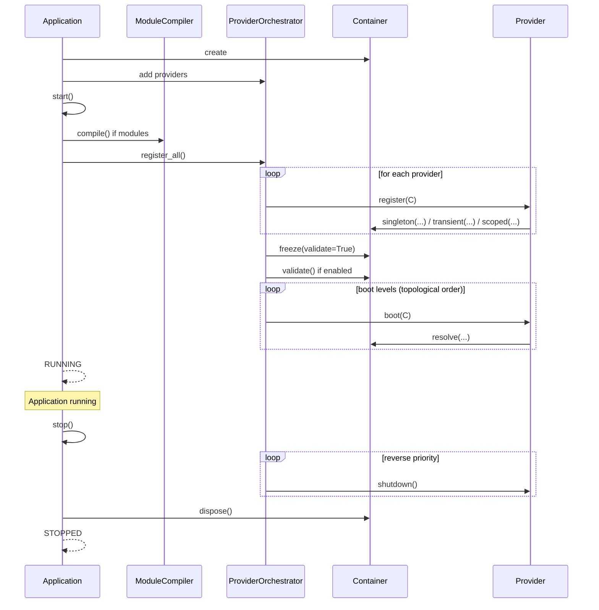

# Architecture

---

## Role in the System

`lexigram` is the **core package** — the foundation that every extension package builds on. It provides the DI container, application lifecycle, provider pattern, configuration system, and the `Result` type.

```
Extension packages (lexigram-web, lexigram-sql, …)
         ↑ depends on
    ┌────┴────┐
    │ lexigram │  ← DI container, Application, Provider, Module, Config, Result
    └────┬────┘
         ↑ depends on
    ┌────┴────────┐
    │ lexigram-contracts │  ← Protocols, types, exceptions (zero deps)
    └─────────────────┘
```

---

## Key Components

```
┌────────────────────────────────────────────────────┐
│                    Application                      │
│  ┌──────────┐  ┌────────────────┐  ┌────────────┐ │
│  │Container │  │ProviderOrch.   │  │ Invoker    │ │
│  │          │  │                │  │            │ │
│  │ register │  │ sort by        │  │ DI function│ │
│  │ resolve  │  │ priority+deps  │  │ calling    │ │
│  │ validate │  │ boot/shutdown  │  │            │ │
│  └────┬─────┘  └────────────────┘  └────────────┘ │
│       │                                              │
│  ┌────┴──────────────────────────────────────┐       │
│  │            MiddlewarePipeline              │       │
│  └───────────────────────────────────────────┘       │
│                                                      │
│  ┌──────────────────────────────────────────┐        │
│  │          LexigramConfig                  │        │
│  │  app_name, debug, env, logging, modules  │        │
│  └──────────────────────────────────────────┘        │
└──────────────────────────────────────────────────────┘
```

### Container (`lexigram.di.container`)

The IoC container is a facade coordinating:

| Sub-component | Responsibility |
|---|---|
| `ServiceRegistry` | Stores bindings (service type → descriptor) |
| `ServiceResolver` | Resolves typed dependencies recursively |
| `DependencyInjector` | Creates instances with constructor injection |
| `ContainerRegistrarImpl` | Write operations (singleton, transient, scoped) |
| `ContainerResolverImpl` | Read operations (resolve, resolve_optional, resolve_all) |
| `ContainerValidator` | Pre-flight validation (missing deps, circular refs, scope violations) |
| `FunctionInvoker` | Auto-injects arguments when calling functions |
| `TypeHintResolverImpl` | Resolves type hints with caching |

**Service scopes:**

| Scope | Lifetime | Registration Method |
|-------|----------|-------------------|
| `SINGLETON` | One instance for the container lifetime | `container.singleton(T, instance)` or `container.singleton(T, factory=factory)` |
| `TRANSIENT` | New instance per resolution | `container.transient(T, factory)` |
| `SCOPED` | One instance per scope context | `container.scoped(T, factory)` |

**Lifecycle:**

```
Register ──► Freeze ──► Resolve ──► Dispose
                  │
              validate()
```

### Provider (`lexigram.di.provider`)

The `Provider` base class defines the lifecycle contract:

| Field | Type | Default | Description |
|-------|------|---------|-------------|
| `name` | `str` | `""` (auto-derived from class name) | Unique identifier |
| `priority` | `ProviderPriority` | `NORMAL` | Boot ordering |
| `dependencies` | `tuple[str, ...]` | `()` | Named provider dependencies |
| `required` | `bool` | `True` | Fatal if boot fails |
| `config_key` | `str \| None` | `None` | Config section to inject |
| `config_model` | `type \| None` | `None` | Config model class |

**Extension point:** Subclass `Provider` and override lifecycle hooks. Providers are discovered via `app.discover_providers()` or added explicitly via `app.add_provider()`.

### Module (`lexigram.di.module`)

Modules provide encapsulation over groups of providers:

| Component | Purpose |
|---|---|
| `@module` decorator | Attaches `ModuleMetadata` to a class |
| `Module` base class | `ClassVar` defaults, `configure()`, `scope()`, `stub()` factory methods |
| `DynamicModule` | Runtime-created module descriptor |
| `ModuleCompiler` | Compiles the module graph into an ordered provider list |
| `ModuleMetadata` | Stores providers, imports, exports, scan paths |

**Visibility rules:**
- Services in a module are **private** by default
- Only types listed in `exports` are resolvable by importing modules
- `@global_module` exports are visible to all modules without `imports`

### Result (`lexigram.result`)

Re-exports from `lexigram.contracts.core.result`. The `Result[T, E]` type is a discriminated union:

```python
class Result(Generic[T, E]):
    def is_ok(self) -> bool: ...
    def is_err(self) -> bool: ...
    def unwrap(self) -> T: ...         # raises UnwrapError on Err
    def unwrap_err(self) -> E: ...
    def unwrap_or(self, default: T) -> T: ...
    def map(self, fn) -> Result[U, E]: ...      # async
    def map_sync(self, fn) -> Result[U, E]: ... # sync
    def and_then(self, fn) -> Result[U, E]: ... # async
    def and_then_sync(self, fn) -> Result[U, E]: ...
    def match(self, *, ok, err) -> U: ...
    def inspect(self, fn) -> Self: ...
    def inspect_err(self, fn) -> Self: ...
    def flatten(self) -> Result[T, E]: ...
    @staticmethod
    def from_exception(exc) -> Result[Never, Exception]: ...
```

### Config (`lexigram.config`)

Configuration loading uses a layered source model:

```
Sources (ordered by priority, later wins):
  1. Class defaults (LexigramConfig fields)
  2. YAML file (application.yaml)
  3. Additional YAML/files via ConfigLoader
  4. Environment variables (LEX_<KEY>)
  5. .env file
  6. CLI options
         │
         ▼
   LexigramConfig (Pydantic/BaseConfig model)
         │
         ▼
   Container singleton (LexigramConfig + ConfigProtocol)
```

`ConfigProvider` (priority `CRITICAL`) loads config during `register()` — this is the one **intentional exception** to the rule that providers shouldn't do I/O in `register()`.

---

## Providers

**Core providers** (included with `lexigram`):

| Provider | Name | Priority | Registers |
|----------|------|----------|-----------|
| `ConfigProvider` | `"config"` | `CRITICAL` | `LexigramConfig`, `ConfigProtocol` |
| `CoreProvider` | `"core"` | `INFRASTRUCTURE` | Core infrastructure services |
| `CoreInfrastructureProvider` | `"common"` | `INFRASTRUCTURE` | Ambient primitives (clock, identity, hashing) |
| `LoggingProvider` | `"logging"` | `INFRASTRUCTURE` | `LoggerProtocol`, structlog config |
| `IdentityProvider` | `"identity"` | `INFRASTRUCTURE` | ID generation |
| `MiddlewareProvider` | `"middleware"` | `INFRASTRUCTURE` | Middleware chain |
| `DiProvider` | `"di"` | `INFRASTRUCTURE` | DI system extensions |

---

## Contracts Used

`lexigram` depends on protocols from `lexigram-contracts`:

| Protocol | Import | Used By |
|----------|--------|---------|
| `ContainerRegistrarProtocol` | `lexigram.contracts.core.di` | `Provider.register()` parameter |
| `ContainerResolverProtocol` | `lexigram.contracts.core.di` | Resolution API |
| `BootContainerProtocol` | `lexigram.contracts.core.di` | `Provider.boot()` parameter |
| `ConfigProtocol` | `lexigram.contracts.core.config` | `LexigramConfig` implements this |
| `ProviderPriority` | `lexigram.contracts.core.provider` | `Provider.priority` field |
| `HealthCheckResult` | `lexigram.contracts.core.health` | `Provider.health_check()` return |
| `ClockProtocol` | `lexigram.contracts.core.clock` | Ambient clock capability |
| `IdGeneratorProtocol` | `lexigram.contracts.core.identity` | Identity generation |
| `LoggerProtocol` | (lexigram.logging) | Structured logging |

---

## Lifecycle

### Application Boot Sequence



### Error Handling During Boot

If any provider's `boot()` raises, all previously booted providers are shut down in reverse order, and the application transitions to `STOPPED`. The `on_error(error, phase)` hook is called for each failed provider.

### Middleware Pipeline

The `MiddlewarePipeline` wraps function calls via the `Invoker`. Middleware is ordered and applied around every `invoker.invoke()` call.

---

## Extension Points

| Extension | How | Example |
|-----------|-----|---------|
| Custom Provider | Subclass `Provider` | Create a provider for your domain services |
| Custom Module | `@module()` decorator | Encapsulate a vertical slice |
| Config Source | Implement `ConfigSourceProtocol` | Load from Vault, SSM, custom backend |
| Resolution Strategy | Implement `ResolutionStrategy` | Custom annotation-based injection |
| Interceptor | Register on `InterceptorRegistry` | AOP around service resolution |
| Service Registration | `container.singleton()` | Bind any protocol to an implementation |
| Middleware | Implement `MiddlewareProtocol` | Logging, tracing, auth around function calls |
