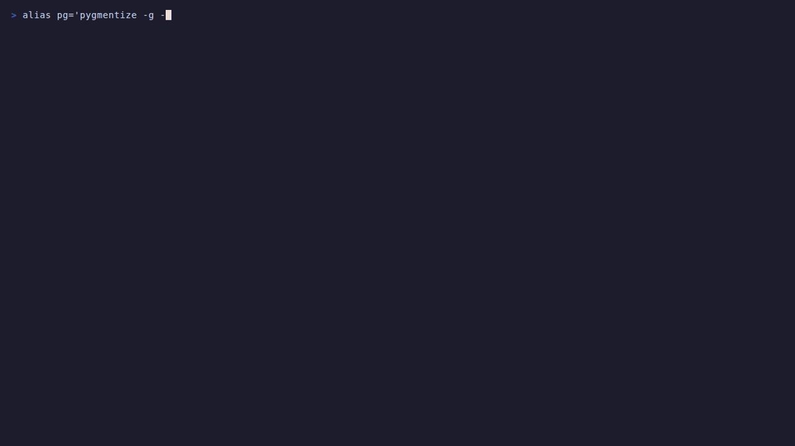

# oridecon

Async-first DI/IoC framework for Python — core package.



---

## Overview

Oridecon is the foundation package for the wider Oridecon ecosystem. It provides the
DI/IoC container, application lifecycle, configuration system, provider protocol,
exception hierarchy, and structured logging foundation.

Async-first by design: application boot, provider lifecycle, I/O paths, and
resolution workflows are built for async Python. Use `Application.boot(...)` to
assemble modules and providers into a running app.

## Install

```bash
uv add oridecon
# Optional extras
uv add "oridecon[security]"
```

## Quick Start

```python
from oridecon import Application
from oridecon.di.module import Module, module
from oridecon.app.standard import StandardModule


@module(imports=[StandardModule.configure()])
class AppModule(Module):
    pass


async with Application.boot(modules=[AppModule]) as app:
    # use app.container to resolve services
    ...
```

## Configuration

> **Zero-config usage:** Call `StandardModule.configure()` with no arguments to use defaults.

### Option 1 — YAML file

```yaml
# application.yaml
app_name: my-app
debug: false
```

### Option 2 — Profiles + Environment Variables *(recommended)*

```bash
export ORI_PROFILE=production
# Environment variables for each field
```

### Option 3 — Python

```python
from oridecon.config.main import OrideconConfig

config = OrideconConfig(...)
StandardModule.configure(config_class=OrideconConfig)
```

## Module Factory Methods

| Method | Description |
|--------|-------------|
| `StandardModule.configure(...)` | Configure with explicit config, sources, or overrides |
| `StandardModule.build_providers()` | Provider list for `Application.boot(providers=[...])` |
| `CoreModule.configure(...)` | Stripped-down kernel without serialization or concurrency |

## Key Features

- **DI Container** — register services as singleton, transient, or scoped; resolve via `await container.resolve(ServiceType)`
- **Provider Lifecycle** — `register()`, `boot()`, `shutdown()` hooks with priority ordering
- **Result Pattern** — `Result[T, E]` for expected domain failures, exceptions for infrastructure errors
- **Module System** — compose applications from reusable modules with explicit exports
- **Structured Logging** — structlog-based logging via `get_logger(__name__)`
- **Configuration** — Pydantic-based config with YAML, environment variables, and profile support

## Testing

```python
async with Application.boot(modules=[StandardModule.configure()]) as app:
    # your test code
    ...
```

## Key Source Files

| File | What it contains |
|------|-----------------|
| `src/oridecon/app/base.py` | Application lifecycle and boot flow |
| `src/oridecon/app/standard.py` | StandardModule.configure() with all kernel providers |
| `src/oridecon/di/container/container.py` | Container registration, scope, and diagnostics |
| `src/oridecon/result/` | Result, Ok, Err, and helpers |
| `src/oridecon/config/main.py` | OrideconConfig and configuration system |
