# shorts-creator — Architecture

Short-form (Reels/Shorts) video creation app built on the **Lexigram** framework:
an htmx server-rendered web UI drives an async render pipeline that turns an
LLM-generated *idea* + *script* into a narrated, captioned 1080×1920 MP4 using
local TTS (Chatterbox), word-level timing (Whisper), stock footage (Pixabay /
Pexels), and ffmpeg composition.

> Everything here is grounded in the current code. File paths are relative to
> this repo root (`shorts-creator/`).

---

## 1. High-Level View

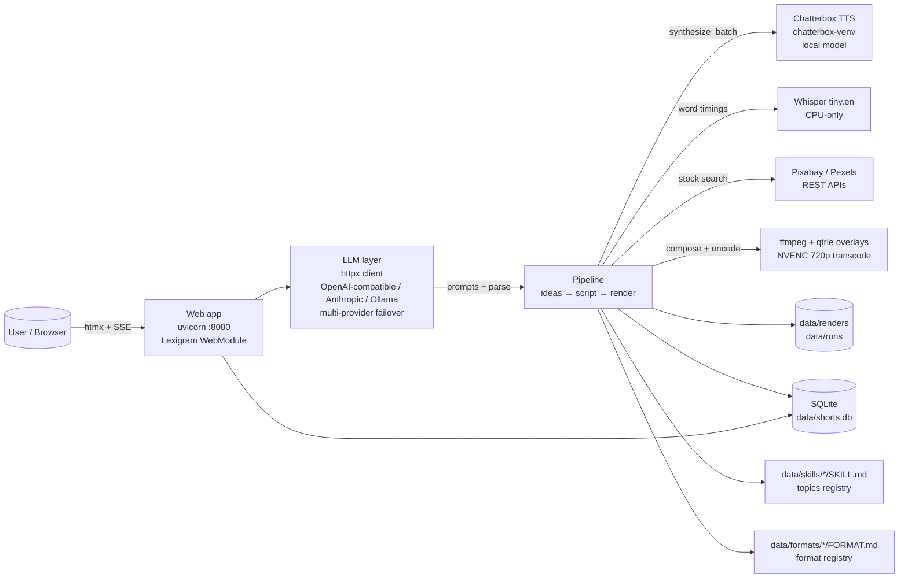

**Key facts**

| Aspect | Value |
|---|---|
| Framework | Lexigram (`lexigram.app`, DI, web, sql, tasks) |
| Frontend | Server-rendered HTML fragments + **htmx 2** + Tailwind CDN; no SPA framework |
| Database | SQLite via lexigram-sql + Alembic migrations (version table `alembic_primary`) |
| HTTP port | 8080 in container, mapped to `DSM_PORT` (default `18080`) on host |
| Rendering | ffmpeg timeline (`lexigram.multimedia`), 1080×1920 @ 30 fps, HEVC master + H.264 720p companion |
| TTS | Chatterbox, own venv (`dsm/chatterbox-venv`), one process per run for all lines |
| Speech timing | Whisper `tiny.en` (`--word_timestamps`, `--device cpu`), timings only — text never used for captions |
| Backgrounds | Stock video (Pixabay / Pexels, randomized provider order), gradient fallback |
| Content model | `topic` (idea source) + `format` (presentation container with `caption_style`) |

---

## 2. Logical Layers

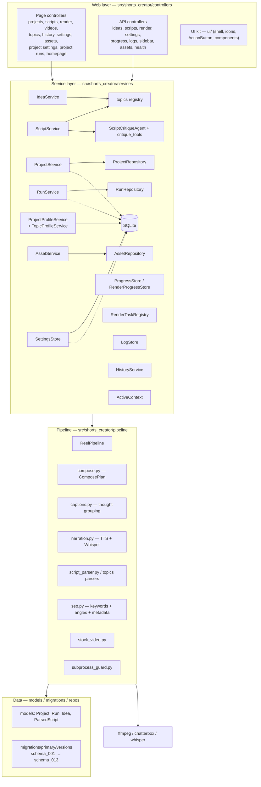

---

## 3. Boot & Dependency Injection

Two modules in `src/shorts_creator/main.py` + `services/module.py`:

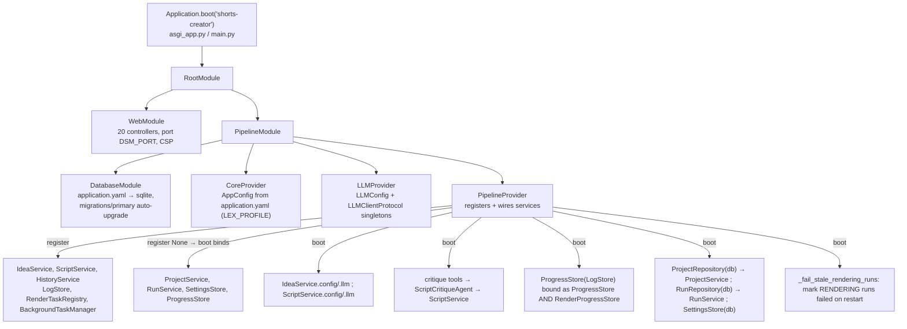

---

## 4. Web Layer — Pages & API Routes

### 4.1 The htmx shell

`AppLayout` (`ui/shell.py`) renders a top navbar + 240 px sidebar; **every** page
navigation is `hx_get` + `hx_target="#main-content"` + `hx_push_url` — no full
page loads. A small inline script auto-injects `project_id` into htmx requests.
Secondary swap targets: `#script-output`, `#concept-list`, `#render-output`,
`#videos-content`, `#save-msg`, `#provider-list`, `#sidebar-active`,
`#card-{key}`, and `this` (dashboard auto-poll every 20 s during an active
run).

### 4.2 Routes

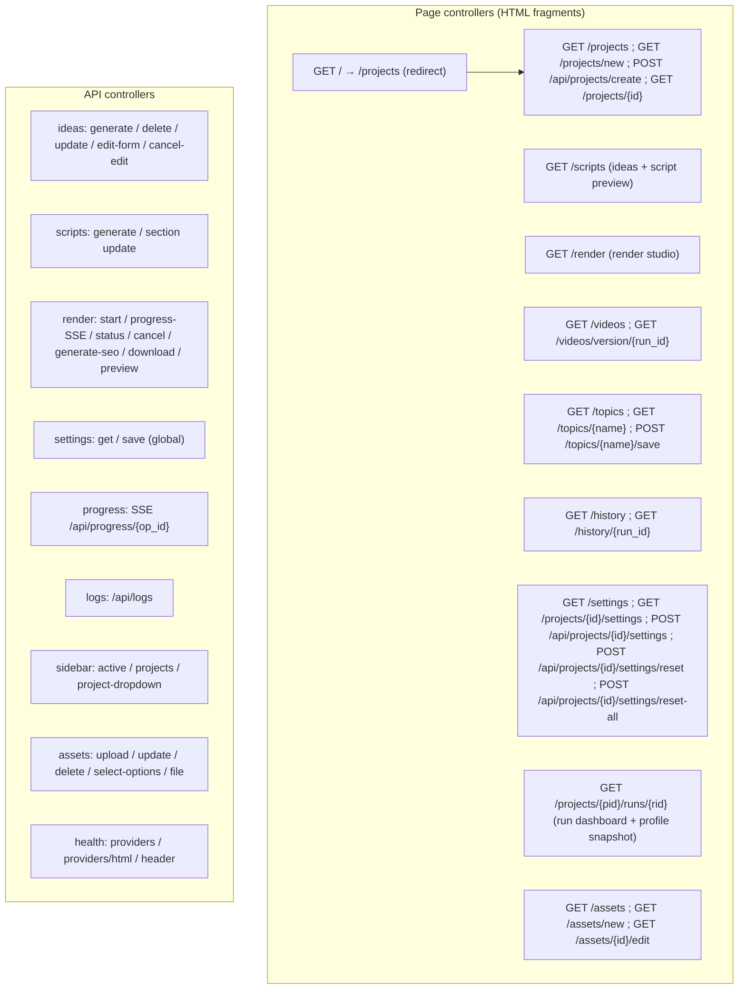

---

## 5. Service Layer & Key Flows

### 5.1 Content generation flow (topic → ideas → script)

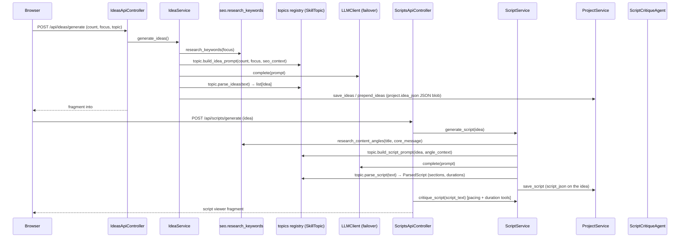

- **Topics** are loaded from `data/skills/*/SKILL.md` (frontmatter: label,
  structure sections, topic categories, banned phrases + `## IDEA_PROMPT` /
  `## SCRIPT_PROMPT` bodies; pacing/duration ranges are substituted from the
  selected format) plus a per-skill `data/skills/*/scripts/main.py` with
  `parse_ideas / parse_script / mock_*`. Registered once in
  `topics/__init__.py: registry`. Current skills: `stoic`,
  `self_improvement`, `psychology`.
- **Formats** are loaded from `data/formats/*/FORMAT.md`; currently only
  `narration` exists: `caption_styles: [highlight, plain]`, default
  `highlight`, `duration_range: [38, 50]`, `pacing_wps_range: [2.5, 3.0]`.
  Only the caption style is threaded into the renderer today.

### 5.2 Settings resolution (tiered cascade)

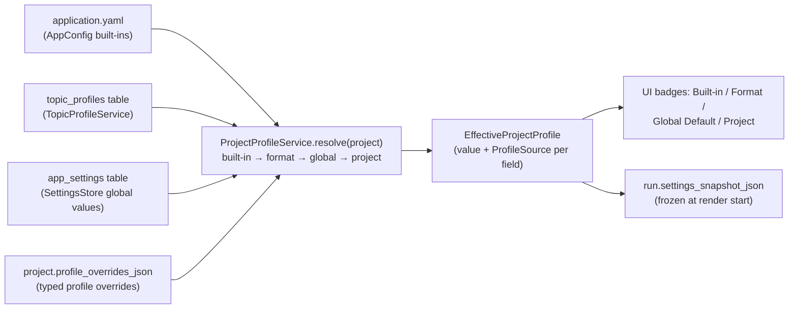

The guided create form, the per-project profile editor, and the render entry
point all resolve through the same `ProjectProfileService`; renders snapshot
the resolved profile at start so later settings edits never change a running
job's inputs.

---

## 6. Render Pipeline (zoom level)

### 6.1 End-to-end

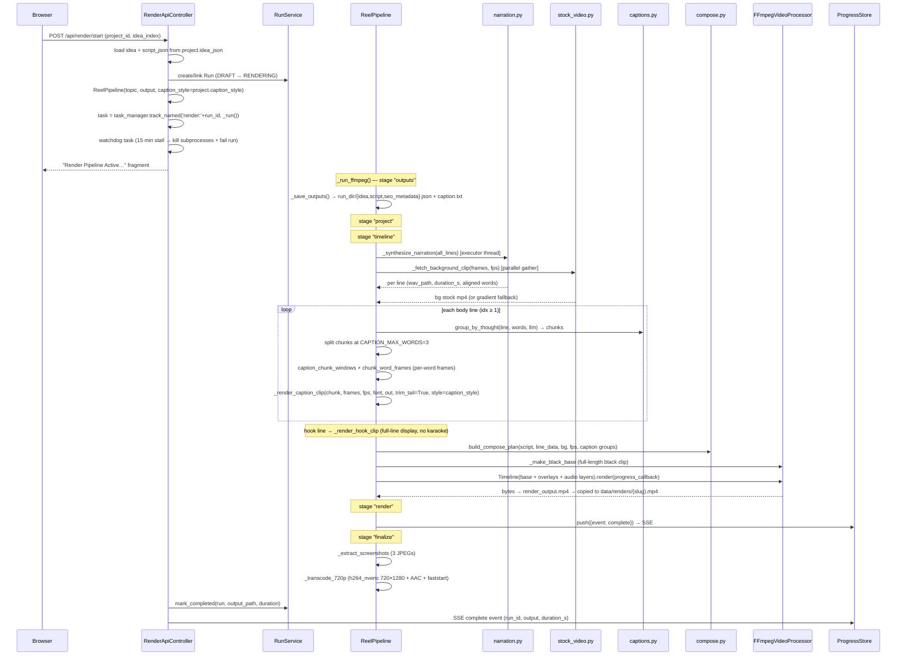

### 6.2 Narration & caption sync (the hard part)

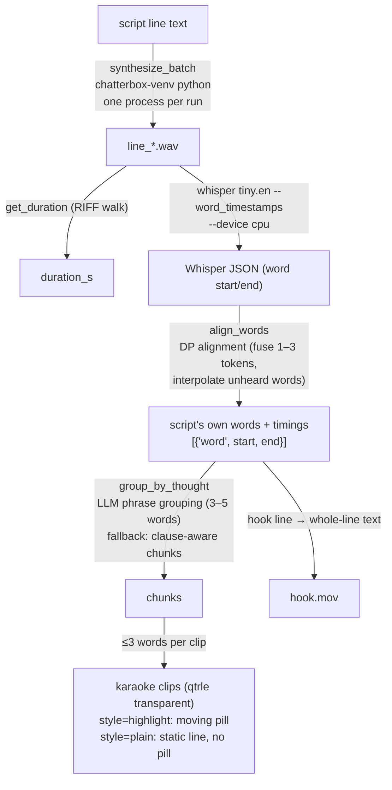

**Caption style** — the resolved `caption_style` (`highlight` | `plain`,
default `highlight`) comes from the run's `settings_snapshot_json`
(`render_api.start_render`, render_api.py) and is passed into
`ReelPipeline(caption_style=…)`. `_render_caption_frame(words,
highlighted_idx, font_size)` draws each frame; `highlighted_idx=None`
(plain) skips the pill. The pill colour is `0x7C5CFAFF`.

### 6.3 Compose plan

`compose.py: build_compose_plan(...) → ComposePlan` is a **pure function**
(no I/O) so timing math cannot drift from the bake loop. Produces:

- `base_asset` — the full-length black base (`_make_black_base`), background
  and hook/caption clips become overlays
- `overlays` — background mp4, hook.mov, caption chunk clips, outro clip
  (generated default `templates/outro_default.mp4` or the project's
  `asset_outro_clip_id` asset)
- `audio_layers` — one per narration WAV at its line offset
- `fade_in`, `encode`, `total_frames`, `narration_end_frames`

---

## 7. Data Layer

### 7.1 Models & schema

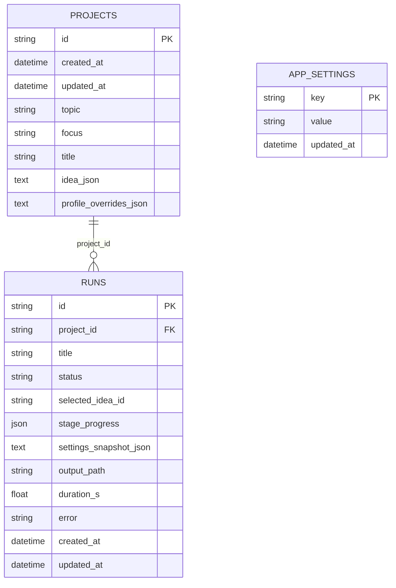

**Embedding, not tables:** ideas + scripts live inside `projects.idea_json`
(a JSON array of idea dicts, each with an optional `script_json`); `runs`
only link to the selected idea by `selected_idea_id`. `ProjectService`
(`save_ideas / prepend_ideas / update_idea / delete_idea / save_script /
get_script`) performs JSON-blob CRUD. All project-level settings (`format`,
`caption_style`, duration, asset references) live in
`projects.profile_overrides_json` (typed overrides, resolved through
`ProjectProfileService`).

### 7.2 Run state machine (`RunService`)

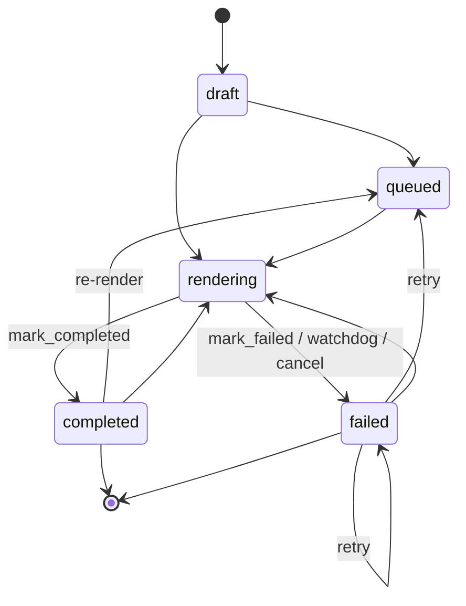

Transitions outside this map raise `InvalidTransitionError`. The `RunStatus`
enum also declares `idea_selected` / `script_ready` (reserved for future
linking states; no transition uses them today). On **startup**,
`_fail_stale_rendering_runs` marks any leftover `rendering` rows as failed
(crashed previous process).

### 7.3 Migrations (chain `schema_001` → `schema_013`)

| Migration | What it does |
|---|---|
| 001 | create `projects` |
| 002 | create `app_settings` |
| 003 | create `runs` |
| 004 | add `app_settings.updated_at` |
| 005 | project override columns (tri-tier settings) |
| 006 | move ideas/scripts from runs → `projects.idea_json` (+ `runs.selected_idea_id`) |
| 007 | drop legacy columns from `projects`/`runs` |
| 008 | rename `projects.script_type` → `topic` + rewrite stored `idea_json` keys (named-param SQLAlchemy 2.0 `text()`) |
| 009 | add `projects.format` (default `narration`) + `caption_style` (default `highlight`) |
| 010 | drop CTA columns (`cta_enabled` / `cta_lead_in` / `cta_display`) — CTA tail replaced by the outro clip |
| 011 | create `assets` + per-project asset reference columns |
| 012 | add `projects.profile_overrides_json`, `topic_profiles` table, `runs.settings_snapshot_json`; fold legacy columns into the JSON and drop them |
| 013 | rename `topic_profiles` table (previously `video_type_profiles`) |

---

## 8. Runtime State & Observability

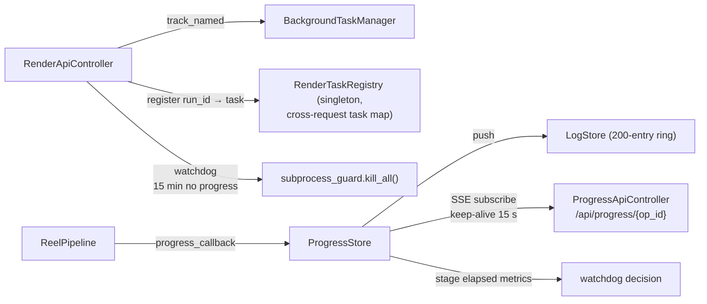

- **RenderTaskRegistry** exists because controllers are per-request; live task
  bookkeeping must live in a DI singleton.
- Per-run stdout is **teed to `data/runs/{run_id}.log`** (docker logs rotate;
  LogStore ring overwrites).
- `HistoryService` keeps a file-based run ledger in `data/runs/*.json` (planned
  replacement: the SQLite `runs` table).

---

## 9. Deployment Topology

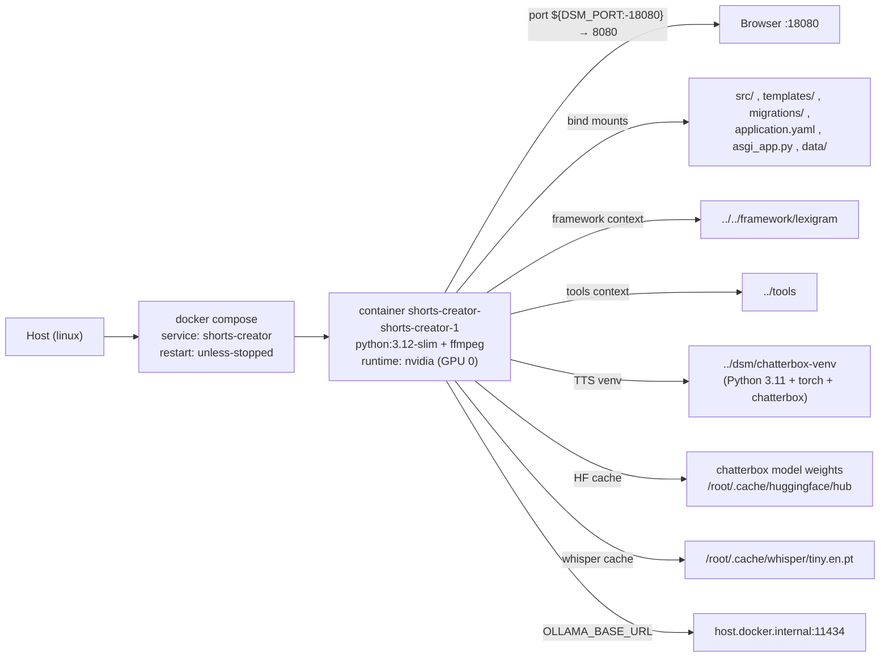

**Startup sequence**: container start → `uvicorn asgi_app:app --reload` →
`Application.boot` → `DatabaseModule` runs Alembic to head (env honors
`SHORTS_CREATOR_DATABASE_URL`) → `PipelineProvider.boot` wires services and
fails stale runs.

### Environment variables

| Var | Purpose |
|---|---|
| `DSM_PORT` | app port (container 8080; host mapping `${DSM_PORT:-18080}`) |
| `DSM_RELOAD` | opt-in `uvicorn --reload` for dev hot-restart (off by default so in-flight renders survive) |
| `SHORTS_CREATOR_DATABASE_URL` | sqlite URL for migrations (auto `+aiosqlite`) |
| `LEX_PROFILE` | config profile selector (dev vs prod LLM providers) |
| `OLLAMA_BASE_URL` | local LLM fallback (host.docker.internal:11434/v1) |
| `GROQ_API_KEYS`, `GEMINI_API_KEYS`, `OPENROUTER_API_KEYS`, `ANTHROPIC_API_KEY` | LLM provider keys (interpolated in `application.prod.yaml` only, i.e. `LEX_PROFILE=prod`) |
| `OPENCODE_ZEN_API_KEY` | opencode-zen LLM provider key (base/dev profile) |
| `PIXABAY_API_KEY`, `PEXELS_API_KEY` | stock-video providers |

**Local-media gotchas (container-local, recreated on rebuild):**
- Whisper model `tiny.en.pt` in `/root/.cache/whisper` — a corrupt copy breaks
  every render (SHA256 mismatch); restore from a valid cache.
- `templates/outro_default.mp4` is generated automatically when missing; the
  compose stage fails only if the generated outro cannot be created in the
  container.

---

## 10. Testing

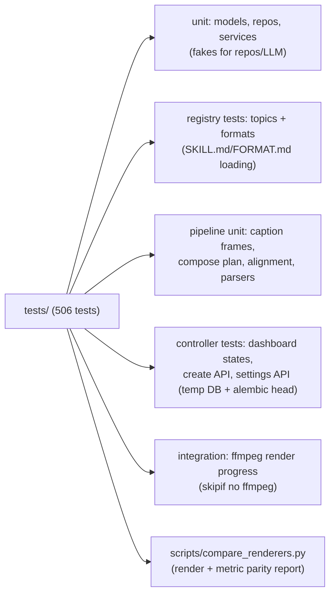

Run: `set -a; source .env; set +a; uv run pytest tests -q` · lint: `uv run ruff check`.

The ffmpeg integration test
(`tests/integration/test_ffmpeg_render_progress.py`) is skipped when `ffmpeg`
is not on PATH (`shutil.which("ffmpeg")`); the rest of the suite is fully
mocked and offline.

---

## 11. Key Design Decisions (why it works this way)

1. **Topic vs format split** — `topic` is the *idea source* (prompts, pacing,
   structure from `data/skills/*/SKILL.md`); `format` is the *presentation
   container* (`data/formats/*/FORMAT.md`). Formats drive the renderer
   (`caption_style`); presets were removed.
2. **No LLM in the render pipeline** — script/idea JSON is produced by the
   services (LLM available), then handed to `ReelPipeline`; the pipeline's own
   `_generate_script` is a no-op stub ("LLM not available in pipeline").
3. **Whisper supplies timing only** — its transcription garbles the TTS voice
   ("The day" → "W-day"), so captions always use script words; a DP alignment
   maps script words onto fused Whisper tokens and interpolates unheard words.
4. **Baked caption pixels** — each caption chunk becomes a transparent qtrle
   `.mov` with the karaoke pill drawn into pixels, so per-word sync survives
   the compose stage with one clip per chunk.
5. **Backgrounds from stock footage, not AI images** — Pollinations.ai was
   deprecated (429 rate-limiting); Pixabay/Pexels with gradient fallback.
6. **TTS in a separate venv** — Chatterbox (~3.6 GB torch weights) lives in
   `chatterbox-venv`; the worker loads the model once per run and synthesizes
   every line in one process.
7. **Watchdog + stale-run cleanup** — a 15-minute stall watchdog kills tracked
   subprocesses and fails the run; startup sweeps orphaned `rendering` rows so
   the UI never hangs on a dead pipeline.
8. **720p companion** — FB Reels loads smaller H.264 faster than 1080 HEVC, so
   every render gets a `_720p.mp4` (NVENC, faststart).
