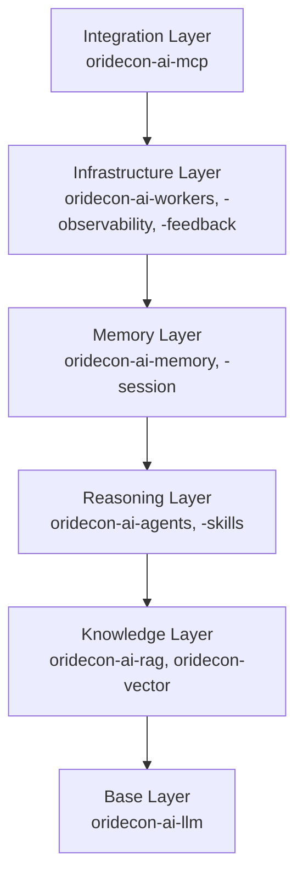

The Oridecon AI subsystem is organized into six layers. Each layer builds on the one below it, and all AI packages follow a strict dependency rule: they import only from `oridecon` and `oridecon-contracts`, never from each other.

## 1. Base Layer — `oridecon-ai-llm`

The LLM client protocol. Provides:

- **Provider routing**: Route requests to OpenAI, Anthropic, Google, and local models via a unified interface
- **Thinking suppression**: Configurable control over chain-of-thought output from reasoning models
- **Token tracking**: Usage accounting and cost estimation

All higher layers depend on this package for model access.

## 2. Knowledge Layer — `oridecon-ai-rag` + `oridecon-vector`

Retrieval-Augmented Generation and vector storage.

- **Document ingestion**: Chunking, embedding, and indexing pipelines
- **Retrieval**: Hybrid search (semantic + keyword), re-ranking, contextual compression
- **Vector storage**: Abstraction over pgvector, Qdrant, Pinecone, and in-memory

:::note
`oridecon-vector` is also used outside the AI subsystem — for example, by recommendation engines. It lives as a general-purpose package, not an AI-only one.
:::

## 3. Reasoning Layer — `oridecon-ai-agents` + `oridecon-ai-skills`

Multi-step reasoning and tool use.

- **Agents**: Loop-based reasoning with tool selection, error recovery, and structured output
- **Skills**: Reusable tool definitions that agents can discover and invoke at runtime
- **Orchestration**: Parallel tool execution, conditional branching, sub-agent delegation

## 4. Memory Layer — `oridecon-ai-memory` + `oridecon-ai-session`

Conversation history and persistent knowledge.

- **Episodic memory**: Per-conversation message history with summarization
- **Semantic memory**: Cross-session facts, user preferences, learned knowledge
- **Session management**: Conversation lifecycle, state persistence, expiry

## 5. Integration Layer — `oridecon-ai-mcp`

Expose AI capabilities as Model Context Protocol tools, resources, and prompts.

- **MCP server**: Wrap agents, RAG pipelines, and skills as MCP tools
- **MCP client**: Connect to external MCP servers from within agents
- **Discovery**: Dynamic tool registration and capability advertisement

## 6. Infrastructure Layer — `oridecon-ai-workers` + `oridecon-ai-observability` + `oridecon-ai-feedback`

Production-grade AI infrastructure.

- **Background processing**: Async task execution for embedding, indexing, and batch inference
- **Observability**: Token usage logging, latency tracking, cost attribution per-user/per-conversation
- **Feedback loops**: User feedback collection, preference fine-tuning data pipelines

:::note
**Architectural rule**: AI packages must never import from each other. `oridecon-ai-agents` does not import `oridecon-ai-rag` — it receives RAG results through its interfaces. This keeps the dependency graph flat and avoids circular coupling.
:::

## Dependency Direction

Each layer depends only on the layers below it. The base layer depends only on `oridecon` and `oridecon-contracts`. The integration layer can optionally consume any layer below it, but never introduces upward dependencies.

See the [Packages](/packages/) reference for individual package APIs and the [Choosing Backends](/ecosystem/choosing-backends/) guide for vector store comparisons.

For version requirements and known constraints, refer to [Compatibility & Dependencies](/ecosystem/compatibility/).
