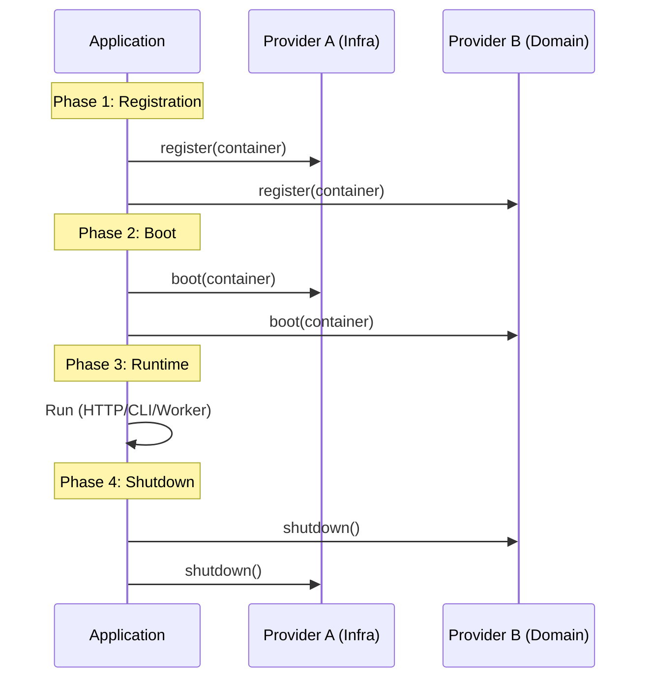
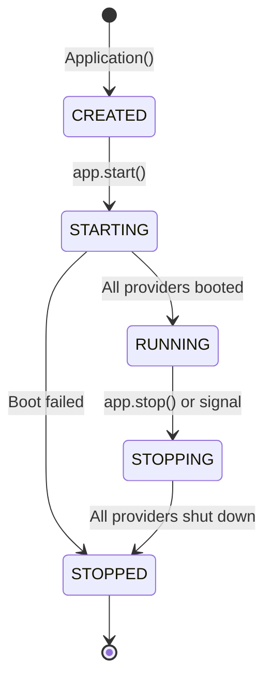

The **Application** class is the heartbeat of a Lexigram project. It acts as the **Composition Root**, the single place where dependencies are wired, providers are registered, and the application's runtime environment is established.

## 1. The Composition Root

Every Lexigram application begins with a single entry point, typically `main.py` or `app.py`. This is where you create the `Application` instance and configure its initial state.

```python
from lexigram import Application, LexigramConfig

# 1. Initialize Configuration
config = LexigramConfig.from_yaml()

# 2. Create the Application (Composition Root)
app = Application(name="order-service", config=config)

# 3. Add Modules and Providers
app.add_module(MyModule)
app.add_provider(MyProvider())

# 4. Boot and run
await app.start()
```

---

## 2. Lifecycle Stages



### Phase 1: Registration

In this phase, the application iterates through all added providers and calls their `register()` method. 
- **Goal**: Bind protocols to implementations in the DI container.
- **Rule**: Do NOT perform any I/O or side-effects (like connecting to a DB) during registration.

### Phase 2: Boot

Once all services are registered, the application enters the Boot phase by calling `boot()` on every provider.
- **Goal**: Initialize connections, start background workers, and warm caches.
- **Ordering**: Providers are booted based on their `priority` (e.g., `ProviderPriority.INFRASTRUCTURE` boots before `ProviderPriority.DOMAIN`).

### Phase 3: Runtime

The application serves traffic — handling HTTP requests, running CLI commands, or processing background tasks.

### Phase 4: Shutdown

When the application receives a termination signal (SIGINT/SIGTERM), it gracefully shuts down.
- **Goal**: Close database pools, flush logs, and disconnect from brokers.
- **Order**: Providers shut down in **reverse** priority order.

---

## 3. Application States



| State | Description |
|-------|-------------|
| `CREATED` | Application initialized, no providers booted |
| `STARTING` | Boot in progress |
| `RUNNING` | Application is operational |
| `STOPPING` | Shutdown in progress |
| `STOPPED` | All resources released |

---

## 4. Context Manager Form

For scripts or tests, use the context manager form which guarantees shutdown:

```python
import asyncio
from lexigram import Application

async def main():
    async with Application.boot(
        name="my-app",
        providers=[MyProvider()],
        modules=[MyModule()],
    ) as app:
        # Application is started and running
        print(f"App state: {app.state}")  # AppState.RUNNING
        # Shutdown happens automatically on exit

asyncio.run(main())
```

---

## 5. Health Checks

Lexigram provides aggregated health checks for monitoring:

```python
# Liveness — is the app alive?
liveness = await app.liveness()

# Readiness — is the app ready to serve traffic?
readiness = await app.readiness()

# Startup — has the app completed startup?
startup = await app.startup_check()

# Full health report
health = await app.health_check()
print(f"Status: {health.status}")
```

---

## 6. Running the Application

### Long-Running (ASGI)

```python
# Use as ASGI app with uvicorn
# uvicorn my_app.app:app --host 0.0.0.0 --port 8000

# Application auto-starts on first request when used as ASGI
app = Application(name="my-app")
app.add_provider(WebProvider())
await app.start()
```

### Using run_application

```python
from lexigram import Application, run_application

app = Application(name="my-app")
app.add_provider(MyProvider())

await run_application(app)
```

---

## 7. Module Compilation

When modules are registered, Lexigram uses `ModuleCompiler` to:
1. Validate import/export visibility
2. Detect circular dependencies
3. Order providers correctly

```python
# If modules are registered, ModuleCompiler extracts and orders providers
if self._modules:
    from lexigram.di.module import ModuleCompiler
    compiler = ModuleCompiler()
    graph = compiler.compile(root_modules=self._modules, standalone_providers=standalone)
```

---

## 8. Events

Application lifecycle events are emitted via `EventBusProtocol`:

| Event | When |
|-------|------|
| `ApplicationStarting` | Before registration begins |
| `ApplicationStarted` | After all providers booted |
| `ApplicationStopping` | Before shutdown begins |
| `ApplicationStopped` | After all providers shut down |

Subscribers can listen using `@event_handler` from `lexigram.events`.
