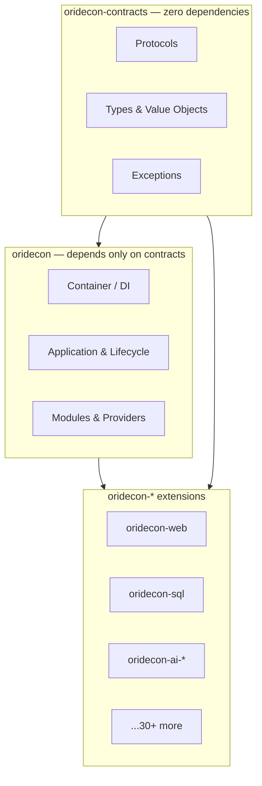

Oridecon's most important design decision isn't a feature — it's a **boundary rule** enforced across every package. Understanding it explains why the framework stays coherent as it grows from two packages to dozens.

## 1. Three Layers, One Direction



| Layer | May depend on | Never depends on |
|-------|---------------|------------------|
| `oridecon-contracts` | *nothing* | anything |
| `oridecon` (core) | `oridecon-contracts` | any extension |
| `oridecon-*` (extension) | `oridecon` + `oridecon-contracts` | **another extension** |

The dependency arrows only point **downward**. Contracts never import implementations; core never imports an extension; and — the rule that does the most work — **extensions never import each other**.

---

## 2. Why "Extensions Never Import Each Other"

This single constraint is what makes packages genuinely pluggable.

- **`oridecon-sql` doesn't import `oridecon-cache`.** If a SQL feature wants caching, it depends on `CacheBackendProtocol` (a *contract*), and the container injects whatever cache implementation is registered — Redis, in-memory, or a test fake.
- **Swap without ripple.** Because dependencies are expressed as protocols in `oridecon-contracts`, replacing one implementation never forces a change in another package.
- **Install à la carte.** You can install `oridecon-web` without pulling in `oridecon-ai-llm`, and vice versa. There is no hidden web of inter-package coupling.

When two extensions genuinely need to collaborate, they do it through a **shared contract** in `oridecon-contracts`, not a direct import.

---

## 3. The Namespace Package Layout

All packages publish into the shared `oridecon` import namespace (a PEP 420 namespace package), even though they are separate distributions:

```
oridecon-web/   → src/oridecon/web/      → import: from oridecon.web import ...
oridecon-sql/   → src/oridecon/sql/      → import: from oridecon.sql import ...
oridecon-ai/    → src/oridecon/ai/       → import: from oridecon.ai import ...
```

So installing the `oridecon-web` *distribution* gives you the `oridecon.web` *module*. One consistent import root; many independently versioned packages underneath.

```python
from oridecon import Application, Provider      # core
from oridecon.web import WebProvider, get        # oridecon-web distribution
from oridecon.contracts.core.di import BootContainerProtocol  # contracts
```

---

## 4. How Extensions Plug In

An extension contributes to an application in three ways, all built on the core primitives:

| Mechanism | Role | Covered in |
|-----------|------|-----------|
| **Provider** | Registers the extension's services in the container and manages their lifecycle | [Providers](/fundamentals/providers/) |
| **Module** | Bundles providers with import/export boundaries; usually exposes `configure()` | [Modules](/fundamentals/modules/) |
| **Contract** | The protocol(s) the extension implements or depends on, defined in `oridecon-contracts` | [Container Protocols](/fundamentals/container-protocols/) |

Most extensions ship a `configure()` classmethod on their module so you add them in one line:

```python
from oridecon import Application
from oridecon.sql import DatabaseProvider     # provider
from oridecon.web import WebProvider

app = Application(name="my-app")
app.add_provider(DatabaseProvider())          # INFRASTRUCTURE priority — boots early
app.add_provider(WebProvider())               # PRESENTATION priority — boots last
```

Boot order follows [provider priority](/fundamentals/providers/#2-provider-priorities), so infrastructure (database, cache) is ready before the web layer starts serving.

---

## 5. What This Buys You

| Property | How the boundary rule delivers it |
|----------|-----------------------------------|
| **Testability** | Depend on contracts → substitute fakes from `oridecon-testing` with no production code change. |
| **Replaceability** | Swap Redis for Memcached, Postgres for SQLite, one LLM provider for another — through config, not refactors. |
| **Incremental adoption** | Start with two packages; add extensions one at a time without untangling dependencies. |
| **Clear ownership** | Each package has one purpose and a well-defined surface; large teams can own packages independently. |

---

## Next Steps

- [Core Concepts](/getting-started/core-concepts/) — providers, DI, modules, and the Result type in one place
- [The Ecosystem](/ecosystem/) — the full set of extensions and what each one does
- [Container Protocols](/fundamentals/container-protocols/) — the type-safe contracts at the heart of the boundary
