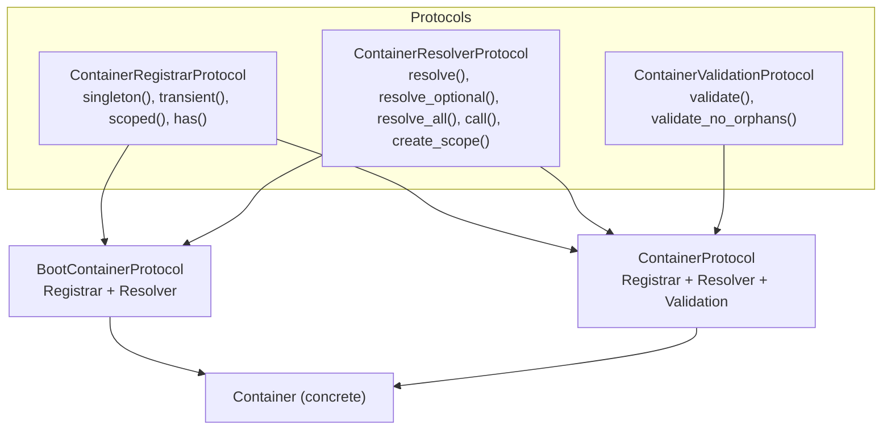

Lexigram uses **structural subtyping** to provide full type safety on the DI container. Rather than typing `container` parameters as a concrete class, you use Protocol types that describe exactly what operations a piece of code needs.

## 1. Protocol Hierarchy



| Protocol | Access | Use When |
|---------|--------|----------|
| `ContainerRegistrarProtocol` | `singleton()`, `transient()`, `scoped()`, `has()` | Module registration code that only binds services |
| `ContainerResolverProtocol` | `resolve()`, `resolve_optional()`, `resolve_all()`, `call()`, `create_scope()` | Code that only retrieves services |
| `BootContainerProtocol` | Registrar + Resolver | Provider `boot()` methods that resolve and rebind services via `bind()` |
| `ContainerValidationProtocol` | `validate()`, `validate_no_orphans()` | Development-time validators |
| `ContainerProtocol` | Registrar + Resolver + Validation | Full container control; rarely needed directly |

---

## 2. Register vs. Boot

```python
from lexigram.di.provider import Provider
from lexigram.contracts.core.provider import ProviderPriority
from lexigram.contracts.core.di import (
    ContainerRegistrarProtocol,
    BootContainerProtocol,
)

class BillingProvider(Provider):
    name = "billing"
    priority = ProviderPriority.APPLICATION

    async def register(self, container: ContainerRegistrarProtocol) -> None:
        """Phase 1: Only registration. No service retrieval allowed."""
        container.singleton(PaymentGateway, StripeGateway)
        container.singleton(PaymentService, PaymentService())

    async def boot(self, container: BootContainerProtocol) -> None:
        """Phase 2: Resolve existing services, wire them, replace via bind()."""
        gateway = await container.resolve(PaymentGateway)
        db = await container.resolve(InvoiceRepository)
        # Replace an already-registered singleton with the wired instance
        container.bind(PaymentService, PaymentService(gateway, db))
```

**Key principle:** The `register()` phase is purely declarative — it says *what* services exist, not *how* they are initialized. The `boot()` phase is where initialization and wiring happen.

:::note
The container is **frozen** before `boot()` runs — calling `singleton()`, `transient()`, or `scoped()` there raises `ContainerError` (LEX_ERR_DI_001). To replace an already-registered singleton during boot (e.g. wrapping a store with a decorator), use `container.bind(service_type, instance)`.
:::

---

## 3. Why Three Registration Protocols?

Using the narrowest Protocol for each context enables mypy to catch errors at the call site:

```python
# This fails at type-check time — register() can't resolve
async def register(self, container: ContainerRegistrarProtocol) -> None:
    db = await container.resolve(DatabaseProtocol)  # mypy: error!

# This is fine — boot() is allowed to resolve
async def boot(self, container: BootContainerProtocol) -> None:
    db = await container.resolve(DatabaseProtocol)  # OK
```

| Protocol | Purpose | Forbidden Operations |
|----------|---------|---------------------|
| `ContainerRegistrarProtocol` | Declare bindings | `resolve()`, `resolve_optional()`, `call()` |
| `ContainerResolverProtocol` | Retrieve services | `singleton()`, `transient()`, `scoped()` |
| `BootContainerProtocol` | Wire services | `singleton()`/`transient()`/`scoped()` post-freeze; use `bind()` to rebind |

---

## 4. Protocol Types in singleton()

When you register a Protocol as a service key, use the overload pattern:

```python
# Concrete type — full type inference
container.singleton(UserService, UserServiceImpl())
#       ↑ resolved as: UserServiceImpl
#       ↓ registered as: type[UserService]

# Protocol type — uses Any fallback overload
container.singleton(LLMClientProtocol, ObservableLLMClient(...))
# Both resolve() and singleton() accept Protocol types via @overload
```

The dual `@overload` signatures on `singleton()`, `resolve()`, `resolve_optional()`, and `resolve_all()` ensure:
- **Concrete types** get full `type[T] -> T` inference
- **Protocol types** are accepted via an `Any` fallback overload

---

## 5. Structural Subtyping in Practice

You never inherit from a Protocol — any object that has the required methods satisfies it:

```python
from lexigram.di.container import Container
from lexigram.contracts.core.di import BootContainerProtocol

container = Container()
assert isinstance(container, BootContainerProtocol)  # True
```

This means the orchestrator can pass the real `Container` instance wherever a Protocol is expected, and mypy knows exactly what operations are available.

---

## 6. The LifecycleManager's Role

The `ProviderOrchestrator` coordinates the two-phase boot:

```python
await orchestrator.register_all(container)  # Phase 1: all register() in priority order
container.freeze()                          # No more registrations
await orchestrator.boot_all(container)      # Phase 2: all boot() in priority order
```

It passes `BootContainerProtocol` to each provider's `boot()` method — giving each provider exactly the access it needs, nothing more.

---

## 7. Verification

Run mypy on your provider package to confirm the container is fully typed:

```bash
uv run mypy core/lexigram/src/  # Expect: Success: no issues found
```

Any `# type: ignore[attr-defined]` or `# type: ignore[type-abstract]` on container method calls indicates a signature needs updating.
