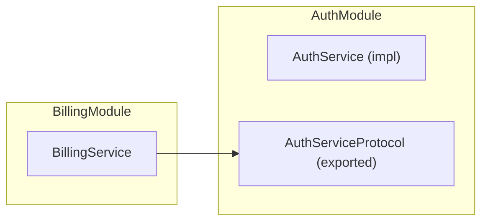

In Lexigram, a **Module** is a high-level organizational unit that groups related providers, services, and configuration. It serves as an encapsulation boundary, defining a strict "public API" for other parts of the application.

## 1. The `@module` Decorator

Use the `@module` decorator to define a module. This tells Lexigram how to treat the package during auto-discovery and DI resolution.

```python
from lexigram.di.module import module

@module(
    providers=[ChatProvider],
    exports=[ChatServiceProtocol, MessageStoreProtocol],
)
class ChatModule:
    """A module providing AI chat functionality."""
```

### Module Class Variables

```python
@module()
class AuthModule:
    name: str | None = None           # Module name (auto-derived if None)
    providers: list[type] = []       # Provider classes
    imports: list[type] = []          # Required module imports
    exports: list[type] = []          # Public API types
    controllers: list[type] = []      # Web controllers
    is_global: bool = False           # Exports visible to all modules
    scan: list[str] = []              # Package paths to scan
```

---

## 2. Encapsulation & Exports

The `exports` list (or the `exports` argument in dynamic modules) is the most critical part of a module. It defines which services are visible to other modules in the application.

- **Internal Services**: Any service registered within a module but NOT exported is considered "private" and cannot be injected into components outside of that module.
- **Protocol Exports**: It is best practice to export **Protocols** rather than implementation classes to maintain decoupling.



### Global Modules

A `@global_module`'s exports are visible to all modules without explicit import:

```python
from lexigram.di.module import global_module, Module

@global_module
class LoggingModule(Module):
    providers = [LoggingProvider]
    exports = [LoggerProtocol]
    is_global = True  # Visible to all modules
```

---

## 3. Dynamic Modules

Sometimes you need to configure a module dynamically before adding it to the application. Use the `Module.configure()` pattern for this.

```python
from lexigram.di.module import module, Module, DynamicModule

@module()
class DatabaseModule(Module):
    
    @classmethod
    def configure(cls, url: str) -> DynamicModule:
        return DynamicModule(
            module=cls,
            providers=[DatabaseProvider(url=url)],
            exports=[DatabaseSession, TransactionManager],
            is_global=True,  # Visible to all modules
        )
```

### Usage in Application

```python
from lexigram import Application

app = Application(name="my-app")
app.add_module(DatabaseModule.configure("postgresql://localhost/mydb"))
```

---

## 4. Module Factory Methods

The `Module` base class provides three factory methods:

| Method | Purpose |
|--------|---------|
| `configure(*args, **kwargs)` | Global configuration — called once at the app root |
| `scope(*providers, **kwargs)` | Register additional providers in a per-feature scope |
| `stub(config=None)` | Return a test-mode module with in-memory/noop backends |

### Scope Method

```python
@module()
class FeatureModule(Module):
    @classmethod
    def scope(cls, *providers: type, **kwargs: Any) -> DynamicModule:
        return DynamicModule(
            module=cls,
            providers=list(providers),
            exports=list(kwargs.get("exports", [])),
        )
```

### Stub Method

```python
@module()
class CacheModule(Module):
    @classmethod
    def stub(cls, config: Any = None) -> DynamicModule:
        return DynamicModule(
            module=cls,
            providers=[FakeCacheProvider()],
            exports=[CacheBackend],
        )
```

---

## 5. Module Lifecycle Hooks

```python
@module()
class DataModule(Module):
    
    @classmethod
    async def on_module_booted(cls) -> None:
        """Called after all providers in this module have been booted.
        
        Override in subclasses to run post-boot initialization logic.
        The container is fully available at this point.
        """
        pass
    
    @classmethod
    async def on_module_shutdown(cls) -> None:
        """Called before this module's providers are shut down.
        
        Override in subclasses to run pre-shutdown cleanup logic.
        """
        pass
```

---

## 6. Module Registry

The application maintains a global `ModuleRegistry` which tracks all loaded modules and their inter-dependencies. This ensures that:

- Circular dependencies are caught early
- Modules are initialized in the correct order
- Module visibility rules are enforced

### Visibility Enforcement

If a module tries to inject a service that's not in its exports or a global module's exports, Lexigram raises `ModuleVisibilityError`:

```
Module 'billing' cannot resolve 'UserRepository': not exported by 'auth' module.
Hint: Import 'AuthModule' into 'billing', or make 'UserRepository' global.
```

---

## 7. Complete Example

```python
# src/my_platform/modules/auth/__init__.py
from lexigram.di.module import module, Module

from my_platform.modules.auth.provider import AuthProvider
from my_platform.modules.auth.protocols import AuthServiceProtocol
from my_platform.modules.auth.services import AuthServiceImpl

@module(
    providers=[AuthProvider],
    imports=[],  # No dependencies
    exports=[AuthServiceProtocol],  # Only protocol is public
)
class AuthModule(Module):
    """Authentication module — only AuthServiceProtocol is visible to importers."""
```

```python
# src/my_platform/app.py
from lexigram import Application, LexigramConfig
from lexigram.di.module import DynamicModule

from my_platform.modules.auth import AuthModule
from my_platform.modules.billing import BillingModule
from my_platform.infrastructure import InfraModule

def create_app() -> Application:
    config = LexigramConfig.from_yaml()
    app = Application(name="my-platform", config=config)
    
    app.add_module(InfraModule)
    app.add_module(AuthModule)
    app.add_module(BillingModule)
    
    return app
```
