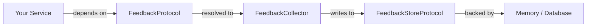

`lexigram-ai-feedback` provides a protocol-based feedback collection system. Application code depends on `FeedbackProtocol`; the storage backend (in-memory, database) is chosen in configuration. Feedback items carry a `FeedbackType` and `value`, with optional context and metadata for auditing and analytics.

For the full configuration reference and advanced features (processor pipelines, middleware, events), see the [`lexigram-ai-feedback` package docs](/packages/lexigram-ai-feedback/).

---

## 1. The Contract

All feedback operations happen through two protocols from `lexigram.contracts.ai.feedback`:

```python
from typing import Any, Protocol, runtime_checkable
from lexigram.contracts.ai.feedback import (
    FeedbackItem,
    FeedbackType,
    FeedbackSummary,
)
from lexigram.result import Result


@runtime_checkable
class FeedbackProtocol(Protocol):
    async def submit_feedback(
        self,
        trace_id: str,
        score: float,
        comment: str | None = None,
        metadata: dict[str, Any] | None = None,
    ) -> None: ...

    async def get_feedback_stats(
        self,
        model: str | None = None,
        provider: str | None = None,
    ) -> dict[str, Any]: ...


@runtime_checkable
class FeedbackStoreProtocol(Protocol):
    async def save(self, feedback: FeedbackItem) -> Result[str, Exception]: ...
    async def find_by_session(self, session_id: str) -> list[FeedbackItem]: ...
    async def find_by_type(
        self,
        feedback_type: FeedbackType,
        *,
        limit: int = 100,
    ) -> list[FeedbackItem]: ...
    async def aggregate(
        self,
        *,
        window_hours: int = 24,
    ) -> FeedbackSummary: ...
```

Your services depend on `FeedbackProtocol` — never on a concrete collector or store:



---

## 2. Configuration

Add the provider and configure the `ai_feedback` section:

```python
from lexigram.ai.feedback import FeedbackModule, FeedbackConfig

app.add_module(
    FeedbackModule.configure(
        FeedbackConfig(
            enabled=True,
            async_processing=True,
            store_raw_payloads=False,
        )
    )
)
```

```yaml title="application.yaml"
ai_feedback:
  enabled: true
  async_processing: true    # process handlers in the background
  store_raw_payloads: false # persist raw incoming payloads for auditing
```

:::note
`FeedbackModule` reads its config from the `ai_feedback:` block automatically. Pass a `FeedbackConfig` instance directly for programmatic setup.
:::

For local development the default in-memory store needs no external service. Swap to a database backend in production by wiring a `DatabaseFeedbackStore` in the provider.

---

## 3. Collecting Feedback

Inject `FeedbackProtocol` into any service and call `submit_feedback()`:

```python
from lexigram.contracts.ai.feedback import FeedbackProtocol


class RatingCollector:
    def __init__(self, feedback: FeedbackProtocol) -> None:
        self._feedback = feedback

    async def record_rating(
        self,
        trace_id: str,
        score: float,
        comment: str | None = None,
    ) -> None:
        await self._feedback.submit_feedback(
            trace_id=trace_id,
            score=score,
            comment=comment,
            metadata={"source": "web-ui"},
        )
```

Resolving `FeedbackProtocol` outside a service (scripts, tests):

```python
async with Application.boot(modules=[FeedbackModule.configure()]) as app:
    feedback = await app.container.resolve(FeedbackProtocol)
    await feedback.submit_feedback(
        trace_id="trace-123",
        score=4.5,
        comment="Good response",
    )
```

---

## 4. Feedback Types

Every feedback item carries a `FeedbackType` and a value:

| Type | Enum | Value |
|---|---|---|
| Rating | `FeedbackType.RATING` | `"rating"` |
| Text | `FeedbackType.TEXT` | `"text"` |
| Correction | `FeedbackType.CORRECTION` | `"correction"` |
| Label | `FeedbackType.LABEL` | `"label"` |

A `FeedbackItem` is an immutable dataclass:

```python
from lexigram.contracts.ai.feedback import FeedbackItem, FeedbackType


item = FeedbackItem(
    feedback_type=FeedbackType.RATING,
    value=5,
    context={"model": "gpt-4", "session_id": "sess-001"},
    metadata={"source": "api"},
)
```

You can query stored items by session or type, and aggregate statistics:

```python
from lexigram.contracts.ai.feedback import FeedbackStoreProtocol


class AnalyticsService:
    def __init__(self, store: FeedbackStoreProtocol) -> None:
        self._store = store

    async def daily_summary(self) -> dict:
        summary = await self._store.aggregate(window_hours=24)
        return {
            "total": summary.total_count,
            "avg_rating": summary.average_rating,
            "by_type": summary.count_by_type,
        }
```

---

## 5. Testing

For unit tests, use `FeedbackModule.stub()` which provides in-memory storage with no external dependencies:

```python
from lexigram import Application
from lexigram.ai.feedback import FeedbackModule
from lexigram.contracts.ai.feedback import FeedbackProtocol, FeedbackItem, FeedbackType


async def test_submits_rating() -> None:
    async with Application.boot(modules=[FeedbackModule.stub()]) as app:
        feedback = await app.container.resolve(FeedbackProtocol)
        await feedback.submit_feedback(
            trace_id="test-trace",
            score=5.0,
            comment="Perfect",
        )

        stats = await feedback.get_feedback_stats()
        assert stats["total_count"] >= 1
```

You can also bind a hand-rolled fake to `FeedbackProtocol` in any test container — the rest of your code depends only on the protocol.

---

## Next Steps

- [Dependency Injection](/fundamentals/dependency-injection/) — binding protocols to implementations
- [Providers](/fundamentals/providers/) — how `FeedbackProvider` hooks into application boot
- [Testing](/guides/testing/) — substituting stubs for infrastructure
- [`lexigram-ai-feedback` package](/packages/lexigram-ai-feedback/) — processor pipelines, middleware, events
