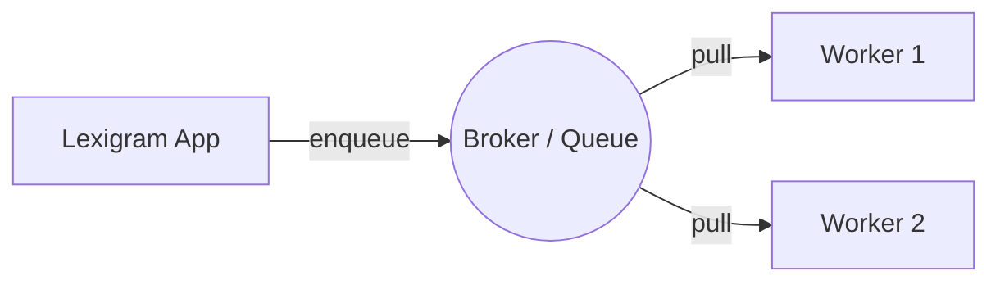

`lexigram-tasks` runs long-running or deferred work outside the request/response cycle, with pluggable backends (in-memory, Redis, AMQP, Postgres), scheduling, retries, and a dead-letter queue. For queue transport specifically, it builds on `lexigram-queue`.

---

## 1. Defining Tasks

Decorate an async function with `@task`. Tasks should be idempotent — they may be retried on failure. Dependencies are resolved from the container when a worker executes the task.

```python
from lexigram.tasks import task


@task
async def send_welcome_email(user_id: str, email: str) -> None:
    ...
```

---

## 2. Scheduled Tasks

Use `@scheduled` for recurring work:

```python
from lexigram.tasks import scheduled


@scheduled(cron="0 0 * * *")   # every night at midnight
async def cleanup_expired_sessions() -> None:
    ...
```

Enable the scheduler in config (see below) so a worker runs due jobs.

---

## 3. Enqueuing Work

Inject the queue contract and enqueue work from your services. `enqueue()` returns a `Result` with the job id:

```python
from lexigram.contracts.infra.tasks import TaskQueueProtocol
from lexigram.result import Result


class EnrollmentService:
    def __init__(self, queue: TaskQueueProtocol) -> None:
        self._queue = queue

    async def enroll(self, user_id: str, email: str) -> None:
        result = await self._queue.enqueue(
            send_welcome_email(user_id=user_id, email=email)
        )
        job_id = result.unwrap()
```

See the [`lexigram-tasks` package docs](/packages/lexigram-tasks/) for handler registration and the full enqueue API.

---

## 4. Configuration

The `tasks` section selects the backend and tunes the worker pool, scheduler, and retry policy:

```yaml title="application.yaml"
tasks:
  enabled: true
  backend:
    type: redis            # memory | redis | amqp | postgres
    redis_url: "${REDIS_URL:redis://localhost:6379}"
    queue_name: tasks
  worker:
    worker_count: 4
    max_concurrent_tasks: 10
    default_timeout: 300.0
  scheduler:
    enabled: true
    timezone: UTC
  retry:
    max_attempts: 3
    base_delay: 1.0
    backoff_factor: 2.0
    jitter: true
```

### Backends at a glance

- **Redis** — high-throughput, low-latency queues (recommended default).
- **Postgres** — transactional jobs (enqueue commits with your data).
- **AMQP (RabbitMQ)** — advanced routing topologies.
- **In-memory** — local development and tests.

---

## 5. The Worker Model

Tasks follow a distributed-worker pattern: your app enqueues jobs to a broker; one or more worker processes pull and execute them.



Failed jobs are retried per the `retry` policy and ultimately routed to a dead-letter queue for inspection.

---

## 6. Multiple Queues

Declare named backends to route different workloads independently (e.g. a fast `emails` queue and a heavy `reports` queue), and inject them with `Named`:

```python
from typing import Annotated
from lexigram.contracts.infra.tasks import TaskQueueProtocol
from lexigram.di.markers import Named


class Mailer:
    def __init__(self, emails: Annotated[TaskQueueProtocol, Named("emails")]) -> None:
        self._emails = emails
```

---

## Next Steps

- [Event-Driven Architecture](/guides/event-driven/) — reacting to domain events
- [Configuration](/getting-started/configuration/) — sections and profiles
- [`lexigram-tasks` package](/packages/lexigram-tasks/) — full API
