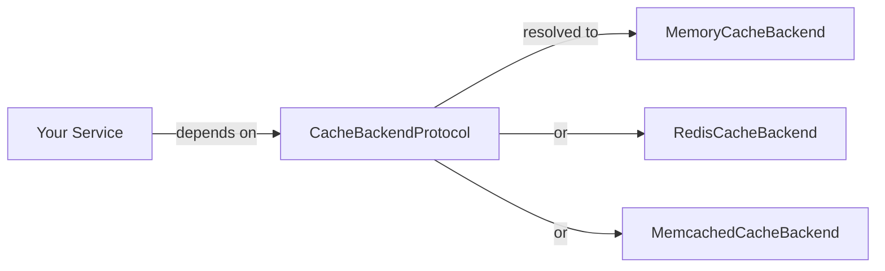

`lexigram-cache` provides async caching behind a single protocol. Application code depends on `CacheBackendProtocol`; the backend (in-memory, Redis, or Memcached) is chosen in configuration. You can swap backends, run several side-by-side, and substitute an in-memory stub in tests without touching the services that use them.

For the full configuration reference and advanced features (stampede protection, semantic cache, decorators), see the [`lexigram-cache` package docs](/packages/lexigram-cache/).

---

## 1. The Contract

All backends implement `CacheBackendProtocol`. Every operation returns a `Result` so backend failures are explicit rather than thrown:

```python
from typing import Any, Protocol, runtime_checkable
from lexigram.result import Result
from lexigram.contracts.infra.cache import CacheError


@runtime_checkable
class CacheBackendProtocol(Protocol):
    async def get(self, key: str) -> Result[Any | None, CacheError]: ...
    async def set(self, key: str, value: Any, ttl: int | None = None) -> Result[None, CacheError]: ...
    async def delete(self, key: str) -> Result[bool, CacheError]: ...
    async def delete_pattern(self, pattern: str) -> Result[int, CacheError]: ...
    async def exists(self, key: str) -> Result[bool, CacheError]: ...
    async def get_many(self, keys: list[str]) -> Result[dict[str, Any], CacheError]: ...
    async def set_many(self, items: dict[str, Any], ttl: int | None = None) -> Result[None, CacheError]: ...
```

Your services depend on the protocol — never on a concrete backend:



---

## 2. Configuration

Add the provider and configure the `cache` section. Declare one or more `backends`; exactly one must be marked `default: true`.

```python
from lexigram import Application
from lexigram.cache import CacheProvider

app = Application(name="my-app")
app.add_provider(CacheProvider())
```

```yaml title="application.yaml"
cache:
  enabled: true
  backends:
    - name: "default"
      type: "redis"          # memory | redis | memcached
      default: true
      url: "${REDIS_URL:redis://localhost:6379/0}"
      default_ttl: 300       # seconds; null disables expiry
      key_prefix: "myapp"
  service:
    enable_protection: true  # stampede protection (distributed locks)
```

For local development the `memory` backend needs no external service:

```yaml title="application.yaml"
cache:
  backends:
    - name: "default"
      type: "memory"
      default: true
      max_size: 10000        # null = unlimited
```

:::note
`CacheProvider` reads its config from the `cache:` block automatically. You can also pass a `CacheConfig` instance directly: `CacheProvider(config=CacheConfig(...))`.
:::

---

## 3. Using the Cache

Inject `CacheBackendProtocol` into any service. The protocol returns `Result`, so check `is_ok()` before unwrapping:

```python
from typing import cast
from lexigram.contracts.infra.cache import CacheBackendProtocol
from lexigram.result import Result, Ok, Err
from my_app.domain.models import Product


class ProductLookup:
    def __init__(self, cache: CacheBackendProtocol, repo: ProductRepository) -> None:
        self._cache = cache
        self._repo = repo

    async def find(self, product_id: str) -> Result[Product, str]:
        key = f"product:{product_id}"

        cached = await self._cache.get(key)
        if cached.is_ok() and cached.unwrap() is not None:
            return Ok(cast(Product, cached.unwrap()))

        result = await self._repo.find(product_id)
        if result.is_ok():
            await self._cache.set(key, result.unwrap(), ttl=300)
        return result
```

Resolving the cache outside a service (scripts, tests):

```python
async with Application.boot(providers=[CacheProvider()]) as app:
    cache = await app.container.resolve(CacheBackendProtocol)
    await cache.set("greeting", "hello", ttl=60)
```

---

## 4. Multiple Backends

Declare more than one entry under `backends`. Each is registered under its name and injected with `Named`:

```yaml title="application.yaml"
cache:
  backends:
    - name: "session"
      type: "redis"
      default: true
      url: "${REDIS_URL}"
      default_ttl: 1800
    - name: "lookup"
      type: "memory"
      max_size: 50000
```

```python
from typing import Annotated
from lexigram.contracts.infra.cache import CacheBackendProtocol
from lexigram.di.markers import Named


class CheckoutService:
    def __init__(
        self,
        session: CacheBackendProtocol,                              # the default backend
        lookup: Annotated[CacheBackendProtocol, Named("lookup")],
    ) -> None:
        self._session = session
        self._lookup = lookup
```

A common split is a fast process-local `memory` cache for hot lookups plus a shared `redis` cache for cross-instance state.

---

## 5. Invalidation Patterns

Three building blocks cover most cases:

- **TTL** — pass `ttl=<seconds>` to `set`. The simplest invalidation is "let it expire."
- **Explicit delete** — `await cache.delete(key)` after a write, or `delete_many([...])` for a batch.
- **Key namespacing + pattern delete** — prefix related keys (`"product:list:..."`) and clear them as a group with `delete_pattern("product:list:*")`.

```python
async def update_product(self, product: Product) -> None:
    await self._repo.save(product)
    await self._cache.delete(f"product:{product.id}")
    await self._cache.delete_pattern("product:list:*")
```

`key_prefix` in the backend config namespaces every key the backend writes — useful when several apps share one Redis instance.

---

## 6. Testing

For unit tests, the framework ships an in-memory `CacheModule.stub()` that satisfies `CacheBackendProtocol` with no external service:

```python
from lexigram import Application
from lexigram.cache import CacheModule
from lexigram.contracts.infra.cache import CacheBackendProtocol


async def test_caches_product_lookup() -> None:
    async with Application.boot(modules=[CacheModule.stub()]) as app:
        cache = await app.container.resolve(CacheBackendProtocol)
        await cache.set("k", "v", ttl=60)
        assert (await cache.get("k")).unwrap() == "v"
```

You can also bind a hand-rolled fake to the protocol in any test container — the rest of your code is none the wiser.

---

## Next Steps

- [Dependency Injection](/fundamentals/dependency-injection/) — binding protocols to implementations
- [Providers](/fundamentals/providers/) — how `CacheProvider` hooks into application boot
- [Testing](/guides/testing/) — substituting stubs for infrastructure
- [`lexigram-cache` package](/packages/lexigram-cache/) — stampede protection, `@cacheable` decorator, semantic cache
