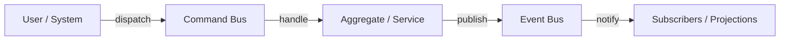

`lexigram-events` provides a full CQRS and event-sourcing stack: command, query, and event buses, an event store, projections, and sagas. It decouples your domain from transactional infrastructure.

---

## 1. Commands vs. Events

Lexigram separates two kinds of message:

1. **Commands** — an intent to change state (`RegisterUser`). Routed to exactly **one** handler via the **Command Bus**.
2. **Events** — a fact that already happened (`UserRegistered`). Broadcast to **many** subscribers via the **Event Bus**.



---

## 2. Commands & the Command Bus

A command is a simple message; the `CommandBus` routes it to its single handler. Inject the bus contract and dispatch:

```python
from lexigram.events import Command, CommandBus


class RegisterUser(Command):
    user_id: str
    email: str


class RegistrationController:
    def __init__(self, commands: CommandBus) -> None:
        self._commands = commands

    async def register(self) -> None:
        await self._commands.dispatch(
            RegisterUser(user_id="u1", email="ada@example.com")
        )
```

See the [`lexigram-events` package docs](/packages/lexigram-events/) for command-handler registration.

---

## 3. Events & the Event Bus

Events notify the rest of the system of a state change. Define a `DomainEvent`:

```python
from lexigram.events import DomainEvent


class UserRegistered(DomainEvent):
    user_id: str
    email: str
```

### Subscribing with a decorator

```python
from lexigram.events import event_handler


@event_handler(UserRegistered)
async def welcome_new_user(event: UserRegistered) -> None:
    # send email, create profile, …
    ...
```

### Subscribing and publishing directly

```python
# Register a handler
bus.subscribe(UserRegistered, welcome_new_user)

# Publish events (e.g. an aggregate's pending events)
await bus.publish([UserRegistered(user_id="u1", email="ada@example.com")])
```

The event bus dispatches handlers in parallel by default, with per-handler retries and a dead-letter queue — all tunable via the `events.event_bus` config.

---

## 4. Event Sourcing & Projections

For domains where history matters, persist events instead of just current state:

- **Event store** — an append-only log of every domain event. Select the backend with `events.event_store_backend` (`memory`, `postgres`, or `mongodb`).
- **Projections** — read models built by subscribing to the event stream and updating a specialized table for queries or search.

```yaml title="application.yaml"
events:
  enabled: true
  event_store_backend: postgres        # memory | postgres | mongodb
  event_bus:
    parallel_dispatch: true
    enable_dead_letter: true
  command_bus:
    max_retries: 3
    timeout_seconds: 30.0
```

---

## 5. When to Use Which Bus

> Prefer the **Command Bus** for inter-module communication *within* an application — modules stay decoupled and interact only through well-defined command contracts. Use **Events** to notify many independent subscribers of something that already happened.

---

## Next Steps

- [Background Jobs](/guides/background-jobs/) — offloading event side effects to workers
- [Multi-Tenancy](/guides/multi-tenancy/) — tenant-scoped event streams
- [`lexigram-events` package](/packages/lexigram-events/) — sagas, projections, and store backends
