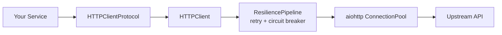

`lexigram-http` is the framework's **outbound** HTTP client — for talking to third-party APIs, partner services, and LLM providers. It is backed by `aiohttp`, ships with connection pooling and an interceptor chain, and wires opt-in resilience (retry, circuit breaker) through the DI container so your services depend on a protocol, not on a transport library.

This guide covers the outbound client only. For the inbound ASGI server that handles requests coming **into** your app, see `lexigram-web`.

For the full API and configuration reference, see the [`lexigram-http` package docs](/packages/lexigram-http/).

---

## 1. Why a Framework HTTP Client

Rolling your own `aiohttp.ClientSession` per service works — until you have five of them, none share a pool, none emit metrics, and each reinvents retry logic. `lexigram-http` gives you:

- **One managed lifecycle** — the connection pool starts with the app and shuts down cleanly.
- **Constructor-injected resilience** — `lexigram-resilience` policies are picked up from the container; no service-locator at request time.
- **Built-in observability** — every request emits `http.request.duration` and `http.request.status` when a metrics recorder is registered.
- **Protocol-first contract** — services depend on `HTTPClientProtocol`, so swapping in a fake for tests is a one-line provider override.

---

## 2. The Contract

Application code never imports `aiohttp` directly. It depends on the protocol exported from `lexigram-contracts`:

```python
from typing import Any, Protocol, runtime_checkable
from lexigram.contracts.web import HttpResponse


@runtime_checkable
class HTTPClientProtocol(Protocol):
    async def get(self, url: str, **kwargs: Any) -> HttpResponse: ...
    async def post(self, url: str, **kwargs: Any) -> HttpResponse: ...
    async def put(self, url: str, **kwargs: Any) -> HttpResponse: ...
    async def delete(self, url: str, **kwargs: Any) -> HttpResponse: ...
    async def patch(self, url: str, **kwargs: Any) -> HttpResponse: ...
    async def head(self, url: str, **kwargs: Any) -> HttpResponse: ...
    async def request(self, method: str, url: str, **kwargs: Any) -> HttpResponse: ...
```

The concrete implementation — `HTTPClient` — returns `Result[HttpResponse, HTTPClientError]` from its verb methods. 2xx responses become `Ok`; 4xx/5xx become `Err(HTTPStatusError)`; connection failures become `Err(HTTPConnectionError | HTTPTimeoutError)`. Infrastructure-level failures (circuit open, retries exhausted) are raised — your domain code does not need to handle them.

---

## 3. Configuration

Register the module and configure the `http` section. Defaults are sane; override only what you need.

```python
from lexigram import Application
from lexigram.di.module import Module, module
from lexigram.http import HTTPModule, HTTPClientConfig


@module(imports=[HTTPModule.configure(HTTPClientConfig())])
class AppModule(Module):
    pass
```

```yaml title="application.yaml"
http:
  pool:
    max_connections: 100              # total concurrent connections
    max_keepalive_connections: 50     # keep-alive per host
    max_connections_per_host: 20
    timeout: 30.0                     # request timeout (seconds)
    ttl_dns_cache: 300                # DNS cache TTL (seconds)
    force_close: false
  proxy: null                         # e.g. "http://proxy.example.com:8080"
  trust_env: true                     # honour HTTP_PROXY / HTTPS_PROXY / NO_PROXY
  cookie_jar: true                    # in-memory per-session cookies
```

Every key has an environment-variable form prefixed with `LEX_HTTP__`, e.g. `LEX_HTTP__POOL__TIMEOUT=15.0`.

---

## 4. Making Requests

Inject the protocol and call it. The example below talks to a partner billing API:

```python
from lexigram.contracts.web import HTTPClientProtocol
from lexigram.result import Result, Ok, Err
from my_app.domain.models import Invoice


class BillingClient:
    def __init__(self, http: HTTPClientProtocol) -> None:
        self._http = http

    async def fetch_invoice(self, invoice_id: str) -> Result[Invoice, str]:
        result = await self._http.get(
            f"https://api.partner.example.com/v1/invoices/{invoice_id}",
            headers={"Authorization": f"Bearer {self._token}"},
        )
        if result.is_err():
            return Err(f"billing fetch failed: {result.error}")
        body = result.value.json
        return Ok(Invoice(id=body["id"], amount_cents=body["amount_cents"]))
```

For SDK-style adapters that hit one upstream with a fixed base URL and default headers (typical for LLM providers), use `BaseURLHTTPClient`:

```python
from lexigram.http import BaseURLHTTPClient

async with BaseURLHTTPClient(
    base_url="https://api.partner.example.com/v1",
    headers={"Authorization": f"Bearer {token}"},
    timeout=60.0,
) as client:
    resp = await client.post("/invoices", json={"amount_cents": 4200})
    resp.raise_for_status()
```

`BaseURLHTTPClient` also exposes a `stream()` async context manager that yields decoded lines — useful for SSE and NDJSON responses.

---

## 5. Resilience Integration

`HTTPProvider` resolves resilience contracts from the container at boot time. Register `lexigram-resilience` and the HTTP client is wrapped automatically:



The provider tries to resolve, in order:

1. `ResiliencePipelineProtocol` — a composed pipeline of retry + circuit breaker + bulkhead + timeout. **Takes precedence** when present.
2. `RetryPolicyProtocol` — applied to every request when no pipeline is registered.
3. `CircuitBreakerRegistryProtocol` — when present, the provider obtains an `"http-default"` breaker and wraps the session call.

When none of these are registered, the client falls back to a default retry policy and runs without a breaker.

:::note
Retries-exhausted and circuit-open are **raised** as `HTTPRetryExhaustedError` / `HTTPCircuitOpenError`. They are not wrapped in `Result` — these are infrastructure failures, not domain outcomes.
:::

See the [resilience guide](/guides/resilience/) for policy configuration.

---

## 6. Observability

When a `MetricsRecorderProtocol` is registered in the container, `HTTPClient` emits per-request signals:

- `http.request.duration` — histogram, tagged with `method`
- `http.request.status` — counter, tagged with `method` and `status` (or `connection_error` / `timeout`)

Structured logs are emitted via `lexigram.logging` under the `http.client.*` namespace (`error_response`, `connection_error`, `timeout`). Add tracing or correlation headers with an interceptor:

```python
from lexigram.contracts.web import InterceptorProtocol


class CorrelationInterceptor(InterceptorProtocol):
    async def intercept_request(self, context):
        context.headers.setdefault("X-Correlation-Id", current_correlation_id())
        return context

    async def intercept_response(self, response):
        return response
```

Pass interceptors to the `HTTPClient` constructor, or compose them via the `InterceptorChainProtocol`. See the [observability guide](/guides/observability/) for the metrics recorder.

---

## 7. Testing

Because services depend on `HTTPClientProtocol`, swap the real client for a fake in tests — no monkey-patching, no recorded fixtures unless you want them:

```python
from lexigram.contracts.web import HTTPClientProtocol, HttpResponse
from lexigram.result import Ok


class FakeHTTPClient(HTTPClientProtocol):
    async def get(self, url, **kwargs):
        return Ok(HttpResponse(status=200, url=url, method="GET", json={"id": "inv_1"}))
    # ... other verbs as needed


async def test_fetch_invoice() -> None:
    client = BillingClient(http=FakeHTTPClient())
    result = await client.fetch_invoice("inv_1")
    assert result.is_ok()
```

For integration-style tests, `HTTPModule.stub()` registers an `HTTPClient` with default config and no outbound traffic unless you exercise it. See the [testing guide](/guides/testing/) for fixture patterns.

---

## Next Steps

- [Resilience](/guides/resilience/) — retry, circuit breaker, and bulkhead policies
- [Observability](/guides/observability/) — metrics, tracing, and structured logging
- [Dependency Injection](/fundamentals/dependency-injection/) — binding protocols to providers
- [`lexigram-http` package](/packages/lexigram-http/) — interceptors, streaming, and full API
