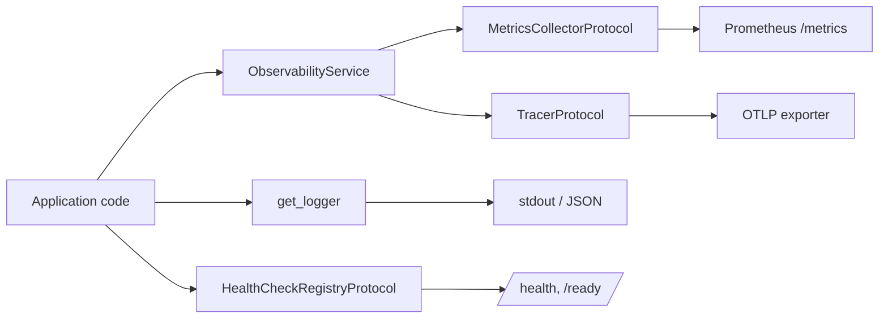

Lexigram treats observability as a first-class concern. Core ships structured logging out of the box, and `lexigram-monitor` adds metrics, distributed tracing, and health checks behind protocol interfaces so your code stays backend-agnostic. Swap Prometheus for OpenTelemetry — or a no-op stub in tests — without touching application code.

For the full API, see the [`lexigram-monitor` package docs](/packages/lexigram-monitor/).

---

## 1. The Four Pillars

Observability in Lexigram is organised around four concerns: **logs**, **metrics**, **traces**, and **health**. A single `MonitorModule` wires them into the DI container, and exporters fan out to whichever backend you scrape or ship to.



Logging is always-on in core; the other three pillars activate when `MonitorModule.configure(...)` is imported.

---

## 2. Structured Logging

`lexigram.logging` is `structlog`-based — never use `print()`. Get a logger named after your module and pass context as keyword arguments:

```python
from lexigram.logging import get_logger

logger = get_logger(__name__)


class OrderService:
    async def place(self, order_id: str, amount: float) -> None:
        logger.info("order.placed", order_id=order_id, amount=amount)
        try:
            await self._charge(amount)
        except PaymentError:
            logger.exception("order.payment_failed", order_id=order_id)
            raise
```

Keyword arguments become first-class fields in the JSON output. `logger.bind(...)` returns a new logger with permanent context — useful for request-scoped fields like `request_id` or `tenant_id`. Format, level, redaction, and sampling are governed by the core logging config — `LEX_LEXIGRAM__LOGGING__*` or the `logging:` section at the core app level — not by `MonitorConfig` (see [YAML Configuration](/fundamentals/yaml-configuration/)).

### Sentry Error Tracking

`lexigram-monitor` bridges structured logs and an external error tracker (Sentry) so every crash is both logged with a correlation id and reported to Sentry with the same id. Enable it by setting a DSN — either the dedicated config var or the conventional `SENTRY_DSN` fallback:

```bash
LEX_MONITOR__ERROR_TRACKING__DSN=https://public@sentry.io/1   # or
SENTRY_DSN=https://public@sentry.io/1
```

Install the unhandled-exception hook to capture crashes that escape every handler — it forwards them to the tracker and logs an `unhandled_exception` event carrying the active `trace_id`/`request_id` from `structlog.contextvars`:

```python
from lexigram.monitor.error_tracking import (
    install_unhandled_exception_hook,
    setup_error_tracking,
)

tracker = setup_error_tracking(monitor_config.error_tracking)
hook = install_unhandled_exception_hook(tracker)
# ... run your application ...
hook.uninstall()
```

When booting through the framework, `MonitorProvider` installs this hook automatically whenever a DSN is configured. Without a DSN — or without `sentry-sdk` installed — both helpers degrade to no-ops and you keep a structured `unhandled_exception` log line.

---

## 3. Metrics

Inject `MetricsCollectorProtocol` for the full counter / gauge / histogram API, or the narrower `MetricsRecorderProtocol` if your code only records.

```python
from lexigram.contracts.observability.metrics import MetricsCollectorProtocol


class CheckoutService:
    def __init__(self, metrics: MetricsCollectorProtocol) -> None:
        self._metrics = metrics
        self._latency = metrics.create_histogram(
            "checkout_duration_seconds",
            description="End-to-end checkout latency",
            labels={"service": "checkout"},
        )

    async def checkout(self, cart_id: str) -> None:
        self._metrics.increment("checkout_requests_total", tags={"cart": "web"})
        ...
```

For ergonomic instrumentation, the package ships decorators that time and trace a function in one line:

```python
from lexigram.monitor import metered, traced

@traced("checkout.process")
@metered("checkout.process.duration")
async def process(cart_id: str) -> None:
    ...
```

:::note
Label cardinality is the most common cause of Prometheus memory blow-ups. Never use unbounded values (user IDs, URLs with path parameters, raw error messages) as label values — bucket them first.
:::

---

## 4. Tracing

Inject `TracerProtocol` and wrap units of work in a span. Spans are context managers and automatically close on exit, capturing exceptions if any are raised.

```python
from lexigram.contracts.observability.tracing import TracerProtocol


class FulfilmentService:
    def __init__(self, tracer: TracerProtocol) -> None:
        self._tracer = tracer

    async def ship(self, order_id: str) -> None:
        with self._tracer.start_span(
            "fulfilment.ship",
            attributes={"order.id": order_id},
        ) as span:
            warehouse = await self._pick_warehouse(order_id)
            span.set_attribute("warehouse.id", warehouse.id)
            await self._dispatch(warehouse, order_id)
            span.add_event("dispatched", {"carrier": warehouse.carrier})
```

For propagation across services or messaging boundaries, use `tracer.inject_context(carrier)` to write `traceparent` into outbound headers and `tracer.extract_context(carrier)` to continue the trace on the consumer side. The higher-level `ObservabilityService` exposes the same span lifecycle through a `trace()` context manager that also covers the no-op case.

---

## 5. Health Checks

Health checks register against `HealthCheckRegistryProtocol`, tagged with a `HealthCheckCategory` that maps directly to Kubernetes probe types:

```python
from lexigram.contracts.core.health import HealthCheckCategory, HealthStatus, HealthCheckResult
from lexigram.contracts.observability.metrics import HealthCheckRegistryProtocol


async def check_payment_gateway() -> HealthCheckResult:
    ok = await payment_client.ping()
    return HealthCheckResult(
        component="payment_gateway",
        status=HealthStatus.HEALTHY if ok else HealthStatus.UNHEALTHY,
    )


class CheckoutModule:
    def __init__(self, health: HealthCheckRegistryProtocol) -> None:
        health.add(
            "payment_gateway",
            check_payment_gateway,
            timeout=2.0,
            critical=True,
            category=HealthCheckCategory.READINESS,
        )
```

When `lexigram-monitor` is paired with `lexigram-web`, the module registers HTTP endpoints under the configured base path (defaults to `/health`). The `Application` itself also exposes `liveness()`, `readiness()`, `startup_check()`, and `health_check()` coroutines for non-HTTP probes (see [Deployment](/guides/deployment/)).

---

## 6. Configuration

Wire `MonitorModule` into your application and configure the `monitor:` section. Defaults are zero-config — every pillar can be toggled independently.

```python
from lexigram import Application
from lexigram.di.module import Module, module
from lexigram.monitor import MonitorModule


@module(imports=[MonitorModule.configure()])
class AppModule(Module):
    pass


app = Application(name="my-app")
app.add_module(AppModule)
```

```yaml title="application.yaml"
monitor:
  metrics:
    enabled: true
    prefix: "myapp"
    histogram_buckets: [0.01, 0.05, 0.1, 0.5, 1.0, 2.5, 5.0]

  prometheus:
    enabled: true
    port: 9090
    path: "/metrics"

  tracing:
    enabled: true
    service_name: "myapp"
    sampler_type: "probability"
    sample_rate: 0.1            # production: sample 10 %

  opentelemetry:
    enabled: true
    otlp:
      endpoint: "http://otel-collector:4317"
      compression: "gzip"

  health:
    enabled: true
    path: "/health"
    interval: 30
    timeout: 5
```

Every key shown above has a `LEX_MONITOR__*` environment-variable equivalent (e.g. `LEX_MONITOR__TRACING__SAMPLE_RATE=0.05`). Structured logging is configured separately via the core `LEX_LEXIGRAM__LOGGING__*` namespace. See [YAML Configuration](/fundamentals/yaml-configuration/) for override semantics.

For tests, swap the module for a no-op stub that discards everything:

```python
async with Application.boot(modules=[MonitorModule.stub()]) as app:
    ...
```

---

## 7. Backends in Production

| Pillar  | Typical sink                 | How it gets there                              |
|---------|------------------------------|------------------------------------------------|
| Logs    | Loki, Elasticsearch, Datadog | stdout JSON, scraped by the container runtime  |
| Metrics | Prometheus, Grafana Cloud    | `/metrics` scrape on the configured port       |
| Traces  | Tempo, Jaeger, Honeycomb     | OTLP exporter to a local OpenTelemetry Collector |
| Health  | Kubernetes probes, ALB / NLB | HTTP requests against `/health` (and `/ready`) |

Shipping OTLP to a sidecar/agent collector lets it handle routing, retries, and backend-specific protocols.

---

## Next Steps

- [Dependency Injection](/fundamentals/dependency-injection/) — injecting metrics, tracer, and health registry protocols
- [Providers](/fundamentals/providers/) — how `MonitorProvider` registers the four pillars
- [Deployment](/guides/deployment/) — wiring `/health` to Kubernetes probes
- [`lexigram-monitor` package reference](/packages/lexigram-monitor/) — full API surface
