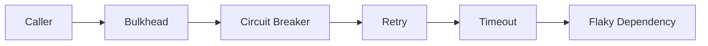

`lexigram-resilience` ships the core fault-tolerance patterns: **retry**, **circuit breaker**, **bulkhead**, **rate limiter**, **throttle**, **timeout**, and **fallback**. Wrap any call that crosses a process boundary — HTTP APIs, databases, message brokers, LLM providers — and turn intermittent failures into bounded, observable behaviour.

For the complete API and tuning knobs, see the [`lexigram-resilience` package docs](/packages/lexigram-resilience/).

---

## 1. What It Protects Against

Each pattern guards against a different failure mode. A typical outbound call stacks several into a **pipeline**: an outer concurrency cap, a breaker that short-circuits when the dependency is down, a retry on transient errors, and a hard timeout on each attempt.



| Pattern         | Protects against                                  |
|-----------------|---------------------------------------------------|
| Retry           | Transient errors (network blips, 503s)            |
| Circuit Breaker | A dependency that is sustainably broken           |
| Bulkhead        | A slow dependency exhausting all worker tasks     |
| Rate Limit      | Exceeding a quota imposed by an upstream service  |
| Throttle        | Bursty client load against a fragile endpoint     |
| Fallback        | Failure with no acceptable primary path           |

---

## 2. Retry

Use `@retry` for operations that may fail transiently. Backoff is exponential with optional jitter; `abort_on` stops retries on errors that will never recover (e.g. `4xx` validation failures).

```python
from lexigram.resilience import retry, RetryConfig

@retry(RetryConfig(
    max_attempts=3,           # 1 initial call + 2 retries
    base_delay=0.5,
    backoff_factor=2.0,
    max_delay=10.0,
    jitter=True,
    retry_on=(ConnectionError, TimeoutError),
    abort_on=(ValueError,),
))
async def fetch_quote(symbol: str) -> dict:
    return await http_client.get(f"/quotes/{symbol}")
```

For programmatic control without a decorator, build a `RetryPolicy` and call `await policy.execute(func, *args)`.

:::note
Only retry **idempotent** operations. Retrying a `POST /payments` may charge a customer twice. Pair non-idempotent calls with the `@idempotent` decorator, or design the upstream API to accept an idempotency key.
:::

---

## 3. Circuit Breaker

A circuit breaker tracks failures in a sliding window. After `failure_threshold` errors it **opens** and rejects calls immediately with `CircuitOpenError`. After `recovery_timeout` seconds it lets a single probe through (**half-open**); on success the breaker **closes** and traffic resumes.

```python
from lexigram.resilience import CircuitBreaker, CircuitBreakerConfig, CircuitOpenError

breaker = CircuitBreaker(
    config=CircuitBreakerConfig(
        name="payments-api",
        failure_threshold=5,
        recovery_timeout=30.0,
        success_threshold=2,
    ),
)


async def charge(card_id: str, amount_cents: int) -> str:
    try:
        return await breaker.execute(payments_client.charge, card_id, amount_cents)
    except CircuitOpenError:
        raise PaymentsUnavailable() from None
```

For a registry-managed breaker shared across handlers, resolve `CircuitBreakerRegistryProtocol` from the container and use `@circuit_breaker("name", registry)`. Set `backend: redis` in config to coordinate state across processes.

---

## 4. Bulkhead

A bulkhead caps concurrent in-flight calls so a single slow dependency can't drain the event loop. Requests above the cap wait in a bounded queue; once both are full, new calls raise `BulkheadRejectedError` immediately.

```python
from lexigram.resilience import bulkhead, BulkheadConfig

@bulkhead(BulkheadConfig(max_concurrent=8, queue_size=32, timeout=5.0))
async def transcode(asset_id: str) -> bytes:
    return await ffmpeg_service.run(asset_id)
```

Size `max_concurrent` to the dependency's safe parallelism — not your worker count. The queue absorbs short bursts; the timeout sheds load when the queue itself backs up.

---

## 5. Rate Limit & Throttle

Both cap throughput, but at different layers. **`@throttle`** is the high-level decorator; **`RateLimiter`** is the low-level token-bucket primitive it builds on. Prefer the decorator unless you need to share one limiter across many code paths.

```python
from lexigram.resilience import throttle, RateLimiter

# Decorator: 100 calls per 60s, smoothed across the window
@throttle(calls=100, period=60.0, strategy="sliding_window")
async def search_external(query: str) -> list[dict]:
    return await external_search.query(query)

# Shared limiter: 10 req/s, bursts up to 10
_limiter = RateLimiter(rate=10, per=1.0)

async def send_sms(to: str, body: str) -> None:
    await _limiter.acquire()
    await sms_client.send(to=to, body=body)
```

`strategy="token_bucket"` (default) permits bursts; `"sliding_window"` smooths traffic over the full period.

---

## 6. Fallback

When the primary path fails, return a degraded result. Steps are tried in order; the first to succeed wins.

```python
from lexigram.contracts.infra.resilience.models import RetryConfig
from lexigram.resilience.fallback import Fallback, AlternativeFallback
from lexigram.result import Ok, Result

async def cached_recommendations(ctx, err) -> Result[list[str], Exception]:
    cached = await cache.get(f"recs:{ctx['user_id']}")
    return Ok(cached or [])

steps = [
    Fallback.retry_fallback(RetryConfig(max_attempts=2, base_delay=0.2)),
    AlternativeFallback(cached_recommendations),
    Fallback.degrade(degraded_result=[]),  # last-resort sentinel
]
```

`Fallback.degrade(...)` returns a static value, `AlternativeFallback(func)` runs an alternate computation (cache lookup, secondary region), and `Fallback.retry_fallback(...)` performs a final retry round.

---

## 7. Composing Patterns

Most production calls want several patterns at once. `ResiliencePipeline` composes them in the canonical order **bulkhead → circuit breaker → retry → timeout**, with bulkhead outermost and timeout closest to the call.

```python
from lexigram.contracts.infra.resilience.models import (
    CircuitBreakerConfig, RetryConfig, TimeoutConfig,
)
from lexigram.resilience import BulkheadConfig
from lexigram.resilience import ResiliencePipeline

pipeline = ResiliencePipeline(
    retry_config=RetryConfig(max_attempts=3, base_delay=0.5),
    circuit_config=CircuitBreakerConfig(name="orders-api", failure_threshold=5),
    bulkhead_config=BulkheadConfig(max_concurrent=20, queue_size=50),
    timeout_config=TimeoutConfig(timeout=5.0),
)

result = await pipeline.execute(orders_client.place, order)
```

:::note
Order matters: with the default pipeline the **timeout applies per attempt**, the **retry sits inside the breaker** (so retries count as failures that can trip it), and the **bulkhead caps total in-flight work including retries**. Override via the `order=` argument only with intent.
:::

Other packages obtain a configured pipeline by injecting `ResiliencePipelineFactoryProtocol` — see [dependency injection](/fundamentals/dependency-injection/).

---

## 8. Configuration

Register `ResilienceModule` (or `ResilienceProvider` directly) and tune the `resilience:` block. All keys are overridable via `LEX_RESILIENCE__*` environment variables. For tests, `ResilienceModule.stub()` provides minimal in-memory wiring.

```python
from lexigram import Application
from lexigram.resilience import ResilienceModule

app = Application(name="my-app")
app.add_module(ResilienceModule.configure())
```

```yaml title="application.yaml"
resilience:
  circuit_breaker:
    failure_threshold: 5
    recovery_timeout: 60.0
    success_threshold: 3
    failure_rate_threshold: 0.5
    backend: memory          # memory | redis | consul
  retry:
    max_attempts: 3          # initial call + 2 retries
    base_delay: 1.0
    max_delay: 60.0
    backoff_factor: 2.0
    jitter: true
  bulkhead:
    max_concurrent: 10
    queue_size: 100
    timeout: 30.0
  timeout:
    timeout: 30.0
```

---

## Next Steps

- [Database & Persistence](/guides/database/) — wrapping query handlers with a resilience pipeline
- [Observability](/guides/observability/) — emitting circuit-state and retry counters to your metrics backend
- [`lexigram-resilience` package](/packages/lexigram-resilience/) — distributed backends, hooks, and the idempotency subsystem
