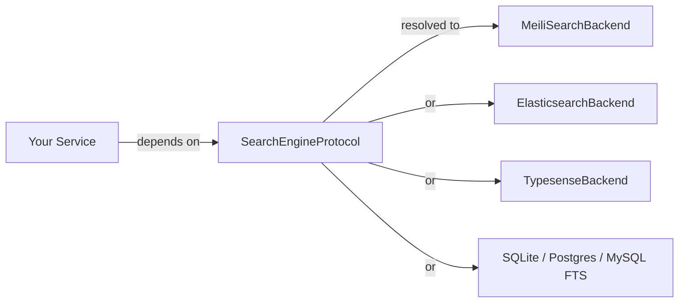

`lexigram-search` provides async full-text search behind a single protocol. Application code depends on `SearchEngineProtocol`; the backend (Meilisearch, Elasticsearch, Typesense, Postgres, MySQL, SQLite, MongoDB, or in-memory) is chosen in configuration. The same indexing and query code runs on a zero-dependency SQLite FTS5 backend in development and on a managed Elasticsearch cluster in production.

For the full configuration reference and backend matrix, see the [`lexigram-search` package docs](/packages/lexigram-search/).

---

## 1. The Contract

All backends implement `SearchEngineProtocol` from `lexigram-contracts`. The protocol covers indexing, bulk indexing, query execution, deletion, and health:

```python
from typing import Any, Protocol, runtime_checkable
from lexigram.contracts.core import HealthCheckResult
from lexigram.contracts.data import QueryResult


@runtime_checkable
class SearchEngineProtocol(Protocol):
    async def index_document(
        self,
        document_id: str,
        document: dict[str, Any],
        index_name: str | None = None,
    ) -> None: ...
    async def index_many(
        self,
        documents: list[tuple[str, dict[str, Any]]],
        index_name: str | None = None,
    ) -> None: ...
    async def search(
        self,
        query: str,
        filters: dict[str, Any] | None = None,
        sort: list[dict[str, str]] | None = None,
        limit: int | None = None,
        offset: int | None = None,
    ) -> QueryResult: ...
    async def delete_document(
        self,
        document_id: str,
        index_name: str | None = None,
    ) -> None: ...
    async def health_check(self, timeout: float = 5.0) -> HealthCheckResult: ...
```

Services depend on the protocol — never on a concrete backend:



---

## 2. Configuration

Register `SearchModule` and configure the `search:` block. `SearchModule.configure()` requires an explicit `SearchConfig`; use `SearchModule.stub()` for tests.

```python
from lexigram import Application
from lexigram.di.module import Module, module
from lexigram.search import SearchModule, SearchConfig


@module(imports=[SearchModule.configure(SearchConfig())])
class AppModule(Module):
    pass


app = Application(name="my-app")
app.add_module(AppModule)
```

```yaml title="application.yaml"
search:
  enabled: true
  backend_type: meilisearch    # meilisearch | elasticsearch | typesense
                               # | postgres | mysql | sqlite | mongodb | memory
  timeout: 30.0
  meilisearch:
    url: "${MEILI_URL:http://localhost:7700}"
    api_key: "${MEILI_API_KEY}"
    searchable_attributes: [name, description, tags]
    filterable_attributes: [category, in_stock]
    sortable_attributes: [created_at, price]
  query:
    strategy: fuzzy            # fuzzy | exact | semantic | hybrid
    default_limit: 10
    max_limit: 100
    enable_faceting: true
  operations:
    bulk_chunk_size: 500
```

For local development the `sqlite` backend uses SQLite FTS5 with no external service:

```yaml title="application.yaml"
search:
  backend_type: sqlite
  sqlite:
    db_path: ":memory:"        # or a file path
    tokenizer: "porter unicode61"
    auto_create_tables: true
```

:::note
Analyzer, tokenizer, and typo-tolerance behaviour differ between backends. A query that returns matches under Meilisearch's typo tolerance may miss under SQLite FTS5's stemmer. Run your relevance checks against the backend you will deploy.
:::

---

## 3. Indexing Documents

Inject `SearchEngineProtocol` and index documents as plain dicts. The document ID is separate from the document payload:

```python
from lexigram.contracts.search import SearchEngineProtocol
from my_app.domain.models import Product


class ProductIndexer:
    def __init__(self, search: SearchEngineProtocol) -> None:
        self._search = search

    async def index(self, product: Product) -> None:
        await self._search.index_document(
            document_id=product.id,
            document={
                "id": product.id,
                "name": product.name,
                "description": product.description,
                "tags": product.tags,
                "category": product.category,
                "price": product.price,
                "in_stock": product.stock > 0,
            },
            index_name="products",
        )

    async def remove(self, product_id: str) -> None:
        await self._search.delete_document(product_id, index_name="products")
```

For bulk loads (reindex jobs, importers) call `index_many` once per chunk instead of looping `index_document` — backends route this to their native bulk API and respect `operations.bulk_chunk_size`:

```python
batch: list[tuple[str, dict[str, Any]]] = [
    (p.id, {"id": p.id, "name": p.name, "tags": p.tags}) for p in products
]
await self._search.index_many(batch, index_name="products")
```

---

## 4. Querying

Pass a free-text query plus optional filters, sort, and pagination. The result exposes hits, total count, and (when supported) facets:

```python
class ProductSearch:
    def __init__(self, search: SearchEngineProtocol) -> None:
        self._search = search

    async def find(self, term: str, category: str | None, page: int) -> dict:
        result = await self._search.search(
            query=term,
            filters={"in_stock": True, "category": category} if category else {"in_stock": True},
            sort=[{"price": "asc"}],
            limit=20,
            offset=(page - 1) * 20,
        )
        return {
            "hits": [r.data for r in result.results],
            "total": result.total,
            "took_ms": result.took_ms,
        }
```

`SearchResponse` (from `lexigram.search.types`) carries:

- `results: list[SearchResult]` — each with `id`, `score`, `data`, optional `highlights`
- `total: int` — total matching documents (not just the returned page)
- `page`, `per_page`, `query`, `took_ms`
- `facets: dict[str, Any] | None` — populated when faceting is enabled and supported by the backend

---

## 5. Facets

When `query.enable_faceting: true` and the backend supports them (Meilisearch, Elasticsearch, Typesense), `SearchResponse.facets` is populated with bucket counts per declared filterable attribute:

```python
result = await self._search.search(query="laptop", limit=20)
# result.facets → {"category": {"electronics": 42, "office": 7}, "in_stock": {"true": 38, "false": 11}}
```

Each backend has its own rules for which fields are facetable — for Meilisearch, list them under `meilisearch.filterable_attributes`. The SQL backends (`sqlite`, `postgres`, `mysql`) do not currently emit facets.

---

## 6. Multiple Backends

Declare `backends:` to register more than one search engine. The primary is bound to the unnamed `SearchEngineProtocol`; each entry is also bound under `Named(entry.name)`:

```yaml title="application.yaml"
search:
  backends:
    - name: catalog
      primary: true
      backend_type: meilisearch
      meilisearch:
        url: "${MEILI_URL}"
    - name: audit
      backend_type: postgres
      database: audit_db
```

```python
from typing import Annotated
from lexigram.contracts.search import SearchEngineProtocol
from lexigram.di.markers import Named


class AuditTrail:
    def __init__(
        self,
        catalog: SearchEngineProtocol,                              # primary
        audit: Annotated[SearchEngineProtocol, Named("audit")],
    ) -> None:
        ...
```

`postgres` and `mysql` backends resolve a named `DatabaseProviderProtocol` from the container at boot — see [Database & Persistence](/guides/database/) for declaring those.

---

## 7. Testing

For unit tests, `SearchModule.stub()` wires an in-memory (null) backend that satisfies `SearchEngineProtocol` with no external service:

```python
from lexigram import Application
from lexigram.search import SearchModule
from lexigram.contracts.search import SearchEngineProtocol


async def test_indexes_and_finds_product() -> None:
    async with Application.boot(modules=[SearchModule.stub()]) as app:
        search = await app.container.resolve(SearchEngineProtocol)
        await search.index_document("p1", {"name": "Laptop"}, index_name="products")
        result = await search.search(query="Laptop")
        assert result.total >= 0  # null backend is a no-op stub
```

For integration tests against real search semantics, prefer `SearchModule.configure(SearchConfig(backend_type=BackendType.SQLITE))` — SQLite FTS5 has no external dependency and exercises real tokenization and ranking.

---

## Next Steps

- [Database & Persistence](/guides/database/) — the source of truth for reindex jobs and the home of the SQL-backed search options
- [Dependency Injection](/fundamentals/dependency-injection/) — binding `SearchEngineProtocol` to a backend
- [`lexigram-search` package](/packages/lexigram-search/) — full backend matrix, analytics, suggestion engine, and federated search
