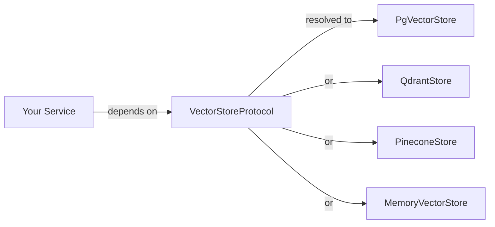

`lexigram-vector` provides vector store backends behind a single protocol. Application code depends on `VectorStoreProtocol`; the backend (pgvector, Qdrant, Pinecone, Chroma, or in-memory) is chosen in configuration. Swap backends, run several side-by-side, and substitute an in-memory stub in tests without touching services that use them.

For the full configuration reference and advanced features (hybrid search, reranking, embedding caching), see the [`lexigram-vector` package docs](/packages/lexigram-vector/).

---

## 1. The Contracts

All backends implement `VectorStoreProtocol` and per-collection operations via `VectorCollectionProtocol`. Every operation returns a `Result` so backend failures are explicit:

```python
from typing import Any, Protocol, runtime_checkable
from lexigram.contracts.core.health import HealthCheckResult
from lexigram.contracts.data.vector.enums import DistanceMetric
from lexigram.contracts.data.vector.types import (
    CollectionConfig, CollectionInfo, DeleteResult,
    SearchQuery, SearchResult, UpsertResult, VectorRecord,
)
from lexigram.contracts.data.vector.filters import MetadataCondition
from lexigram.result import Result


@runtime_checkable
class VectorStoreProtocol(Protocol):
    async def connect(self) -> None: ...
    async def disconnect(self) -> None: ...
    async def health_check(self, timeout: float = 5.0) -> HealthCheckResult: ...
    async def list_collections(self) -> list[CollectionInfo]: ...
    async def create_collection(self, config: CollectionConfig) -> None: ...
    async def delete_collection(self, name: str) -> None: ...
    async def collection_exists(self, name: str) -> bool: ...
    async def get_collection(self, name: str) -> VectorCollectionProtocol: ...
    async def add_texts(
        self,
        texts: list[str],
        embeddings: list[list[float]] | None = None,
        metadatas: list[dict[str, Any]] | None = None,
        collection_name: str | None = None,
    ) -> UpsertResult: ...


@runtime_checkable
class VectorCollectionProtocol(Protocol):
    @property
    def name(self) -> str: ...
    @property
    def dimension(self) -> int: ...
    @property
    def distance_metric(self) -> DistanceMetric: ...
    async def upsert(self, records: list[VectorRecord]) -> UpsertResult: ...
    async def search(self, query: SearchQuery) -> list[SearchResult]: ...
    async def get(self, ids: list[str]) -> list[VectorRecord]: ...
    async def delete(self, ids: list[str]) -> DeleteResult: ...
    async def count(self) -> int: ...
```

Your services depend on the store protocol — never on a concrete backend:



---

## 2. Configuration

Add `VectorModule` and configure the backend:

```python
from lexigram import Application
from lexigram.vector import VectorModule, VectorConfig

app = Application(name="my-app")
app.add_module(VectorModule.configure(
    VectorConfig(
        backend="pgvector",
        default_dimension=1536,
        default_distance_metric="cosine",
    ),
))
```

```yaml title="application.yaml"
vector:
  enabled: true
  backend: pgvector
  default_dimension: 1536
  default_distance_metric: cosine
  upsert_batch_size: 100
  max_retries: 3
  retry_delay: 1.0
  pgvector:
    database: primary
    schema: public
```

For local development, the `memory` backend needs no external service:

```yaml title="application.yaml"
vector:
  backend: memory
  memory:
    max_collections: 100
    max_vectors_per_collection: 100000
```

:::note
`VectorModule.configure()` accepts a `VectorConfig`, a plain `dict`, or `None` for environment variable defaults.
:::

---

## 3. Collections

Create a collection with a specific dimension and distance metric, then get a handle for operations:

```python
from lexigram.contracts.data.vector.protocols import VectorStoreProtocol
from lexigram.contracts.data.vector.types import CollectionConfig
from lexigram.contracts.data.vector.enums import DistanceMetric


async def setup_collection(store: VectorStoreProtocol) -> None:
    await store.create_collection(
        CollectionConfig(
            name="products",
            dimension=1536,
            distance_metric=DistanceMetric.COSINE,
        )
    )

    collection = await store.get_collection("products")
    print(f"Collection: {collection.name}, dim={collection.dimension}")
```

---

## 4. Upserting Vectors

Insert or update vectors with metadata:

```python
from lexigram.contracts.data.vector.types import VectorRecord


async def upsert_vectors(collection: VectorCollectionProtocol) -> None:
    result = await collection.upsert([
        VectorRecord(
            id="vec-1",
            vector=[0.1, 0.2, ...],  # 1536-dimensional
            metadata={"title": "Document A", "category": "science"},
        ),
        VectorRecord(
            id="vec-2",
            vector=[0.3, 0.4, ...],
            metadata={"title": "Document B", "category": "history"},
        ),
    ])
    print(f"Upserted: {result.upserted_count}")
```

---

## 5. Searching

Query a collection using a vector embedding:

```python
from lexigram.contracts.data.vector.types import SearchQuery


async def search(collection: VectorCollectionProtocol, query_vector: list[float]) -> None:
    results = await collection.search(
        SearchQuery(
            vector=query_vector,
            top_k=5,
            filter={"category": {"$eq": "science"}},
        )
    )
    for result in results:
        print(f"ID: {result.id}, Score: {result.score}, Metadata: {result.metadata}")
```

The `SearchQuery` supports filters via `MetadataCondition` and `MetadataConditionGroup`, enabling complex metadata filtering during search.

---

## 6. Multiple Backends

Declare multiple named backends for different use cases:

```yaml title="application.yaml"
vector:
  backends:
    - name: primary
      primary: true
      backend: qdrant
      qdrant:
        url: http://qdrant:6333
    - name: cache
      backend: memory
      memory:
        max_collections: 10
```

Named backends are injected with `Named`:

```python
from typing import Annotated
from lexigram.contracts.data.vector.protocols import VectorStoreProtocol
from lexigram.di.markers import Named


class SearchService:
    def __init__(
        self,
        store: VectorStoreProtocol,
        cache: Annotated[VectorStoreProtocol, Named("cache")],
    ) -> None:
        self._store = store
        self._cache = cache
```

---

## 7. Testing

Use `VectorModule.stub()` for isolated tests with an in-memory backend:

```python
from lexigram import Application
from lexigram.vector import VectorModule
from lexigram.contracts.data.vector.protocols import VectorStoreProtocol
from lexigram.contracts.data.vector.types import CollectionConfig


async def test_vector_search() -> None:
    async with Application.boot(modules=[VectorModule.stub()]) as app:
        store = await app.container.resolve(VectorStoreProtocol)
        await store.create_collection(
            CollectionConfig(name="test", dimension=4, distance_metric="cosine")
        )
        coll = await store.get_collection("test")
        assert coll.name == "test"
```

---

## Next Steps

- [Retrieval-Augmented Generation](/guides/ai-rag/) — using vector stores for RAG
- [AI Memory](/guides/ai-memory/) — semantic memory backed by vector storage
- [Dependency Injection](/fundamentals/dependency-injection/) — binding protocols to implementations
- [`lexigram-vector` package](/packages/lexigram-vector/) — hybrid search, reranking, embedding cache
