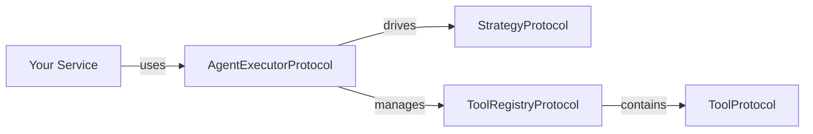

`lexigram-ai-agents` provides an agent system with pluggable reasoning strategies, tool registration, and an executor protocol. Agents think, act, and observe using strategies like ReAct or Plan-and-Execute, with tool access governed by a registry.

For full configuration details, see the [`lexigram-ai-agents` package docs](/packages/lexigram-ai-agents/).

---

## 1. The Contracts

All agents, tools, and executors implement protocols from `lexigram.contracts.ai`. The executor drives the reasoning loop, and the tool registry manages tool lifecycle:

```python
from typing import Any, Protocol, runtime_checkable
from lexigram.result import Result
from lexigram.contracts.ai import AgentError, ToolError, AgentResponse


class ToolProtocol(Protocol):
    @property
    def name(self) -> str: ...
    @property
    def description(self) -> str: ...
    @property
    def parameters_schema(self) -> dict[str, Any]: ...
    async def execute(self, **kwargs: Any) -> Any: ...


class AgentExecutorProtocol(Protocol):
    async def run(
        self,
        agent: AgentProtocol,
        message: str,
        session_id: str | None = None,
        user_id: str | None = None,
        **kwargs: Any,
    ) -> Result[AgentResponse, AgentError]: ...

    async def astream(
        self,
        agent: AgentProtocol,
        message: str,
        session_id: str | None = None,
        user_id: str | None = None,
        **kwargs: Any,
    ) -> Any: ...


class ToolRegistryProtocol(Protocol):
    def register(self, tool: ToolProtocol, module_class: type | None = None) -> None: ...
    def get(self, name: str) -> ToolProtocol | None: ...
    def list_tools(self) -> list[ToolProtocol]: ...
    async def execute(self, name: str, **kwargs: Any) -> Result[Any, ToolError]: ...
```

Your services depend on these protocols — never on concrete implementations:



---

## 2. Configuration

Add the `AgentsModule` via the application:

```python
from lexigram import Application
from lexigram.ai.agents import AgentsModule
from lexigram.ai.agents import AgentConfig

app = Application(name="my-app")
app.add_module(AgentsModule.configure(AgentConfig(max_iterations=10)))
```

```yaml title="application.yaml"
ai_agents:
  enabled: true
  max_iterations: 10
  default_temperature: 0.7
  default_max_tokens: 2048
  tool_max_retries: 3
  enable_tracing: true
  enable_metrics: true
```

:::note
`AgentConfig` fields are also configurable via environment variables with the `LEXIGRAM_AI_AGENTS__` prefix. You can pass `config=None` to `configure()` to use all defaults.
:::

---

## 3. Defining Tools

Use the `@tool` decorator to convert an async function into an agent tool:

```python
from lexigram.ai.agents import tool


@tool(name="lookup_order", description="Look up an order by its ID")
async def lookup_order(order_id: str) -> dict:
    return {"order_id": order_id, "status": "shipped"}
```

The decorator generates a JSON Schema from the function's type hints and wraps it in a `FunctionTool`. For tools with more complex behavior, subclass `AbstractTool`:

```python
from lexigram.ai.agents import AbstractTool


class WeatherTool(AbstractTool):
    @property
    def name(self) -> str:
        return "get_weather"

    @property
    def description(self) -> str:
        return "Get current weather for a location"

    @property
    def parameters_schema(self) -> dict[str, Any]:
        return {
            "type": "object",
            "properties": {
                "location": {"type": "string", "description": "City or region"}
            },
            "required": ["location"],
        }

    async def execute(self, location: str) -> dict:
        return {"temperature": 22, "conditions": "sunny"}
```

---

## 4. Creating an Agent

Subclass `AgentBase` and set `name`, `system_prompt`, and the `tools` property:

```python
from lexigram.ai.agents import AgentBase, tool


@tool(name="search_kb", description="Search the knowledge base")
async def search_knowledge_base(query: str) -> list[dict]:
    return [{"title": f"Result for {query}", "content": "..."}]


@tool(name="calculate", description="Perform arithmetic")
async def calculate(expression: str) -> str:
    return str(eval(expression))


class SupportAgent(AgentBase):
    name = "support_agent"
    system_prompt = "You are a helpful support agent with knowledge base access."

    @property
    def tools(self):
        return [search_knowledge_base, calculate]
```

---

## 5. Running an Agent

Resolve `AgentExecutorProtocol` from the container and call `run()`:

```python
from lexigram import Application
from lexigram.ai.agents import AgentsModule, AgentConfig
from lexigram.contracts.ai import AgentExecutorProtocol


async def main() -> None:
    async with Application.boot(
        modules=[AgentsModule.configure(AgentConfig(max_iterations=10))]
    ) as app:
        executor = await app.container.resolve(AgentExecutorProtocol)
        agent = SupportAgent()

        result = await executor.run(agent, "What is 42 + 7?")
        if result.is_ok():
            response = result.unwrap()
            print(f"Answer: {response.message}")
            print(f"Steps: {response.step_count}")
            print(f"Tokens: {response.total_tokens}")
        else:
            error = result.unwrap_err()
            print(f"Agent failed: {error}")
```

:::tip
Use `astream()` for real-time monitoring. It yields `AgentEvent` objects with thoughts, tool calls, and messages as they happen.
:::

---

## 6. Strategies

Agents use a reasoning strategy to drive execution. The framework ships with several built-in strategies registered in `AgentStrategyRegistry`:

| Strategy | Description |
|----------|-------------|
| `ReActStrategy` | Reason → Act → Observe (default) |
| `PlanAndExecuteStrategy` | Plan then execute steps |
| `ReflexionStrategy` | Self-critique and refine |
| `SupervisorStrategy` | Delegates to sub-agents |

Switch strategies or register custom ones with the `@strategy` decorator:

```python
from lexigram.ai.agents import strategy


@strategy(name="custom")
class CustomStrategy:
    async def execute(
        self,
        message: str,
        tools: list,
        history: list[dict[str, Any]],
        llm: Any,
        **kwargs: Any,
    ) -> Any:
        # Custom reasoning loop
        ...
```

---

## 7. Multi-Agent Support

Enable multi-agent orchestration to let agents delegate tasks to peer agents:

```python
from lexigram.ai.agents import AgentsModule

app.add_module(AgentsModule.configure(
    AgentConfig(max_iterations=10),
    enable_multi_agent=True,
))
```

When enabled, agents can use `AgentAsToolAdapter` to expose other agents as callable tools, enabling supervisor-led delegation and crew-based workflows.

---

## 8. Testing

Use `AgentsModule.stub()` for isolated tests without an LLM backend:

```python
from lexigram import Application
from lexigram.ai.agents import AgentsModule
from lexigram.contracts.ai import AgentExecutorProtocol


async def test_agent_resolves() -> None:
    async with Application.boot(modules=[AgentsModule.stub()]) as app:
        executor = await app.container.resolve(AgentExecutorProtocol)
        assert executor is not None
```

The stub registers no-op implementations that satisfy the protocols without external dependencies.

:::caution
Stubs return empty `AgentResponse` objects. For integration tests, provide a real LLM binding or a test-double LLM client.
:::

---

## Next Steps

- [Dependency Injection](/fundamentals/dependency-injection/) — binding protocols
- [AI Memory](/guides/ai-memory/) — episodic and semantic recall
- [AI Skills](/guides/ai-skills/) — composable skills for agents
- [AI Sessions](/guides/ai-sessions/) — session management
- [AI RAG](/guides/ai-rag/) — retrieval-augmented generation
- [`lexigram-ai-agents` package](/packages/lexigram-ai-agents/) — crews, delegation, streaming
