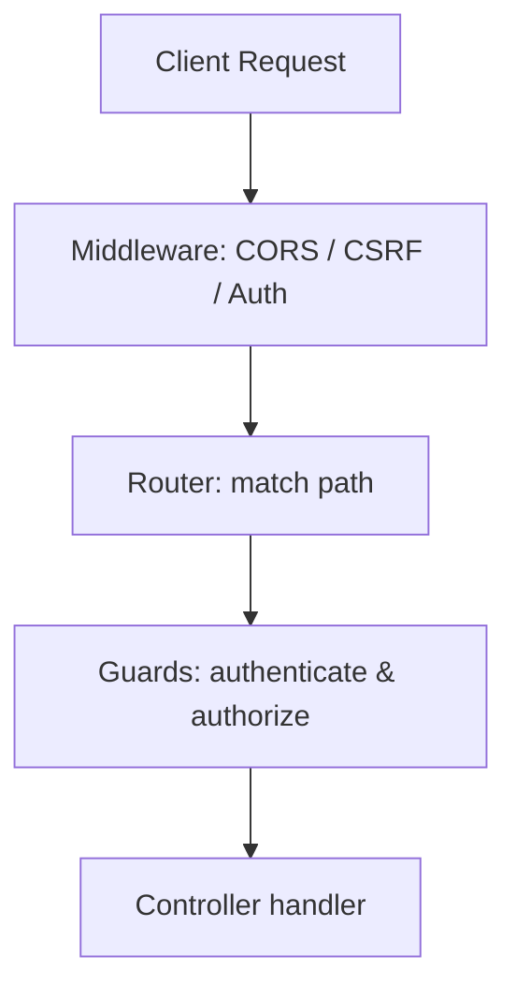

`lexigram-auth` provides authentication and authorization — JWT, OAuth2, password hashing, and role-based access control (RBAC). In a web application, most checks happen in the request pipeline using **guards**.

---

## 1. The Security Pipeline



| Component | Scope | Runs | Used for |
|-----------|-------|------|----------|
| **Middleware** | Global | Outermost | CORS, CSRF, rate limiting, auth context |
| **Guard** | Per route/controller | After routing | Authentication, role checks |

---

## 2. Protecting Routes with Guards

Apply guards to a controller or a single handler with `@use_guards`. The built-in `AuthGuard` requires a valid session or token; `RoleGuard` restricts by role.

```python
from lexigram.web import Controller, get
from lexigram.web.security import use_guards, AuthGuard, RoleGuard


class ProfileController(Controller):
    prefix = "/api/profile"

    @get("/")
    @use_guards(AuthGuard)
    async def me(self) -> dict:
        return {"status": "authenticated"}


@use_guards(RoleGuard("admin"))      # applies to every route in the controller
class AdminController(Controller):
    prefix = "/admin"
```

`lexigram.web` also re-exports concise shortcuts:

```python
from lexigram.web import roles, guard

@roles("admin", "editor")     # require any of these roles
@guard(MyCustomGuard)         # apply a custom guard
```

---

## 3. Custom Guards

`AuthGuard` and `RoleGuard` are abstract base classes — implement your own by subclassing and returning either success or a `GuardRejection`. Request data is available through the typed `Request` (e.g. `request.ip`, `request.user`):

```python
from lexigram.web.security import AuthGuard
from lexigram.web import Request


class IPAllowlistGuard(AuthGuard):
    allowed = {"127.0.0.1", "10.0.0.1"}

    async def can_activate(self, request: Request) -> bool:
        return request.ip in self.allowed
```

See the [`lexigram-auth` package docs](/packages/lexigram-auth/) for the exact guard interface and built-in guards.

---

## 4. Error Mapping

When a guard rejects a request, Lexigram returns a standardized HTTP error (as [RFC 7807 Problem Details](https://www.rfc-editor.org/rfc/rfc7807)):

| Failure | HTTP status |
|---------|-------------|
| Not authenticated | `401` |
| Authenticated but not authorized | `403` |

Because the framework uses the [Result pattern](/fundamentals/result-pattern/), services can also return auth errors directly and the web layer maps them to the right status code.

---

## 5. Wiring Auth

Add the auth provider and configure the `auth` section — JWT signing, password policy, and RBAC:

```python
from lexigram.auth import AuthBundleProvider

app.add_provider(AuthBundleProvider())
```

```yaml title="application.yaml"
auth:
  enabled: true
  token:
    secret_key: "${LEX_AUTH__TOKEN__SECRET_KEY}"
    algorithm: HS256
    access_token_expire_minutes: 30
  password:
    min_length: 12
    require_uppercase: true
    require_digits: true
  rbac:
    enabled: true
    default_role: viewer
```

---

## Next Steps

- [Multi-Tenancy](/guides/multi-tenancy/) — tenant-scoped access control
- [Result Pattern](/fundamentals/result-pattern/) — returning auth errors from services
- [`lexigram-auth` package](/packages/lexigram-auth/) — JWT, OAuth2, and RBAC in depth
