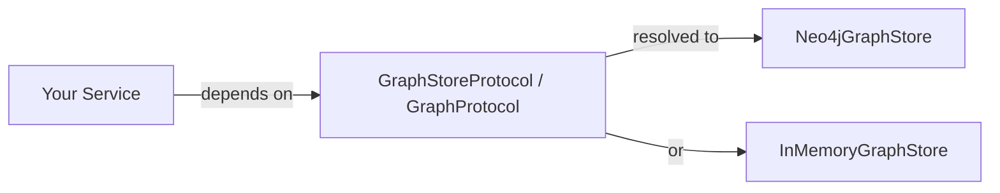

`lexigram-graph` provides async graph-database access behind a single protocol. Application code depends on `GraphStoreProtocol` for lifecycle and `GraphProtocol` for CRUD and traversal; the backend (Neo4j or in-memory) is chosen in configuration. You can swap backends and substitute an in-memory stub in tests without touching the services that use them.

For the full configuration reference, traversal query DSL, and Cypher compiler, see the [`lexigram-graph` package docs](/packages/lexigram-graph/).

---

## 1. The Contract

All backends implement `GraphStoreProtocol` (top-level lifecycle) and `GraphProtocol` (per-graph operations). The core value types are immutable:

```python
from typing import Any, Protocol, runtime_checkable
from lexigram.contracts.data.graph.types import (
    GraphNode,
    GraphEdge,
    GraphPath,
    NodeResult,
    EdgeResult,
    NodeSpec,
    EdgeSpec,
    IndexSpec,
    ConstraintSpec,
    TraversalQuery,
)


@runtime_checkable
class MyGraphProtocol(GraphProtocol, Protocol):
    async def create_node(self, labels: list[str], properties: dict[str, Any] | None = None, node_id: str | None = None) -> NodeResult: ...
    async def create_edge(self, source_id: str, target_id: str, edge_type: str, properties: dict[str, Any] | None = None) -> EdgeResult: ...
    async def traverse(self, query: TraversalQuery) -> list[GraphPath]: ...
    async def shortest_path(self, from_id: str, to_id: str, max_depth: int = 10) -> GraphPath | None: ...
```

Your services depend on the protocol — never on a concrete backend:



---

## 2. Configuration

Add the provider and configure the `graph` section:

```python
from lexigram import Application
from lexigram.graph import GraphModule

app = Application(name="my-app")
```

```yaml title="application.yaml"
graph:
  enabled: true
  backend: neo4j                    # "neo4j" or "memory"
  default_traversal_max_depth: 10
  default_query_limit: 100
  bulk_batch_size: 1000
  max_retries: 3
  retry_delay: 1.0
  neo4j:
    uri: "${NEO4J_URI:bolt://localhost:7687}"
    username: "${NEO4J_USER:neo4j}"
    password: "${NEO4J_PASSWORD}"
    database: "neo4j"
    max_connection_pool_size: 100
    encrypted: false
```

For local development the `memory` backend needs no external service:

```yaml title="application.yaml"
graph:
  backend: memory
  memory:
    max_nodes: 1000000
    max_edges: 5000000
```

:::caution
The `memory` backend is not persistent. All data is lost when the process exits. In production, use `neo4j`.
:::

---

## 3. Nodes & Edges

Inject `GraphStoreProtocol`, get a graph handle, and perform CRUD:

```python
from lexigram.contracts.data.graph.protocols import GraphStoreProtocol
from lexigram.contracts.data.graph.types import GraphNode, GraphEdge, NodeResult


class FriendGraph:
    def __init__(self, store: GraphStoreProtocol) -> None:
        self._store = store

    async def add_person(self, name: str, age: int) -> NodeResult:
        graph = await self._store.get_graph("social")
        return await graph.create_node(["Person"], {"name": name, "age": age})

    async def add_friendship(self, from_id: str, to_id: str) -> None:
        graph = await self._store.get_graph("social")
        await graph.create_edge(from_id, to_id, "FRIENDS_WITH")

    async def find_person(self, name: str) -> GraphNode | None:
        graph = await self._store.get_graph("social")
        results = await graph.find_nodes(labels=["Person"], filter={"name": name})
        return results[0] if results else None

    async def friends_of(self, person_id: str) -> list[GraphNode]:
        graph = await self._store.get_graph("social")
        return await graph.neighbors(person_id, depth=1, edge_types=["FRIENDS_WITH"])
```

:::tip
The `neighbors()` method supports `depth` for multi-hop traversal and `direction` (OUTGOING, INCOMING, or BOTH) from `EdgeDirection`.
:::

---

## 4. Traversal & Shortest Path

Structured traversals use `TraversalQuery` with a `StartSpec` and one or more `TraversalStep` objects:

```python
from lexigram.contracts.data.graph.types import (
    StartSpec,
    TraversalQuery,
    TraversalStep,
    GraphPath,
)
from lexigram.contracts.data.graph.enums import EdgeDirection


class RecommendationEngine:
    def __init__(self, store: GraphStoreProtocol) -> None:
        self._store = store

    async def recommend(self, person_id: str) -> list[GraphPath]:
        graph = await self._store.get_graph("social")
        query = TraversalQuery(
            start=StartSpec(node_ids=(person_id,)),
            steps=(
                TraversalStep(
                    edge_types=("FRIENDS_WITH",),
                    direction=EdgeDirection.OUTGOING,
                    max_depth=2,
                ),
                TraversalStep(
                    edge_types=("LIKES",),
                    direction=EdgeDirection.OUTGOING,
                ),
            ),
            limit=20,
        )
        return await graph.traverse(query)
```

Shortest-path queries are a first-class operation:

```python
path = await graph.shortest_path(
    from_id="person-a",
    to_id="person-b",
    max_depth=6,
    edge_types=["FRIENDS_WITH", "KNOWS"],
    direction=EdgeDirection.BOTH,
)
if path is not None:
    print(f"Found path with {path.length} hops")
```

---

## 5. Bulk Operations & Schema

Bulk create operations batch nodes and edges for efficiency:

```python
from lexigram.contracts.data.graph.types import NodeSpec, EdgeSpec, BulkNodeResult

async def import_users(self, users: list[dict]) -> BulkNodeResult:
    graph = await self._store.get_graph("social")
    nodes = [NodeSpec(labels=("User",), properties=u) for u in users]
    return await graph.bulk_create_nodes(nodes)
```

Schema management creates indexes and constraints:

```python
from lexigram.contracts.data.graph.types import IndexSpec, ConstraintSpec
from lexigram.contracts.data.graph.enums import IndexKind, ConstraintKind

await graph.create_index(IndexSpec(name="idx_name", label="Person", properties=("name",), kind=IndexKind.BTREE))
await graph.create_constraint(ConstraintSpec(name="uq_email", label="User", properties=("email",), kind=ConstraintKind.UNIQUE))
```

---

## 6. Raw Queries

When the structured API isn't enough, pass raw Cypher directly:

```python
results = await graph.query(
    "MATCH (p:Person)-[:FRIENDS_WITH]->(f) WHERE p.name = $name RETURN f.name AS friend",
    parameters={"name": "Alice"},
)
```

:::note
The Neo4j backend compiles `TraversalQuery` into parameterized Cypher via the internal `CypherCompiler`. Raw queries bypass this and are sent directly to the server.
:::

---

## 7. Testing

`GraphModule.stub()` uses in-memory backends with no external dependencies:

```python
from lexigram import Application
from lexigram.graph import GraphModule
from lexigram.contracts.data.graph.protocols import GraphStoreProtocol


async def test_creates_and_finds_node() -> None:
    async with Application.boot(modules=[GraphModule.stub()]) as app:
        store = await app.container.resolve(GraphStoreProtocol)
        graph = await store.get_graph("test")
        result = await graph.create_node(["Test"], {"name": "hello"})
        node = await graph.get_node(result.id)
        assert node is not None
        assert node.properties["name"] == "hello"
```

---

## Next Steps

- [Dependency Injection](/fundamentals/dependency-injection/) — binding protocols to implementations
- [Providers](/fundamentals/providers/) — how `GraphProvider` hooks into application boot
- [Testing](/guides/testing/) — substituting stubs for infrastructure
- [`lexigram-graph` package](/packages/lexigram-graph/) — traversal DSL, Cypher compiler, event hooks
