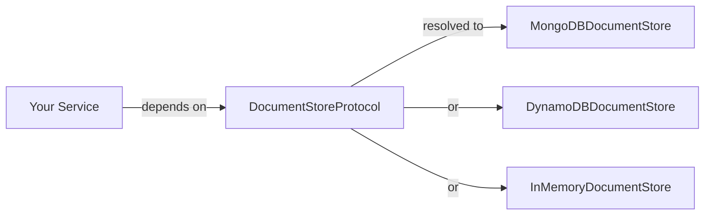

`lexigram-nosql` provides async document-database access behind a single protocol. Application code depends on `DocumentStoreProtocol`; the backend (MongoDB, DynamoDB in-memory simulator, or Firestore emulator) is chosen in configuration. You can swap backends, run several side-by-side, and substitute an in-memory stub in tests without touching the services that use them.

For the full configuration reference and advanced features (aggregation pipelines, document migrations, bulk writes), see the [`lexigram-nosql` package docs](/packages/lexigram-nosql/).

---

## 1. The Contract

All backends implement `DocumentStoreProtocol`, which exposes collection access through `CollectionProtocol`. Every read/write returns a `Result` so backend failures are explicit rather than thrown:

```python
from typing import Any, Protocol, runtime_checkable
from lexigram.contracts.data.nosql.nosql import (
    BulkWriteResult,
    CollectionProtocol,
    DocumentResult,
    DocumentStoreProtocol,
)
from lexigram.result import Result


@runtime_checkable
class MyCollection(CollectionProtocol, Protocol):
    async def insert_one(self, document: dict[str, Any]) -> DocumentResult: ...
    async def find_one(self, filter: dict[str, Any], *, projection: dict[str, Any] | None = None) -> dict[str, Any] | None: ...
    async def count_documents(self, filter: dict[str, Any] | None = None) -> int: ...
```

Your services depend on the protocol — never on a concrete backend:



---

## 2. Configuration

`NoSQLConfig` lives under the `nosql:` key in `application.yaml`. The driver selects the backend:

```python
from lexigram import Application
from lexigram.nosql import NoSQLModule

app = Application(name="my-app")
```

```yaml title="application.yaml"
nosql:
  enabled: true
  driver: mongodb
  mongodb:
    uri: "${MONGODB_URI:mongodb://localhost:27017}"
    database: "myapp"
    max_pool_size: 50
    min_pool_size: 5
    connect_timeout_ms: 10000
    socket_timeout_ms: 30000
    retry_writes: true
    read_preference: "primaryPreferred"
    write_concern_w: "majority"
```

DynamoDB and Firestore each have their own config section:

```yaml title="application.yaml"
nosql:
  driver: dynamodb
  dynamodb:
    table_name: "lexigram"
    region: "${AWS_REGION:us-east-1}"
    pk_field: "_id"
    endpoint_url: "${DYNAMODB_ENDPOINT}"  # localhost:8000 for DynamoDB Local
```

```yaml title="application.yaml"
nosql:
  driver: firestore
  firestore:
    project_id: "${GCP_PROJECT}"
    credentials_json: "${GCP_SA_KEY}"
    database_id: "(default)"
```

---

## 3. Using the Document Store

Inject `DocumentStoreProtocol` into any service. Call `collection()` to get a handle, then use the collection API:

```python
from lexigram.contracts.data.nosql.nosql import DocumentStoreProtocol
from lexigram.result import Result, Ok, Err
from my_app.domain.models import Product


class ProductCatalog:
    def __init__(self, store: DocumentStoreProtocol) -> None:
        self._store = store

    async def find_by_sku(self, sku: str) -> Result[Product, str]:
        products = self._store.collection("products")
        doc = await products.find_one({"sku": sku})
        if doc is None:
            return Err(f"Product not found: {sku}")
        return Ok(Product.from_doc(doc))

    async def list_available(self) -> Result[list[Product], str]:
        products = self._store.collection("products")
        docs = []
        async for doc in products.find({"status": "active"}, sort=[("name", 1)], limit=50):
            docs.append(Product.from_doc(doc))
        return Ok(docs)
```

Resolving the store outside a service (scripts, tests):

```python
from lexigram import Application
from lexigram.nosql import NoSQLModule
from lexigram.contracts.data.nosql.nosql import DocumentStoreProtocol

async with Application.boot(modules=[NoSQLModule.stub()]) as app:
    store = await app.container.resolve(DocumentStoreProtocol)
    result = await store.collection("products").insert_one({"sku": "ABC", "name": "Widget"})
```

---

## 4. Document Repositories

For domain-driven projects, `DocumentRepositoryProtocol` provides a generic CRUD interface. `NoSQLModule.scope()` registers your repository classes:

```python
from lexigram.contracts.data.nosql.nosql_repository import DocumentRepositoryProtocol
from lexigram.nosql import NoSQLModule, NoSQLConfig


class ProductRepository:
    def __init__(self, repo: DocumentRepositoryProtocol[Product]) -> None:
        self._repo = repo

    async def save(self, product: Product) -> Product:
        return await self._repo.save(product)


@module(imports=[
    NoSQLModule.configure(NoSQLConfig(driver="mongodb")),
    NoSQLModule.scope(ProductRepository),
])
class CatalogModule:
    pass
```

---

:::note
`DocumentQueryBuilder` builds filter dicts that work across MongoDB, DynamoDB, and Firestore. The builder normalises operators into a common representation; each backend translates them into its native query format at execution time.
:::

## 5. Query Builder & Aggregation Pipelines

The fluent query builder constructs typed filter dictionaries without raw dicts:

```python
from lexigram.nosql import DocumentQueryBuilder, ComparisonOp, LogicalOp

query = (
    DocumentQueryBuilder()
    .filter(ComparisonOp.GTE, "price", 10.0)
    .filter(ComparisonOp.LTE, "price", 100.0)
    .filter(LogicalOp.OR, [{"status": "active"}, {"status": "promo"}])
    .sort([("price", 1)])
    .limit(20)
    .build()
)
```

Aggregation pipelines chain stages fluently:

```python
from lexigram.nosql import AggregationPipeline, AggregationOp

pipeline = (
    AggregationPipeline()
    .match({"category": "electronics"})
    .group({"_id": "$brand", "count": {"$sum": 1}, "avg_price": {"$avg": "$price"}})
    .sort({"avg_price": -1})
    .project({"brand": 1, "avg_price": 1, "count": 1})
    .build()
)
```

---

## 6. Migrations

The `MigrationManager` applies ordered schema changes. Operations are declarative:

```python
from lexigram.nosql import MigrationManager, CreateIndex, DropIndex, RenameField, AddField, DropCollection

manager = MigrationManager("user-schema-v2")
manager.add(CreateIndex("users", [("email", 1)], unique=True))
manager.add(RenameField("users", "fullname", "display_name"))
manager.add(AddField("users", "timezone", default="UTC"))
manager.add(DropCollection("old_sessions"))

result = await manager.apply()
```

Each operation is idempotent. The manager emits `MigrationAppliedEvent` and `MigrationFailedEvent` for observability.

:::caution
Migrations run at provider `boot()` time. In production, run schema migrations through the CLI or a deployment script rather than relying on auto-migration at startup — this gives you explicit control over order and rollback.
:::

---

## 7. Multiple Backends

Declare multiple entries under `backends` with `NamedNoSQLConfig`. Primary backends also receive the unnamed binding:

```yaml title="application.yaml"
nosql:
  backends:
    - name: "primary"
      driver: "mongodb"
      primary: true
      mongodb:
        uri: "${MONGODB_URI}"
        database: "app"
    - name: "analytics"
      driver: "mongodb"
      mongodb:
        uri: "${MONGODB_URI_ANALYTICS}"
        database: "analytics"
```

```python
from typing import Annotated
from lexigram.contracts.data.nosql.nosql import DocumentStoreProtocol
from lexigram.di.markers import Named


class DashboardService:
    def __init__(
        self,
        store: DocumentStoreProtocol,
        analytics: Annotated[DocumentStoreProtocol, Named("analytics")],
    ) -> None:
        self._store = store
        self._analytics = analytics
```

---

## 8. Testing

`NoSQLModule.stub()` returns an in-memory document store with no external service:

```python
from lexigram import Application
from lexigram.nosql import NoSQLModule
from lexigram.contracts.data.nosql.nosql import DocumentStoreProtocol


async def test_inserts_product() -> None:
    async with Application.boot(modules=[NoSQLModule.stub()]) as app:
        store = await app.container.resolve(DocumentStoreProtocol)
        result = await store.collection("products").insert_one({"sku": "ABC"})
        assert result.acknowledged
```

---

## Next Steps

- [Dependency Injection](/fundamentals/dependency-injection/) — binding protocols to implementations
- [Providers](/fundamentals/providers/) — how `NoSQLProvider` hooks into application boot
- [Testing](/guides/testing/) — substituting stubs for infrastructure
- [`lexigram-nosql` package](/packages/lexigram-nosql/) — full config reference, `DocumentRepositoryProtocol`, bulk operations
