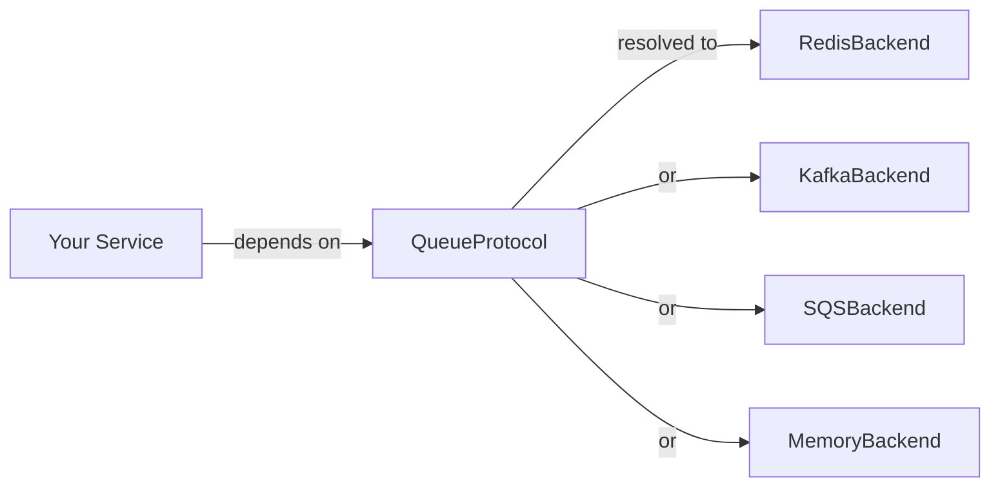

`lexigram-queue` provides async publish/subscribe messaging behind a single protocol. Application code depends on `QueueProtocol`; the backend (in-memory, Redis, RabbitMQ, Kafka, SQS, Azure Service Bus, or GCP Pub/Sub) is chosen in configuration. You can swap backends, run several side-by-side, and substitute an in-memory stub in tests without touching the services that use them.

For the full configuration reference and advanced features (transactional outbox, middleware pipelines, dead-letter queues), see the [`lexigram-queue` package docs](/packages/lexigram-queue/).

---

## 1. The Contract

All backends implement `QueueProtocol`. Messages are modeled as `BusMessage` — an immutable dataclass with headers, TTL, priority, and delivery guarantees:

```python
from typing import Any, Protocol, runtime_checkable
from lexigram.contracts.queue.protocols import QueueProtocol
from lexigram.contracts.queue.types import BusMessage, DeliveryGuarantee


@runtime_checkable
class MyQueue(QueueProtocol, Protocol):
    async def connect(self) -> None: ...
    async def close(self) -> None: ...
    async def publish(self, topic: str, message: BusMessage) -> None: ...
    async def subscribe(self, topic: str, handler: Callable[[BusMessage], Coroutine[Any, Any, None]]) -> None: ...
    async def health_check(self, timeout: float = 5.0) -> HealthCheckResult: ...
```

Your services depend on the protocol — never on a concrete backend:



---

## 2. Configuration

Queue backends are declared through `NamedQueueConfig`. Exactly one should be marked `primary: true`:

```python
from lexigram import Application
from lexigram.queue import QueueModule

app = Application(name="my-app")
```

```yaml title="application.yaml"
queue:
  backends:
    - name: "default"
      driver: "redis"
      primary: true
      delivery_guarantee: "at_least_once"
      max_retries: 3
      redis:
        url: "${REDIS_URL:redis://localhost:6379/0}"
        max_connections: 10
        socket_timeout: 5.0
```

Each driver has its own config block:

```yaml title="application.yaml"
queue:
  backends:
    - name: "events"
      driver: "kafka"
      primary: true
      kafka:
        bootstrap_servers: "${KAFKA_BROKERS:localhost:9092}"
        client_id: "myapp"
        group_id: "myapp-consumers"
        auto_offset_reset: "earliest"
```

```yaml title="application.yaml"
queue:
  backends:
    - name: "orders"
      driver: "sqs"
      sqs:
        region: "${AWS_REGION:us-east-1}"
        queue_url: "${SQS_QUEUE_URL}"
        visibility_timeout: 30
```

---

## 3. Publishing & Subscribing

Inject `QueueProtocol` and call `publish()` with a `BusMessage`:

```python
from lexigram.contracts.queue.protocols import QueueProtocol
from lexigram.contracts.queue.types import BusMessage, DeliveryGuarantee


class OrderService:
    def __init__(self, queue: QueueProtocol) -> None:
        self._queue = queue

    async def place_order(self, order_id: str) -> None:
        message = BusMessage(
            topic="orders.placed",
            payload={"order_id": order_id},
            delivery_guarantee=DeliveryGuarantee.AT_LEAST_ONCE,
            ttl=300.0,
        )
        await self._queue.publish("orders.placed", message)
```

Subscribe by registering an async handler:

```python
async def handle_order_placed(message: BusMessage) -> None:
    print(f"Processing order {message.payload['order_id']}")

await queue.subscribe("orders.placed", handle_order_placed)
```

---

:::tip
Use `BusMessage.delivery_guarantee` to tune safety. `AT_LEAST_ONCE` is the best default for most workloads. Switch to `EXACTLY_ONCE` only when your backend and consumer both support idempotent processing — it adds significant overhead.
:::

## 4. Message Consumers

For structured consumers, extend `MessageConsumer` and declare the topic:

```python
from lexigram.contracts.queue.types import BusMessage
from lexigram.queue import MessageConsumer


class OrderConsumer(MessageConsumer):
    topic = "orders.placed"

    async def handle(self, message: BusMessage) -> None:
        order_id = message.payload["order_id"]
```

Scope consumers into your feature module:

```python
from lexigram.di.module import module
from lexigram.queue import QueueModule

@module(imports=[
    QueueModule.configure(),
    QueueModule.scope(OrderConsumer, PaymentConsumer),
])
class OrdersFeatureModule:
    pass
```

---

## 5. Dead-Letter Queue & Outbox

Messages that exhaust their retries are routed to the `DeadLetterQueue`:

```python
from lexigram.queue import DeadLetterQueue

dlq = DeadLetterQueue()
dlq.store(message)
failed = dlq.drain()
```

:::caution
`DeadLetterQueue` is in-memory by default. In production, pair it with an `AuditStoreProtocol` or a persistent backend so dead-lettered messages survive a process restart.
:::

For atomic staging of messages alongside database writes, use `TransactionalOutbox`:

```python
from lexigram.queue import TransactionalOutbox

outbox = TransactionalOutbox(queue)
outbox.stage("order.created", BusMessage(topic="order.created", payload=data))
await outbox.flush()
```

---

## 6. Middleware Pipelines

Chain middleware around message handlers with `MessagePipeline`:

```python
from lexigram.queue import MessagePipeline, MiddlewareBase


class LoggingMiddleware(MiddlewareBase):
    async def handle(self, message: BusMessage, next: callable) -> None:
        logger.info("processing", topic=message.topic)
        await next(message)
        logger.info("completed", topic=message.topic)


pipeline = MessagePipeline()
pipeline.use(LoggingMiddleware())
pipeline.set_handler(my_handler)
await pipeline.run(message)
```

---

## 7. Multiple Backends

Declare multiple named backends, each registered under `Annotated[T, Named(name)]`:

```yaml title="application.yaml"
queue:
  backends:
    - name: "events"
      driver: "kafka"
      primary: true
    - name: "notifications"
      driver: "redis"
```

```python
from typing import Annotated
from lexigram.contracts.queue.protocols import QueueProtocol
from lexigram.di.markers import Named


class NotificationService:
    def __init__(
        self,
        queue: QueueProtocol,
        notifications: Annotated[QueueProtocol, Named("notifications")],
    ) -> None:
        self._queue = queue
        self._notifications = notifications
```

---

## 8. Testing

`QueueModule.stub()` returns an in-memory backend with no external broker:

```python
from lexigram import Application
from lexigram.queue import QueueModule
from lexigram.contracts.queue.protocols import QueueProtocol
from lexigram.contracts.queue.types import BusMessage


async def test_publishes_and_consumes() -> None:
    received = []

    async def handler(msg: BusMessage) -> None:
        received.append(msg)

    async with Application.boot(modules=[QueueModule.stub()]) as app:
        queue = await app.container.resolve(QueueProtocol)
        await queue.connect()
        await queue.subscribe("test", handler)
        await queue.publish("test", BusMessage(payload="hello"))
        assert len(received) == 1
```

---

## Next Steps

- [Dependency Injection](/fundamentals/dependency-injection/) — binding protocols to implementations
- [Providers](/fundamentals/providers/) — how `QueueProvider` hooks into application boot
- [Testing](/guides/testing/) — substituting stubs for infrastructure
- [`lexigram-queue` package](/packages/lexigram-queue/) — full config reference, driver options, CLI tools
