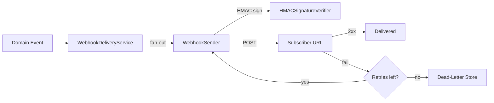

`lexigram-webhook` is an **outbound** webhook subsystem: your application registers subscriber URLs, dispatches events to them with HMAC-signed payloads, retries failures with exponential backoff, and parks unrecoverable deliveries in a dead-letter queue. It also ships a small helper for **inbound** verification — useful when your code is the receiver of someone else's signed webhook.

For the full configuration reference and admin panel integration, see the [`lexigram-webhook` package docs](/packages/lexigram-webhook/).

---

## 1. Outbound vs. Inbound

The package is primarily **outbound** — you own the subscriptions, sign the payloads, and track delivery. Subscription CRUD, fan-out delivery, retries, and the dead-letter queue all sit on the outbound side.

For **inbound** webhooks (a third party signing requests to your endpoint), the package exposes `HMACSignatureVerifier` and a `verify_webhook_payload` helper that use constant-time comparison. Anything beyond signature verification — replay protection, event-type routing, idempotency — is left to your inbound controller.



---

## 2. Configuration

Register `WebhookModule.configure()` and add a `webhook:` block. Defaults are production-sane; override only what you need.

```python
from lexigram import Application
from lexigram.di.module import Module, module
from lexigram.webhook import WebhookModule


@module(imports=[WebhookModule.configure()])
class AppModule(Module):
    pass


app = Application(modules=[AppModule])
```

```yaml title="application.yaml"
webhook:
  store_backend: "sql"               # memory | sql (sql needs the [sql] extra)
  retry_max_attempts: 5
  retry_base_delay: 1.0              # seconds
  retry_max_delay: 60.0
  retry_backoff_factor: 2.0
  delivery_timeout_seconds: 30.0
  disable_after_consecutive_failures: 50
  failure_window_hours: 24
  signature_algorithm: "sha256"      # sha256 | sha512
  signature_header: "X-Webhook-Signature"
  secret_rotation_grace_hours: 24
```

:::note
Secrets are generated per-subscription by the service; there is no global signing secret to configure. `secret_length` controls the entropy of each one (32 bytes by default, hex-encoded to 64 chars).
:::

---

## 3. Subscriptions

Inject `WebhookSubscriptionService` to register, list, rotate, and deactivate subscribers. A partner subscribing to `order.shipped` looks like this:

```python
from lexigram.webhook.subscription.service import WebhookSubscriptionService


class PartnerOnboarding:
    def __init__(self, subscriptions: WebhookSubscriptionService) -> None:
        self._subscriptions = subscriptions

    async def subscribe_partner(self, callback_url: str, tenant_id: str) -> str:
        result = await self._subscriptions.create(
            url=callback_url,
            event_types=frozenset({"order.shipped", "order.cancelled"}),
            description="Acme partner shipping webhook",
            tenant_id=tenant_id,
        )
        subscription = result.unwrap()
        # Return secret to the partner ONCE — it isn't shown again.
        return subscription.secret
```

`event_types=None` subscribes to every event. `rotate_secret()` issues a new secret while keeping the old one valid for `secret_rotation_grace_hours`, so partners can roll over without dropped deliveries.

---

## 4. Triggering a Webhook

Dispatch through `WebhookDeliveryServiceProtocol`. The service lists all active subscriptions matching the event type and delivers concurrently:

```python
import uuid
from lexigram.contracts.webhook import WebhookEvent, WebhookDeliveryServiceProtocol


class ShippingService:
    def __init__(self, webhooks: WebhookDeliveryServiceProtocol) -> None:
        self._webhooks = webhooks

    async def mark_shipped(self, order_id: str, tracking: str) -> None:
        await self._webhooks.dispatch(WebhookEvent(
            event_id=str(uuid.uuid4()),
            event_type="order.shipped",
            payload={"order_id": order_id, "tracking_number": tracking},
            source="shipping-service",
        ))
```

A receiver sees a `POST` with `Content-Type: application/json`, the payload as the body, and the standard webhook headers (`X-Webhook-Signature`, `X-Webhook-Event-Type`, `X-Webhook-Event-ID`, `X-Webhook-Timestamp`).

---

## 5. HMAC Signing

Each delivery is signed with HMAC-SHA256 over the raw request body and the subscription's secret. The signature header value is `sha256=<hex_digest>` — the same shape Stripe and GitHub use.

A subscriber verifies it like this (constant-time comparison is mandatory):

```python
import hmac
import hashlib


def verify(payload: bytes, signature_header: str, secret: str) -> bool:
    expected = "sha256=" + hmac.new(
        secret.encode("utf-8"), payload, hashlib.sha256
    ).hexdigest()
    return hmac.compare_digest(expected, signature_header)
```

If you receive inbound webhooks elsewhere in your own app, reuse the package helper instead of reimplementing it:

```python
from lexigram.webhook.verification.helpers import verify_webhook_payload

ok = await verify_webhook_payload(raw_body, request.headers["X-Webhook-Signature"], secret)
```

:::note
Always verify on the raw request bytes, before any JSON parsing — reserialized payloads will not produce the same digest.
:::

---

## 6. Delivery Tracking, Retries, Auto-Disable

Every attempt is persisted as a `DeliveryAttempt` with a `DeliveryStatus` of `PENDING`, `DELIVERED`, `FAILED`, `DEAD_LETTER`, or `CANCELLED`. On non-2xx responses or connection errors the delivery service sleeps for `retry_base_delay` seconds, then multiplies by `retry_backoff_factor` (capped at `retry_max_delay`) for each subsequent attempt — for the defaults: 1s, 2s, 4s, 8s, 16s.

Two safety nets are wired in:

- **Dead-letter** — after `retry_max_attempts` the final attempt is recorded with status `DEAD_LETTER` and retries stop.
- **Auto-disable** — if a subscription accumulates `disable_after_consecutive_failures` failures inside `failure_window_hours`, it is flipped to `active=False` automatically.

Query attempts directly through `WebhookDeliveryStoreProtocol` (e.g. for an admin view filtered by `status=DeliveryStatus.FAILED`).

---

## 7. Dead-Letter Queue

Dead-lettered attempts stay in the same store; `DeadLetterManager` is a thin convenience layer for listing and counting them. To replay one, call `redeliver()` on the delivery service:

```python
from lexigram.contracts.webhook import WebhookDeliveryServiceProtocol
from lexigram.webhook.delivery.dead_letter import DeadLetterManager


class WebhookOps:
    def __init__(
        self,
        dlq: DeadLetterManager,
        deliveries: WebhookDeliveryServiceProtocol,
    ) -> None:
        self._dlq = dlq
        self._deliveries = deliveries

    async def replay_all(self) -> None:
        for attempt in await self._dlq.list(limit=100):
            await self._deliveries.redeliver(attempt.attempt_id)
```

When `enable_admin: true`, the same view is available in the Lexigram admin panel — subscriptions, recent deliveries, and the DLQ.

---

## 8. Testing

`WebhookModule.configure()` defaults to the in-memory store, so an integration test can boot the full pipeline without external services:

```python
from lexigram import Application
from lexigram.webhook import WebhookModule
from lexigram.webhook.subscription.service import WebhookSubscriptionService


async def test_subscription_round_trip() -> None:
    async with Application.boot(modules=[WebhookModule.configure()]) as app:
        subs = await app.container.resolve(WebhookSubscriptionService)
        created = (await subs.create(url="https://example.test/hook")).unwrap()
        assert (await subs.get(created.subscription_id)).unwrap().active
```

For unit tests of services that *dispatch* webhooks, bind a fake `WebhookDeliveryServiceProtocol` that records calls — the rest of the code remains unaware.

---

## Next Steps

- [Event-Driven Architecture](/guides/event-driven/) — bridging domain events to outbound webhooks
- [Resilience](/guides/resilience/) — circuit breakers and timeouts for outbound HTTP
- [Background Jobs](/guides/background-jobs/) — offloading dispatch from request handlers
- [`lexigram-webhook` package](/packages/lexigram-webhook/) — admin panel, SQL store, full config reference
