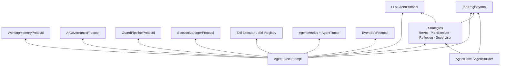
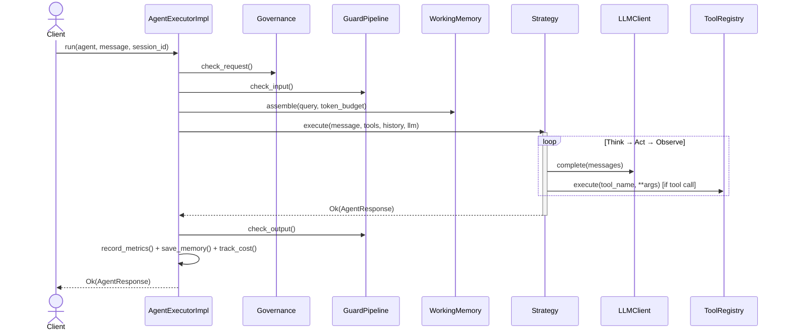
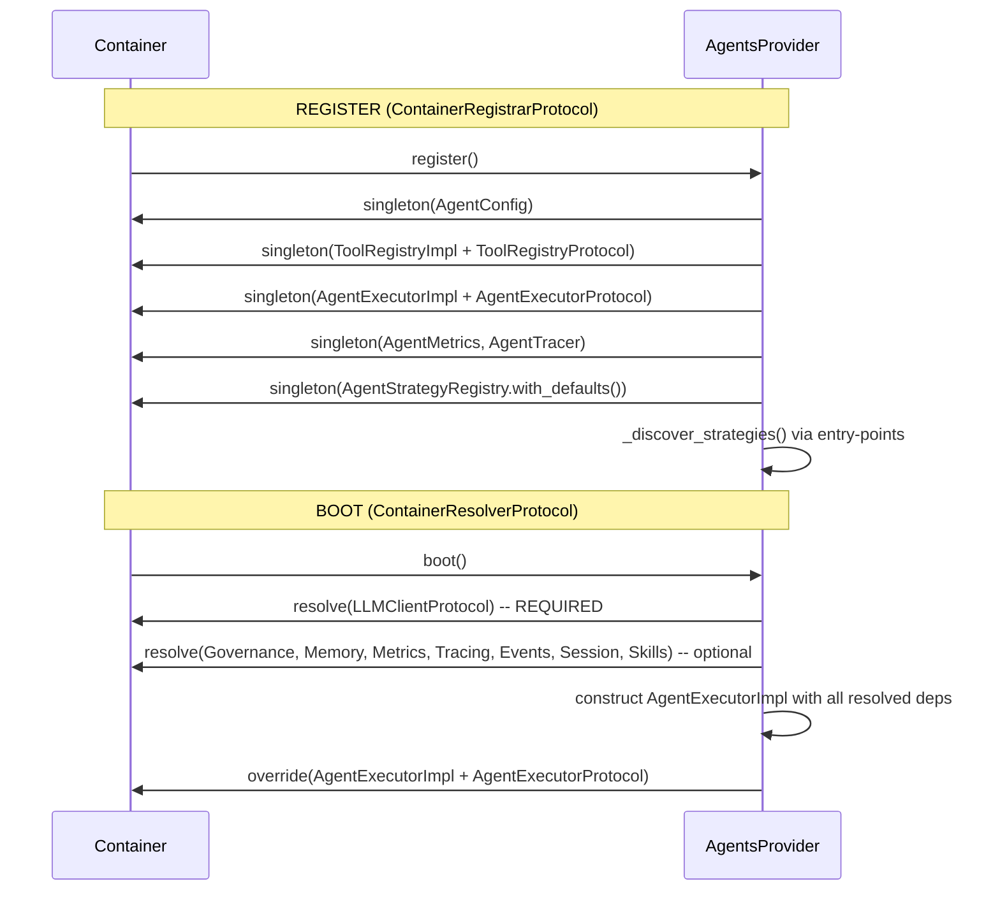

# Architecture

Internal design of the `lexigram-ai-agents` package.

---

## Role in the System

`lexigram-ai-agents` is the agent execution framework, orchestrating reasoning loops, tool execution, memory, governance, and observability.



**Import rule:** Agent code imports from `lexigram` and `lexigram-contracts` only. Cross-package communication goes through protocols resolved via the DI container.

---

## Agent Model

Agents declare identity, capabilities, and persona via two paths:

### Subclass `AgentBase`

```python
class OrderAgent(AgentBase):
    name = "order_agent"
    system_prompt = "You are a helpful order support agent."

    @property
    def tools(self):
        return [lookup_order, search_products]
```

### Fluent `AgentBuilder`

```python
agent = (
    AgentBuilder("order_agent")
    .with_system_prompt("...").with_tools(lookup_order)
    .with_strategy("react", max_iterations=10)
    .with_memory(memory_backend).with_guards(pii_guard)
    .with_governance(budget_limit=10.0).with_temperature(0.7)
    .build()
)
```

### Agent Anatomy

```
AgentProtocol → AgentBase
    ├── name            — Unique identifier
    ├── system_prompt   — Persona and constraints
    ├── tools           — ToolProtocol instances
    ├── strategy        — Optional StrategyProtocol override
    ├── memory          — Optional MemoryProtocol backend
    └── temperature     — LLM temperature (default 0.7)
```

---

## Agent Execution

`AgentExecutorImpl` wraps strategy execution with full infrastructure in prescribed order: governance check → input guard → session resume → memory assembly → skill merge → strategy execution → output guard → metrics → memory save → cost tracking → events.



Streaming is supported via `astream()` which yields `AgentEvent` objects (`STARTED`, `MESSAGE`, `TOOL_CALL`, `ERROR`, `FINISHED`) with a unique `run_id`.

---

## Tool System

### Protocol & Implementations

Two paths to create tools:

**Subclass `AbstractTool`:**
```python
class OrderLookupTool(AbstractTool):
    name = "lookup_order"
    description = "Look up an order by its ID"
    parameters_schema = {"type": "object", "properties": {"order_id": {"type": "string"}}, "required": ["order_id"]}
    async def execute(self, **kwargs: Any) -> Any:
        return await self.order_service.find(kwargs["order_id"])
```

**`@tool` decorator** (auto-generates JSON schema from type hints + docstring):
```python
@tool
async def lookup_order(order_id: str) -> dict:
    """Look up an order by its ID."""
    return await order_service.find(order_id)
```

### ToolRegistryImpl

```python
registry = ToolRegistryImpl()
registry.register(lookup_order, module_class=OrdersModule)
registry.set_module_graph(compiled_graph)       # optional visibility
registry.set_caller_module(SupportModule)
result = await registry.execute("lookup_order", order_id="123")
```

**Visibility rules:** No module graph → all visible. No caller → all visible. Unowned tool → visible. Same module → visible. Caller imports tool's module → visible. Global → visible.

**Boundary:** Tools are atomic, stateless, single-purpose. Skills (from `lexigram-ai-skills`) are composed multi-step workflows. Skills may invoke tools. Tools must NOT invoke skills.

---

## Memory Integration

Two systems, with `WorkingMemoryProtocol` preferred:

```
Executor.run()
    ├── working_memory.assemble() → history (preferred)
    └── memory.get_messages()     → history (legacy fallback)
    ...
    ├── working_memory.add()            → persist (preferred)
    ├── session_manager.add_turn()      → persist (session store)
    └── memory.add()                    → persist (legacy)
```

Memory failures are logged but never break execution.

---

## Strategies

All strategies extend `AbstractStrategy` (implements `StrategyProtocol`).

| Strategy | Pattern | Best For |
|----------|---------|----------|
| `ReActStrategy` | Think→Act→Observe (default) | General-purpose tool-using agents |
| `PlanAndExecuteStrategy` | Plan→Execute→Replan→Synthesize | Complex multi-step tasks |
| `ReflexionStrategy` | Generate→Critique→Refine | Quality-critical responses |
| `SupervisorStrategy` | Assess→Delegate→Review→Decide | Multi-agent orchestration |

### Strategy Selection

```mermaid
flowchart TD
    Input[Agent config] --> Has{Strategy set?}
    Has -->|No| R[ReActStrategy max_iterations=10]
    Has -->|Yes| Reg[AgentStrategyRegistry.resolve(name)]
    Reg --> F{Found?}
    F -->|Yes| I[Instantiate with kwargs]
    F -->|No| E[ValueError]
    R & I --> Ex[Strategy.execute()]

    subgraph Registry[AgentStrategyRegistry]
        react["react → ReActStrategy"]
        pe["plan-execute → PlanAndExecuteStrategy"]
        ref["reflexion → ReflexionStrategy"]
        ep["entry-points → discoverable"]
    end
    Reg --> Registry
```

### ReActStrategy

Think→Act→Observe loop (Yao et al., 2022). LLM output format:

```
THOUGHT: <reasoning>
ACTION: <tool_name>
ACTION_INPUT: <json args>
```

Produce `FINAL_ANSWER:` to terminate. Config: `max_iterations` (10), `tool_timeout` (30s), `tool_max_retries` (3).

### PlanAndExecuteStrategy

Two-phase (Wang et al., 2023): LLM creates a numbered plan → each step executes (tool or reasoning) → on failure LLM replans → final synthesis. Config: `max_steps` (10), `max_replans` (2).

### ReflexionStrategy

Generate → Critique → Refine. LLM evaluates its own response; loop stops on `NO_CHANGES_NEEDED`. Config: `max_iterations` (3).

### SupervisorStrategy

Hierarchical: supervisor LLM delegates to sub-agents (wrapped as `AgentAsToolAdapter`), reviews responses, and produces final answer. Config: `max_delegations` (5).

---

## Provider Lifecycle

`AgentsProvider` (priority `DOMAIN`, config key `ai_agents`):



**register():** Binds config, creates ToolRegistryImpl, registers executor/metrics/tracer/strategy registry, discovers entry-point strategies. Exits early if `config.enabled is False`.

**boot():** Resolves required `LLMClientProtocol`, resolves all optional integrations (governance, memory, metrics, tracing, event bus, session manager, skill executor/registry, module graph), constructs fully-wired `AgentExecutorImpl`, and overrides both concrete and protocol tokens.

**shutdown():** Logging cleanup.

---

## Contracts Used

| Contract | Import Path | Purpose |
|----------|-------------|---------|
| `AgentExecutorProtocol` | `lexigram.contracts.ai` | Agent execution entry point |
| `ToolRegistryProtocol` | `lexigram.contracts.ai` | Tool registration and lookup |
| `AgentProtocol` | `lexigram.contracts.ai.agents` | Agent identity and capabilities |
| `StrategyProtocol` | `lexigram.contracts.ai.agents` | Reasoning strategy interface |
| `ToolProtocol` | `lexigram.contracts.ai.agents` | Atomic tool interface |
| `AgentResponse` / `AgentEvent` | `lexigram.contracts.ai.agents` | Result and streaming types |
| `MemoryProtocol` | `lexigram.contracts.ai.agents` | Agent-attached memory |
| `AgentError` / `ToolError` / `StrategyError` | `lexigram.contracts.ai.agents` | Domain error bases |
| `LLMClientProtocol` | `lexigram.contracts.ai.llm` | LLM completion |
| `ChatMessage` / `Role` | `lexigram.contracts.ai.llm` | Conversation types |
| `AIGovernanceProtocol` | `lexigram.contracts.ai.governance` | Budget/rate limits |
| `GuardPipelineProtocol` | `lexigram.contracts.ai.guards` | Input/output guardrails |
| `WorkingMemoryProtocol` | `lexigram.contracts.ai.memory` | Context assembly |
| `SessionManagerProtocol` | `lexigram.contracts.ai.session` | Multi-turn sessions |
| `SkillExecutorProtocol` / `SkillRegistryProtocol` | `lexigram.contracts.ai.skills` | Composable skills |
| `EventBusProtocol` | `lexigram.contracts.events.protocols` | Domain events |
| `MetricsRecorderProtocol` | `lexigram.contracts.observability.metrics` | Prometheus metrics |
| `TracerProtocol` | `lexigram.contracts.observability.tracing` | OpenTelemetry tracing |

---

## Exception Hierarchy

```
LexigramError (contracts)
    ├── AgentError (contracts)
    │   ├── AgentConfigurationError    — Invalid config       (LEX_ERR_AGT_004)
    │   ├── AgentExecutionError        — Unrecoverable exec   (LEX_ERR_AGT_005)
    │   └── BudgetExceededError        — Governance exceeded  (LEX_ERR_AGT_010)
    ├── ToolError (contracts)
    │   ├── ToolNotFoundError          — Not in registry      (LEX_ERR_AGT_006)
    │   ├── ToolExecutionError         — Runtime failure      (LEX_ERR_AGT_007)
    │   ├── ToolAccessDeniedError      — Visibility blocked   (LEX_ERR_AGT_008)
    │   └── ToolValidationError        — Bad arguments        (LEX_ERR_AGT_011)
    └── StrategyError (contracts)
        └── MaxIterationsExceededError — Iteration limit      (LEX_ERR_AGT_009)
```

---

## Extension Points

| Point | Mechanism |
|-------|-----------|
| Custom agent | Subclass `AgentBase`, set `name`, `system_prompt`, `tools` property |
| Fluent agent | `AgentBuilder` chain |
| Custom tool (class) | Subclass `AbstractTool` |
| Custom tool (function) | `@tool` decorator |
| Custom strategy | Subclass `AbstractStrategy`, implement `execute()` |
| Strategy registration | `AgentStrategyRegistry` or `lexigram.agent.strategies` entry-point |
| Custom planner | Implement `PlannerProtocol` |
| Custom observer | Implement `ObserverProtocol` |
| Tool visibility | `ToolRegistryImpl.set_module_graph()` |
| Agent as tool | `AgentAsToolAdapter` wraps agents for delegation |
| Crew process | Configure via `Crew` / `CrewBuilder` |
| Governance/Guard/Memory | Resolve via container — automatically integrated |

---

## Constants

| Symbol | Description |
|--------|-------------|
| `ENV_PREFIX` | `LEX_AI_AGENTS__` |
| `METRIC_AGENT_EXECUTIONS_TOTAL` | Counter: total executions |
| `METRIC_AGENT_EXECUTION_DURATION_MS` | Histogram: execution duration |
| `METRIC_AGENT_EXECUTION_TOKENS` | Histogram: tokens per execution |
| `METRIC_AGENT_EXECUTION_STEPS` | Histogram: steps per execution |
| `METRIC_AGENT_EXECUTIONS_ERRORS` | Counter: execution errors |
| `METRIC_AGENT_GOVERNANCE_DENIED` | Counter: governance denials |
| `METRIC_AGENT_TOOL_CALLS_TOTAL` | Counter: total tool calls |
| `METRIC_AGENT_TOOL_CALL_DURATION_MS` | Histogram: tool call duration |
| `SPAN_AGENT_EXECUTE` / `SPAN_AGENT_LLM` / `SPAN_AGENT_TOOL` | Span names for tracing |
| `__version__` | Package version |
