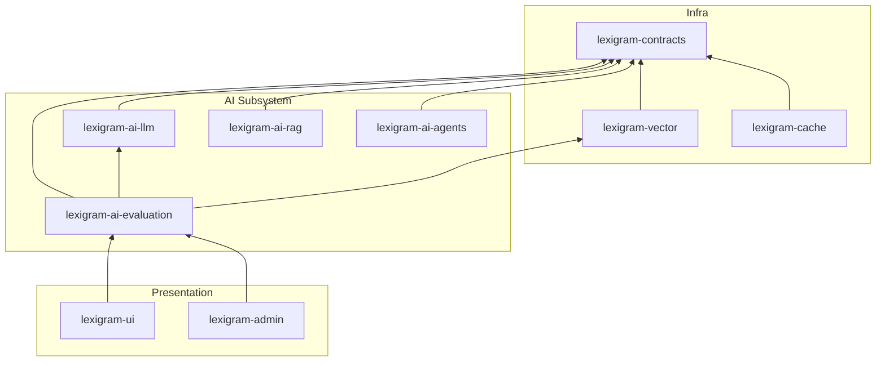
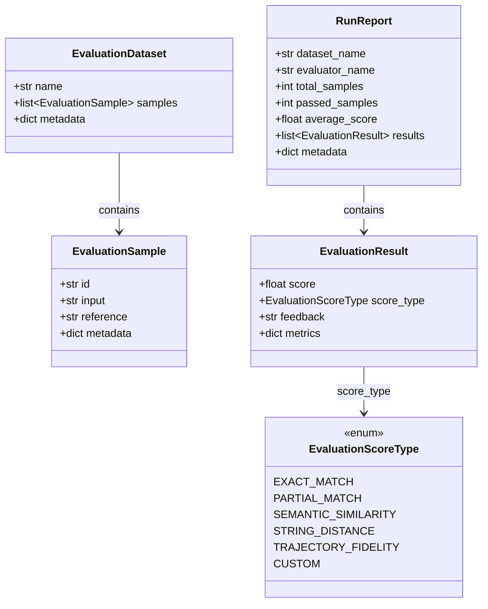
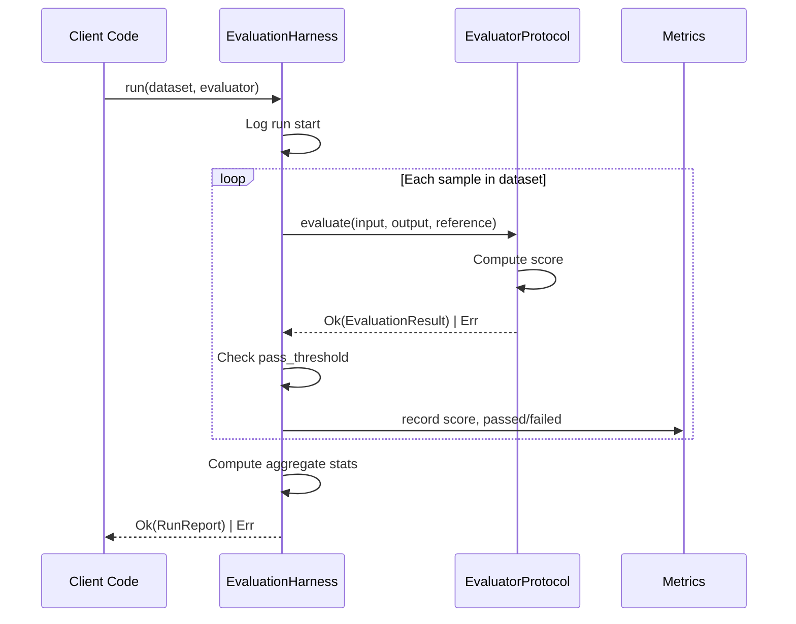
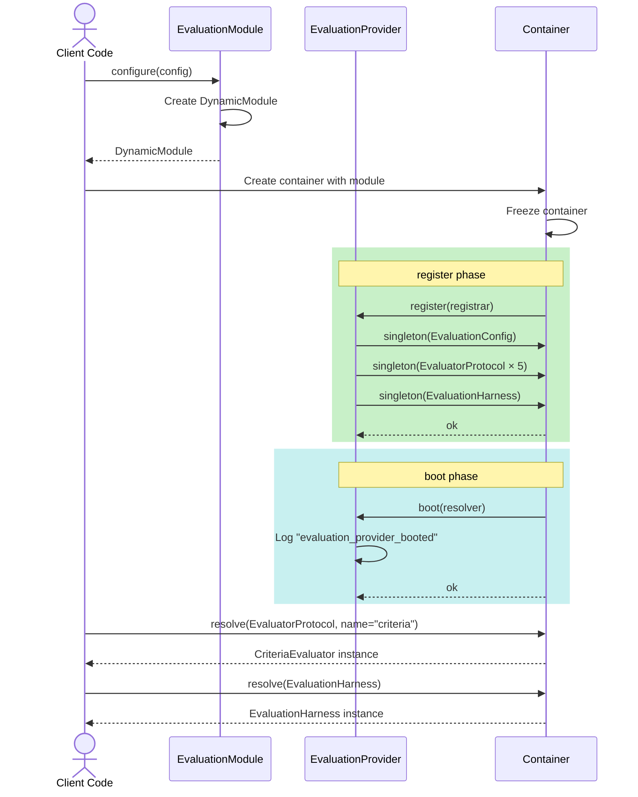

# Architecture

Internal design of the `lexigram-ai-evaluation` package.

---

## Role in the System

The evaluation package sits in the AI subsystem layer, providing
benchmarking and testing capabilities for AI model outputs.



**Import direction:** Arrows point toward the dependency. Evaluation
depends on `lexigram-contracts` for protocols and types, optionally
on `lexigram-ai-llm` for embedding-based evaluation, and on
`lexigram-vector` for vector store-backed comparisons.

---

## Evaluation Model



**EvaluationDataset** — a named collection of `EvaluationSample` instances,
each with an `id`, `input` (prompt/query), `reference` (expected output),
and optional `metadata`.

**EvaluationResult** — produced per sample. Contains `score` (0.0–1.0),
`score_type` (enum mapping the metric family), `feedback` text,
and `metrics` dict for extensible detail.

**RunReport** — aggregate result from running one evaluator against
one dataset. Includes the average score, pass/fail count against a
threshold, and per-sample results.

### Score Types

| Enum Value | Meaning |
|---|---|
| `EXACT_MATCH` | Binary — output must match reference exactly |
| `PARTIAL_MATCH` | Partial keyword/concept overlap |
| `SEMANTIC_SIMILARITY` | Embedding cosine similarity |
| `STRING_DISTANCE` | Levenshtein, Jaccard, or cosine string distance |
| `TRAJECTORY_FIDELITY` | Agent step-by-step trajectory match |
| `CUSTOM` | User-defined scoring strategy |

---

## Evaluation Pipeline



### Steps

1. **Dataset loaded** — from JSON, CSV, or in-memory list of `EvaluationSample`
2. **Per-sample evaluation** — harness iterates samples, calling
   `evaluator.evaluate(input, output, reference)` for each
3. **Threshold check** — each result compared against `pass_threshold`
4. **Aggregation** — scores averaged, pass/fail counted, `RunReport` built
5. **Return** — `Ok(RunReport)` with full detail, or `Err` on infrastructure failure

---

## Built-in Evaluators

| Evaluator | Score Type | Description |
|---|---|---|
| `CriteriaEvaluator` | `EXACT_MATCH` | Rule-based evaluation — exact match, contains, contains_all, regex. Accepts a list of criteria dicts. Falls back to exact string comparison when no criteria given. |
| `QAEvaluator` | `PARTIAL_MATCH` | Keyword-overlap evaluation. Tokenizes output and reference, removes stopwords, computes intersection ratio. |
| `StringDistanceEvaluator` | `STRING_DISTANCE` | String similarity via Levenshtein distance or Jaccard similarity on word sets. |
| `EmbeddingDistanceEvaluator` | `SEMANTIC_SIMILARITY` | Cosine similarity between output and reference embeddings. Requires an `EmbeddingClientProtocol` in the container. |
| `TrajectoryEvaluator` | `TRAJECTORY_FIDELITY` | Agent trajectory fidelity. Parses JSON trajectories, compares step actions and final state key-values. |

All built-in evaluators share the same `evaluate(input, output, reference)`
signature and return `Result[EvaluationResult, Exception]`. They inherit
from `BaseEvaluator` which provides the `_create_result()` helper.

### Evaluator Registration

```python
# di/provider.py — five named singletons
container.singleton(EvaluatorProtocol, CriteriaEvaluator(), name="criteria")
container.singleton(EvaluatorProtocol, QAEvaluator(), name="qa")
container.singleton(EvaluatorProtocol, StringDistanceEvaluator(), name="string_distance")
container.singleton(EvaluatorProtocol, EmbeddingDistanceEvaluator(), name="embedding_distance")
```

Evaluators are registered as **named singletons** on the
`EvaluatorProtocol` contract. Consumers resolve by name via the
container.

---

## Provider Lifecycle



### Provider Details

| Phase | Input | Actions |
|---|---|---|
| `register()` | `ContainerRegistrarProtocol` | Bind `EvaluationConfig`, 5 named `EvaluatorProtocol` singletons, `EvaluationHarness` |
| `boot()` | `BootContainerProtocol` | Log completion |
| `shutdown()` | none | No-op (evaluators are stateless) |

### Module Configuration

```python
from lexigram.ai.evaluation import EvaluationModule
from lexigram.ai.evaluation.config import EvaluationConfig

module = EvaluationModule.configure(
    config=EvaluationConfig(
        default_threshold=0.9,
        embedding_model="text-embedding-3-large",
    )
)
```

`EvaluationModule.configure()` accepts an optional `EvaluationConfig`.
The `stub()` classmethod produces a module suitable for testing with
safe defaults.

---

## Contracts Used

All contracts live in `lexigram.contracts.ai.evaluation`:

| Symbol | Kind | Description |
|---|---|---|
| `EvaluatorProtocol` | Protocol | `evaluate(input, output, reference) -> Result[EvaluationResult, Exception]` |
| `EvaluationHarnessProtocol` | Protocol | `run(dataset, evaluator) -> Result[RunReport, Exception]` |
| `EvaluationResult` | Frozen dataclass | `score`, `score_type`, `feedback`, `metrics` |
| `EvaluationSample` | Frozen dataclass | `id`, `input`, `reference`, `metadata` |
| `EvaluationDataset` | Frozen dataclass | `name`, `samples`, `metadata` |
| `RunReport` | Frozen dataclass | `dataset_name`, `evaluator_name`, `total_samples`, `passed_samples`, `average_score`, `results`, `metadata` |
| `EvaluationScoreType` | Enum | `EXACT_MATCH`, `PARTIAL_MATCH`, `SEMANTIC_SIMILARITY`, `STRING_DISTANCE`, `TRAJECTORY_FIDELITY`, `CUSTOM` |
| `EmbeddingClientProtocol` | Protocol (from `lexigram.contracts.ai.llm`) | Used optionally by `EmbeddingDistanceEvaluator` |
| `EvaluationError` | Exception | Base exception for evaluation errors |

---

## Configuration

`EvaluationConfig` extends `BaseConfig` and is populated from environment
variables or constructor kwargs:

| Field | Default | Env Variable |
|---|---|---|
| `enabled` | `True` | `LEX_AI_EVALUATION__ENABLED` |
| `default_threshold` | `0.8` | `LEX_AI_EVALUATION__DEFAULT_THRESHOLD` |
| `embedding_model` | `"text-embedding-3-small"` | `LEX_AI_EVALUATION__EMBEDDING_MODEL` |
| `include_metadata` | `True` | `LEX_AI_EVALUATION__INCLUDE_METADATA` |
| `max_samples` | `None` | `LEX_AI_EVALUATION__MAX_SAMPLES` |
| `max_retries` | `3` | `LEX_AI_EVALUATION__MAX_RETRIES` |
| `timeout_seconds` | `30` | `LEX_AI_EVALUATION__TIMEOUT_SECONDS` |

---

## Exception Hierarchy

```
LexigramError
└── AIError (contracts)
    └── EvaluationError (contracts)
        ├── EvaluationConfigError
        ├── EvaluatorNotFoundError
        ├── DatasetError
        └── HarnessError
```

Leaf exceptions live in the extension package. `EvaluationError` lives
in contracts as the base callers catch at the domain boundary.

---

## Extension Points

| Point | Mechanism |
|---|---|
| Custom evaluator | Implement `EvaluatorProtocol`, register as named singleton |
| Custom metric | Return extra values in `EvaluationResult.metrics` dict |
| Custom dataset source | Build `EvaluationDataset` from any source (JSON, CSV, DB, API) |
| Custom scoring strategy | Subclass `BaseEvaluator`, override `evaluate()` |
| Evaluator combination | Wrap multiple evaluators in a composite implementing `EvaluatorProtocol` |
| Threshold policy | Override `pass_threshold` on `EvaluationHarness` |
| Async dataset loading | Implement custom loader that returns `EvaluationDataset` |

### Custom Evaluator Example

```python
from lexigram.contracts.ai.evaluation import (
    EvaluationResult,
    EvaluationScoreType,
    EvaluatorProtocol,
)
from lexigram.result import Ok, Result

class LengthEvaluator(EvaluatorProtocol):
    @property
    def name(self) -> str:
        return "length"

    async def evaluate(
        self, input: str, output: str, reference: str
    ) -> Result[EvaluationResult, Exception]:
        ratio = min(len(output), len(reference)) / max(len(output), len(reference), 1)
        return Ok(EvaluationResult(
            score=ratio,
            score_type=EvaluationScoreType.CUSTOM,
            feedback=f"Length ratio: {ratio:.2f}",
            metrics={"output_length": len(output), "reference_length": len(reference)},
        ))
```

Register in the container: `container.singleton(EvaluatorProtocol, LengthEvaluator(), name="length")`.
