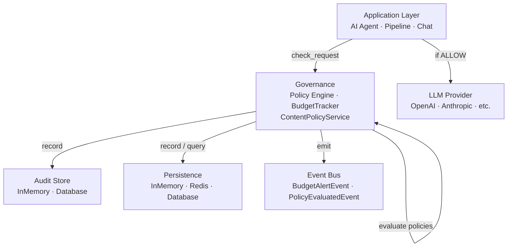
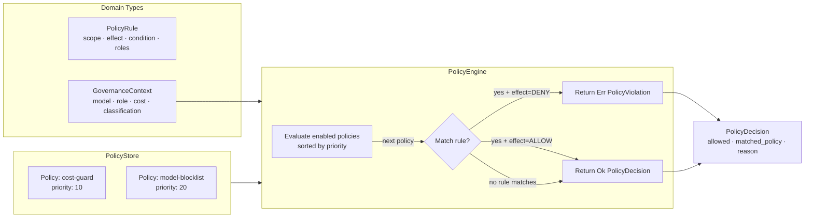
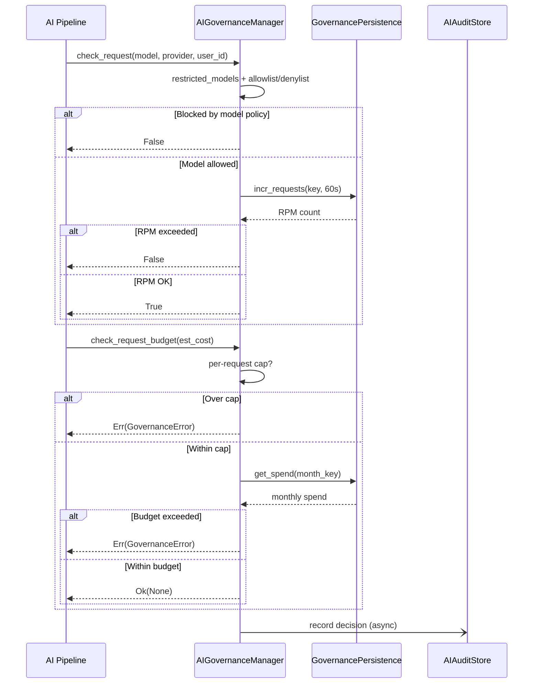
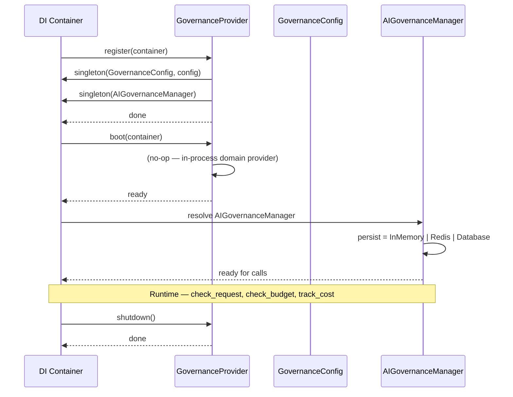

# Architecture

Internal design of the `lexigram-ai-governance` package.

---

## Role in the System

`lexigram-ai-governance` provides AI governance policies that gate which LLM requests are allowed, denied, or throttled based on budget, rate, model, content, and data-classification rules.

**Import direction:** Application code depends on `AIGovernanceProtocol` from `lexigram-contracts`. The governance package implements that contract. No other governance package imports from the application layer.

---

## Policy Model

Policies are declarative rules composed of scope-constrained conditions evaluated in priority order.

### Rule Scopes

| Scope | Condition Keys | Example |
|-------|---------------|---------|
| `MODEL` | `model_pattern` (glob) | `{"model_pattern": "gpt-4*"}` |
| `COST` | `max_cost` | `{"max_cost": 0.50}` |
| `GUARDRAIL` | `required` (list) | `{"required": ["pii_filter"]}` |
| `DATA_CLASSIFICATION` | `classification` | `{"classification": "pii"}` |

**Evaluation:** Load enabled policies sorted by priority. For each, iterate rules (skip if `roles` doesn't match). First DENY match short-circuits → `Err(PolicyViolation)`. No DENY → `Ok(PolicyDecision(allowed=True))`.

---

## Enforcement

Governance checks fire at two points before an LLM call: request-level (model access / rate limits) and budget-level (per-request cap + monthly spend). Content gating is a third layer via `ContentPolicyService` + `CompositeGate`.

---

## Provider Lifecycle

`GovernanceProvider` (priority `DOMAIN`) registers `GovernanceConfig` + `AIGovernanceManager` as singletons. The manager auto-selects persistence: explicit `persistence=` → use it; `cache=` (implements `CacheBackendProtocol`) → `RedisGovernancePersistence`; neither → `InMemoryGovernancePersistence`.

---

## Contracts Used

| Contract Symbol | Source | Role |
|----------------|--------|------|
| `AIGovernanceProtocol` | `lexigram.contracts.ai.governance` | Primary service contract for `check_request`, `check_budget`, `track_cost`, `reload_config` |
| `CostTrackingProtocol` | `lexigram.contracts.ai.governance` | Cost recording (`track_cost`) |
| `AIAuditStoreProtocol` | `lexigram.contracts.ai.governance` | Audit event persistence (`record`, `query`, `aggregate`) |
| `GovernanceError` | `lexigram.contracts.ai.governance` | Base domain exception |
| `BudgetExceededError` | `lexigram.contracts.ai.governance` | Monthly spend cap breached |
| `CacheBackendProtocol` | `lexigram.contracts.infra.cache` | Distributed counter/spend storage (optional) |
| `DatabaseProviderProtocol` | `lexigram.contracts.data` | SQL-backed persistence (optional) |
| `EventBusProtocol` | `lexigram.contracts.events` | Budget alert emission (optional) |
| `ContainerRegistrarProtocol` | `lexigram.contracts.core.di` | Provider registration |
| `ContainerResolverProtocol` | `lexigram.contracts.core.di` | Provider boot-time resolution |

---

## Extension Points

| Point | Mechanism | Example |
|-------|-----------|---------|
| Custom policy rule | `PolicyScope` enum + `PolicyRule` condition | Add a `JURISDICTION` scope |
| Custom policy store | Implement `PolicyStore`-like CRUD | Database-backed policy storage |
| Custom persistence | Implement `GovernancePersistence` protocol | S3-backed spend counters |
| Custom content gate | Implement `ContentPolicyGateProtocol` | Abuse detection gate |
| Custom audit store | Implement `AIAuditStore` protocol | Elasticsearch audit sink |
| Policy observer | Implement `PolicyObserverProtocol` | Metrics counter on every evaluation |
| Budget alert handler | Subscribe to `BudgetAlertEvent` via `EventBusProtocol` | PagerDuty at 90% spend |
| Hot-reload config | Call `AIGovernanceManager.reload_config()` | Runtime policy change without restart |
| Composite gate composition | Add gates to `CompositeGate(gates=[...])` | Abuse + quota + jurisdiction |
