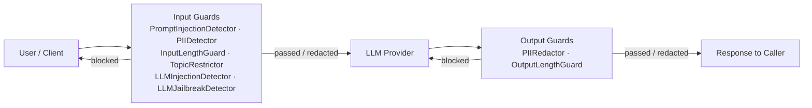
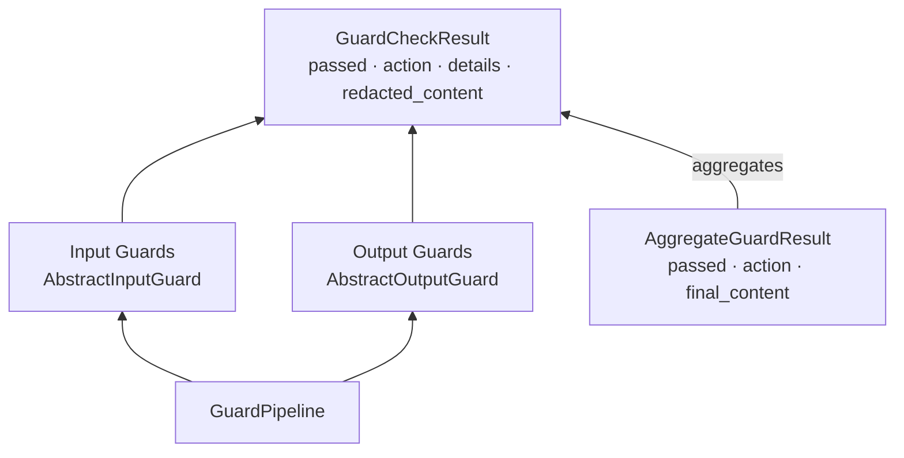
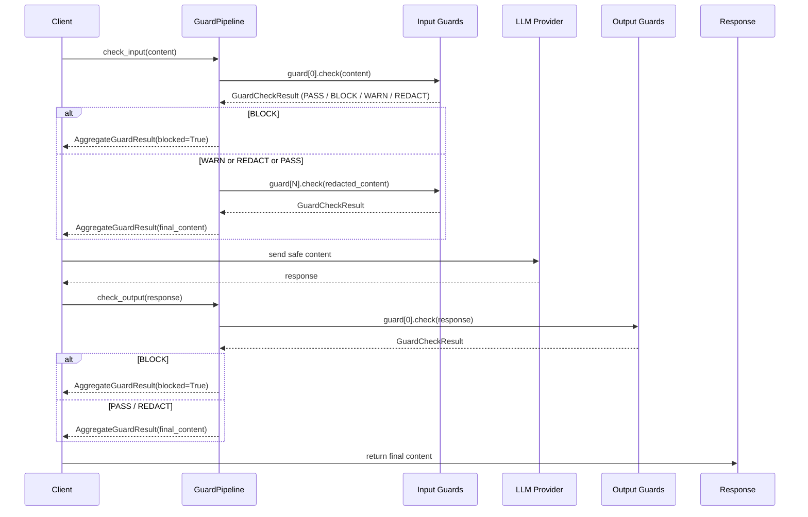
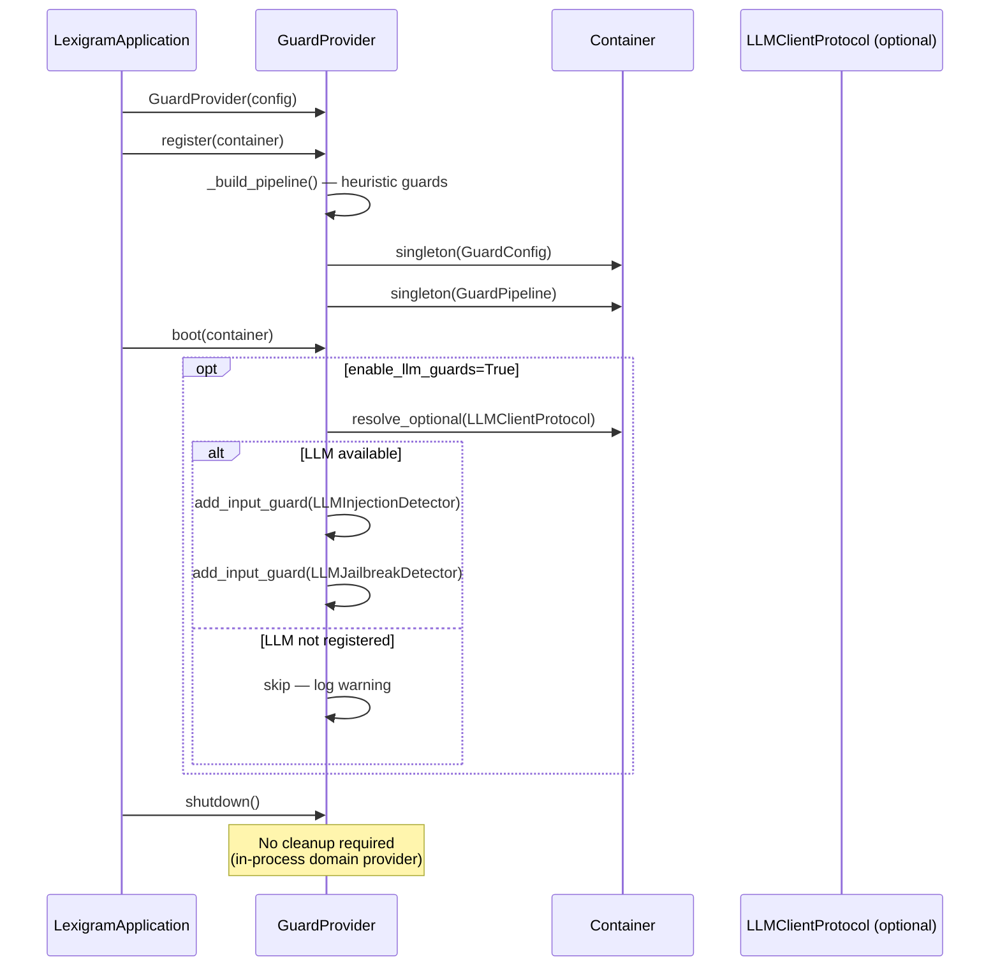

# Architecture

Internal design of the `lexigram-ai-guard` package.

---

## Role in the System

The guardrail layer sits between user input and the LLM, and between the LLM response and the caller:

The pipeline uses a **fire-and-forget** pattern per check — each guard returns a verdict (`PASS`, `BLOCK`, `WARN`, `REDACT`) and the aggregate action drives the outcome. Blocked content is rejected before reaching the LLM; redacted content is sanitised in-flight.

---

## Guard Model

### Input guards

Each implements `InputGuardProtocol.check(content, *, messages, metadata) → Result[GuardResultProtocol, GuardError]` and subclasses `AbstractInputGuard`. Guards run in registration order; a `BLOCK` verdict stops subsequent guards. `REDACT` passes the redacted content to the next guard.

### Output guards

Each implements `OutputGuardProtocol.check(content, *, original_input, metadata) → Result[GuardResultProtocol, GuardError]` and subclasses `AbstractOutputGuard`. Same sequential semantics as input guards but operate on LLM response content.

### Guard pipeline

`GuardPipeline` holds ordered lists of input and output guards. Exposes `check_input()` and `check_output()` — both return `Result[AggregateGuardResult, GuardError]`. Supports `parallel=True` for concurrent guard execution (disables redaction chaining).

### Guard action enum

| Action | Severity | `passed` | Description |
|--------|----------|----------|-------------|
| `PASS` | 0 | `True` | Content is safe |
| `WARN` | 1 | `True` | Content is borderline, allowed |
| `REDACT` | 2 | `True` | Content sanitised, allowed |
| `BLOCK` | 3 | `False` | Content unsafe, rejected |

---

## Execution

---

## Built-in Guards

| Guard | Direction | Method | Actions | Source |
|-------|-----------|--------|---------|--------|
| `PromptInjectionDetector` | Input | Regex heuristics (override, roleplay, exfiltration patterns) | `block`, `warn` | `input/injection.py` |
| `PIIDetector` | Input | Regex scan (EMAIL, PHONE, SSN, CREDIT_CARD, IP_ADDRESS, AWS_KEY) | `block`, `warn`, `redact` | `input/pii.py` |
| `InputLengthGuard` | Input | Character count | `block`, `warn` | `input/length.py` |
| `TopicRestrictor` | Input | Keyword / phrase word-boundary match | `block`, `warn` | `input/topic.py` |
| `LLMInjectionDetector` | Input | LLM classifier (fast model judge) | `block`, `warn` | `input/llm_injection.py` |
| `LLMJailbreakDetector` | Input | LLM classifier (5 jailbreak categories) | `block`, `warn` | `input/llm_jailbreak.py` |
| `PIIRedactor` | Output | Regex scan + `[REDACTED:<TYPE>]` substitution | `redact`, `block` | `output/pii_redactor.py` |
| `OutputLengthGuard` | Output | Character count | `block`, `warn` | `output/length.py` |

Heuristic guards (first four input guards) run synchronously under an async wrapper. LLM-based guards are optional — enabled via `GuardConfig.enable_llm_guards=True` and resolved from the container during the provider `boot()` phase.

---

## Provider Lifecycle

When `GuardConfig.enabled` is `False`, the provider registers a no-op pipeline with zero guards. LLM-based guards are **appended** during `boot()` after heuristic guards — they are not part of `_build_pipeline()`.

---

## Contracts Used

The package re-exports its protocols from `lexigram.contracts.ai.guards` for convenience at `lexigram.ai.guard.protocols`:

| Protocol | Contracts Source | Purpose |
|----------|-----------------|---------|
| `InputGuardProtocol` | `contracts/ai/guards.py:61` | Input guard contract (check with messages+metadata) |
| `OutputGuardProtocol` | `contracts/ai/guards.py:94` | Output guard contract (check with original_input+metadata) |
| `GuardPipelineProtocol` | `contracts/ai/guards.py:127` | Pipeline contract (check_input + check_output) |
| `GuardResultProtocol` | `contracts/ai/guards.py:27` | Immutable guard result with action+redacted_content |

The package also uses:
- `GuardConfig` — `BaseConfig` subclass with env-prefix `LEX_AI_GUARD__`
- `GuardError` (contracts base) — extended by `GuardConfigurationError`, `GuardPipelineError`
- `GuardCheckResult` / `AggregateGuardResult` — frozen dataclass value objects
- `InputGuardTriggeredEvent` / `OutputGuardTriggeredEvent` — domain events for audit
- `GuardInputCheckedHook` / `GuardOutputCheckedHook` / `GuardPipelineCompletedHook` — hook payloads
- `guarded` decorator — attaches guard metadata to async functions (marker only, container resolves the pipeline)

---

## Extension Points

| Point | Mechanism |
|-------|-----------|
| Custom input guard | Subclass `AbstractInputGuard`, implement `check()` |
| Custom output guard | Subclass `AbstractOutputGuard`, implement `check()` |
| Custom heuristic detector | Add regex/pattern class and wrap in `AbstractInputGuard` |
| Custom LLM-based detector | Implement `LLMClientProtocol` and subclass `AbstractInputGuard` |
| Custom response handler | Inspect `AggregateGuardResult.action` in calling code |
| Pipeline ordering | Reorder guards in provider `_build_pipeline()` or append via `add_input_guard()` / `add_output_guard()` |
| Configuration override | `GuardConfig` fields + environment variables (`LEX_AI_GUARD__*`) |
| Audit integration | Subscribe to `InputGuardTriggeredEvent` / `OutputGuardTriggeredEvent` |
| Hook integration | Register listeners for `GuardInputCheckedHook` / `GuardOutputCheckedHook` / `GuardPipelineCompletedHook` |
| Guarded decorator | Annotate service methods with `@guarded(input_guards=[...], output_guards=[...])` |
