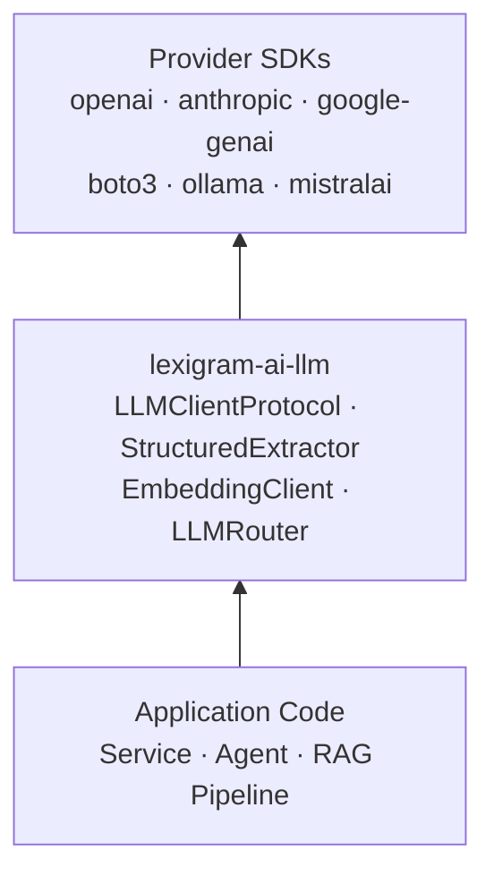
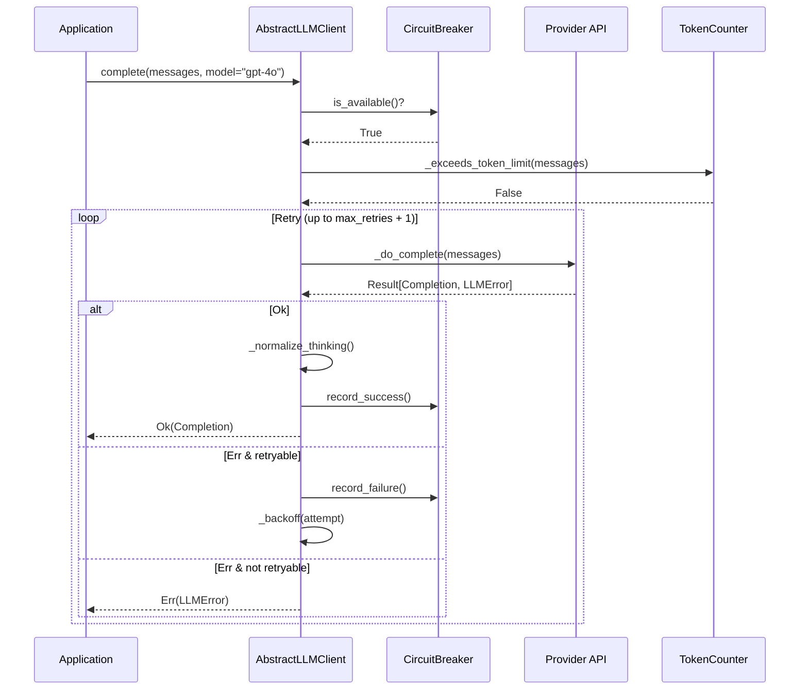
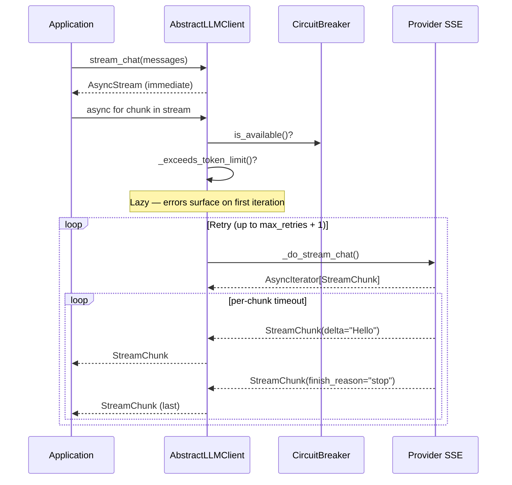
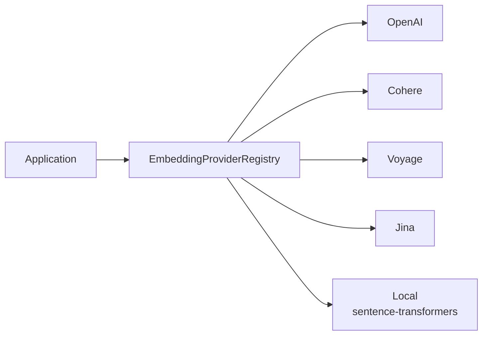
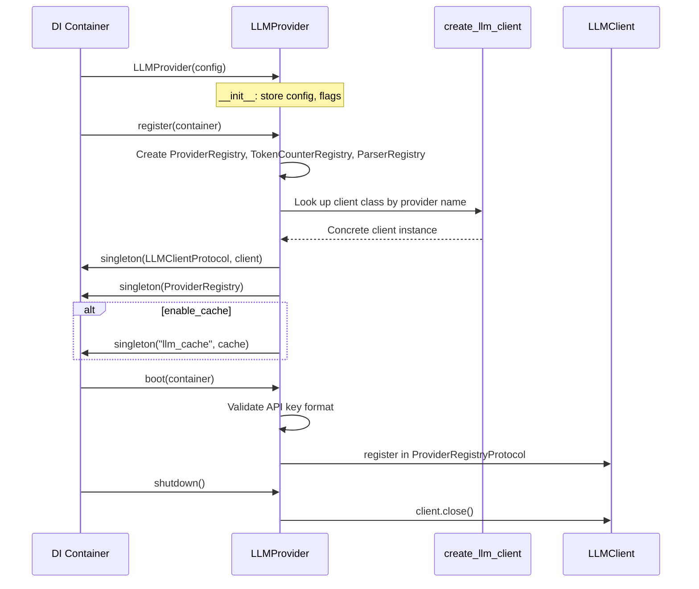
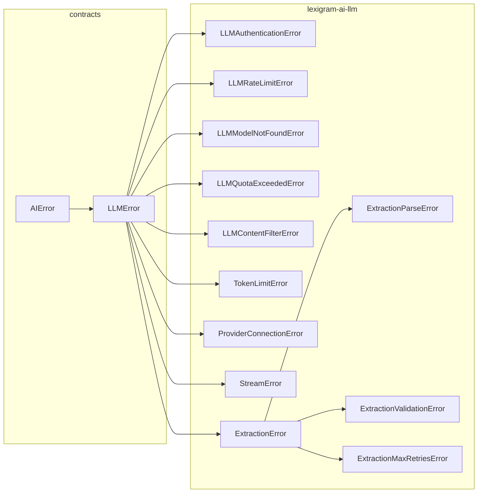

# Architecture

Internal design of the `lexigram-ai-llm` package — the LLM client abstraction layer.

---

## Role in the System

Provides a unified `LLMClientProtocol` across every major LLM provider, sitting between application code and provider SDKs.



Also provides structured output extraction, embedding generation, multi-provider routing, response caching, rate limiting, circuit breakers, and token counting — all behind protocol boundaries.

---

## Provider Abstraction

### `LLMClientProtocol`

The central contract. Every provider client implements:

```python
class LLMClientProtocol(Protocol):
    async def complete(self, messages, **kwargs) -> Result[Completion, LLMError]: ...
    def stream_chat(self, messages, **kwargs) -> AsyncStream[StreamChunk, LLMError]: ...
    async def chat(self, messages, tools=None, **kwargs) -> Result[Completion, LLMError]: ...
    async def health_check(self, timeout=5.0) -> HealthCheckResult: ...
    async def close(self) -> None: ...
```

### Supported Providers

Each maps to a concrete class in `ProviderRegistry` extending `AbstractLLMClient`:

```mermaid
flowchart LR
    subgraph R[ProviderRegistry]
        OpenAI · Anthropic · Gemini · Ollama · Groq · Mistral
        Cohere · OpenRouter · Bedrock · Vertex · Azure
        Cloudflare · DeepSeek · Together · Fireworks
    end
    R -->|implements| LLMClientProtocol
```

DeepSeek, Together, and Fireworks extend `OpenAICompatibleClient`.

### Template Method

`AbstractLLMClient` implements the shared retry/breaker/pre-flight in `complete()`, `stream_chat()`, `chat()`. Subclasses implement only:

| Method | Purpose |
|--------|---------|
| `_do_complete()` | Non-streaming completion call |
| `_do_stream_chat()` | Return `AsyncIterator[StreamChunk]` |
| `_do_chat()` | Completion with tool calling |
| `health_check()` | Provider connectivity probe |
| `_apply_thinking()` | Inject thinking params into API payload |

---

## Chat / Completion Lifecycle



Pre-flight: circuit breaker → token limit. Retryable errors (rate limits, 5xx): exponential backoff `2^attempt + 0.1*attempt`. Non-retryable: return immediately.

---

## Streaming

Streaming returns `AsyncStream[StreamChunk, LLMError]` — a typed async iterable with lazy setup and error coercion.



`StreamingResponse` aggregates chunks (separating answer from thinking content), exposing:

- `total_chunks`, `total_tokens` — counts across the stream
- `total_latency_ms`, `time_to_first_chunk_ms`, `chunks_per_second` — timing

`SSEStreamAdapter` converts SSE to `StreamChunk`. `ParallelStreamAggregator` merges multiple provider streams.

---

## Embedding

`AbstractEmbeddingAdapter` subclasses, registered in `EmbeddingProviderRegistry`:



All implement `embed(texts) -> list[list[float]]`, `get_models()`, `health_check()`. Default models: OpenAI `text-embedding-3-small`, Cohere `embed-english-v3.0`, Voyage `voyage-3`, Jina `jina-embeddings-v3`, Local `all-MiniLM-L6-v2`.

---

## Structured Output

`StructuredExtractor` wraps any `LLMClientProtocol` and extracts validated, typed data:

```python
extractor = StructuredExtractor(llm_client, default_model="gpt-4o")
result = await extractor.extract(prompt="Analyze sentiment", output_model=Sentiment)
```

```mermaid
flowchart LR
    Prompt --> Build["Build system prompt\nwith JSON schema"]
    Build --> LLM["LLMClientProtocol.complete()"]
    LLM --> Parse["extract_json_block()\nbracket-counting + fence strip"]
    Parse --> Validate["validate_against_model()"]
    Validate --> Retry{Retry?}
    Retry -->|yes| LLM
    Retry -->|no| Ok[Ok(T)]
    Parse -->|fail| Err1[ExtractionParseError]
    Validate -->|fail| Err2[ExtractionValidationError]
    Retry -->|exhausted| Err3[ExtractionMaxRetriesError]
```

`ParserRegistry` default parsers: JSON, Pydantic, Enum, CSV.

---

## Provider Lifecycle



`__init__` stores config/flags. `register()` creates registries, client, and singletons. `boot()` validates API key. `shutdown()` closes connections.

### Routing Provider

`LLMRoutingProvider` registers `LLMRouter` with strategies:

| Strategy | Behavior |
|----------|----------|
| `SequentialCascadeStrategy` | Try providers in priority order |
| `ParallelRaceStrategy` | Fire all providers; return first success |
| `CostOptimizedStrategy` | Cheapest capable provider based on pricing data |
| `LatencyOptimizedStrategy` | Historically fastest provider |

---

## Contracts Used

| Contract | Location | Implementations |
|----------|----------|----------------|
| `LLMClientProtocol` | `contracts/ai/llm.py` | `OpenAIClient`, `AnthropicClient`, etc. |
| `EmbeddingClientProtocol` | `contracts/ai/llm.py` | `OpenAIEmbeddingAdapter`, etc. |
| `LLMCacheProtocol` | `lexigram-ai-llm/protocols.py` | `LLMCache`, `RedisLLMCache` |
| `ProviderRegistryProtocol` | `contracts/ai/providers.py` | `ProviderRegistry` |
| `TokenCounterProtocol` | `contracts/ai/llm.py` | `TiktokenCounter`, `HuggingFaceCounter` |
| `CacheBackendProtocol` | `contracts/cache/protocols.py` | `RedisLLMCache` |
| `RoutingStrategyProtocol` | `lexigram-ai-llm/routing/strategies/` | 4 strategies |
| `QuotaBackendProtocol` | `contracts/ai/routing.py` | `RateLimiter` |
| `InferenceLoggerProtocol` | `contracts/ai/routing.py` | `InferenceLogger` |

### Module Mapping

| Module | Purpose |
|--------|---------|
| `module.py` | `LLMModule` entrypoint |
| `config.py` | `ClientConfig` |
| `types.py` | `ChatMessage`, `Completion`, `StreamChunk` |
| `exceptions.py` | Leaf exceptions |
| `constants.py` | Provider names, defaults, metrics |
| `clients/` | 15 provider implementations |
| `registry/` | `ProviderRegistry` |
| `di/` | `LLMProvider`, factories |
| `caching/` | `LLMCache`, `RedisLLMCache` |
| `embedding/` | 5 embedding adapters |
| `streaming/` | `StreamingResponse`, SSE |
| `structured/` | `StructuredExtractor` |
| `parsers/` | JSON, Pydantic, Enum, CSV |
| `routing/` | `LLMRouter`, 4 strategies |
| `pricing/` | `PricingManager`, token counting |
| `rate_limiting/` | Token-bucket `RateLimiter` |
| `health/` | `ProviderCircuitBreaker` |
| `thinking/` | Thinking tag normalization |

---

## Extension Points

| Point | Mechanism |
|-------|-----------|
| Custom provider | Subclass `AbstractLLMClient`, register in `ProviderRegistry` |
| OpenAI-compatible | Subclass `OpenAICompatibleClient` |
| Custom embedding | Subclass `AbstractEmbeddingAdapter` |
| Custom token counter | Implement `TokenCounterProtocol` |
| Custom output parser | Implement parser, register in `ParserRegistry` |
| Custom streaming adapter | Subclass `AbstractStreamingAdapter` |
| Custom routing strategy | Implement `RoutingStrategyProtocol` |
| Custom LLM cache | Implement `LLMCacheProtocol` |
| Caching backend | Implement `CacheBackendProtocol` from contracts |
| Output filter | Subclass `OutputFilter`, wrap in `SecureLLMClient` |
| Pricing source | Implement `PricingSourceProtocol` |

---

## Error Handling

Domain bases in `lexigram-contracts`, leaf exceptions in `lexigram-ai-llm`. Infrastructure errors raise; domain errors return as `Result`.



| Error | Trigger | Recovery |
|---|---|---|
| `LLMAuthenticationError` | Invalid API key | Config fix |
| `LLMRateLimitError` | 429 response | Backoff + retry |
| `LLMModelNotFoundError` | Model unavailable | Fallback |
| `LLMQuotaExceededError` | Billing limit | Switch provider |
| `LLMContentFilterError` | Safety filter | Reformulate |
| `TokenLimitError` | Context window | Reduce messages |
| `ProviderConnectionError` | Network failure | Retry |

**Circuit breaker**: `ProviderCircuitBreaker` opens after N failures, preventing network calls. **Rate limiter**: token-bucket per provider, returns `LLMRateLimitError` before any network call when empty.

---

## DI Registration

```python
@inject
class LLMProvider(Provider):
    name = "llm"
    priority = ProviderPriority.DOMAIN

    async def register(self, container):
        container.singleton(ClientConfig, self.config)
        container.singleton(ProviderRegistry, registry)
        container.singleton(ProviderRegistryProtocol, registry)
        container.singleton(LLMClientProtocol, client)
        container.singleton(TokenCounterProtocol, default_counter)

    async def boot(self, container):
        # Validate API key format, register in shared ProviderRegistryProtocol

    async def shutdown(self):
        await self._llm_client.close()
```

Usage: `LLMModule.configure(ClientConfig(provider="openai", model="gpt-4o"))` for single, `LLMModule.configure(routing=LLMConfig())` for multi-provider.
