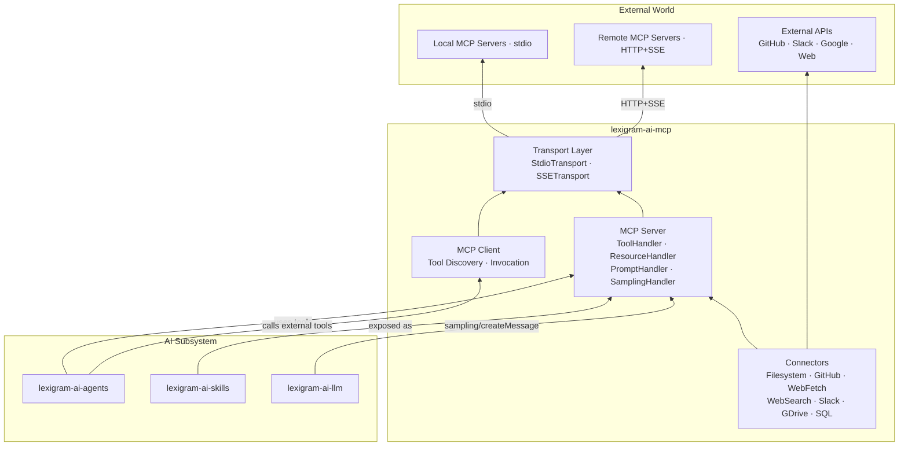
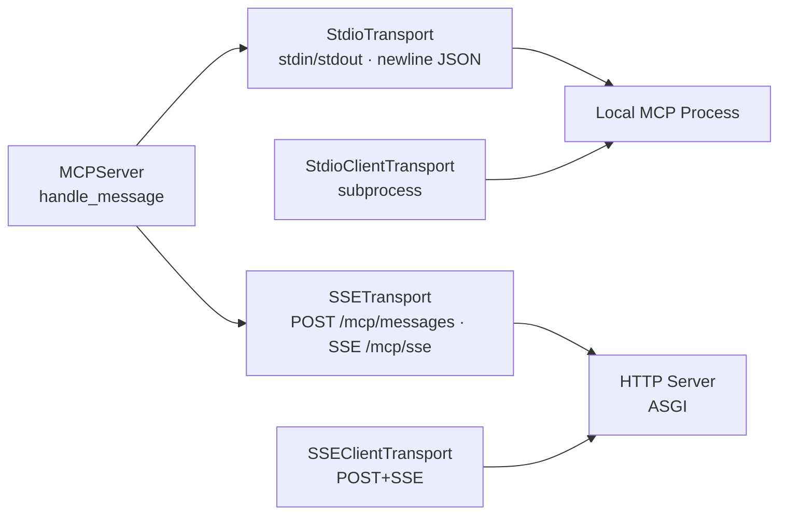
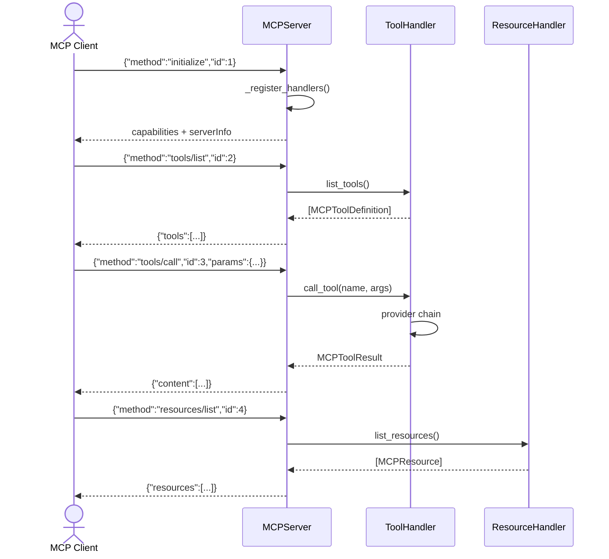
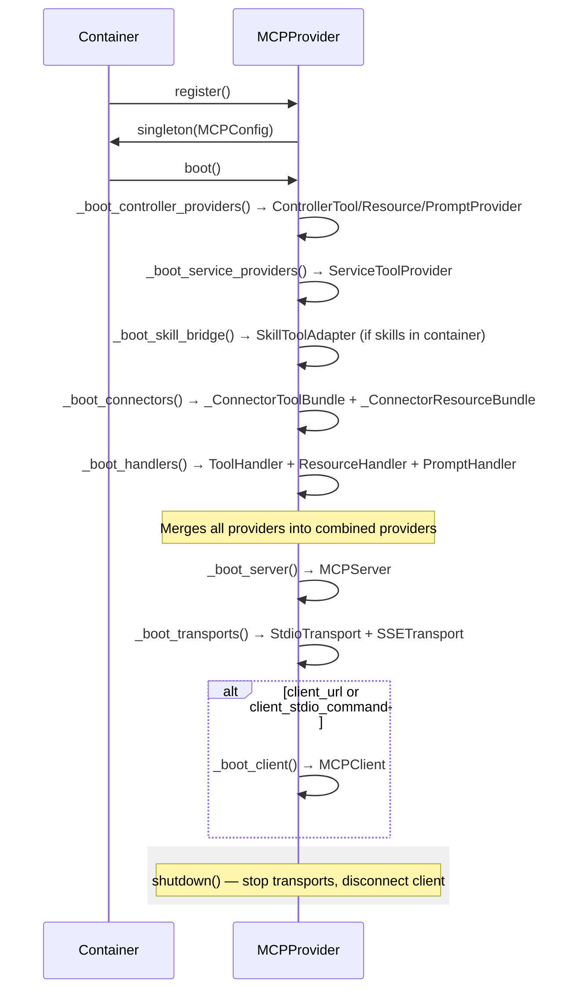
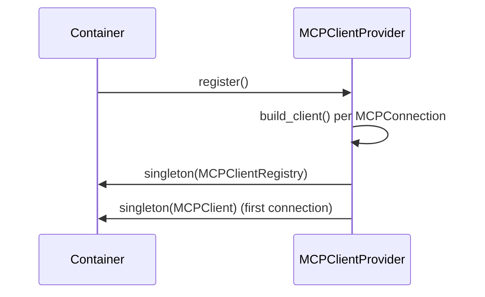
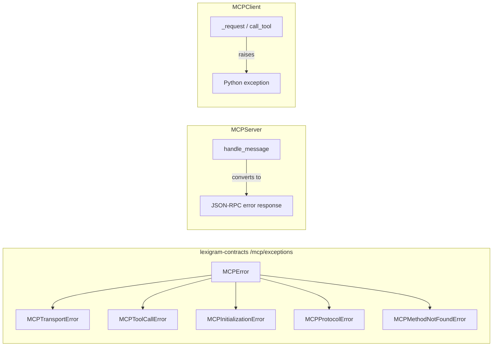

# Architecture

Internal design of the `lexigram-ai-mcp` package — the Model Context Protocol (MCP) server/client bridge for AI ↔ external tool integration.

---

## Role in the System



**Import rule:** `lexigram-ai-mcp` depends on `lexigram` and `lexigram-contracts` only. Bridges to agents, skills, and LLM are resolved via DI container protocols — never direct imports.

---

## Protocol Architecture

The MCP is a JSON-RPC 2.0 protocol for AI clients to discover and invoke tools, read resources, and use prompt templates.

### Message Format

```json
{"jsonrpc":"2.0","id":1,"method":"tools/call","params":{"name":"get_user","arguments":{"user_id":"abc"}}}
```

Notifications omit `id`: `{"jsonrpc":"2.0","method":"notifications/initialized"}`

### Protocol Methods

| Method | Direction | Description |
|--------|-----------|-------------|
| `initialize` | Client → Server | Capability negotiation, handshake |
| `notifications/initialized` | Client → Server | Handshake complete |
| `ping` | Either | Keepalive |
| `tools/list` | Client → Server | List available tools |
| `tools/call` | Client → Server | Invoke a tool |
| `resources/list` | Client → Server | List available resources |
| `resources/read` | Client → Server | Read a resource by URI |
| `resources/templates/list` | Client → Server | List resource URI templates |
| `prompts/list` | Client → Server | List prompt templates |
| `prompts/get` | Client → Server | Get a rendered prompt |
| `sampling/createMessage` | Server → Client | Request LLM sampling (reverse) |
| `logging/setLevel` | Client → Server | Set server logging level |

### Transport Layer



The server is transport-agnostic — `MCPServer.handle_message()` receives parsed `dict` and returns `dict`. `AbstractTransport` defines `start()`, `stop()`, `send()`, `receive()`.

- **`StdioTransport`** — reads newline-delimited JSON from stdin, writes to stdout
- **`SSETransport`** — receives via HTTP POST, streams via SSE. `MCPServerHost` provides the ASGI callable (mountable in Starlette/FastAPI/Uvicorn)

---

## Server Model

`MCPServer` routes JSON-RPC messages to registered handlers via a method-name dispatch table built in `_register_handlers()`:



### Handler Provider Chain

```
ToolHandler → _CombinedToolProvider
  ├── ControllerToolProvider   ← @tool-decorated MCPController methods
  ├── ServiceToolProvider       ← Auto-exposed service methods
  ├── _ConnectorToolBundle      ← Built-in connectors
  └── SkillToolAdapter          ← Optional lexigram-ai-skills bridge
```

### MCPController Pattern

```python
class DataToolsController(MCPController):
    def __init__(self, repo: UserRepository) -> None:
        self.repo = repo

    @tool("get_user", description="Fetch user by ID")
    async def get_user(self, user_id: str) -> dict:
        return (await self.repo.get(user_id)).unwrap_or({})
```

Decorators attach `_tool_config` / `_resource_config` / `_prompt_config` metadata. `MCPController.collect_tools()` traverses the MRO. `ControllerToolProvider` resolves controller instances from the container and dispatches.

---

## Client Model

`MCPClient` handles the MCP handshake (`initialize` → `initialized`) and exposes `list_tools()`, `call_tool()`, `list_resources()`, `list_prompts()`.

### Lifecycle

```
connect() → initialize → initialized notification → ready
         ↓
  list_tools() · call_tool() · list_resources() · list_prompts()
         ↓
  disconnect()
```

```python
transport = StdioClientTransport(["uvx", "mcp-server-git", "--repository", "/repo"])
async with MCPClient(transport) as client:
    tools = await client.list_tools()
    result = await client.call_tool("git_log", {"max_count": 5})
```

### Multi-Connection Registry

`MCPClientModule` registers named clients in `MCPClientRegistry` (and the first connection directly as `MCPClient`):

```python
class ReportService:
    def __init__(self, registry: MCPClientRegistry) -> None:
        self._git = registry.get("git")
        self._analytics = registry.get("analytics")
```

---

## Provider Lifecycle

### MCPProvider (PRESENTATION, priority 80)



### MCPClientProvider (COMMS, priority 90)



---

## Contracts Used

| Contract | Location | Implemented By |
|----------|----------|----------------|
| `MCPServerProtocol` | `contracts/mcp/protocols.py` | `MCPServer` |
| `MCPTransportProtocol` | `contracts/mcp/protocols.py` | `StdioTransport`, `SSETransport` |
| `MCPToolProviderProtocol` | `contracts/mcp/protocols.py` | `ControllerToolProvider`, `ServiceToolProvider`, `SkillToolAdapter`, connector bundles |
| `MCPToolHandlerProtocol` | `contracts/mcp/protocols.py` | `ToolHandler` |
| `MCPResourceProviderProtocol` | `contracts/mcp/protocols.py` | `ControllerResourceProvider`, connector bundles |
| `MCPResourceHandlerProtocol` | `contracts/mcp/protocols.py` | `ResourceHandler` |
| `MCPPromptProviderProtocol` | `contracts/mcp/protocols.py` | `ControllerPromptProvider` |
| `MCPPromptHandlerProtocol` | `contracts/mcp/protocols.py` | `PromptHandler` |
| `SkillRegistryProtocol` | `contracts/ai/skills.py` | `SkillToolAdapter` (container-resolved, optional) |
| `SkillExecutorProtocol` | `contracts/ai/skills.py` | `SkillToolAdapter` (container-resolved, optional) |
| `LLMClientProtocol` | `contracts/ai/llm.py` | `SamplingHandler` (container-resolved, optional) |
| `AIMetricsProtocol` | `contracts/observability/ai.py` | `ObservableToolHandler`, `ObservableResourceHandler` (optional) |
| `DatabaseProviderProtocol` | `contracts/data/__init__.py` | `SQLConnector` (container-resolved, optional) |

Exceptions in `contracts/mcp/exceptions.py`: `MCPError`, `MCPTransportError`, `MCPToolCallError`, `MCPInitializationError`, `MCPProtocolError`, `MCPMethodNotFoundError`.

### Auto-Wiring Rules

| Condition | Behavior |
|-----------|----------|
| `SkillRegistryProtocol` + `SkillExecutorProtocol` in container | Skills exposed as MCP tools via `SkillToolAdapter` |
| `LLMClientProtocol` in container | `SamplingHandler` enables `sampling/createMessage` |
| `AIMetricsProtocol` in container | `ObservableToolHandler`/`ObservableResourceHandler` wrap handlers |
| `DatabaseProviderProtocol` in container + `sql.dsn` set | `SQLConnector` activates |

---

## Exception Convention



The server never raises — it converts errors to JSON-RPC error responses. The client raises Python exceptions on protocol violations and tool errors.

---

## Extension Points

| Point | Mechanism |
|-------|-----------|
| Custom transport | Subclass `AbstractTransport`, implement `start/stop/send/receive` |
| Custom tools/resources/prompts | `MCPController` subclass with `@tool`/`@resource`/`@prompt` |
| Custom tool/resource provider | Implement `MCPToolProviderProtocol` or `MCPResourceProviderProtocol` |
| Service auto-exposure | `MCPModule.from_services(services=[UserService])` |
| Built-in connectors | Configure via `MCPConfig.connectors` (FS, GitHub, WebFetch, WebSearch, Slack, GDrive, SQL) |
| Skill bridge | Install `lexigram-ai-skills` — `SkillToolAdapter` auto-wires |
| Agent tool bridge | `MCPToolAdapter` wraps external MCP tools as `ToolProtocol` |
| Observability | Register `AIMetricsProtocol` — `ObservableToolHandler` wraps automatically |
| Sampling (server→LLM) | Register `LLMClientProtocol` — `SamplingHandler` activates |
