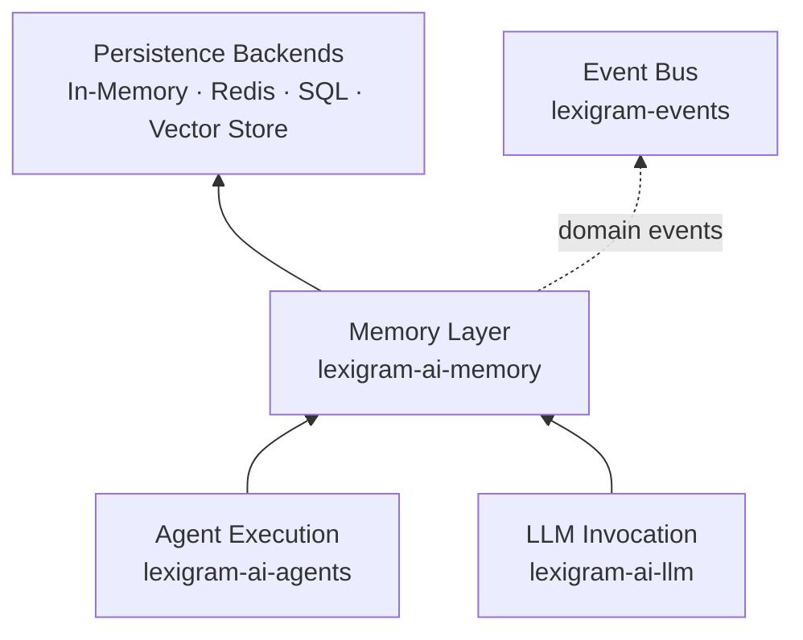
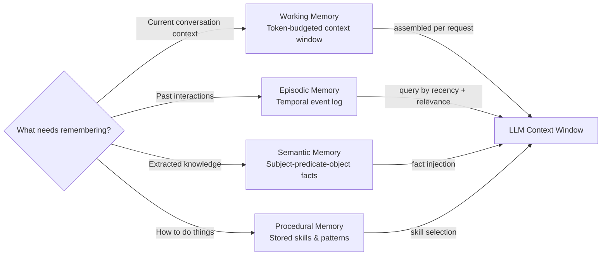
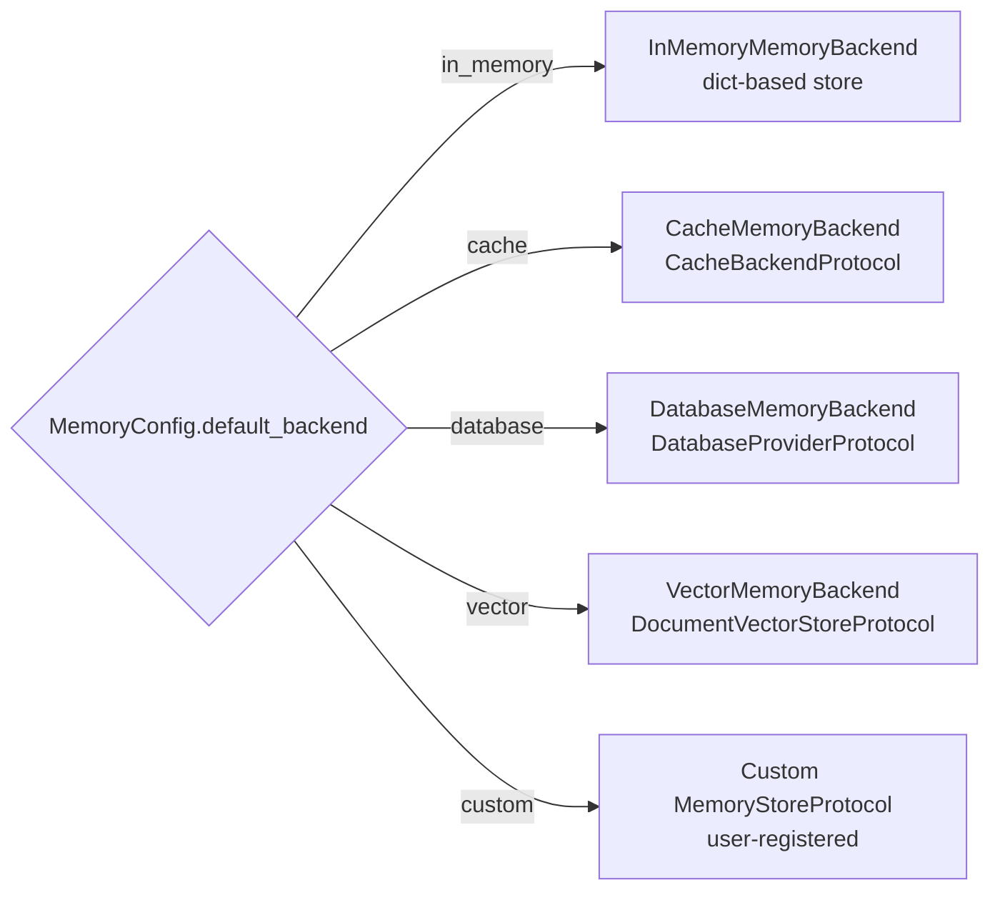
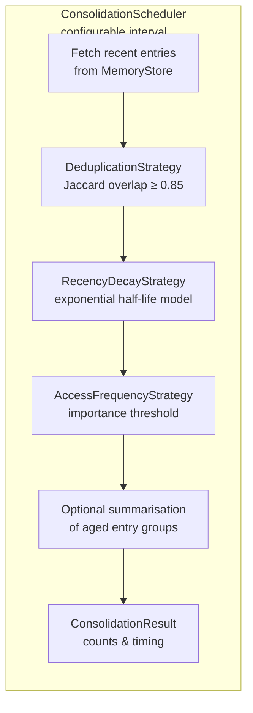
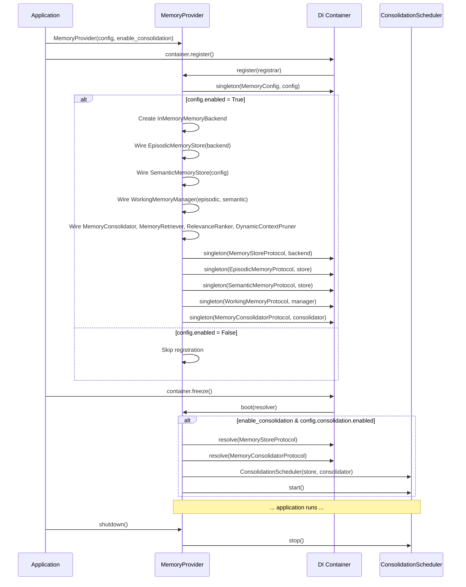

# Architecture

Internal design of the `lexigram-ai-memory` package.

---

## Role in the System

`lexigram-ai-memory` provides the memory layer for AI agents. It sits between the LLM invocation layer and the persistence layer, managing what an agent remembers across turns and sessions.



The memory layer is consumed by agent executors (for conversational context) and LLM clients (for working memory assembly). It emits domain events (`MemoryStoredEvent`, `MemoryRetrievedEvent`) for audit, observability, and safety review systems.

---

## Memory Types

The package defines four memory tiers accessed via distinct protocols. Each serves a different retention and retrieval purpose.



### Working Memory (`WorkingMemoryProtocol`)

The immediate context window assembled per LLM request. Managed by `WorkingMemoryManager`, it pulls recent turns from episodic memory and relevant facts from semantic memory, fitting everything within a configurable token budget.

```
Budget allocation:
  ┌─────────────────────────────────────────────────────┐
  │ System Prompt (fixed: 512 tokens)                    │
  ├─────────────────────────────────────────────────────┤
  │ Recent Turns (40% of remaining) — last N messages   │
  │ Episodic Recall (30% of remaining) — similar past    │
  │ Semantic Facts (20% of remaining) — entity knowledge │
  │ Tool Descriptions (10% of remaining) — function docs │
  └─────────────────────────────────────────────────────┘
```

### Episodic Memory (`EpisodicMemoryProtocol`)

Records timestamped interactions as `MemoryEntry` objects. Backed by a pluggable `MemoryStoreProtocol`, it supports hybrid retrieval weighting recency, importance, and relevance. Each entry carries an `importance` score (0–1) that influences persistence and pruning.

### Semantic Memory (`SemanticMemoryProtocol`)

Stores structured knowledge as subject-predicate-object triples via `FactStore`. Facts have a `confidence` score (0–1); only those above the `min_confidence` threshold are returned. An optional `EntityExtractor` can ingest raw `MemoryEntry` objects into semantic facts automatically.

### Procedural Memory

Procedural memory is not implemented as a separate store. Skills and tool definitions are registered via `lexigram-ai-agents` and `lexigram-ai-skills`. The memory layer reserves this concept as an extension point for future learned-procedure storage.

---

## Store Abstraction

All memory backends implement `MemoryStoreProtocol` from `lexigram-contracts`. This protocol defines the full CRUD interface for memory entries:

```python
class MemoryStoreProtocol(Protocol):
    async def store(self, entry: MemoryEntry) -> None: ...
    async def retrieve(self, query: MemoryQuery) -> list[MemorySearchResult]: ...
    async def get_recent(self, n: int) -> list[MemoryEntry]: ...
    async def delete(self, entry_id: str) -> None: ...
    async def clear(self) -> None: ...
    async def health_check(self, timeout: float = 5.0) -> HealthCheckResult: ...
```

### Supported Backends

| Backend | Class | Dependencies | Use Case |
|---------|-------|-------------|----------|
| In-Memory | `InMemoryMemoryBackend` | None | Development, testing, single-process |
| Cache | `CacheMemoryBackend` | `CacheBackendProtocol` | Redis-backed ephemeral memory |
| Database | `DatabaseMemoryBackend` | `DatabaseProviderProtocol` | Persistent SQL-backed memory |
| Vector | `VectorMemoryBackend` | `DocumentVectorStoreProtocol` | Semantic similarity search |

The default backend is `InMemoryMemoryBackend`, configured via `MemoryConfig.default_backend`. Applications override this by registering a custom `MemoryStoreProtocol` binding after `MemoryProvider` runs.

### Backend Selection Flow



---

## Memory Consolidation

Consolidation is the process of promoting short-term episodic memories into more durable forms and pruning stale entries to prevent unbounded growth.

### Consolidation Pipeline



Three strategies run in sequence: `DeduplicationStrategy` (Jaccard overlap ≥ 0.85), `RecencyDecayStrategy` (exponential half-life model, `threshold: 0.05`), and `AccessFrequencyStrategy` (importance floor at 0.1). An optional `summarise_fn` compresses surviving aged batches into summary entries.

### Scheduling

The `ConsolidationScheduler` runs as a background `asyncio.Task`, started during `boot()` and cancelled during `shutdown()`. Each cycle:
1. Fetches `batch_size * 10` recent entries from `MemoryStoreProtocol`
2. Passes them through `MemoryConsolidatorProtocol.consolidate()`
3. Sleeps for `interval_seconds` (default: 3600 = 1 hour)

---

## Provider Lifecycle

`MemoryProvider` (priority `DOMAIN`) registers all memory services and manages the consolidation scheduler.



### register() Phase

1. Binds `MemoryConfig` as a singleton
2. Exits early if `config.enabled` is `False`
3. Creates the default backend (`InMemoryMemoryBackend`)
4. Wires tier stores: `EpisodicMemoryStore` → backend, `SemanticMemoryStore` → `FactStore`, `WorkingMemoryManager` → episodic + semantic
5. Wires supporting services: `MemoryConsolidator`, `MemoryRetriever`, `RelevanceRanker`, `DynamicContextPruner`
6. Registers all services under their protocol tokens

### boot() Phase

If `enable_consolidation` is `True` and `config.consolidation.enabled` is `True`, creates and starts the `ConsolidationScheduler` background task.

### shutdown() Phase

Stops the `ConsolidationScheduler` if running (cancels the asyncio task).

---

## Contracts Used

| Contract | Import Path | Purpose |
|----------|-------------|---------|
| `MemoryEntry` | `lexigram.contracts.ai.memory` | Core data unit with importance, embedding, metadata |
| `MemoryQuery` | `lexigram.contracts.ai.memory` | Query parameters with configurable weightings |
| `MemorySearchResult` | `lexigram.contracts.ai.memory` | Result with score and source attribution |
| `ConsolidationResult` | `lexigram.contracts.ai.memory` | Consolidation statistics |
| `MemoryStoreProtocol` | `lexigram.contracts.ai.memory` | Storage CRUD for memory entries |
| `EpisodicMemoryProtocol` | `lexigram.contracts.ai.memory` | Temporal event record/recall |
| `SemanticMemoryProtocol` | `lexigram.contracts.ai.memory` | Fact storage and query |
| `WorkingMemoryProtocol` | `lexigram.contracts.ai.memory` | Token-budgeted context assembly |
| `MemoryConsolidatorProtocol` | `lexigram.contracts.ai.memory` | Consolidation pipeline |
| `TokenCounterProtocol` | `lexigram.contracts.ai.llm` | Token counting for budget allocation |
| `CacheBackendProtocol` | `lexigram.contracts.infra.cache` | Cache-backed store (optional) |
| `DatabaseProviderProtocol` | `lexigram.contracts.data` | SQL-backed store (optional) |
| `DocumentVectorStoreProtocol` | `lexigram.contracts.ai.vector` | Vector-backed store (optional) |
| `HealthCheckResult` | `lexigram.contracts.core` | Health status for all services |

---

## Hook System

The package defines hook payload dataclasses fired during memory lifecycle operations:

| Hook Payload | Fired When | Attributes |
|-------------|-----------|------------|
| `MemoryWrittenHook` | Entry written to a tier | `tier`, `backend` |
| `MemoryRetrievedHook` | Entries retrieved from a tier | `tier`, `result_count` |
| `MemoryConsolidatedHook` | Consolidation pass completes | `strategy` |

Hooks are invoked through the framework's `HookRegistryProtocol` — consumers register callbacks keyed by payload type.

---

## Exception Convention

```
LexigramError → AIError → AIMemoryError (contracts)
    └── MemorySystemError (package base)
        ├── MemoryStoreError     — backend failure
        ├── MemoryCapacityError  — store at capacity
        ├── EmbeddingError       — embedding failure
        └── FactExtractionError  — extraction failure
```

`ConsolidationError` and `StorageError` live in `lexigram-contracts` (they appear in protocol method signatures).

---

## Extension Points

| Point | Mechanism |
|-------|-----------|
| Custom memory type | Implement a new protocol (or use `MemoryStoreProtocol`) and register via `MemoryStoreProtocol` override |
| Custom store backend | Implement `MemoryStoreProtocol`; register after `MemoryProvider` runs to override the default |
| Custom consolidation strategy | Subclass consolidation strategy pattern (`DeduplicationStrategy`, `RecencyDecayStrategy`, `AccessFrequencyStrategy`) and inject into `MemoryConsolidator` |
| Custom pruning scorer | Implement `RelevanceScorerProtocol` and register in `DynamicContextPruner._get_scorer()` registry |
| Custom entity extractor | Inject into `SemanticMemoryStore` constructor for automated fact ingestion |
| Summarisation callback | Pass `summarise_fn: Callable[[list[MemoryEntry]], Awaitable[MemoryEntry]]` to `MemoryConsolidator` |
| Event-driven integration | Subscribe to `MemoryStoredEvent` / `MemoryRetrievedEvent` via `EventBusProtocol` |
| Hook-based plugin | Register callbacks on `HookRegistryProtocol` for `MemoryWrittenHook`, `MemoryRetrievedHook`, `MemoryConsolidatedHook` |

---

## Configuration

Top-level `MemoryConfig` with nested sub-configs:

| Config Class | Fields |
|-------------|--------|
| `MemoryConfig` | `enabled`, `default_backend`, `ttl_seconds`, `working`, `episodic`, `semantic`, `consolidation` |
| `WorkingMemoryConfig` | `system_prompt_tokens`, `recent_turns_fraction`, `episodic_fraction`, `semantic_fraction`, `tool_descriptions_fraction`, `max_recent_turns` |
| `EpisodicMemoryConfig` | `default_top_k`, `recency_weight`, `importance_weight`, `relevance_weight`, `ttl_seconds` |
| `SemanticMemoryConfig` | `min_confidence`, `max_facts_per_entity` |
| `ConsolidationConfig` | `enabled`, `interval_seconds`, `age_threshold_hours`, `importance_prune_threshold`, `batch_size` |

Environment variable prefix: `LEX_AI_MEMORY__`
