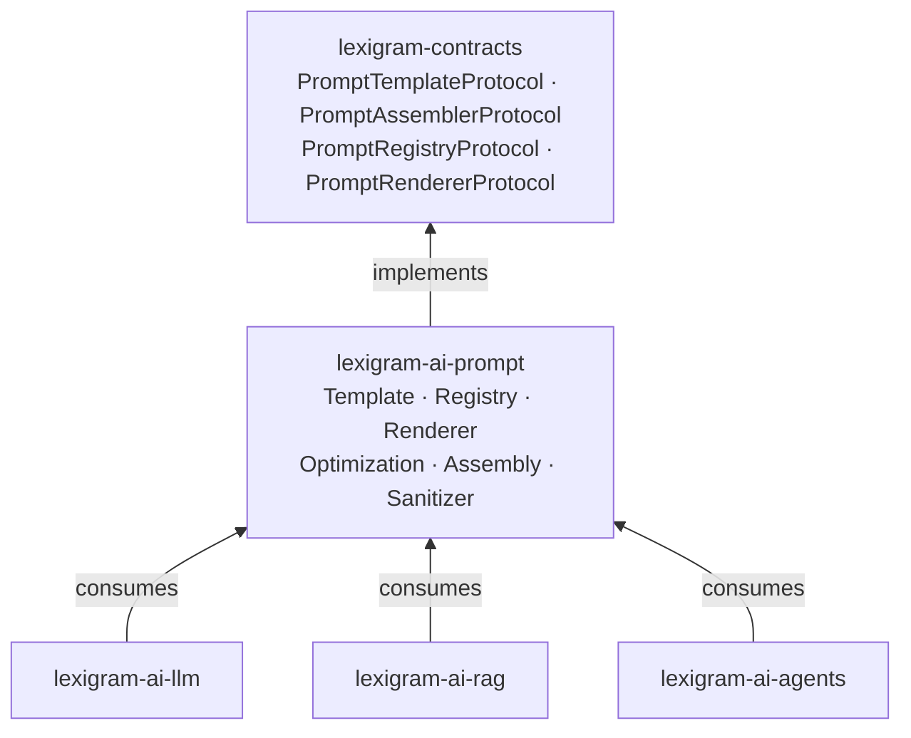
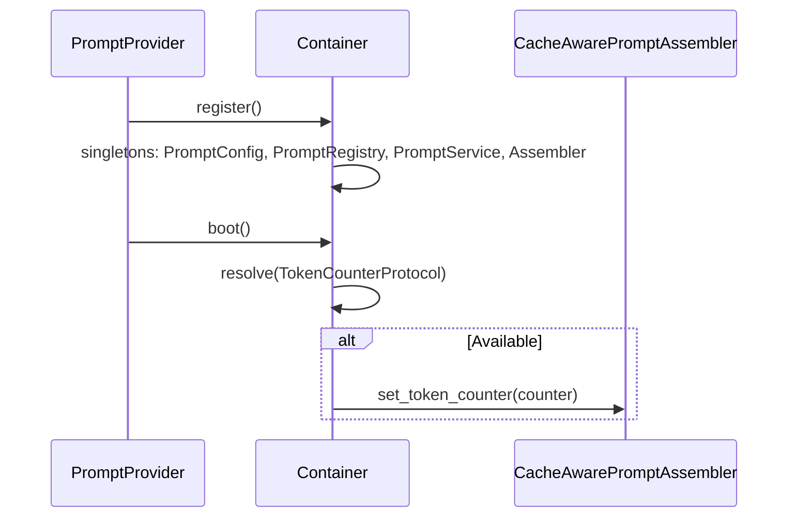

# Architecture

Internal design of the `lexigram-ai-prompt` package.

---

## Role in the System



The prompt management layer sits between **contracts** (interfaces in `lexigram-contracts`) and LLM/RAG/Agent consumers. It provides template authoring, variable validation, multi-format rendering, versioned storage, automated optimization, and provider-aware assembly with cache annotation.

---

## Template System

Five implementations at `lexigram/ai/prompt/template/`, all extending `AbstractPromptTemplate`:

| Template | Output | Use Case |
|----------|--------|----------|
| `StringPromptTemplate` | `str` | Single-message prompts with typed variable validation |
| `ChatPromptTemplate` | `list[dict]` | Multi-turn system/user/assistant message slots |
| `FewShotPromptTemplate` | `str` | Prefix-examples-suffix with pluggable `ExampleSelectorProtocol` |
| `PartialPromptTemplate` | `str \| list[dict]` | Wraps any template with pre-filled defaults |
| `ConditionalPrompt` | `str \| list[dict]` | Predicate-based branch dispatch |

### Variables

`PromptVariable(name, type, required, default, max_length, allowed_values)` declares typed constraints. `resolve_variables()` checks type, length, allowed values, and required-ness, merging with caller-supplied values. Undeclared extras pass through.

### Rendering

`PromptRenderer` dispatches to one of four `RenderFormat` engines: `F_STRING` (default, `str.format_map`), `JINJA2` (optional jinja2 dep), `DOLLAR` (`string.Template`), or `SIMPLE` (literal).

`InputSanitizer` scans variable values for injection patterns (instruction override, role hijack, system prompt leak) with optional strict mode.

### Decorative Registration

`@prompt_template(name, version, tags)` registers a class as a named, versioned template — for code-first definitions alongside file-based loading from YAML/JSON.

---

## Management

### Registry

`PromptRegistry` maps names to templates (register, get, list, unregister). `VersionedPromptStore` maintains per-name version history with `push()`, `rollback(steps)`, and configurable `max_versions` eviction.

### Service Layer

`PromptService` is the primary runtime facade injected via DI. It resolves name+version, merges variables, applies provider-specific escaping, substitutes content, and notifies an optional `PromptObserverProtocol` for telemetry or audit.

```python
# Template loading — combined at construction:
DirectoryPromptLoader("/path/to/templates/").load()
DictPromptLoader([{"name": "...", "version": "v1", "content": "..."}]).load()
```

### Optimization

`PromptOptimizer` automatically improves prompts on labelled datasets (DSPy-inspired):

| Strategy | Approach |
|----------|----------|
| `BOOTSTRAP_FEW_SHOT` | Search example pool for best few-shot combination |
| `TEMPLATE_REFINEMENT` | LLM rewrites template based on failure analysis |
| `ENSEMBLE` | Evaluate multiple candidate templates, return highest-scoring |

`DynamicFewShotSelector` uses embedding cosine similarity (`EmbeddingClientProtocol`) for semantic example selection.

---

## Provider Lifecycle



`PromptProvider` at `di/provider.py`, priority `DOMAIN`:

1. **register()** — loads templates from configured sources, binds all singletons. Early-returns if `enabled=False`.
2. **boot()** — optionally injects `TokenCounterProtocol` into the assembler for cache-size validation. Graceful fallback.
3. **shutdown()** — no-op (in-process, no external backends).

### Assembly & Cache Annotation

`CacheAwarePromptAssembler` enforces **static-before-dynamic** 7-layer ordering for maximum KV-cache reuse:

```
Layer 1: System instructions        ─┐
Layer 2: Tool definitions            │ STATIC (cached)
Layer 3: Reference documents         │
Layer 4: Few-shot examples          ─┘
────────────────────────────────── ← CACHE BOUNDARY
Layer 5: Chat history               ─┐
Layer 6: Current query               │ DYNAMIC
Layer 7: Dynamic metadata           ─┘
```

Provider-specific strategies dispatch through `ProviderCacheStrategyRegistry`:

| Provider | Strategy |
|----------|----------|
| `anthropic` | `cache_control: ephemeral` on ≤ 4 blocks ≥ 1024 tokens |
| `openai` / `azure` | Warn if static prefix < 1024 tokens (auto-cached) |
| `deepseek` | Pad static blocks to nearest 64-token boundary |
| `gemini` | Flag blocks ≥ 32k tokens for Context Caching API |
| `mistral` | Pass-through |

---

## Contracts Used

| Contract | `lexigram-contracts` Location | Purpose |
|----------|------------------------------|---------|
| `PromptTemplateProtocol` | `ai/llm.py` | Template interface — `name`, `render()`, `get_variables()` |
| `PromptRegistryProtocol` | `ai/llm.py` | Named template registry |
| `PromptAssemblerProtocol` | `ai/llm.py` | Static-to-dynamic assembly with cache annotations |
| `PromptRendererProtocol` | `ai/llm.py` | Template string substitution |
| `PromptOptimizerProtocol` | `ai/llm.py` | Automatic prompt improvement |
| `TokenCounterProtocol` | `ai/llm.py` | Model-aware token counting |
| `ChatMessage` | `ai/llm.py` | Shared message value type |
| `EmbeddingClientProtocol` | `ai/llm.py` | Dynamic few-shot selection |
| `DomainEvent` | `domain/events.py` | Event base class |
| `ProviderPriority` | `core/provider.py` | DI provider ordering |

### Exceptions

All extend `PromptError(AIError)` at `exceptions.py`:

| Exception | When Raised |
|-----------|-------------|
| `PromptRenderError` | Missing variable or substitution failure |
| `PromptValidationError` | Variable type/length/allowed-value violation |
| `PromptNotFoundError` | Template not in registry |
| `PromptVersionError` | Version conflict or invalid rollback |
| `PromptConfigError` | Invalid configuration |
| `OptimizationError` | Optimization fails |

### Events & Hooks

- `PromptRenderedEvent(DomainEvent)` — fired after successful render
- `PromptTemplateResolvedHook`, `PromptRenderedHook`, `PromptInputSanitizedHook` — hook payloads

---

## Extension Points

| Point | Mechanism |
|-------|-----------|
| Custom template | Subclass `AbstractPromptTemplate`, implement `render()` |
| Custom rendering format | Add `RenderFormat` value + branch in `PromptRenderer.render()` |
| Custom variable validation | Add patterns to `InputSanitizer` or custom `PromptVariable` |
| Custom example selector | Implement `ExampleSelectorProtocol`, pass to `FewShotPromptTemplate` |
| Custom cache strategy | Implement `CacheStrategy` protocol, register in `ProviderCacheStrategyRegistry` |
| Custom optimizer strategy | Add `OptimizationStrategy` value, implement method on `PromptOptimizer` |
| Custom template loader | Implement `PromptLoaderProtocol`, supply to `PromptService` |
| Observability hook | Implement `PromptObserverProtocol`, pass to `PromptProvider(observer=...)` |
| Provider escaping rules | Extend `_apply_provider_escaping()` with new `LLMProvider` values |
| Versioned storage | Configure `max_versions` on `VersionedPromptStore` |
