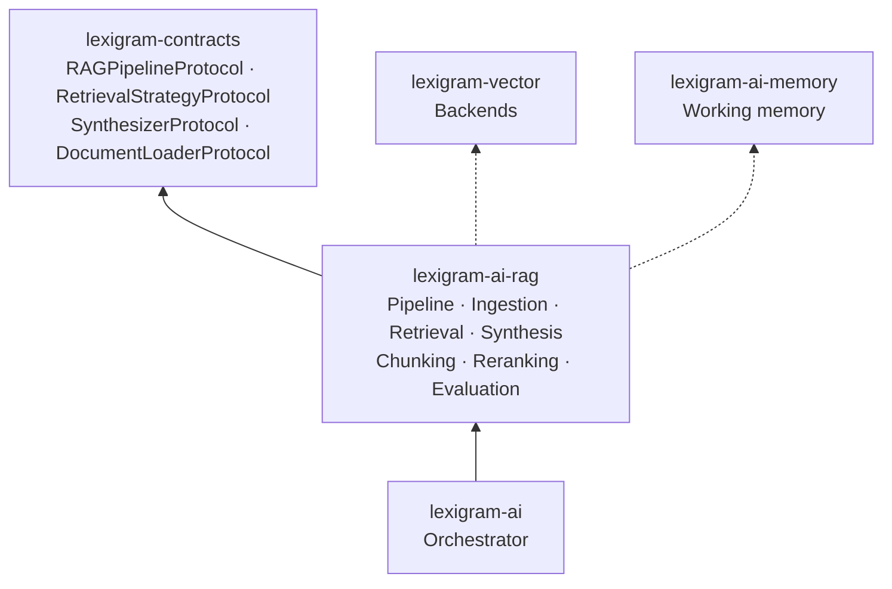
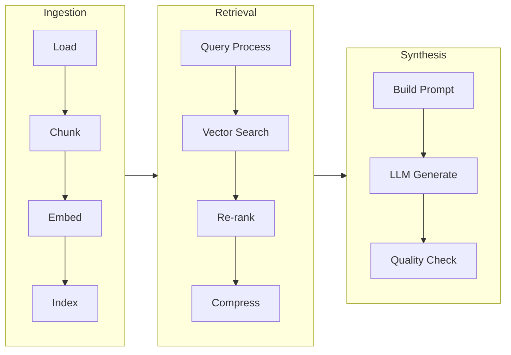
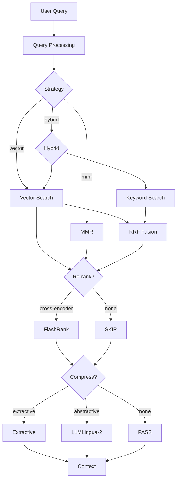
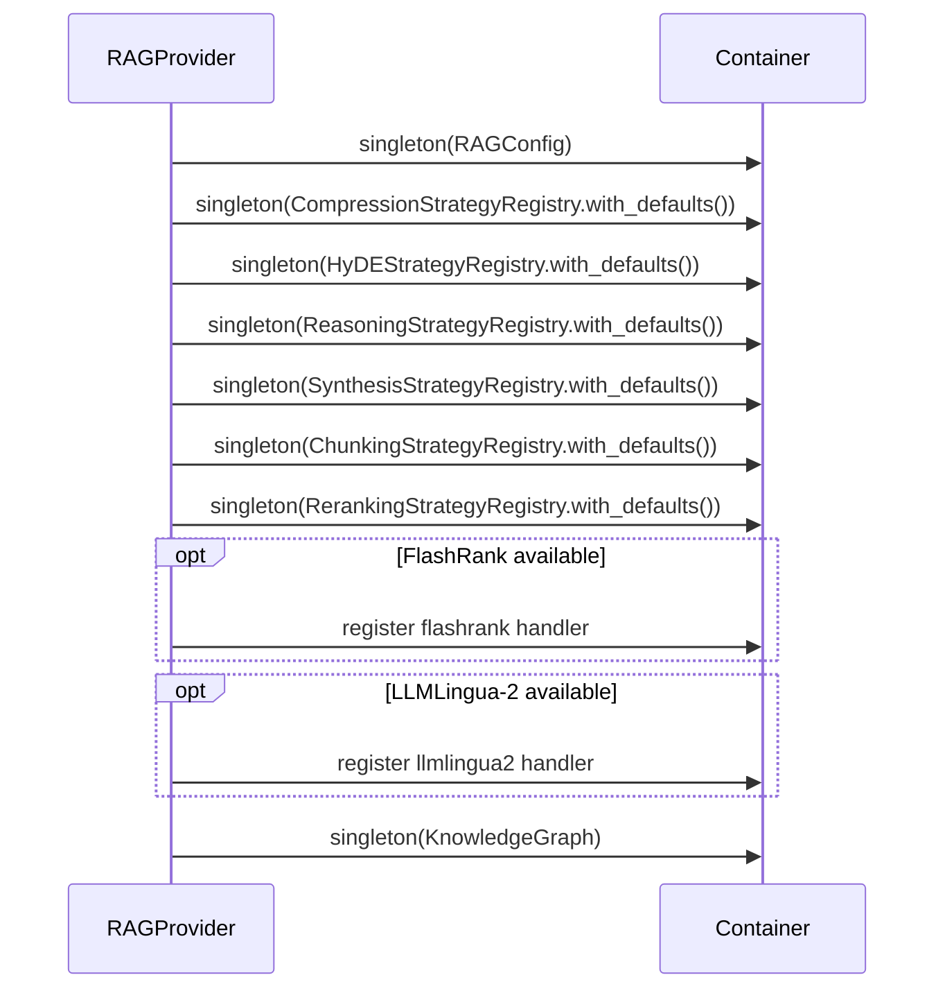

# Architecture

Internal design of the `lexigram-ai-rag` package.

---

## Role in the System

`lexigram-ai-rag` implements the RAG pipeline protocol defined in `lexigram-contracts`. It is an AI-subsystem extension consumed by `lexigram-ai` (the orchestrator) and usable standalone via `RAGModule`.



**Import direction:** Arrows point toward the dependency. `lexigram-ai-rag` imports only from `lexigram` and `lexigram-contracts`. Vector store and memory are resolved via DI — never imported directly.

---

## Pipeline Architecture

The RAG pipeline follows three phases: **ingestion** → **retrieval** → **synthesis**.



### PipelineConfig Stages

Configured via `PipelineConfig` (`config.py:289`), which defines an ordered list of `PipelineStageType` values:

| Stage | Config Class | Purpose |
|-------|-------------|---------|
| `INGESTION` | `IngestionConfig` | Load, preprocess, OCR, table extraction |
| `QUERY_PROCESSING` | `QueryProcessingConfig` | Transform, HyDE, routing |
| `RETRIEVAL` | `RetrievalConfig` | Vector/hybrid search, KG, multi-hop |
| `CONTEXT_OPTIMIZATION` | `ContextOptimizationConfig` | Rerank, compress, deduplicate |
| `SYNTHESIS` | `SynthesisConfig` | LLM response generation |
| `QUALITY_ASSURANCE` | `QualityAssuranceConfig` | Faithfulness, hallucination checks |
| `POST_PROCESSING` | `PostProcessingConfig` | Cache, collect metrics |

Each stage implements `PipelineStageProtocol` (`pipeline/base.py:10`) and processes a shared `PipelineContext` (`pipeline/types.py:74`).

---

## Ingestion Pipeline

Documents enter through the ingestion pipeline and are transformed into indexed chunks.

### SmartLoader (`loaders/registry.py:186`)

Auto-detects file format from extension or URL and delegates to the right loader:

| Loader | Formats | Dependencies |
|--------|---------|-------------|
| `TextLoader` | `.txt`, `.rst` | None |
| `MarkdownLoader` | `.md`, `.markdown` | None |
| `JSONLoader` | `.json`, `.jsonl` | None |
| `CSVLoader` | `.csv`, `.tsv` | None |
| `PDFLoader` | `.pdf` | pypdf (opt) |
| `HTMLLoader` | `.html`, `.htm` | beautifulsoup4 (opt) |
| `WebScraperLoader` | URLs | aiohttp (opt) |
| `DocxLoader` | `.docx` | python-docx (opt) |
| `ExcelLoader` | `.xlsx`, `.xls` | openpyxl (opt) |
| `CodeLoader` | 20+ code exts | None |

### Chunking (`chunking/`)

`ChunkingStrategyRegistry` (`chunking/strategy_registry.py:23`) maps strategy names to chunker classes:

| Strategy | Class | Method |
|----------|-------|--------|
| `fixed_size` | `FixedSizeChunker` | Fixed character count |
| `recursive` | `RecursiveChunker` | Recursive separator splitting |
| `semantic` | `SemanticChunker` | Sentence/paragraph boundaries |
| `sliding_window` | `SlidingWindowChunker` | Overlapping windows |
| `token` | `TokenChunker` | Token-count (cl100k_base) |

Chunkers implement `ChunkerProtocol` (`protocols.py:7`):

```python
@runtime_checkable
class ChunkerProtocol(Protocol):
    def chunk(self, text: str, chunk_size: int, overlap: int) -> list[str]: ...
```

### Indexing and Preprocessing

Chunks are embedded via `EmbeddingClientProtocol` and indexed into `DocumentVectorStoreProtocol` (PGVector, Chroma, Qdrant). The adapter at `index/vector_store_index.py` handles batch upsert.

Optional preprocessing (`preprocessing/`): OCR (`ocr.py`), table extraction (`tables.py`), metadata enrichment (`enricher.py`). Controlled via `IngestionConfig.preprocessing_enabled`.

---

## Retrieval

The retrieval phase converts a user query into ranked context chunks.



| Strategy | Class | Behavior |
|----------|-------|----------|
| `vector` | `VectorRetrievalStrategy` | Sort by pre-computed similarity score |
| `mmr` | `MMRRetrievalStrategy` | MMR — balance relevance & diversity |

Registered in `RetrievalStrategyRegistry` (`retrieval/strategy_registry.py:18`). Implements `RetrievalStrategyProtocol`.

### Query Enhancement

- **Query expansion** — generate variants (`query/transformers.py`)
- **HyDE** (`hyde/`) — Hypothetical Document Embeddings via `HyDEStrategyRegistry`
- **Query routing** (`routing/`) — dispatch to strategy (rule-based, semantic, LLM)

### Re-ranking (`reranking/`)

Handler-based dispatch via `RerankingStrategyRegistry` (`reranking/strategy_registry.py:10`). FlashRank registered when optional dep is installed. Custom handlers via `can_handle()` + `create_and_rerank()`.

### Context Compression (`context_compression/`)

Strategies: extractive (sentence scoring), abstractive (LLMLingua-2, opt), hybrid, token-limit, semantic dedup. Via `CompressionStrategyRegistry`.

---

## Synthesis

The synthesis stage constructs a prompt from retrieved context and generates a response.

| Strategy | Method | Requires LLM |
|----------|--------|-------------|
| `direct` | Concatenate chunks | No |
| `extractive` | Extract relevant sentences | No |
| `abstractive` | LLM-generated response | Yes |
| `hybrid` | Extractive + abstractive | Yes |

`SynthesisStrategyRegistry` (`pipeline/stages/synthesis_registry.py:132`) dispatches to handlers. Falls back to extractive if abstractive fails and no LLM is available.

### Context Window

`SynthesisConfig` (`synthesis/types.py:201`): `max_context_length` (4000), `max_response_length` (500), `fallback_strategy`, `min_confidence`. Context compression runs before synthesis to fit the LLM's token budget.

### Quality Assurance (`pipeline/stages/quality.py:21`)

Validates faithfulness, relevance, coherence, hallucination detection, confidence. Below-threshold responses can be rejected (`reject_low_quality`) or flagged (`warn_low_quality`).

---

## Provider Lifecycle

`RAGProvider` (`di/provider.py:40`) — priority `DOMAIN`.

| Phase | Action |
|-------|--------|
| `__init__(config)` | Store `RAGConfig` |
| `register(container)` | Register config, 6 strategy registries (`Compression`, `HyDE`, `Reasoning`, `Synthesis`, `Chunking`, `Reranking`), knowledge graph. Discover chunking/retrieval providers via `lexigram.chunking.strategies` and `lexigram.retrieval.strategies` entry points. |
| `boot(container)` | Resolve optional `WorkingMemoryProtocol` and `GraphStoreProtocol`. Non-fatal if absent. |
| `shutdown()` | No-op |
| `health_check(timeout)` | Ping embedding and vector store. Returns `DEGRADED` if either is missing. |

Config key: `"ai.rag"` — maps to `LEX_AI_RAG__*` env vars (`constants.py:14`) or YAML.

### Strategy Registry Registration



### Pipeline Executor (`pipeline/executor.py:21`)

| Error Strategy | Behavior |
|----------------|----------|
| `FAIL_FAST` | Raise immediately |
| `RETRY` | Exponential backoff (`max_retries`, `retry_delay`) |
| `SKIP` | Skip stage, continue |
| `GRACEFUL` | Warning, continue with partial results |
| `FALLBACK` | Execute fallback |

Supports sequential (`execute()`) and parallel (`execute_parallel()`) execution.

---

## Composable Steps

`steps/core.py` provides fine-grained `PipelineStep` implementations for custom pipelines:

| Step | Input | Output |
|------|-------|--------|
| `LoadDocumentsStep` | Source path/URL | `list[Chunk]` |
| `SplitDocumentsStep` | Documents | `list[Chunk]` |
| `IndexDocumentsStep` | Chunks | `int` (count) |
| `RetrieveContextStep` | Query | `list[RAGSearchResult]` |
| `GenerateAnswerStep` | Query + context | `Completion` |
| `TranslationStep` | Chunks | `list[Chunk]` |

---

## Contracts Used

From `lexigram-contracts`:

| Protocol | Module | Usage |
|----------|--------|-------|
| `RAGPipelineProtocol` | `contracts.ai.rag` | Pipeline entry point |
| `RetrievalStrategyProtocol` | `contracts.ai.rag` | Pluggable retrieval |
| `RerankingStrategyProtocol` | `contracts.ai.rag` | Cross-encoder reranking |
| `SynthesizerProtocol` | `contracts.ai.rag` | Answer synthesis |
| `DocumentLoaderProtocol` | `contracts.ai.rag` | Document loading |
| `PromptCompressorProtocol` | `contracts.ai.rag` | Context compression |
| `RAGEvaluatorProtocol` | `contracts.ai.rag` | Quality evaluation |
| `ChunkProtocol` | `contracts.ai.rag` | Chunk interface |
| `DocumentProtocol` / `DocumentVectorStoreProtocol` | `contracts.ai.vector` | Document + vector store |
| `SearchResultProtocol` / `ChunkerProtocol` | `contracts.ai.vector` | Search + chunking |
| `EmbeddingClientProtocol` / `LLMClientProtocol` | `contracts.ai` | Embedding + LLM (opt) |
| `WorkingMemoryProtocol` | `contracts.ai.memory` | Memory (opt) |
| `GraphStoreProtocol` | `contracts.data.graph.protocols` | KG (opt) |
| `RAGContext` / `RAGResponse` | `contracts.ai.rag` | I/O DTOs |

### Exception Hierarchy

```text
contracts: RAGError → ChunkingError, RetrievalError, SynthesisError
package:   RAGError → PreprocessingError, MissingCitationsError, MultimodalError
                        └─ AudioLoaderError, VideoLoaderError, ImageLoaderError, CLIPEmbeddingError
```

Domain errors return via `Result[T, E]`. Infrastructure errors propagate as exceptions.

Package-internal types (not in contracts): `Chunk`, `Context`, `PipelineContext`, `SynthesisResult`, `QualityMetrics`, `ContextChunk`, `ChunkingStrategy`, `SynthesisStrategy`.

---

## Caching, Events, and Hooks

### RAGCache (`cache/`)

Query result cache with configurable TTL (default: 3600s). Embedding cache (`DEFAULT_EMBEDDING_CACHE_SIZE: 10_000`). Metrics: `ai.rag.cache.hits`, `ai.rag.pipeline.duration_ms`, `ai.rag.retrieved.chunks`.

### Domain Events (`events.py`)

`RetrievalCompletedEvent(query_id, documents_retrieved)`, `SynthesisCompletedEvent(query_id, context_chunks)` — published via `EventBusProtocol`.

### Lifecycle Hooks (`hooks.py`)

`RAGPipelineStartedHook(pipeline_name)`, `RAGDocumentsRetrievedHook(chunk_count)`, `RAGAnswerSynthesizedHook(pipeline_name)` — fired via `HookRegistryProtocol`.

### Evaluation (`evaluation/`)

Hallucination detection, answer quality, context relevance, retrieval precision/recall. Auto-evaluation via `PipelineConfig.auto_evaluate_every_n`.

---

## Extension Points

| Point | Mechanism | Location |
|-------|-----------|----------|
| Custom document loader | Subclass `AbstractDocumentLoader`, register in `LoaderRegistry` | `loaders/registry.py` |
| Custom chunker | Register in `ChunkingStrategyRegistry` | `chunking/strategy_registry.py` |
| Custom retrieval strategy | Entry-point `lexigram.retrieval.strategies` | `retrieval/strategy_registry.py` |
| Custom reranking handler | Register in `RerankingStrategyRegistry` | `reranking/strategy_registry.py` |
| Custom synthesizer | Register handler in `SynthesisStrategyRegistry` | `pipeline/stages/synthesis_registry.py` |
| Custom compressor | Register in `CompressionStrategyRegistry` | `context_compression/strategy_registry.py` |
| Custom HyDE generator | Register in `HyDEStrategyRegistry` | `hyde/strategy_registry.py` |
| Custom reasoning strategy | Register in `ReasoningStrategyRegistry` | `reasoning/strategy_registry.py` |
| Lifecycle hooks | Hook dataclass + `HookRegistryProtocol` | `hooks.py` |
| Event subscribers | `event_bus.subscribe(EventClass, handler)` | `events.py` |
| Custom pipeline stage | Implement `PipelineStageProtocol` | `pipeline/base.py` |
| Composable step | Subclass `PipelineStep` | `steps/core.py` |

All registries are populated with defaults via `with_defaults()`. Custom entries are additive.

---

## DI Registration

```python
@module()
class RAGModule(Module):
    @classmethod
    def configure(cls, config: RAGConfig | None = None) -> DynamicModule:
        return DynamicModule(
            module=cls,
            providers=[RAGProvider(config=config)],
            exports=[RAGPipelineProtocol, RetrievalStrategyProtocol],
        )

@module(imports=[RAGModule.configure(RAGConfig(chunk_size=512))])
class AppModule(Module):
    pass
```

## Constants

`constants.py`: `ENV_PREFIX` (`LEX_AI_RAG__`), default chunk size/overlap (512/50), `DEFAULT_TOP_K` (5), similarity threshold (0.7), cache TTL (3600s), embedding cache size (10_000), metric names (`ai.rag.*`).
