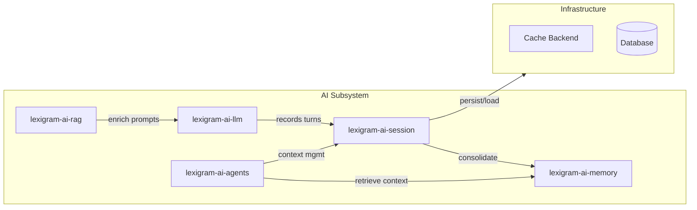
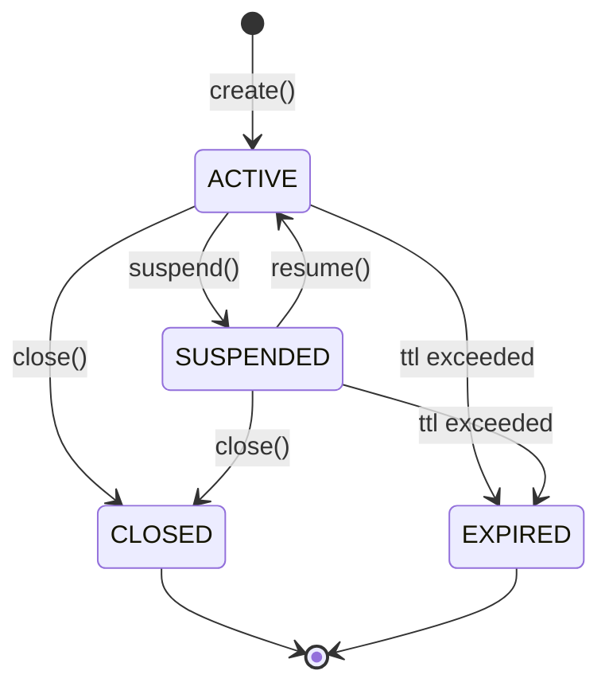
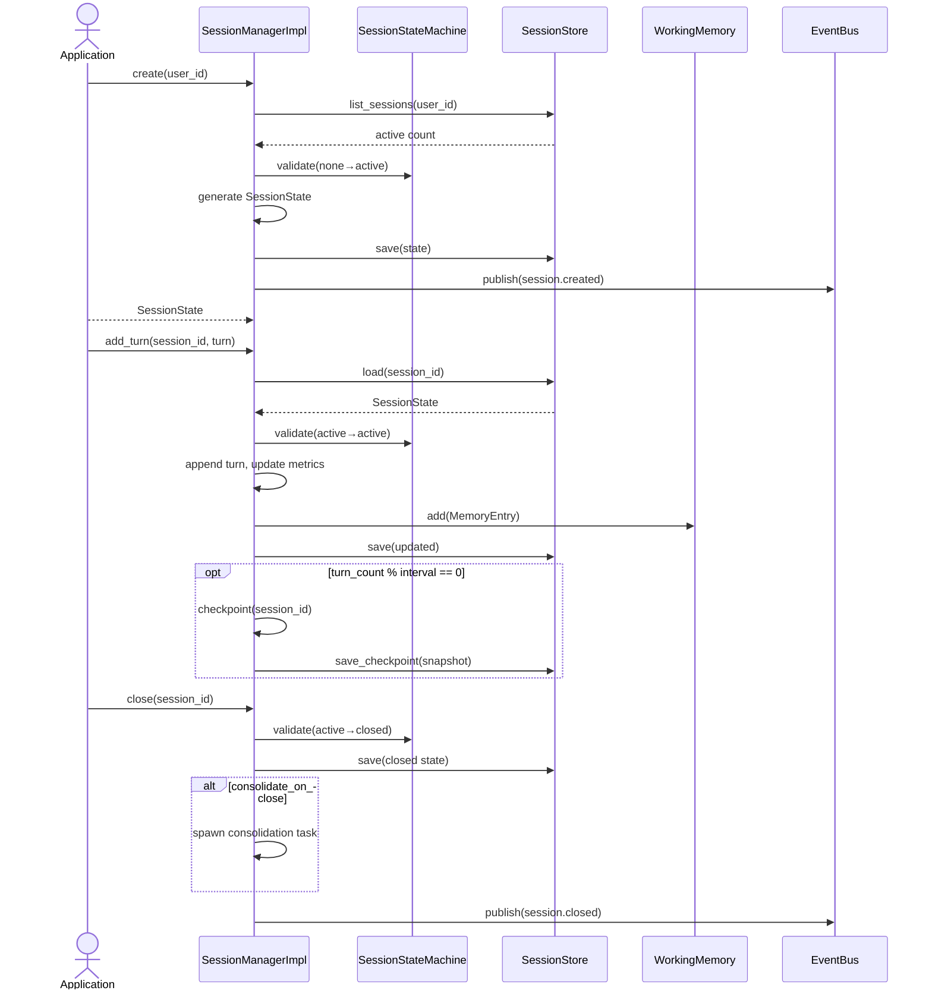
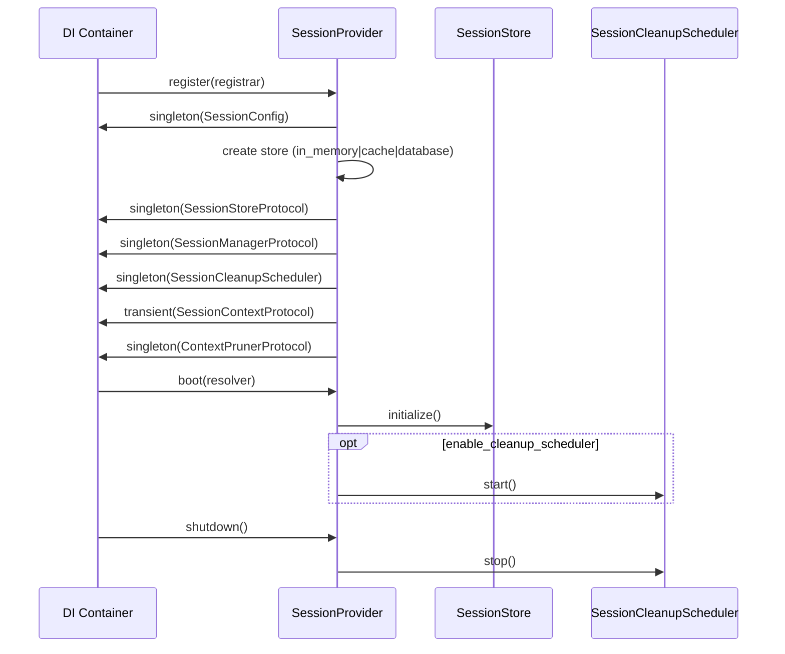

# Architecture

Internal design of the `lexigram-ai-session` package.

---

## Role in the System



`lexigram-ai-session` depends only on `lexigram` and `lexigram-contracts`. All runtime communication with other AI packages flows through protocols resolved via the DI container — never direct imports.

---

## Module Layout

```
src/lexigram/ai/session/
├── __init__.py               # Public API — lazy imports
├── config.py                 # SessionConfig
├── constants.py              # Defaults, env prefix
├── module.py                 # SessionModule (DI module)
├── hooks.py                  # Hook dataclasses
├── types.py                  # SessionId, TurnId, Metadata
├── protocols.py              # Re-exports from contracts
├── state/
│   └── core.py               # SessionStateMachine (FSM)
├── manager/
│   ├── core.py               # SessionManagerImpl
│   └── cleanup.py            # SessionCleanupScheduler
├── stores/
│   ├── in_memory.py          # InMemorySessionStore
│   ├── cache.py              # CacheSessionStore
│   └── database.py           # DatabaseSessionStore
├── context/
│   ├── session_context.py    # SessionContext (ContextVar-backed)
│   └── pruner.py             # RelevanceContextPruner
├── branching/
│   ├── branch_manager.py     # BranchManager
│   └── merge.py              # MergeStrategy implementations
├── checkpointing/
│   ├── checkpoint_manager.py # CheckpointManager
│   └── diff.py               # StateDiff
├── multi_agent/
│   ├── group_session.py      # GroupSession
│   ├── role_isolation.py     # RoleIsolation
│   └── turn_manager.py       # RoundRobinTurnManager, etc.
├── analytics/
│   └── core.py               # SessionAnalytics
├── middleware/
│   └── session_middleware.py # SessionMiddleware
├── services/
├── events.py                 # SessionCreatedEvent, SessionClosedEvent
├── exceptions.py             # SessionError hierarchy
├── decorators.py
└── di/
    └── provider.py           # SessionProvider
```

---

## Session State Machine



Enforced by `SessionStateMachine` in `state/core.py` via a transition table. Invalid transitions raise `SessionTransitionError`.

| From | To | Trigger |
|------|----|---------|
| ACTIVE | SUSPENDED | `session.suspend()` |
| ACTIVE | CLOSED | `session.close()` |
| ACTIVE | EXPIRED | cleanup sweep |
| SUSPENDED | ACTIVE | `session.resume()` |
| SUSPENDED | CLOSED | `session.close()` |
| SUSPENDED | EXPIRED | cleanup sweep |

---

## Session Lifecycle



---

## Store Abstraction

`SessionStoreProtocol` defines the persistence contract. All backends implement the same ten methods for session and checkpoint CRUD plus expiration.

```python
class SessionStoreProtocol(Protocol):
    async def save(self, state: SessionState) -> None: ...
    async def load(self, session_id: str) -> SessionState | None: ...
    async def delete(self, session_id: str) -> None: ...
    async def list_sessions(self, user_id: str) -> list[SessionState]: ...
    async def save_checkpoint(self, checkpoint: SessionCheckpoint) -> None: ...
    async def load_checkpoint(self, checkpoint_id: str) -> SessionCheckpoint | None: ...
    async def list_checkpoints(self, session_id: str) -> list[SessionCheckpoint]: ...
    async def delete_checkpoint(self, checkpoint_id: str) -> None: ...
    async def expire_old_sessions(self, ttl_seconds: int) -> int: ...
```

### Supported Backends

| Backend | Class | Lifetime | Use Case |
|---------|-------|----------|----------|
| `in_memory` | `InMemorySessionStore` | Process | Dev, test, single-process |
| `cache` | `CacheSessionStore` | Configurable | Distributed ephemeral (Redis) |
| `database` | `DatabaseSessionStore` | Persistent | Production durability |

Selected via `SessionConfig.backend`. The provider resolves the implementation during `register()`:

```python
if self._config.backend == "in_memory":
    container.singleton(SessionStoreProtocol, instance=InMemorySessionStore())
elif self._config.backend == "cache":
    container.singleton(SessionStoreProtocol, factory=CacheSessionStore)
elif self._config.backend == "database":
    container.singleton(SessionStoreProtocol, factory=DatabaseSessionStore)
```

---

## Provider Lifecycle



**register()** — If `enabled == False`, no session services are registered. The store backend is selected, then `SessionManagerProtocol`, `SessionCleanupScheduler`, `SessionContextProtocol`, and `ContextPrunerProtocol` are wired.

**boot()** — Resolves the store and calls `initialize()` if exposed. Starts the background cleanup loop if `enable_cleanup_scheduler` is `True`.

**shutdown()** — Stops the cleanup scheduler background loop.

---

## Contracts Used

### From `lexigram.contracts.ai.session`

| Contract | Purpose |
|----------|---------|
| `SessionManagerProtocol` | Session lifecycle: create, resume, suspend, close, add_turn |
| `SessionStoreProtocol` | Persistence: save, load, delete, checkpoint CRUD |
| `SessionContextProtocol` | Per-request session binding via ContextVar |
| `ContextPrunerProtocol` | Relevance-based context window pruning |
| `SessionState` | Immutable value type: status, turns, tokens, cost, metadata |
| `SessionTurn` | Single turn with role, content, tokens, cost |
| `SessionCheckpoint` | Immutable state snapshot for restore/branching |
| `SessionStatus` | Enum: ACTIVE, SUSPENDED, CLOSED, EXPIRED |
| `SessionError` | Base exception in contracts |

### From `lexigram.contracts.ai.memory`

| Contract | Purpose |
|----------|---------|
| `WorkingMemoryProtocol` | Optional turn recording in working memory |

### Exceptions (package-local)

| Exception | When Raised |
|-----------|-------------|
| `SessionNotFoundError` | Session ID not in store |
| `SessionClosedError` | Write on closed session |
| `SessionExpiredError` | Session TTL exceeded |
| `SessionTransitionError` | Invalid state transition |
| `SessionCapacityError` | Per-user or per-session limit hit |
| `CheckpointNotFoundError` | Checkpoint ID not found |

---

## Context Window Management

`SessionContext` provides per-asyncio-task session isolation via `ContextVar`:

```python
token = ctx.bind(state)
try:
    ...
finally:
    ctx.unbind(token)
```

`RelevanceContextPruner` implements `ContextPrunerProtocol` to trim the context window when token limits approach. Custom pruners can implement the same protocol.

---

## Multi-Agent Support

| Component | Role |
|-----------|------|
| `GroupSession` | Multi-agent session with shared history + per-agent isolation |
| `RoleIsolation` | Permissions filter for agent message visibility |
| `TurnManager` | Abstract base for turn-selection strategies |
| `RoundRobinTurnManager` | Equal turns per agent |
| `PriorityTurnManager` | Priority-weighted dispatch |
| `TopicBasedTurnManager` | Topic-routed turn assignment |

The `BranchManager` enables session forking from checkpoints, with merge strategies (`AppendMerge`, `SelectiveMerge`, or custom `MergeStrategy`) to reunify divergent paths.

---

## Event Hooks

```python
@dataclass(frozen=True, kw_only=True)
class SessionStartedHook:        session_id: str
class SessionCheckpointCreatedHook:  session_id: str
class SessionClosedHook:         session_id: str
```

Domain events `SessionCreatedEvent` and `SessionClosedEvent` are published to the `DomainEvent` bus for audit, analytics, and billing.

---

## Extension Points

| Point | Mechanism | Example |
|-------|-----------|---------|
| Session store backend | Implement `SessionStoreProtocol` | Redis Cluster, MongoDB, S3 |
| Context pruner | Implement `ContextPrunerProtocol` | Embedding-similarity, recency-only |
| Merge strategy | Implement `MergeStrategy` | Semantic merge, LLM-directed |
| Turn strategy | Subclass `TurnManager` | LLM-directed turn assignment |
| Session middleware | `SessionMiddleware` for web | Extract session from JWT |
| Event hooks | Subscribe to hook dataclasses | `SessionStartedHook` for audit |
| Memory integration | Pass `WorkingMemoryProtocol` | Episodic memory on each turn |

---

## DI Registration

```python
class SessionProvider(Provider):
    name = "session"
    priority = ProviderPriority.INFRASTRUCTURE

    async def register(self, container):
        container.singleton(SessionConfig, instance=self._config)
        container.singleton(SessionStoreProtocol, ...)
        container.singleton(SessionManagerProtocol, factory=SessionManagerImpl)
        container.singleton(SessionCleanupScheduler, factory=SessionCleanupScheduler)
        container.transient(SessionContextProtocol, factory=SessionContext)
        container.singleton(ContextPrunerProtocol, factory=RelevanceContextPruner)
```

Application modules wire it via `SessionModule.configure()`:

```python
@module(imports=[SessionModule.configure(SessionConfig(backend="cache"))])
class AppModule(Module):
    pass
```

---

## Entry Points

Registered in `pyproject.toml`:

| Entry Point | Target | Discovery By |
|-------------|--------|--------------|
| `lexigram.ai.subsystems` | `SessionProvider` | `lexigram-ai` orchestrator |
| `lexigram.ai.modules` | `SessionModule` | Application DI setup |
