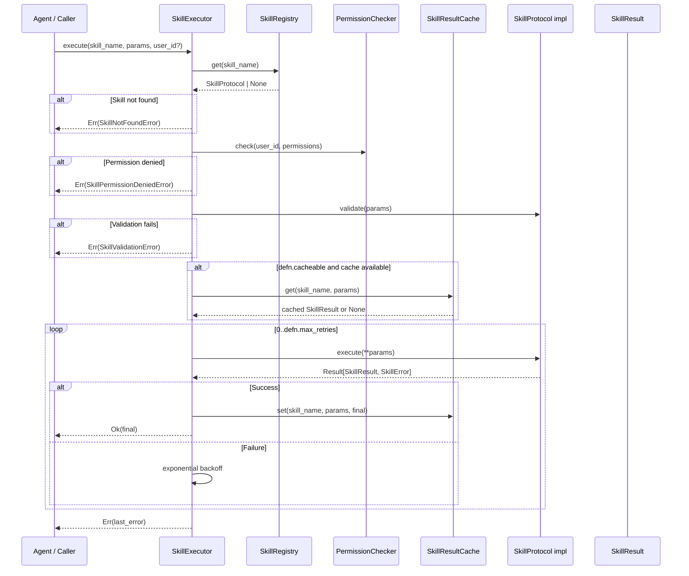
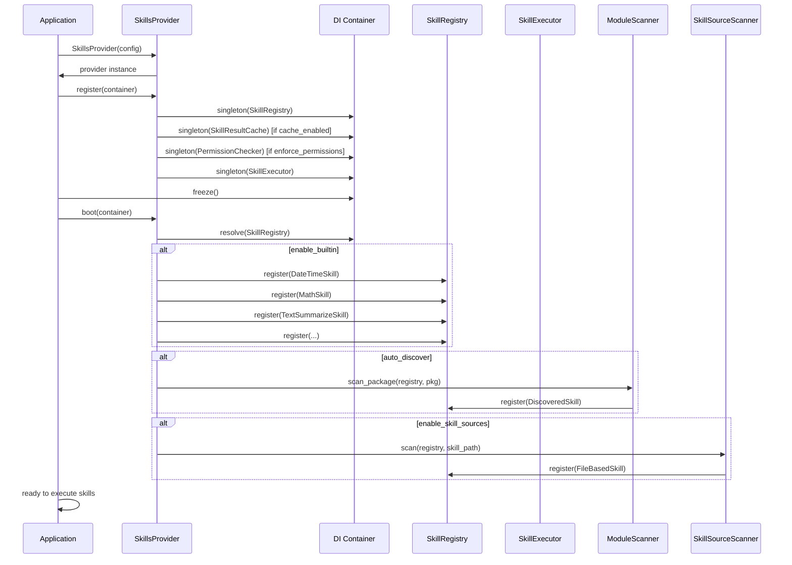

# Architecture

Internal design of the `lexigram-ai-skills` package.

---

## Role in the System

lexigram-ai-skills provides the skill framework for AI capabilities. It defines how skills are declared, registered, discovered, and executed within the Lexigram AI subsystem.

```mermaid
flowchart LR
    subgraph Define[Skill Definition]
        A1[AbstractSkill subclass] --> D[SkillDefinition]
        A2[@skill decorator] --> D
        A3[SKILL.md file] --> D
    end
    subgraph Register[Skill Registry]
        D --> R[SkillRegistry]
        R --> S[SkillRegistryProtocol]
    end
    subgraph Execute[Skill Execution]
        S --> E[SkillExecutor]
        E --> Res[SkillResult]
    end
    subgraph Compose[Composition]
        Chain[SkillChain] --> E
        Pipe[SkillPipeline] --> E
        Parallel[ParallelSkills] --> E
        Router[SkillRouter] --> E
    end
```

Skills enter the system through three paths: class-based (subclass `AbstractSkill`), decorator-based (`@skill` on async functions), or file-based (SKILL.md sources scanned from disk). All converge on `SkillDefinition` metadata and are registered into a `SkillRegistry` before execution.

---

## Skill Model

### SkillDefinition

Frozen dataclass in `lexigram.contracts.ai.skills` that captures a skill's contract:

```python
@dataclass(frozen=True)
class SkillDefinition:
    name: str                              # Unique identifier
    description: str                       # Human-readable purpose
    parameters_schema: dict[str, Any]      # JSON Schema for params
    returns_schema: dict[str, Any]         # JSON Schema for return value
    category: str = "general"              # Logical grouping
    requires_confirmation: bool = False    # User approval gate
    cacheable: bool = False                # Permits result caching
    max_retries: int = 0                   # Retry attempts on failure
    timeout_seconds: float = 30.0          # Execution deadline
    permissions: list[str]                 # Required permission strings
    metadata: dict[str, Any]               # Extension data
```

### SkillResult

```python
@dataclass(frozen=True)
class SkillResult:
    skill_name: str
    success: bool
    output: Any = None
    error: str | None = None
    duration_ms: float = 0.0
    cached: bool = False
    metadata: dict[str, Any]
```

### SkillParameter

```python
@dataclass(frozen=True)
class SkillParameter:
    name: str
    type: str                              # "string", "integer", "boolean", etc.
    description: str
    required: bool = True
    default: Any = None
    enum: list[Any] | None = None
    min_value: float | None = None
    max_value: float | None = None
    max_length: int | None = None
```

### SkillProtocol (contract)

Any object satisfying this protocol is a skill:

```python
class SkillProtocol(Protocol):
    @property
    def definition(self) -> SkillDefinition: ...
    async def execute(self, **kwargs) -> Result[SkillResult, SkillError]: ...
    def validate(self, params: dict[str, Any]) -> list[str]: ...
```

---

## Execution Pipeline



### SkillExecutor

The `SkillExecutor` in `executor/core.py` orchestrates the full lifecycle:

1. **Resolve** — look up the skill by name in the registry
2. **Authorize** — check caller permissions against the skill's required permissions
3. **Validate** — run parameter validation against `parameters_schema`
4. **Cache check** — return cached result if available and eligible
5. **Execute** — invoke `skill.execute(**params)` with `asyncio.wait_for` timeout
6. **Retry** — exponential backoff (`min(2^attempt, 30)s`) on failure
7. **Cache store** — persist result on success if cacheable
8. **Return** — `Ok(SkillResult)` or `Err(SkillError)`

A configurable `asyncio.Semaphore` caps concurrent executions via `max_concurrent_executions`.

---

## Provider Lifecycle



`SkillsProvider` (priority `DOMAIN`) follows the two-phase DI pattern:

| Phase | Input | Action |
|-------|-------|--------|
| `register()` | `ContainerRegistrarProtocol` | Create empty `SkillRegistry`, wire cache and permission checker, bind `SkillExecutor` |
| `boot()` | `ContainerResolverProtocol` | Populate registry: built-in skills from `_BUILTIN_MAP`, auto-discovered `@skill` functions, SKILL.md file sources |
| `shutdown()` | — | No-op (all state is in-process) |
| `health_check()` | timeout | Always `HEALTHY` (no external backend) |

---

## Contracts Used

From `lexigram.contracts.ai.skills`:

| Contract | Kind | Purpose |
|----------|------|---------|
| `SkillProtocol` | Protocol | Interface every skill implements. Requires `definition`, `execute()`, `validate()` |
| `SkillRegistryProtocol` | Protocol | Registration, lookup, listing, and schema export |
| `SkillExecutorProtocol` | Protocol | Execution lifecycle: resolve → authorize → validate → cache → execute → retry |
| `ToolkitProtocol` | Protocol | Grouped skill collections |
| `SkillDefinition` | Value type | Frozen dataclass with name, description, parameter schema, metadata |
| `SkillResult` | Value type | Frozen dataclass with output, error, duration, cache status |
| `SkillParameter` | Value type | Individual parameter descriptor |
| `SkillError` | Base exception | Root exception for skill domain errors |

---

## Module Layout

```
src/lexigram/ai/skills/
├── __init__.py                  # Public API — lazy imports
├── config.py                    # SkillsConfig (execution, caching, discovery)
├── constants.py                 # Defaults, env prefix
├── module.py                    # SkillsModule @module (DI façade)
├── events.py                    # SkillExecutedEvent (domain event)
├── hooks.py                     # SkillExecutedHook, SkillExecutionFailedHook
├── decorators.py                # @skill, @skill_param
├── exceptions.py                # SkillNotFoundError, SkillTimeoutError, etc.
├── protocols.py                 # Re-exports from contracts for consumer convenience
├── types.py                     # (extensible — reserved for local types)
├── base/core.py                 # AbstractSkill, FunctionSkill, SkillToolAdapter, ToolSkillAdapter
├── executor/core.py             # SkillExecutor — full execution lifecycle
├── registry/core.py             # SkillRegistry — central skill catalog
├── caching/skill_cache.py       # SkillResultCache — TTL-backed result cache
├── permissions/permission_checker.py  # PermissionChecker — RBAC for skills
├── validation/
│   ├── schema.py                # JSON Schema validation utilities
│   └── validators.py            # validate_non_empty_string, validate_positive_int, etc.
├── discovery/
│   ├── module_scanner.py        # Auto-discover @skill functions in packages
│   ├── skill_source_scanner.py  # Scan directories for SKILL.md files
│   ├── skill_loader.py          # Load external skill scripts
│   └── mcp_bridge.py            # MCPSkillBridge — MCP tool integration
├── composition/
│   ├── chain.py                 # SkillChain — sequential pipe-through
│   ├── parallel.py              # ParallelSkills — concurrent execution
│   ├── pipeline.py              # SkillPipeline — shared-context enrichment
│   └── router.py                # SkillRouter — condition-based dispatch
├── builtin/                     # Pre-built skills (datetime, math, web search, etc.)
└── di/provider.py               # SkillsProvider — DI registration + boot wiring
```

---

## Composition

Skills can be composed into higher-order execution patterns:

| Pattern | Class | Behavior |
|---------|-------|----------|
| **Chain** | `SkillChain(steps)` | Pipe each skill's output into the next skill's input. Optional key remapping between steps. |
| **Pipeline** | `SkillPipeline()` | Multiple stages enriching a shared mutable context dict. Each stage reads from and writes to the same payload. |
| **Parallel** | `ParallelSkills(skills)` | Concurrent execution with `asyncio.gather`. Returns a combined result. |
| **Router** | `SkillRouter(routes)` | Condition-based dispatch, selecting a skill based on input characteristics. |

---

## Adapter Bridges

Two adapters enable cross-system interop:

| Adapter | Direction | Use Case |
|---------|-----------|----------|
| `ToolSkillAdapter` | `ToolProtocol` → `SkillProtocol` | Wrap agent tools as skills so they appear in skill registries |
| `SkillToolAdapter` | `SkillProtocol` → `ToolProtocol` | Expose skills as tools for agent `ToolRegistry` consumption |

Both preserve the original's behavior while satisfying the target protocol.

---

## Extension Points

| Point | Mechanism | Example |
|-------|-----------|---------|
| New skill type | Implement `SkillProtocol` | Custom AI-powered skill with unique execution logic |
| Function-based skill | `@skill` + `@skill_param` decorators | Quick one-off capabilities |
| Class-based skill | Subclass `AbstractSkill`, define `definition` + `execute` | Complex skills with shared state |
| External skill sources | SKILL.md files in configured `skill_paths` | `.claude/skills/`, `.opencode/skills/` |
| Custom cache backend | Pass `CacheBackendProtocol` to `SkillResultCache` | Redis, Memcached |
| Custom permission store | Implement `PermissionCheckerProtocol` (duck-typed) | OPA, custom RBAC |
| Auto-discovery | Add package to `scan_packages` in config | `scan_packages: ["my_app.skills"]` |
| Composition | Use `SkillChain`, `SkillPipeline`, `ParallelSkills` | Sequential or concurrent processing |
| MCP integration | `MCPSkillBridge` in discovery | Remote skill execution via Model Context Protocol |
| Event hooks | Subscribe to hook dataclasses | `SkillExecutedHook` for audit logging |
| Custom executor | Implement `SkillExecutorProtocol` | Wrap the default executor with custom instrumentation |
