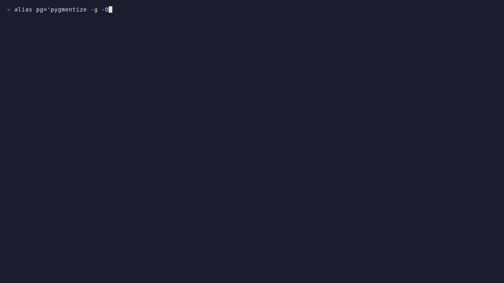

# Give AI a pattern to follow

*Agents, LLMs, RAG, Skills — wired together, no glue code.*

[](https://pypi.org/project/oridecon-ai/)
[](https://pypi.org/project/oridecon-ai/)
[](https://github.com/dbtinoy-/oridecon/blob/main/LICENSE)



`oridecon-ai` is the AI layer of the [oridecon framework](https://oridecon.dev): a thin coordinator that wires the oridecon-ai family — agents, LLMs, RAG, memory, skills, MCP, session, workers, observability, feedback, guard, governance, evaluation, prompt, relay — into the container through entry-point discovery. one install, one `Application.boot`, and the whole family is resolvable by contract. every backend is swappable: run it on your own infra or point it at an API.

- **wired, not glued.** agents, llms, rag, memory — one container, one boot call.
- **async, end to end.** the container, the modules, the controllers — concurrency-safe by construction.
- **contracts everywhere.** every package talks through protocols, so swapping an implementation never ripples.
- **local-first.** defaults point at any OpenAI-compatible server — Ollama, LM Studio, vLLM — hosted providers are a config change away.

→ full docs at [docs.oridecon.dev](https://docs.oridecon.dev)

## install

```bash
uv add "oridecon[ai,web]"    # framework + web + ai + server (what the example below uses)
uv add oridecon-ai           # just the coordinator
pip install "oridecon[ai,web]"
```

## 60 seconds, end to end

```python
from oridecon import Application
from oridecon.web import Controller, get, WebModule
from oridecon.web.server import run_server
from oridecon.ai.llm import LLMModule, ClientConfig
from oridecon.contracts.ai import LLMClientProtocol, ChatMessage, Role


class ChatController(Controller):
    def __init__(self, llm: LLMClientProtocol):
        self.llm = llm

    @get("/chat")
    async def chat(self, q: str) -> dict:
        messages = [ChatMessage(role=Role.USER, content=q)]
        result = await self.llm.complete(messages)
        return {"reply": result.unwrap().content}


app = Application()
app.add_modules(
    [
        # Local-first. To talk to a hosted provider instead, set
        # `provider="openai"` (or "anthropic", "groq", ...) and supply
        # the matching API key.
        LLMModule.configure(
            ClientConfig(
                provider="ollama",
                model="llama3.2",
                api_base="http://localhost:11434",
                api_key="ollama",
            )
        ),
        WebModule.configure(controllers=[ChatController]),
    ]
)

run_server(app, port=8000)
```

→ http://localhost:8000/chat?q=hello
> No API key needed if you're pointing at a local model. To talk to a hosted provider instead, set `provider="openai"` (or `"anthropic"`, `"groq"`, …), drop `api_base`, and supply the matching API key — or let `LLMModule.configure()` read the whole block from `ORI_AI_LLM__*` env vars.

what just happened?

- `Application.boot` assembled two modules — an LLM client and a web server — into one container and started them together.
- `LLMModule.configure(...)` declared a provider, a model, and an endpoint. No SDK, no per-provider code.
- `ChatController` resolved `LLMClientProtocol` by type from the container. Swap the provider; the controller never changes.

```text
oridecon-ai
├── umbrella        entry point · discovers subsystems
├── llm             provider-agnostic clients
├── agents          tools, react, and beyond
├── rag             chunkers, embedders, retrieval pipelines
├── memory          working, episodic, semantic stores
├── skills          versioned agent capabilities
├── session         conversation state and resumption
├── mcp             model-context-protocol clients
├── workers         background AI jobs
├── observability   tracing and metrics
├── feedback        quality loops
├── guard           input/output safety gates
├── governance      policy, audit, budgets
├── evaluation      evals and quality gates
├── prompt          versioned prompt templates
├── relay           protocol conversion engine
└── relay-gateway   HTTP gateway for relay
```

## what's in the box

the whole family lives in this repository under [`experimental/ai/`](../../../experimental/ai/) — experimental tier, API stability is not guaranteed between releases. same container, same contracts, same rules as the stable core.

- **`oridecon-ai`** — the coordinator (this package)
- **`oridecon-ai-llm`** — provider-agnostic clients for Ollama, OpenAI, Anthropic, Groq, Mistral, and more
- **`oridecon-ai-agents`** — tools, react, and beyond
- **`oridecon-ai-rag`** — chunkers, embedders, retrieval pipelines
- **`oridecon-ai-memory`** — working, episodic, semantic stores
- **`oridecon-ai-skills`** — versioned agent capabilities
- **`oridecon-ai-session`** — conversation state and resumption
- **`oridecon-ai-mcp`** — model-context-protocol clients
- **`oridecon-ai-workers`** — background AI jobs
- **`oridecon-ai-observability`** — tracing and metrics
- **`oridecon-ai-feedback`** — quality loops
- **`oridecon-ai-guard`** — input/output safety gates
- **`oridecon-ai-governance`** — policy, audit, budgets
- **`oridecon-ai-evaluation`** — evals and quality gates
- **`oridecon-ai-prompt`** — versioned prompt templates
- **`oridecon-ai-relay`** — protocol conversion engine
- **`oridecon-ai-relay-gateway`** — HTTP gateway for relay

## early on purpose

The AI layer is in 0.1 — which means you can still change it. APIs may shift before 1.0, so pin your versions, and tell us what feels wrong. Shaping a framework is more fun when it's still soft.

## pointers

- full docs → [docs.oridecon.dev](https://docs.oridecon.dev)
- the stable core → [oridecon](https://github.com/dbtinoy-/oridecon)
- the AI family → [experimental/ai](../../../experimental/ai/) in this repository