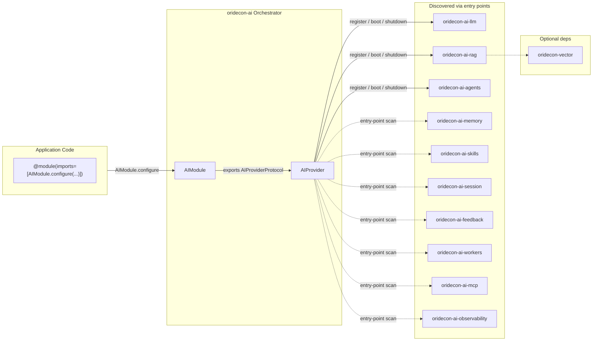
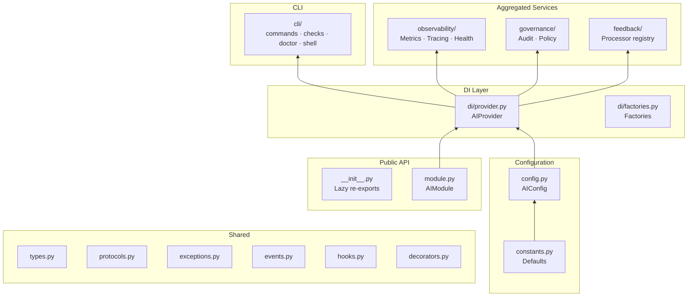
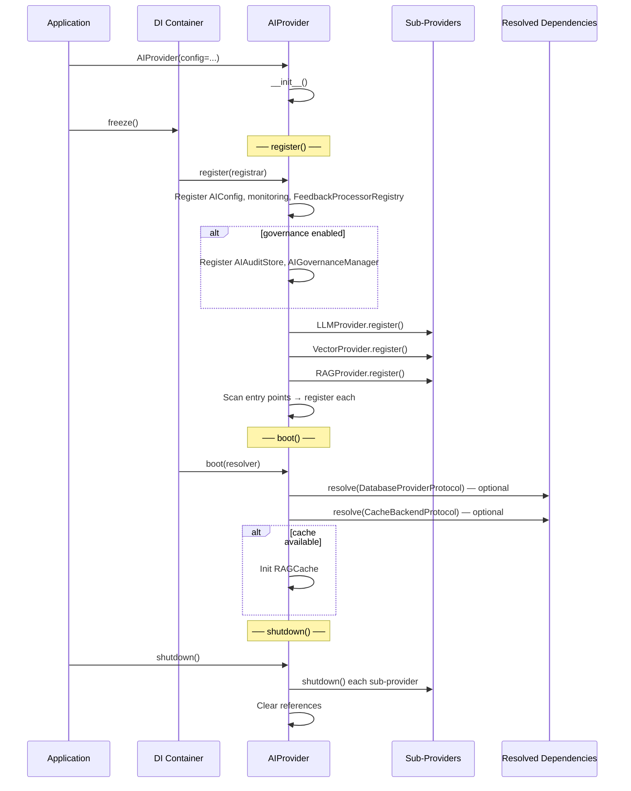
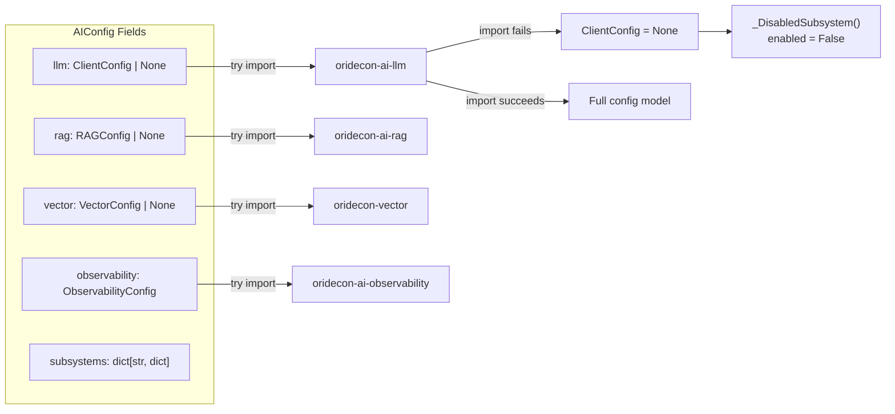

# Architecture

Internal design of the `oridecon-ai` package — the AI orchestrator for the Oridecon Framework.

---

## Role in the System

`oridecon-ai` is an **optional orchestrator** that discovers and coordinates AI sub-packages via Python entry points. It does not implement LLM clients, RAG pipelines, or agent strategies — it registers, wires, and monitors them.



**Key constraint:** Sub-packages import **only** from `oridecon` and `oridecon-contracts`. They never import from `oridecon-ai` or from each other. Cross-package communication goes through contracts resolved via the DI container.

---

## Subsystem Discovery

`oridecon-ai` discovers sub-packages through two entry-point groups:

| Entry Point Group | Purpose | Loaded By |
|---|---|---|
| `oridecon.ai.subsystems` | Runtime discovery at `AIProvider.register()` | `AIProvider.register()` |
| `oridecon.ai.modules` | Test-time only — `AIModule.stub()` | `AIModule.stub()` |

### Discovery Flow

```mermaid
flowchart TD
    subgraph Registration[AIProvider.register]
        EP[Scan oridecon.ai.subsystems groups] --> FILTER{name in}
        FILTER -->|llm / vector / rag| EXPLICIT["Wire with config injection"]
        FILTER -->|other| DYNAMIC["Load & call .register(container)"]
        EXPLICIT --> LLM["LLMProvider.register(container)"]
        EXPLICIT --> VEC["VectorProvider.register(container)"]
        EXPLICIT --> RAG["RAGProvider.register(container)"]
    end

    subgraph EP_Contract[Sub-package declares]
        TOML[pyproject.toml] -->|entry-points.oridecon.ai.subsystems| EP
    end

    TOML -->|example| EG[
        "[project.entry-points.&quot;oridecon.ai.subsystems&quot;]"
        "agents = &quot;oridecon.ai.agents.di.provider:AgentsProvider&quot;"
    ]
```

The three core subsystems (LLM, Vector, RAG) are handled explicitly with config injection (`provider.py:210-231`). All others enter a dynamic loop (`provider.py:254-274`) that loads the provider class and calls `register()`, passing config from a lookup dict keyed by entry-point name.

---

## Architecture Overview

### Module Layer

`AIModule` is the public entry point — a `@module()`-decorated class whose `configure()` returns a `DynamicModule` registering `AIProvider` and exporting `AIProviderProtocol`. Consumers pass the result to their own `@module(imports=[...])`.

### Internal Architecture



### Source mapping

| Path | Purpose |
|---|---|
| `oridecon/ai/__init__.py` | Lazy re-exports (`AIConfig`, `AIModule`, `AIProvider`) |
| `oridecon/ai/module.py` | `AIModule` — `@module()` entry point |
| `oridecon/ai/di/provider.py` | `AIProvider` orchestrator |
| `oridecon/ai/di/factories.py` | Reserved factory functions |
| `oridecon/ai/config.py` | `AIConfig` with try/except optional imports |
| `oridecon/ai/constants.py` | `ENV_PREFIX`, default limits, version |
| `oridecon/ai/types.py` | `AIBaseEvent`, contracts re-exports |
| `oridecon/ai/exceptions.py` | `AIError` (package base, code `ORI_ERR_AI_005`) |
| `oridecon/ai/observability/` | Health, Metrics, Tracing, CallbackManager |
| `oridecon/ai/governance/` | Audit store, policy manager, persistence backends |
| `oridecon/ai/feedback/` | `FeedbackProcessorRegistry` |
| `oridecon/ai/cli/` | Commands, health checks, doctor, shell |

---

## Provider Lifecycle

`AIProvider` follows the standard Oridecon three-phase lifecycle:

```python
class AIProvider(Provider, AIProviderProtocol):
    name = "ai"
    priority = ProviderPriority.DOMAIN       # 50
    config_key: str | None = "ai"
    config_model: type | None = AIConfig
    optional_dependencies: tuple[str, ...] = ("db", "cache")
```



### Phase details

| Phase | Method | Receives | Actions |
|---|---|---|---|
| Registration | `register(container)` | `ContainerRegistrarProtocol` | Registers config, monitoring, governance singletons; delegates to sub-providers; discovers entry-point subsystems |
| Boot | `boot(container)` | `ContainerResolverProtocol` | Resolves optional `DatabaseProviderProtocol` and `CacheBackendProtocol`; inits `RAGCache` |
| Shutdown | `shutdown()` | — | Calls `shutdown()` on each sub-provider; clears references |

Sub-providers run their lifecycle during `AIProvider.register()` — they do **not** get independent lifecycle phases. `AIProvider.boot()` resolves cross-cutting dependencies; `AIProvider.shutdown()` iterates sub-providers for cleanup.

### Health check

`health_check()` aggregates sub-provider health into a `HealthCheckResult` with per-component latency, delegating to each sub-provider's own `health_check()` method.

---

## Config Model

`AIConfig` uses try/except imports so missing sub-packages degrade gracefully:



When a sub-package is not installed, its config field becomes `_DisabledSubsystem()` — a falsy sentinel returning `None` for all attribute access. The provider gates sub-provider delegation on `if intelligence_config.llm:`.

---

## Contracts Used

| Contract | Source | Bound By |
|---|---|---|
| `AIProviderProtocol` | `oridecon.contracts.ai` | `AIProvider` |
| `LLMClientProtocol` | `oridecon.contracts.ai.llm` | Delegated to `oridecon-ai-llm` |
| `VectorStoreProtocol` | `oridecon.contracts.data.vector` | Delegated to `oridecon-vector` |
| `RAGPipelineProtocol` | `oridecon.contracts.ai.rag` | Delegated to `oridecon-ai-rag` |
| `CacheBackendProtocol` | `oridecon.contracts.cache` | Resolved at `boot()` — optional |
| `DatabaseProviderProtocol` | `oridecon.contracts.data` | Resolved at `boot()` — optional |
| `CallbackManagerProtocol` | `oridecon.contracts.ai.callbacks` | `CallbackManagerImpl` |
| `AIHealthMonitorProtocol` | `oridecon.contracts.ai.observability` | `AIHealthMonitor` |
| `AIMetricsProtocol` | `oridecon.contracts.ai.observability` | `AIMetrics` |
| `AITracerProtocol` | `oridecon.contracts.ai.observability` | `AITracer` |
| `AgentExecutorProtocol` | `oridecon.contracts.agents` | Delegated to `oridecon-ai-agents` |
| `SessionManagerProtocol` | `oridecon.contracts.ai.session` | Delegated to `oridecon-ai-session` |
| `MemoryStoreProtocol` | `oridecon.contracts.ai.memory` | Delegated to `oridecon-ai-memory` |
| `SkillRegistryProtocol` | `oridecon.contracts.ai.skills` | Delegated to `oridecon-ai-skills` |
| `FeedbackProtocol` | `oridecon.contracts.ai.feedback` | Delegated to `oridecon-ai-feedback` |

---

## CLI Integration

`AICliContributor` registers with the `oridecon` CLI framework:

| Contribution | Description |
|---|---|
| `ai` command group | `oridecon ai ...` — subsystem management |
| `ai_llm_provider` health check | Verifies LLM provider reachable |
| `ai_subsystem_discovery` health check | Verifies entry-point discovery works |
| `ai_api_keys_configured` doctor check | Checks AI API keys are configured |
| `ai` shell context | Interactive AI client for REPL |

---

## Extension Points

| Point | Mechanism | Example |
|---|---|---|
| New AI subsystem | `oridecon.ai.subsystems` entry point | `agents = "oridecon.ai.agents.di.provider:AgentsProvider"` |
| New LLM provider | Register in `oridecon-ai-llm`'s `ProviderRegistry` | `ProviderRegistry.register("openai", OpenAIProvider)` |
| New RAG chunking strategy | `oridecon.chunking.strategies` entry point | `semantic = "..."` |
| New agent strategy | `oridecon.agent.strategies` entry point | `react = "..."` |
| Feedback processor | `FeedbackProcessorRegistry.register()` | `processor_registry.register("sentiment", ...)` |
| Governance backend | Implement persistence for `AIGovernanceManager` | `DatabaseGovernancePersistence` |
| Observability extension | Implement `AITracerProtocol` / `AIMetricsProtocol` | Custom tracing backend |

To add a new subsystem: create a provider with `register()`/`boot()`/`shutdown()`, declare the `oridecon.ai.subsystems` entry point in `pyproject.toml`, and configuration flows through `AIConfig.subsystems[name]`. If the subsystem exposes a protocol consumed by other packages, the protocol **must** live in `oridecon-contracts`.

---

## Constants

| Symbol | Value | Description |
|---|---|---|
| `ENV_PREFIX` | `ORI_AI__` | Env var prefix for AI config |
| `ENV_NESTED_DELIMITER` | `__` | Nested key delimiter for env vars |
| `DEFAULT_MAX_TOKENS` | `4096` | Default max tokens per completion |
| `DEFAULT_TEMPERATURE` | `0.7` | Default temperature |
| `DEFAULT_REQUEST_TIMEOUT_S` | `60` | Default request timeout |
| `DEFAULT_CONTEXT_WINDOW_MESSAGES` | `50` | Max messages in context |
| `__version__` | `0.1.1` | Package version |
