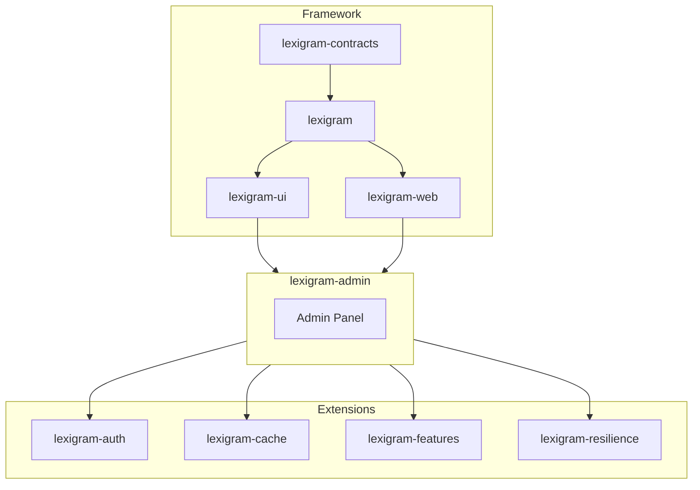
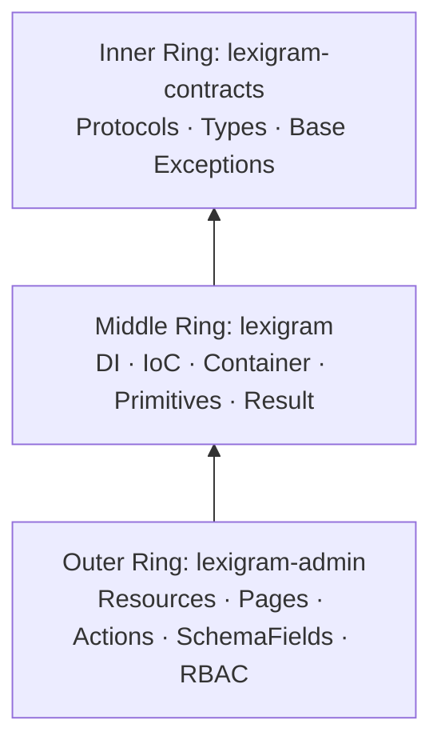
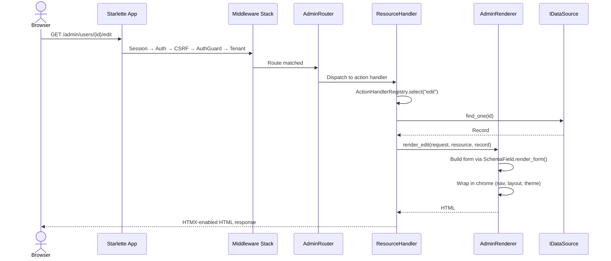
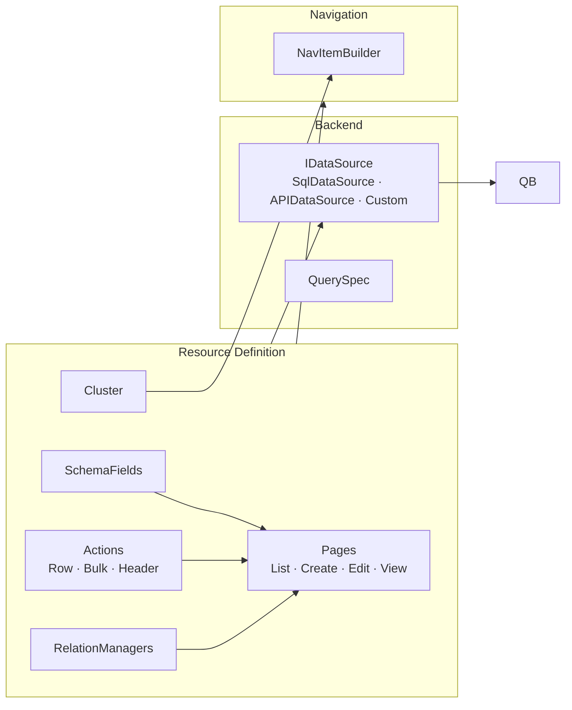
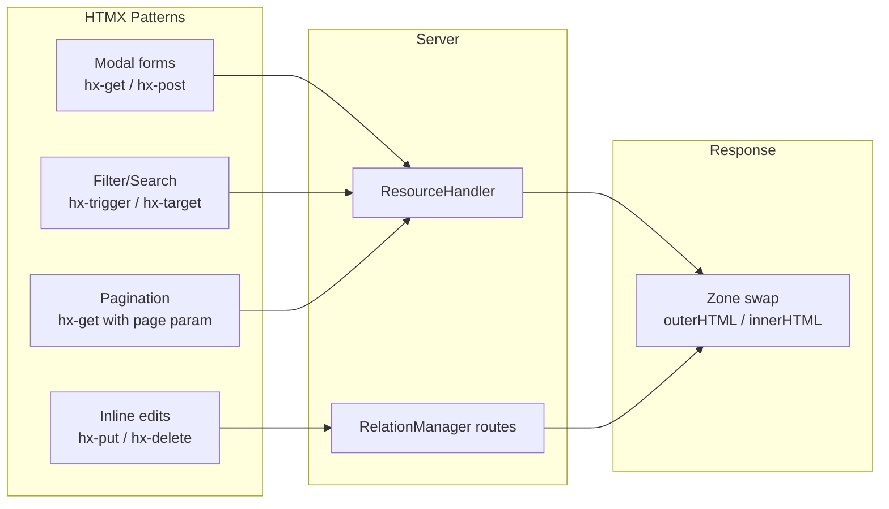
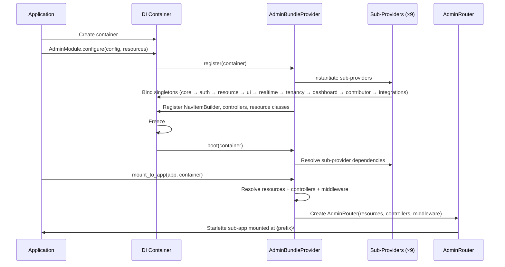

# Architecture

Internal design of the `lexigram-admin` package and its role in the Lexigram framework.

---

## Role in the System

`lexigram-admin` is an async-first admin panel framework with declarative Resource definitions, CRUD routing, HTMX-driven interactions, RBAC, and a contributor system for extension packages.



**Import exceptions** (documented in AGENTS.md §1.2): `lexigram-admin` may import directly from `lexigram-ui`, `lexigram-web`, `lexigram-auth`, `lexigram-cache`, `lexigram-features`, and `lexigram-resilience`. These are declared as explicit `pyproject.toml` dependencies.

---

## Three-Ring Model



| Ring | Package | What It Provides |
|------|---------|-----------------|
| Inner | `lexigram-contracts` | Protocols, value types, base exceptions (`LexigramError`, `ProviderPriority`). Zero dependencies. |
| Middle | `lexigram` | DI container, IoC provider pattern, primitives (clock, identity), `Result[T, E]`, logging. |
| Outer | `lexigram-admin` | Admin panel abstractions — Resource, SchemaField, Action, Page, Cluster, RelationManager, IDataSource. None hoisted to contracts — they reference admin-domain types. |

---

## Request Lifecycle



**Middleware stack** (inner → outer execution order):

| Middleware | Purpose |
|-----------|---------|
| `AdminErrorMiddleware` | Error handler for admin-specific HTTP errors |
| `AdminAuthorizationMiddleware` | RBAC enforcement at request entry |
| `AdminAuthMiddleware` | Loads user from session into `request.state.user` |
| `AdminAuthGuardMiddleware` | Redirects unauthenticated requests to login |
| `AdminCsrfMiddleware` | CSRF token validation |
| `SetupMiddleware` | First-run wizard redirect |
| `AdminTenantMiddleware` | Multi-tenant isolation (when enabled) |

---

## Resource System

The core abstraction — a single class defines a model-backed admin entity with fields, actions, pages, permissions, navigation grouping, and relations.



```python
class UserResource(Resource):
    model = User
    name = "users"
    cluster = "content"
    icon = "users"
    fields = [
        TextField("name").required(),
        EmailField("email").required(),
        BooleanField("is_active"),
    ]
    actions = [EditAction(), DeleteAction()]
    relations = [UserPostsRelationManager]
```

| Attribute | Type | Purpose |
|-----------|------|---------|
| `model` | `type[DomainModel] \| None` | Domain model this resource represents |
| `name` | `str \| None` | URL-safe identifier; auto-derived from class name |
| `cluster` | `str \| None` | Navigation grouping key (references `Cluster.name`) |
| `fields` | `list[SchemaField]` | Declarative field definitions |
| `actions` | `list[Action]` | Row-level actions |
| `bulk_actions` | `list[BulkAction]` | Selection-driven bulk actions |
| `relations` | `list[type[RelationManager]]` | Related-record managers on ViewPage |
| `pages` | `list[type[Page]]` | Page classes (defaults: List, Create, Edit, View) |
| `permissions` | `ResourcePermissions \| None` | RBAC permissions for this resource |
| `_data_source` | `IDataSource \| None` | Data backend set at runtime via `set_data_source()` |

**Lifecycle hooks:** `before_create` / `after_create`, `before_update` / `after_update`, `before_delete` / `after_delete`, `before_clone` / `after_clone`, `before_restore` / `after_restore`, `before_purge` / `after_purge`.

### Built-in Pages

| Page | Path | Purpose |
|------|------|---------|
| `ListPage` | `/{resource}` | Table with filters, search, pagination, bulk actions |
| `CreatePage` | `/{resource}/create` | Form for a new record |
| `EditPage` | `/{resource}/{id}/edit` | Form pre-filled with existing record |
| `ViewPage` | `/{resource}/{id}` | Read-only detail view with relation managers |

### Route Registration

| Path | Methods | Handler Mode |
|------|---------|-------------|
| `/{name}` | GET | `list` |
| `/{name}/create` | GET, POST | `create` |
| `/{name}/{id}` | GET | `detail` |
| `/{name}/{id}/edit` | GET, POST | `edit` |
| `/{name}/{id}/clone` | GET | `clone` |
| `/{name}/{id}/delete` | DELETE, POST | `delete` |
| `/{name}/bulk` | POST | `bulk` |

Plus six HTMX routes per relation manager (list, create form, create, edit form, update, delete).

---

## SchemaField System

One field class renders in three contexts — form input, table column, and filter widget.

```mermaid
flowchart LR
    subgraph Field[SchemaField[T]<br/>frozen dataclass]
        F[name · label · help_text<br/>required · readonly · sortable · searchable]
    end
    Field --> Form[render_form()<br/>→ Element]
    Field --> Column[render_column()<br/>→ Element]
    Field --> Filter[render_filter()<br/>→ Element | None]
    Field --> Coerce[from_form(str) → Result[T, FieldError]<br/>to_form(T) → str]
```

| Method | Signature | Context |
|--------|-----------|---------|
| `render_form()` | `(value: T \| None, *, errors) -> Element` | Form input on Create/Edit pages |
| `render_column()` | `(record: Any, value: T \| None) -> Element` | Table cell on ListPage |
| `render_filter()` | `(current_value: Any \| None = None) -> Element \| None` | Filter widget in sidebar |

**Subclass hierarchy (~30 types):**

```
SchemaField (abstract, Generic[T])
├── TextField (str) — EmailField, PasswordField, URLField
├── TextAreaField (str) — MarkdownField, RichTextField
├── NumberField (int | float) — IntegerField, FloatField, CurrencyField
├── BooleanField (bool) — ToggleField
├── DateField (date) — DateTimeField, TimeField
├── SelectField (T from fixed set) — EnumField, MultiSelectField, RadioField
├── RelationField (related record ID) — BelongsToField, HasManyField, MorphField
├── JsonField (dict | list)
├── FileField (UploadedFile) — ImageField, AvatarField
├── ColorField (str hex), RatingField (int 1-5), TagsField (list[str]), KeyValueField, HiddenField
```

---

## Action System

Stateful work units against a record, a selection, or no record.

```mermaid
flowchart LR
    Action[Action[R, Outcome]<br/>frozen dataclass]
    Action --> Row[RowAction[Any, Any]<br/>Single record]
    Action --> Bulk[BulkAction[list[Any], Any]<br/>Selection of records]
    Action --> Header[HeaderAction[None, Any]<br/>No record context]

    Row --> |execute()| Result[Result[Outcome, ActionError]]
    Bulk --> |execute()| Result
    Header --> |execute()| Result
```

| Hook | Purpose |
|------|---------|
| `execute()` | **Abstract.** The business logic. Returns `Result[Outcome, ActionError]`. |
| `visible_for()` | Visibility predicate; defaults to `True`. |
| `authorize()` | Auth check; defaults to `Ok(None)`. Returns `Result[None, PermissionDenied]`. |
| `form()` | Optional parameter-collection form; defaults to `None`. |
| `confirm()` | Optional confirmation dialog config; defaults to `None`. |
| `render_button()` | Button rendering; default delegates to `ActionButton`. |

**Visual variants:** `ActionColor` enum — `GRAY`, `PRIMARY`, `SUCCESS`, `WARNING`, `DANGER`, `INFO`.

---

## HTMX Integration



**RelationManager HTMX inline-edit cycle:**

| User action | Request | Server response |
|---|---|---|
| Click "Add" | `GET /admin/{r}/{id}/relations/{rel}/new` | Create form rendered into relation panel |
| Submit | `POST /admin/{r}/{id}/relations/{rel}` | Creates record; returns updated panel |
| Click row "Edit" | `GET /admin/{r}/{id}/relations/{rel}/{rid}/edit` | Replace row with edit form |
| Submit edit | `PUT /admin/{r}/{id}/relations/{rel}/{rid}` | Updates; replaces form with display row |
| Click "Delete" | `DELETE /admin/{r}/{id}/relations/{rel}/{rid}` | Removes the row |

All swaps use `hx-swap="outerHTML"` targeted at the row or relation panel zone.

---

## Provider Lifecycle



### Sub-Provider Architecture

`AdminBundleProvider` orchestrates nine focused sub-providers:

| Sub-Provider | Responsibility |
|---|---|
| `AdminCoreSubProvider` | Core admin services, renderer, config |
| `AdminAuthSubProvider` | Auth integration, login/logout, session |
| `AdminResourceSubProvider` | Resource registration and resolution |
| `AdminUISubProvider` | UI components, theme, layout |
| `AdminRealtimeSubProvider` | Server-sent events, WebSocket |
| `AdminTenancySubProvider` | Multi-tenant data isolation |
| `AdminDashboardSubProvider` | Dashboard widgets, homepage |
| `AdminContributorSubProvider` | Extension registration |
| `AdminIntegrationsSubProvider` | Cache, search, resilience integration specs |

---

## Contracts Used

| Protocol | Location | Purpose |
|----------|----------|---------|
| `IDataSource[T]` | `lexigram-admin.data.data_source` | Data access contract every Resource backend satisfies. `@runtime_checkable`. |
| `AdminContributorRegistryProtocol` | `lexigram.contracts.admin.protocols` | Extension point for resources, pages, widgets, navigation |
| `AdminAuthorizerProtocol` | `lexigram.contracts.admin.authorizer` | RBAC authorization service |
| `AdminContributorProtocol` | `lexigram.contracts.admin.protocols` | Contributor surface for features |
| `AdminUserStoreProtocol` | `admin/auth/store/protocols.py` | User store for admin authentication |
| `AdminCsrfServiceProtocol` | `admin/auth/protocols.py` | CSRF token service |
| `AdminSessionServiceProtocol` | `admin/auth/protocols.py` | Session management |

All admin-specific protocols live within `lexigram-admin` or `lexigram.contracts.admin`. They are not hoisted to top-level contracts because they reference admin-domain types (`AdminUser`, `AdminRequest`, `Permission`, `Zone`, `Cluster`).

---

## Security / RBAC

Permission predicates at Resource, Page, and Action level via `ResourcePermissions` (CRUD role sets, field-level visibility, action-level permissions).

| Layer | Enforcement | Mechanism |
|-------|------------|-----------|
| Route | `AdminAuthorizationMiddleware` | Resolves `AdminAuthorizerProtocol` |
| Resource | `ResourcePermissions` on class | CRUD role sets, field-level `FieldPermission` |
| Action | `action.authorize()` | `Result[None, PermissionDenied]` |
| Action | `action.visible_for()` | Boolean visibility predicate |
| Relation | `can_create/edit/delete/detach` | `Result[None, PermissionDeniedError]` |

---

## Exception / Result Doctrine

| Scenario | Mechanism |
|----------|-----------|
| Expected, recoverable domain failures | `Result[T, E]` with specific error type |
| Infrastructure failures | Raise exceptions |
| Action execution | `Result[Outcome, ActionError]` |
| Authorization | `Result[None, PermissionDenied]` or raise `PermissionDeniedError` |
| Data access | `Result[T, DataError]` from `IDataSource` |
| Form coercion | `Result[T \| None, FieldError]` from `SchemaField.from_form()` |

**Prohibited:** Blind `result.unwrap()`, wrapping infra exceptions in `Result`, `Any` as error type.

**Exception hierarchy:** `LexigramError` → `DomainError` (NotFound, PermissionDenied, Conflict, Data, Notification) / `AdminError` (ActionError, AdminDataError) / `ValidationError` (AdminValidationError). `FieldError(Exception)` — used as Result error type, not exception flow.

---

## IDataSource Protocol

```python
@runtime_checkable
class IDataSource(Protocol[T]):
    async def find_one(self, item_id: Any) -> T | None: ...
    async def find_many(self, query: QuerySpec) -> QueryResult[T]: ...
    async def count(self, query: QuerySpec) -> int: ...
    async def create(self, data: dict[str, Any]) -> T: ...
    async def update(self, item_id: Any, data: dict[str, Any]) -> T: ...
    async def delete(self, item_id: Any) -> bool: ...
    async def bulk_create(self, items: list[dict]) -> list[T]: ...
    async def bulk_update(self, ids: list[Any], data: dict) -> int: ...
    async def bulk_delete(self, ids: list[Any]) -> int: ...
```

**Built-in implementations:** `SqlDataSource[T]` (SQL via `DatabaseProviderProtocol`), `DataSourceBase[T]` (ABC for custom implementations), `APIDataSource[T]` (external HTTP API).

---

## Extension Points

| Point | Mechanism |
|-------|-----------|
| Custom resource | Subclass `Resource`, define fields/actions/pages |
| Custom field | Subclass `SchemaField[T]`, implement `render_form()` + `render_column()` |
| Custom action | Subclass `RowAction` / `BulkAction` / `HeaderAction`, override `execute()` |
| Custom page | Subclass `Page`, implement `view()`. Register via contributor or `AdminBuilder.page()` |
| Contributor system | Subclass `BaseAdminContributor`, override `get_resources()`, `get_dashboard_widgets()`, `get_navigation_items()`, etc. |
| Dashboard widgets | `DashboardWidgetDefinition` registered via contributor |
| Custom data source | Implement `IDataSource[T]` protocol, attach via `Resource.set_data_source()` |
| Navigation entries | `NavigationContribution` via contributor or `Cluster` on Resource |
| Controller | Implement a Starlette `HTTPEndpoint` with `get_routes()`, pass to `AdminModule.configure(controllers=...)` |

Contributors override methods: `get_resources()`, `get_dashboard_widgets()`, `get_navigation_items()`, `get_health_definitions()`, `get_management_pages()`, `get_settings_panels()`, `get_actions()`, `get_routes()` — all return empty sequences by default. Collision mode via `AdminConfig.contributor_collision_mode` (`"warn"` | `"error"`).

---

## DI Registration

```python
# lexigram/admin/di/bundle_provider.py
class AdminBundleProvider(Provider):
    name = "admin"
    priority = ProviderPriority.APPLICATION

    async def register(self, container: ContainerRegistrarProtocol) -> None:
        container.singleton(AdminBundleProvider, self)
        container.singleton("admin_bundle", self)
        container.singleton(NavItemBuilder, nav_item_builder)
        container.singleton(WidgetController, WidgetController)
        container.singleton(DashboardController, DashboardController)
        for sp in self._sub_providers:
            await sp.register(container)

    async def boot(self, container: ContainerResolverProtocol) -> None:
        for sp in self._sub_providers:
            await sp.boot(container)

    async def mount_to_app(self, app, container) -> None:
        # Resolve resources, controllers, middleware
        # Build AdminRouter → Starlette sub-app → mount on app
        ...

# Usage:
AdminModule.configure(config=admin_config, resources=[UserResource])
```

---

## File Layout

```
experimental/apps/lexigram-admin/src/lexigram/admin/
├── __init__.py              # Public API exports
├── module.py                # AdminModule (DI entry point)
├── config.py                # AdminConfig
├── exceptions.py            # Exception hierarchy
├── constants.py             # Constants
├── actions/                 # Action, RowAction, BulkAction, HeaderAction
├── clusters/                # Cluster dataclass
├── core/routing.py          # AdminRouter, route builder
├── data/                    # IDataSource, QueryResult, SqlDataSource
├── di/
│   ├── bundle_provider.py   # AdminBundleProvider
│   └── sub_providers/       # 9 sub-providers
├── pages/                   # Page ABC, resource_pages (List/Create/Edit/View)
├── relations/               # RelationManager, HTMX inline CRUD routes
├── resources/               # Resource, ResourceHandler, renderers
├── schema/                  # SchemaField ABC + ~30 field types
├── rbac/                    # Permissions, authorization service
├── auth/                    # Auth protocols, user store, session
├── contributors/            # BaseAdminContributor, registry
├── controllers/             # WidgetController, DashboardController, etc.
├── middleware/               # Auth, CSRF, tenant, error, setup middleware
├── navigation/              # NavItemBuilder
├── engine/                  # AdminRenderer (HTML composition)
├── dashboard/               # Widget definitions
├── realtime/                # SSE event hub
├── services/                # Settings, search services
└── integrations/            # Cache, search, resilience wrappers
```
