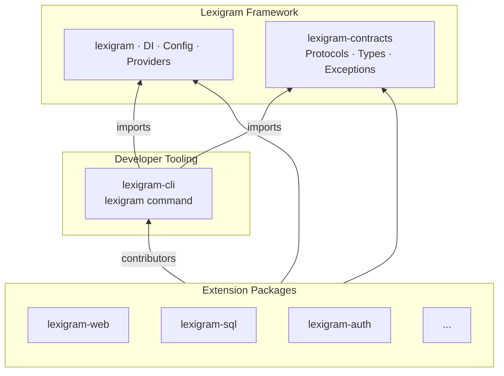
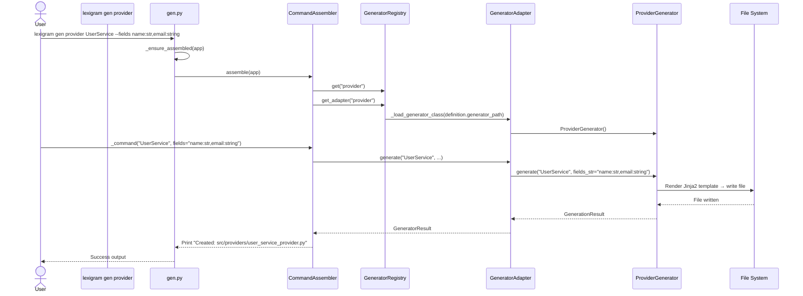
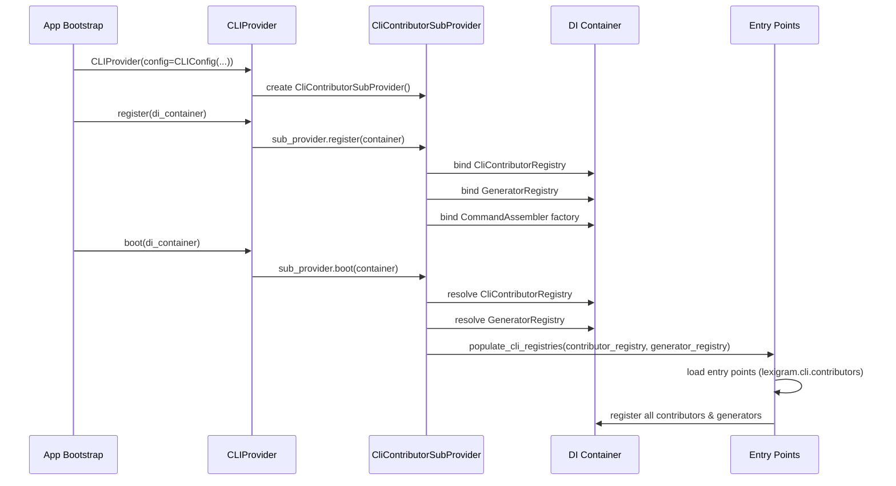
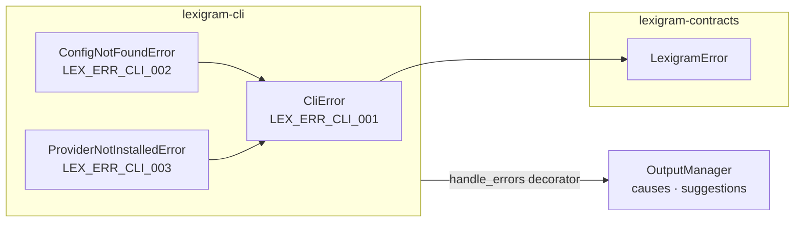

# Architecture

Internal design of the `lexigram-cli` package.

---

## Role in the System

`lexigram-cli` is the framework's command-line interface layer — a single
`lexigram` binary that provides project scaffolding, code generation,
database management, dev server control, and runtime inspection. It sits
above the core framework and consumes contracts, never the reverse.



**Dependency direction:** `lexigram-cli` imports from `lexigram` and
`lexigram-contracts`. Extension packages register CLI surfaces via the
`lexigram.cli.contributors` entry point — they contribute generators,
commands, health checks, and hooks without `lexigram-cli` importing them
directly.

---

## Command Architecture

Every CLI command is a Typer sub-app grouped under the root `lexigram`
Typer application. The root is defined in `runtime/main.py` and each
command group lives in its own module under `commands/`.

```mermaid
flowchart LR
    subgraph Root[lexigram root]
        CB[callback &#40;global flags&#41;]
    end

    subgraph Groups[Typer Sub-apps]
        INIT[init]
        NEW[new]
        ADD[add]
        DEV[dev]
        RUN[run]
        DB[db]
        EVENTS[events]
        GEN[gen]
        CONFIG[config]
        INSPECT[inspect]
        SHELL[shell]
        CONTRIB[contrib]
        PROJECT[project]
        SYSTEM[system]
    end

    subgraph Meta[Inline Commands]
        VER[version]
        COM[completion]
        LIST[list]
        TESTCMD[test]
        LINTCMD[lint]
    end

    subgraph Contributed[Dynamic — via entry points]
        EXTRA[... additional sub-apps ...]
    end

    Root --> Groups
    Root --> Meta
    Root --> Contributed
```



### Built-in command groups (15 groups)

| Group | File | Purpose |
|-------|------|---------|
| `init` | `commands/init.py` | Initialize `application.yaml` in existing project |
| `new` | `commands/new.py` | Scaffold new project or extension package (`new project`, `new package`) |
| `add` | `commands/add.py` | Add a provider (`lexigram-sql`, `lexigram-auth`, etc.) |
| `dev` | `commands/dev.py` | Start ASGI dev server with hot reload (`dev start`) |
| `run` | `commands/run.py` | Smart runner — auto-detects factory, launches production server |
| `db` | `commands/db.py` | Database management (migrations, shell, backup, restore) |
| `events` | `commands/events.py` | Event schema migration and status |
| `gen` | `commands/gen.py` | Code generation — assembled from contributors at import time |
| `config` | `commands/config.py` | Configuration show, validate, diff, env, doctor |
| `inspect` | `commands/inspect.py` | Runtime introspection (providers, routes, container, etc.) |
| `shell` | `commands/shell.py` | Interactive Python REPL with app context |
| `contrib` | `commands/contrib.py` | Discover and inspect installed CLI contributors |
| `project` | `commands/project.py` | Test, lint, typecheck runner dispatch |
| `system` | `commands/system.py` | System info, health check, doctor |
| `meta` | `runtime/main.py` (inline) | `version`, `completion`, `list`, `test`, `lint` |

### Global flags

The root callback in `runtime/main.py` defines shared flags propagated
via `CLIContext`:

| Flag | Description |
|------|-------------|
| `--json` | Switch all output to JSON mode |
| `--quiet` / `-q` | Suppress non-essential output |
| `--debug` | Show debug output and tracebacks |
| `--no-color` | Disable Rich markup |
| `--config` / `-c` | Explicit path to `application.yaml` |

---

## Generator System

The code generation system is a **contributor-based pipeline**: packages
register `GeneratorDefinition` entries via `CliContributorProtocol`, the
`CommandAssembler` wires them as Typer subcommands under `lexigram gen`,
and dynamic dispatch resolves a `GeneratorAdapter` at invocation time.



### Generator flow

1. **Registration** — `CliContributorProtocol.get_generators()` returns
   `GeneratorDefinition` objects with a `generator_path` (dotted
   `module:ClassName`), name, and default output directory.
2. **Assembly** — `CommandAssembler.assemble()` iterates all contributors
   and creates a Typer command function per generator.
3. **Dispatch** — When invoked, the command uses `GeneratorRegistry` to
   resolve the definition, then `get_adapter()` to lazily import and
   instantiate a `GeneratorAdapter` wrapping the real generator class.
4. **Execution** — `GeneratorAdapter.generate()` delegates to the real
   generator's `.generate()` method, which renders Jinja2 templates
   and writes files.

### Generator class hierarchy

```
lexigram.codegen.base.GeneratorBase       ← framework base
    └── ProviderGenerator                  ├── generates provider.py from provider.py.jinja2
    └── TestGenerator                      └── generates test files from test_unit.py.jinja2
```

Both built-in generators use `TemplateRenderer` with the Jinja2 templates
in `templates/`. External packages contribute their own generators via
the contributor system.

### Generator registry

```python
# Typical registration in a CliContributor
from lexigram.contracts.cli.types import GeneratorDefinition

generators = [
    GeneratorDefinition(
        name="provider",
        title="Generate Provider",
        description="Generate a provider class",
        contributor="my_package",
        generator_path="my_package.generators:MyGenerator",
        default_output_dir="src/providers",
    ),
]
```

---

## Provider / Module System

`lexigram-cli` integrates with the framework's DI container via the
standard provider/module pattern.

### CLIModule

```python
from lexigram.cli import CLIModule

# In your app module:
@module(
    imports=[CLIModule.configure(CLIConfig(...))]
)
class AppModule(Module):
    pass
```

`CLIModule.configure()` creates a `DynamicModule` that exports
`CLIApplicationProtocol`. The `stub()` classmethod provides a no-op
variant for testing.

### CLIProvider

| Property | Value |
|----------|-------|
| `name` | `"cli"` |
| `priority` | `ProviderPriority.APPLICATION` (40) |
| `register()` | Binds `CLIConfig` singleton; delegates to `CliContributorSubProvider` |
| `boot()` | Wires contributors via `populate_cli_registries()` |
| `shutdown()` | Stateless — no-op |
| `health_check()` | Always `HEALTHY` (no external dependencies) |



### CliContributorSubProvider

A composed sub-provider that registers the full contribution system
(registry, generator registry, assembler) as container singletons
during `register()`, then discovers all entry points during `boot()`.

---

## Config Loading

The CLI resolves configuration through three prioritized sources:

```mermaid
flowchart LR
    A[1. --config / -c flag] --> D[load_config_yaml_async]
    B[2. LEX_CONFIG env var] --> D
    C[3. Walk up from CWD find application.yaml] --> D
    D --> E{File found?}
    E -->|Yes| F[Parse YAML + env interpolation]
    E -->|No| G[Raise ConfigNotFoundError]
    F --> H[dict[str, Any]]
```

Resolution order in `find_config()`:

| Priority | Source | Example |
|----------|--------|---------|
| 1 | `--config` / `-c` CLI flag | `lexigram dev --config /etc/app.yaml` |
| 2 | `LEX_CONFIG` env var | `LEX_CONFIG=/etc/app.yaml lexigram dev` |
| 3 | Walk up from CWD | `./application.yaml`, `../application.yaml`, ... |

### Config loading features

- **YAML parsing** — via `yaml.safe_load()` with `aiofiles` for async I/O
- **Environment interpolation** — `${VAR}` and `${VAR:default}` patterns
  are resolved during load via `interpolate_string()`
- **Secret masking** — `config show` masks keys containing `secret`,
  `password`, `key`, `token` by default; `--reveal-secrets` to bypass

### CLIConfig

```python
class CLIConfig(BaseConfig):
    config_section: ClassVar[str] = "cli"
    default_template: str = "web-api"
    default_database: str = "postgres"
    color: bool = True
    verbose: bool = False
```

Mapped from the `[cli]` section of `application.yaml` or via
`LEX_CLI__*` environment variables (`LEX_CLI__VERBOSE=true`).

---

## Contributor System

The contributor system is the primary extension mechanism. Packages
register under the `lexigram.cli.contributors` entry-point group and
provide generators, command groups, health checks, doctor checks, shell
context, and lifecycle hooks.

### Core contributor

The `CoreCliContributor` (in `contributors/core.py`) registers the two
built-in generators: `provider` and `test`.

### ContributorRuntime

```python
runtime = ContributorRuntime.from_entry_points()
```

Loads all `lexigram.cli.contributors` entry points with:

| Feature | Description |
|---------|-------------|
| `contributors` | Successfully instantiated `CliContributorProtocol` objects |
| `errors` | `dict[str, LoadError]` — contributors that failed to load or instantiate |
| `command_conflicts` | `dict[str, CommandConflict]` — collisions resolved by scope priority |

### Conflict resolution

When two contributors register commands with the same name,
`ContributorRuntime` uses a scope-based winner system:

1. **Reserved names** — certain names (`search`) are reserved for
   built-in or scoped packages; third-party attempts are rejected.
2. **Scope priority** — packages in `_SCOPE_DISTS` (the canonical
   `lexigram-*` set) take priority over third-party packages.
3. **First-registered wins** — ties within the same scope.

---

## Key Components

### Directory tree

```
src/lexigram/cli/
├── __init__.py              # Lazy-loaded exports
├── config.py                # CLIConfig + ConfigManager (TOML)
├── constants.py             # Version, env prefix, defaults
├── exceptions.py            # CliError, ConfigNotFoundError, ProviderNotInstalledError
├── module.py                # CLIModule — DI module for CLI
├── protocols.py             # CommandProtocol, CLIRunnerProtocol, CLIApplicationProtocol
├── types.py                 # CommandType, CLIResult
├── assembly/
│   └── assembler.py         # CommandAssembler — wires generators onto Typer
├── commands/                # 15 command groups + meta commands
├── contributors/
│   ├── base.py              # BaseCliContributor
│   ├── core.py              # CoreCliContributor (built-in generators)
│   ├── registry.py          # CliContributorRegistry
│   ├── discovery.py         # populate_cli_registries() — entry-point loader
│   └── runtime.py           # ContributorRuntime — load, error, conflict resolution
├── di/
│   ├── provider.py          # CLIProvider
│   └── sub_providers/
│       └── contributor.py   # CliContributorSubProvider
├── generators/
│   ├── base.py              # Re-exports GeneratorBase from lexigram.codegen
│   ├── provider.py          # ProviderGenerator
│   ├── test.py              # TestGenerator
│   └── field_parser.py      # FieldSpec, parse_fields
├── lib/
│   ├── config_gen.py        # PACKAGE_CONFIGS — introspect config models → YAML
│   ├── config_loader.py     # find_config(), load_config_yaml_async()
│   ├── console.py           # Rich Console (shared instance)
│   ├── entry_point.py       # detect_factory_attr(), path_to_module()
│   ├── naming.py            # to_camel_case, to_snake_case (re-exports)
│   └── templates.py         # TemplateRenderer — Jinja2 wrapper
├── output/
│   └── manager.py           # OutputManager — Rich / JSON / Quiet modes
├── registry/                # 22 registry modules (below)
└── templates/
    ├── project/             # Project scaffolding (web-api, full, api)
    ├── package/             # Extension package scaffolding
    ├── provider.py.jinja2   # Provider generator template
    └── test_unit.py.jinja2  # Test generator template
```

### Registry modules

The `registry/` package provides pluggable, registry-pattern
implementations for CLI subsystems:

| Module | Key Classes | Purpose |
|--------|-------------|---------|
| `server.py` | `ServerBackend`, `ServerRegistry`, `ServerManager` | ASGI server backends (uvicorn, hypercorn, granian, gunicorn) |
| `database.py` | `DatabaseBackend`, `DatabaseRegistry`, `DatabaseConnection` | Database-specific operations (SQLite, PostgreSQL, MySQL) |
| `generator.py` | `CodeGenerator`, `GeneratorAdapter`, `GeneratorRegistry` | Code generator definition and dispatch |
| `config.py` | `ConfigValidator`, `ConfigValidatorRegistry` | Config validation (secrets, production, required fields) |
| `health.py` | `HealthCheck`, `HealthCheckRegistry` | Static project health checks |
| `hook.py` | `Hook`, `HookRegistry`, `HookExecutor` | CLI lifecycle hooks |
| `command.py` | `CommandEntry`, `CommandRegistry` | Command metadata and categorization |
| `provider.py` | `Provider`, `ProviderRegistry`, `ProviderInstaller` | `lexigram add` provider management |
| `template.py` | `ProjectTemplate`, `TemplateRegistry`, `ProjectBuilder` | Project scaffolding templates |
| `task.py` | `TaskRunner`, `TaskRunnerRegistry` | Test/lint/typecheck runner dispatch |
| `formatter.py` | `OutputFormatter`, `FormatterRegistry` | Output serialization (JSON, YAML, table) |
| `environment.py` | `Environment`, `EnvironmentRegistry` | Environment configuration profiles |
| `inspect.py` | `Inspector`, `InspectorRegistry` | Runtime introspection (stub) |
| `secrets.py` | `SecretsRegistry`, `SecretBackend` | Secret generation |
| `telemetry.py` | `TelemetryRegistry` | Telemetry opt-in/out |
| `completion.py` | `CompletionGenerator`, `CompletionRegistry` | Shell completion scripts |
| `version.py` | `VersionInfo`, `VersionRegistry` | Package version management |
| `presets.py` | `Preset`, `PresetRegistry` | Project preset combinations |
| `migration.py` | (stub) | Migration helpers |
| `serializer.py` | (stub) | Serialization helpers |
| `watcher.py` | (stub) | File change watchers |

### OutputManager

The unified output layer supports three modes:

```python
# Default — Rich-formatted, human-readable
out = OutputManager()
out.success("Created file")

# JSON mode — machine-readable
out = OutputManager(json_mode=True)
out.success("Created file")  # → {"status": "success", "message": "Created file"}

# Quiet mode — suppresses non-essential output
out = OutputManager(quiet=True)
out.info("...")  # suppressed
out.error("fail")  # shown
```

### Error handling

The `handle_errors` decorator wraps Typer commands to catch
`CliError` (rendered with causes and suggestions) and unexpected
exceptions (rendered with traceback hint):

```python
@app.command()
@handle_errors
def my_command():
    # CliError → friendly output with causes/suggestions
    # Generic Exception → error + hint to use --debug
    # typer.Exit → re-raised as-is
```

---

## Exception Convention



| Code | Exception | Description |
|------|-----------|-------------|
| `LEX_ERR_CLI_001` | `CliError` | Base CLI exception with `causes` and `suggestions` lists |
| `LEX_ERR_CLI_002` | `ConfigNotFoundError` | `application.yaml` not found |
| `LEX_ERR_CLI_003` | `ProviderNotInstalledError` | Required provider package missing |

All extend `LexigramError` from `lexigram-contracts`.

---

## DI Registration

```python
# lexigram/cli/di/provider.py
class CLIProvider(Provider):
    async def register(self, container):
        if self._cli_config is not None:
            container.singleton(CLIConfig, self._cli_config)
        await self._contributor_sub_provider.register(container)

# lexigram/cli/di/sub_providers/contributor.py
class CliContributorSubProvider:
    async def register(self, container):
        container.singleton(CliContributorRegistry, CliContributorRegistry())
        container.singleton(GeneratorRegistry, GeneratorRegistry())
        container.singleton(CommandAssembler, factory=CommandAssembler)
```

The CLI is registered as a framework module:

```python
from lexigram.cli import CLIModule
from lexigram.cli.config import CLIConfig

@module(imports=[CLIModule.configure(CLIConfig(...))])
class AppModule(Module):
    pass
```

---

## Public Package Support

The contributor system distinguishes between **scoped** (canonical
`lexigram-*` packages) and **third-party** contributors. This is
enforced via `_SCOPE_DISTS` in `contributors/runtime.py`:

```python
_SCOPE_DISTS = frozenset({
    "lexigram", "lexigram-contracts", "lexigram-web", "lexigram-sql",
    "lexigram-cache", "lexigram-auth", "lexigram-events", "lexigram-ai",
    # ... ~30 canonical packages
})
```

| Mechanism | Behavior |
|-----------|----------|
| `_SCOPE_DISTS` | Canonical packages win command name conflicts over third-party packages |
| `_RESERVED_COMMANDS` | Certain names (`search`) are reserved — only scoped packages may register them |
| `BUILTIN_COMMANDS` | Built-in Typer groups always win; contributed commands with matching names are skipped |
| Conflict logging | `contrib list` and `contrib check` report all resolved conflicts |

---

## Extension Points

| Point | Mechanism | Location |
|-------|-----------|----------|
| Custom generator | Register `GeneratorDefinition` via `CliContributorProtocol.get_generators()` | Any package |
| Custom command group | Register `CommandContribution` via `CliContributorProtocol.get_commands()` | Any package |
| Custom project template | Add directory under `templates/project/` | This package |
| Custom server backend | Subclass `ServerBackend`, register via `ServerRegistry` | Any package |
| Custom database backend | Subclass `DatabaseBackend`, register via `DatabaseRegistry` | Any package |
| Custom config validator | Subclass `ConfigValidator`, register via `ConfigValidatorRegistry` | Any package |
| Health check | Register `HealthCheckContribution` via `CliContributorProtocol` | Any package |
| Doctor check | Register `DoctorCheckContribution` via `CliContributorProtocol` | Any package |
| Shell context injection | Register `ShellContextContribution` via `CliContributorProtocol` | Any package |
| CLI lifecycle hooks | Register `HookContribution` via `CliContributorProtocol` | Any package |
| Output format | Subclass `OutputFormatter`, register via `FormatterRegistry` | Any package |
| Task runner | Subclass `TaskRunner`, register via `TaskRunnerRegistry` | Any package |
| Environment profile | Subclass `Environment`, register via `EnvironmentRegistry` | This package |

---

## Constants

| Symbol | Description |
|--------|-------------|
| `ENV_PREFIX` | `LEX_CLI__` |
| `DEFAULT_OUTPUT_FORMAT` | `"text"` |
| `DEFAULT_LOG_LEVEL` | `"INFO"` |
| `DEFAULT_CONFIG_FILE` | `"application.yaml"` |
| `FORMAT_TEXT`, `FORMAT_JSON`, `FORMAT_TABLE` | Output format constants |
| `ENTRY_POINT_GROUP` | `"lexigram.cli.contributors"` |
| `__version__` | Package version from `importlib.metadata` |
