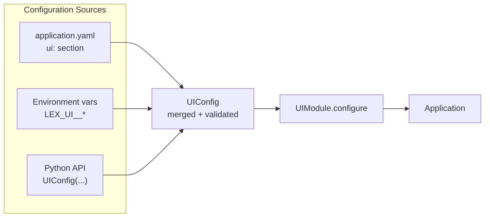

# lexigram-ui

HTMX/htpy component library for Lexigram web applications.

---

## Overview

`lexigram-ui` provides server-rendered UI primitives — components, layouts, HTMX helpers, and rendering utilities — built on htpy for plain Python templates. It ships with atoms (Button, TextInput, Badge), molecules (Card, Modal, Tabs), organisms (Form, SlideOver), and layouts, all integrated via `UIModule` for DI wiring and config-driven defaults.

The library ships with **ShadCN-compatible CSS variable design tokens** in oklch color space, a **polymorphic `asChild` pattern** for slot-based composition, and a **component CLI** (`lexigram-ui add`) for scaffolding components into your project.

---

## Install

```bash
uv add lexigram-ui
```

## Quick Start

```python
from lexigram.di.module import Module, module
from lexigram.ui.module import UIModule
from lexigram.ui.config import UIConfig
from lexigram.ui.atoms import Button
from lexigram.ui.core.base import Component, el, render_to_string


@module(imports=[UIModule.configure(UIConfig(default_theme="default"))])
class AppModule(Module):
    pass


class SavePanel(Component):
    def render(self) -> object:
        return el(
            "section",
            el("h2", "Profile"),
            Button("Save", hx_post="/profile/save"),
            class_="bg-card text-card-foreground p-6 rounded-lg shadow-sm",
        )


html = render_to_string(SavePanel())
```

## Configuration

> **Zero-config usage:** Call `UIModule.configure()` with no arguments to use all defaults.



### Option 1 — YAML file

```yaml
# application.yaml
ui:
  default_theme: "default"
  auto_escape: true
  htmx_version: "2.0.4"
  debug_components: false
  theme: light
  enable_sse: false
  enable_realtime: false
```

### Option 2 — Profiles + Environment Variables *(recommended)*

```bash
export LEX_UI__DEFAULT_THEME=default
export LEX_UI__DEBUG_COMPONENTS=false
export LEX_UI__THEME=dark
```

### Option 3 — Python

```python
from lexigram.ui.module import UIModule
from lexigram.ui.config import UIConfig

UIModule.configure(
    UIConfig(
        default_theme="default",
        theme="dark",
        enable_sse=True,
    )
)
```

### Config reference

| Field | Default | Env var | Description |
|-------|---------|---------|-------------|
| `default_theme` | `"default"` | `LEX_UI__DEFAULT_THEME` | Default UI theme (`default`, `dark`, `light`, `system`) |
| `auto_escape` | `true` | `LEX_UI__AUTO_ESCAPE` | HTML-escape user-supplied strings by default |
| `htmx_version` | `"2.0.4"` | `LEX_UI__HTMX_VERSION` | HTMX asset version referenced in layout helpers |
| `debug_components` | `false` | `LEX_UI__DEBUG_COMPONENTS` | Render `data-component` debug attributes (dev only) |
| `theme` | `"light"` | `LEX_UI__THEME` | Active theme (`light`, `dark`, `system`) |
| `enable_sse` | `false` | `LEX_UI__ENABLE_SSE` | Enable server-sent event support |
| `enable_realtime` | `false` | `LEX_UI__ENABLE_REALTIME` | Enable realtime-oriented UI features |

## Module Factory Methods

| Method | Description |
|--------|-------------|
| `UIModule.configure(config, **kwargs)` | Register `UIProvider` with explicit `UIConfig` values |
| `UIModule.stub()` | Default no-op module for tests |

## Key Features

- **Core rendering primitives** — `Component`, `Element`, `RawHTML`, `el`, `raw`, `render_to_string`
- **Polymorphic `asChild` pattern** — slot-based composition via `as_child` parameter on `Component`, `Button`, `Link`, `Card`
- **ShadCN design tokens** — CSS variable system in oklch color space: `SHADCN_DEFAULT_COLORS`, `SHADCN_DARK_COLORS`, `shadcn_css()` generator, `SEMANTIC_CLASSES`
- **Theme system** — `shadcn_css()` generates complete `:root` / `.dark` CSS blocks with overridable `primary`, `background`, `foreground`, `radius`, status colors
- **Component CLI** — `lexigram-ui add <component>` scaffolds components into your project (12 components in registry: button, card, modal, input, select, tabs, toast, tooltip, skeleton, form, badge, pagination)
- **HTMX helpers** — `hx_get`, `hx_post`, `hx_target`, `hx_swap`, and higher-level helpers
- **Server-Sent Events** — `SSEMessage` and `SSEStream` for realtime UI
- **Component library** — atoms, molecules, organisms, and layouts organized by usage layer
- **Context and swap zones** — `UIContext`, `Zone`, `Zones`, `SwapMode`
- **Error and response helpers** — `validation_error`, `render_validation_errors`, `htmx_error_response`
- **Accessibility** — `AriaAttrs`, `SkipLink`, `announce`, ARIA role helpers
- **Performance** — `RenderCache`, `ResponseOptimizer`, `MetricsCollector`
- **CSP requirements** — `UI_CSP_REQUIREMENTS` for Content Security Policy configuration

## Testing

```python
async with Application.boot(modules=[UIModule.stub()]) as app:
    # your test code
    ...
```

## Key Source Files

| File | What it contains |
|------|----------------|
| `src/lexigram/ui/module.py` | `UIModule.configure()`, `.stub()` |
| `src/lexigram/ui/config.py` | `UIConfig`, `DebounceConfig`, `HTMLDocumentConfig`, `BaseLayoutConfig`, `HeadConfig`, `FooterConfig`, `ToastConfig` |
| `src/lexigram/ui/core/base.py` | `Component`, `Element`, `el`, `render_to_string` |
| `src/lexigram/ui/core/slot.py` | `Slot` — pass-through renderer for `asChild` pattern |
| `src/lexigram/ui/protocols.py` | `RenderableProtocol` |
| `src/lexigram/ui/styles/design_tokens.py` | `SHADCN_DEFAULT_COLORS`, `SHADCN_DARK_COLORS`, `render_all_tokens()` |
| `src/lexigram/ui/styles/theme.py` | `shadcn_css()` — complete CSS variable generation |
| `src/lexigram/ui/styles/tokens.py` | Semantic class maps (button, alert, toast, icon colors) |
| `src/lexigram/ui/atoms/__init__.py` | Button, TextInput, Badge, Icon |
| `src/lexigram/ui/molecules/__init__.py` | Card, Modal, Tabs, Toast |
| `src/lexigram/ui/organisms/__init__.py` | Form, SlideOver, Chart |
| `src/lexigram/ui/htmx/attrs.py` | `hx_get`, `hx_post`, `hx_target`, `hx_swap` |
| `src/lexigram/ui/htmx/sse.py` | `SSEMessage`, `SSEStream` |
| `src/lexigram/ui/cli/registry.py` | `COMPONENT_REGISTRY`, `ComponentEntry` — 12 registerable components |
| `src/lexigram/ui/cli/add.py` | `lexigram-ui add` CLI command (typer) |
| `src/lexigram/ui/constants.py` | `UITheme`, `Breakpoint`, `UI_CSP_REQUIREMENTS` |
