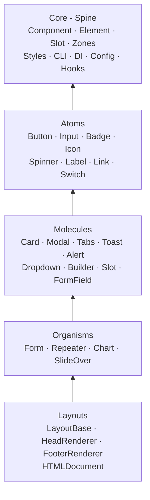
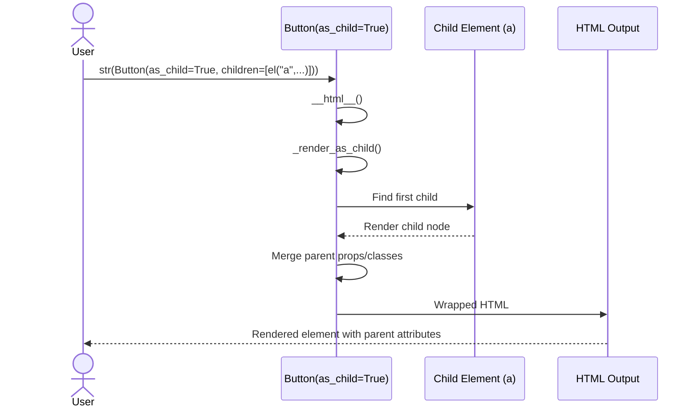
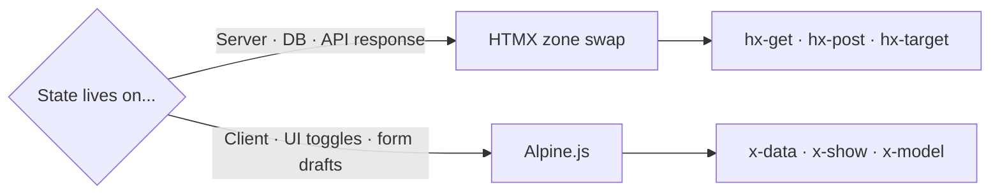
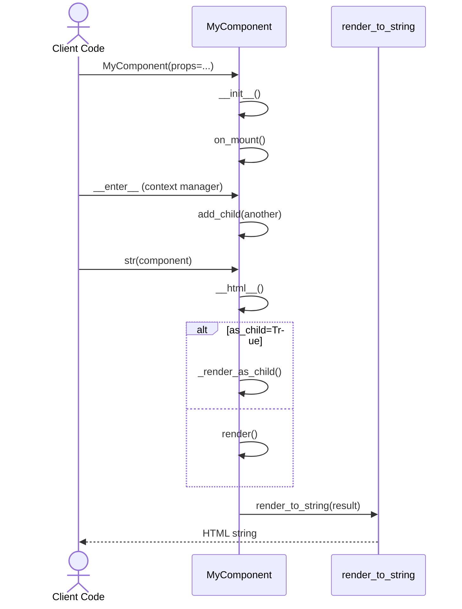
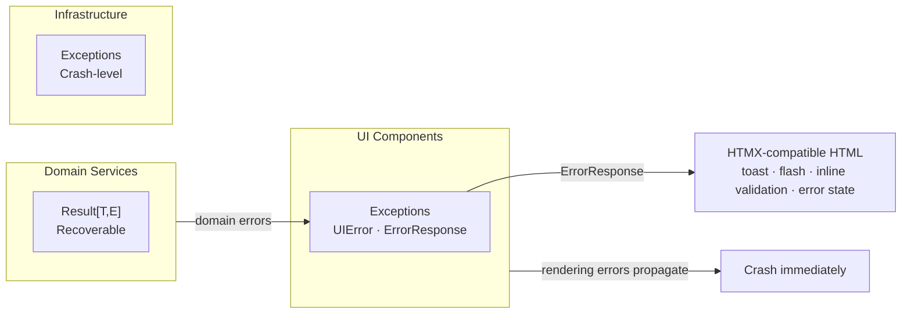

# Architecture

Internal design of the `lexigram-ui` package.

---

## Five-Layer Model



**Import direction rule (atomic-discipline):**

Arrows point toward the dependency. A layout may import molecules, atoms, and core. An atom may _not_ import from molecules. Violations are caught in code review — no linter enforces this today.

---

## ShadCN Design Token System

The style system is organized in three files under `styles/`:

### `design_tokens.py`
Defines the canonical CSS custom properties in oklch color space:
- `SHADCN_DEFAULT_COLORS` — 23 light-mode variables (`--background`, `--foreground`, `--primary`, `--card`, `--border`, `--radius`, gray scale 50–950, status colors)
- `SHADCN_DARK_COLORS` — Corresponding dark-mode overrides
- `render_css_variables(colors, dark_colors)` — Produces `:root { ... }` and `.dark { ... }` CSS blocks
- `render_utility_classes()` — Renders `.bg-card`, `.text-muted-foreground`, etc.

### `theme.py`
Provides `shadcn_css()` which generates the complete CSS string. Accepts optional overrides for `primary`, `background`, `foreground`, `radius`, and status colors (success, warning, info).

### `tokens.py`
Semantic class maps that resolve component variant names to CSS variable classes:
- `BUTTON_CLASSES`, `ALERT_CLASSES`, `TOAST_CLASSES`, `SEMANTIC_CLASSES`, `SEMANTIC_ICONS`
- Lookup functions: `get_button_classes()`, `get_alert_classes()`, `get_toast_classes()`, `get_semantic_classes()`

Components reference CSS variables instead of hardcoded color values. For example, a primary button renders `class="bg-primary text-primary-foreground"` instead of `class="bg-blue-600 text-white"`.

---

## Polymorphic `asChild` Pattern

The `asChild` pattern (inspired by Radix UI / ShadCN) allows a component to delegate rendering to its first child, merging its own props into that child.

### How it works

1. `Component.__init__()` accepts an `as_child: bool = False` parameter
2. When `as_child=True`, `__html__()` calls `_render_as_child()` instead of `render()`
3. `_render_as_child()` finds the first `Slot` child, renders it, and wraps the result with the parent's attributes/classes



### Usage

```python
# Without asChild — Button renders as <button>
Button("Click me")

# With asChild — Button merges its props into the Link child
Button(as_child=True, children=[
    el("a", "Click me", href="/target")
])
```

### Components supporting asChild

- `Component` (base — all subclasses inherit)
- `Button` (applied via `_render_as_child()`)
- `Link` (renders child as link content)
- `Card` (renders child as card content)

### Slot

`Slot` is a pass-through component that renders its children without a wrapping DOM node. It enables patterns where a parent component receives children but wants to render them at a specific insertion point rather than as direct children of its own output:

```python
class MyCard(Component):
    def render(self):
        return el("div", el(Slot()), class_="card")
```

---

## Component CLI

The CLI mirrors ShadCN's `npx shadcn add` workflow for Python:

```bash
lexigram-ui add button     # Copy button component into src/components/ui/
lexigram-ui add card -o my_components/ui  # Custom output directory
```

### Registry (`cli/registry.py`)

`COMPONENT_REGISTRY` maps 12 component names to `ComponentEntry` definitions with source paths and dependency tracking. The CLI resolves transitive dependencies (e.g., `form` depends on `input`, `select`, `button`) and copies all required files.

### Add command (`cli/add.py`)

- Resolves the installed `lexigram-ui` package path
- Collects source files for the requested component and all transitive dependencies
- Copies them to the project's `src/components/ui/` directory (configurable via `--output`)
- Uses pyperclip for copying over writing to preserve source integrity

---

## HTMX / Alpine Decision Rule



**HTMX zones** are registered in `lexigram.ui.core.zones.Zones` and target server-rendered partials. **Alpine** is used for local interactivity that never needs a server round-trip. Both can coexist on the same page — HTMX handles data flows, Alpine handles UI choreography.

---

## Design System Theming

The theme system is invoked at the layout level:

```python
from lexigram.ui.styles.theme import shadcn_css

# Generate complete CSS with default ShadCN colors
css = shadcn_css()

# Custom primary color
css = shadcn_css(primary="oklch(0.6 0.2 280)")

# Include in HTML head
head = el("style", raw(css))
```

The `LayoutBase` calls `get_theme_css_variables()` during rendering, which generates the CSS variable block and injects it into the page `<head>`. The `UIConfig.default_theme` field controls which theme name is passed to `shadcn_css()`.

---

## Component Contract

Every component follows this contract:

### `render() -> str | Any`

Must return either a raw HTML string or an `Element`/`htpy` node. Called by `__html__()`.

### `__html__() -> str`

Dispatch method that:
1. Checks `asChild` — if `True`, delegates to `_render_as_child()`
2. Calls `self.render()`
3. Passes the result through `render_to_string()`
4. Optionally injects `data-component` marker (`debug_components=True`)

### Lifecycle

```python
component = MyComponent(props=...)  # __init__ → on_mount()
with component:                      # __enter__ — parent for children
    add_child(another)
html = str(component)                # __html__ → render() → render_to_string()
```



### ContextVar Isolation

`UIContext` is stored in a `ContextVar` so each async request gets its own isolated context tree. Call `set_ui_context(ctx)` in middleware and `get_ui_context()` in components.

---

## Zones Registry

`lexigram.ui.core.zones.Zones` defines canonical HTMX swap targets:

```python
class Zones:
    DATA = Zone("data-content", swap=SwapMode.INNER_HTML)
    FLASH = Zone("flash-container", swap=SwapMode.INNER_HTML)
    MODAL = Zone("modal-container", swap=SwapMode.INNER_HTML)
    SIDEBAR = Zone("sidebar-content", swap=SwapMode.INNER_HTML)
    NAV = Zone("nav-content", swap=SwapMode.OUTER_HTML)
```

HTMX responses render HTML into these named zones. The `htmx_error_response()` function uses `Zones.FLASH` as the retarget for error toasts.

---

## `el()` Builder API

```python
from lexigram.ui import el

# pythonic kwargs → HTML attributes
el("div", class_="container", hx_get="/api", hx_trigger="load")
# → <div class="container" hx-get="/api" hx-trigger="load">
```

The `el()` function always delegates to `Element()` (our local lightweight implementation). It handles:
- `class_` → `class`, `for_` → `for` (Python reserved-word mapping)
- `hx_post` → `hx-post` (underscore to hyphen)
- Boolean attributes (`True` → bare, `False`/`None` → omitted)
- `with` context manager (Streamlit-style nesting)
- Self-closing tags (`input`, `img`, `br`, `hr`, `meta`, `link`)

---

## Exception Convention



The UI layer uses exceptions because rendering errors must propagate immediately — partial HTML output is worse than a crash. `ErrorResponse` converts domain errors into HTMX-compatible HTML (toast, flash, inline validation, or error state).

---

## DI Registration

```python
# lexigram/ui/di/provider.py
class UIProvider(Provider):
    async def register(self, container):
        container.singleton(UIConfig, config)
        container.singleton(HTMLDocumentConfig, HTMLDocumentConfig())
        container.singleton(BaseLayoutConfig, BaseLayoutConfig())
        container.singleton(HeadConfig, HeadConfig())
        container.singleton(FooterConfig, FooterConfig())
        container.singleton(ToastConfig, ToastConfig())
        container.singleton(MetricsCollector, MetricsCollector)
        container.singleton(ResponseOptimizer, ResponseOptimizer)
        container.singleton(RenderCache, RenderCache)
```

Layout configs are registered as singletons with defaults. Application code overrides them via `UIModule.configure(config=...)`.

---

## CSP Requirements

The `UI_CSP_REQUIREMENTS` dict in `constants.py` provides the Content Security Policy directives needed for lexigram-ui's external dependencies:

```python
UI_CSP_REQUIREMENTS = {
    "script-src": [...],
    "style-src": [...],
    "connect-src": [...],
}
```

Reference this when configuring your application's CSP to allow HTMX, Alpine.js, icon libraries, and Tailwind CDN.

---

## Performance

- `RenderCache` — LRU cache keyed by component name + serialized props
- `ResponseOptimizer` — ETag-based 304 responses for HTMX
- `MetricsCollector` — in-memory counters for render time, cache hit rate
- `measure_render_time` — decorator wrapping component render

---

## Constants

`constants.py` defines:

| Symbol | Description |
|--------|-------------|
| `UITheme` | Enum: `DEFAULT`, `DARK`, `LIGHT`, `SYSTEM` |
| `Breakpoint` | Enum: responsive breakpoints (SM–XXL) |
| `UI_CSP_REQUIREMENTS` | CSP directives for external assets |
| `ENV_PREFIX` | `LEX_UI__` |
| `__version__` | Package version |

---

## Extension Points

| Point | Mechanism |
|-------|-----------|
| Custom component | Subclass `Component`, implement `render()` |
| Custom input | Subclass `AbstractInput`, override `render_input()` |
| Custom layout | Subclass `LayoutBase`, override `render_body_content()` |
| HTMX swap target | Add a `Zone` to `Zones` (or subclass) |
| Toast handling | `X-Toast` header on HTMX responses → `ServerToastChannel` |
| Theme override | Call `shadcn_css()` with custom oklch values |
| Component scaffold | Add entry to `COMPONENT_REGISTRY` in `cli/registry.py` |
