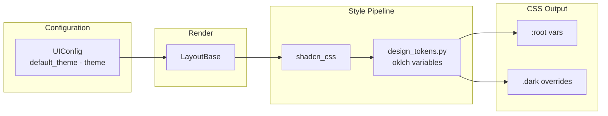
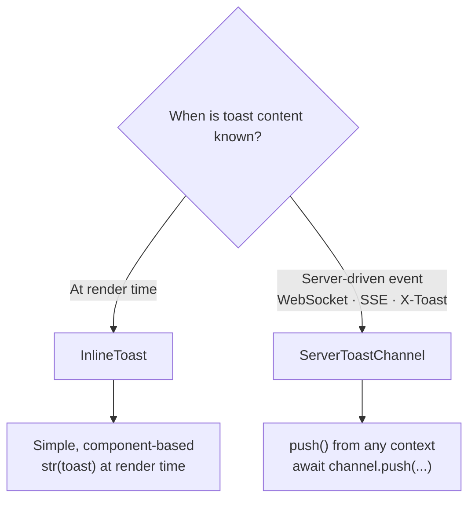

# Guide

Learn how to use `lexigram-ui` effectively.

---

## "Hello, Component" Walkthrough

```python
from lexigram.ui import Component, el, render_to_string

class Greeting(Component):
    def __init__(self, name: str = "World"):
        super().__init__(name=name)
        self.name = name

    def render(self):
        return el("h1", class_="text-foreground text-2xl font-bold", children=[f"Hello, {self.name}!"])

html = render_to_string(Greeting(name="Lexigram"))
# <h1 class="text-foreground text-2xl font-bold">Hello, Lexigram!</h1>
```

Note the use of `text-foreground` (a CSS variable utility class) instead of a hardcoded color — your components automatically adapt to light and dark themes.

---

## Composing Atoms → Molecules → Organisms

Build complex UIs from small, testable pieces:

```python
# Atom
from lexigram.ui import Button, Label, Input

# Molecule
from lexigram.ui import InputGroup, Card

card = Card(
    title="Login",
    children=[
        InputGroup(
            label="Email",
            input=Input(type="email", name="email"),
        ),
        Button("Sign In", variant="primary"),
    ],
)
html = render_to_string(card)
```

---

## Using the `asChild` Polymorphic Pattern

The `asChild` pattern lets a component merge its props into a child element instead of wrapping it. This is useful when you want a Button to render as a link, or a Card to render as a button.

### Button as Link

```python
from lexigram.ui import Button

# Without asChild — renders <button class="...">Click me</button>
Button("Click me")

# With asChild — renders <a href="/target" class="...">Click me</a>
Button(as_child=True, children=[
    el("a", "Click me", href="/target")
])
```

### Link as Button

```python
from lexigram.ui import Link

# Without asChild — renders <a href="/target" class="...">Click me</a>
Link("Click me", href="/target")

# With asChild — renders <span class="link-class" onclick="...">Click me</span>
Link(as_child=True, children=[
    el("span", "Click me", onclick="handleClick()")
])
```

### How it works

When `as_child=True`, the component's `__html__()` method calls `_render_as_child()` instead of `render()`. This method:
1. Finds the first child in the component's children list
2. Renders it directly (no wrapping DOM node)
3. The parent's CSS classes, attributes, and props are still applied

Components that support `asChild`: `Component`, `Button`, `Link`, `Card` (all inherit from `Component`).

---

## Using HTMX Zones for Swaps

Register named swap targets:

```python
from lexigram.ui import Zones, Zone, SwapMode

# Use a built-in zone
form_html = render_to_string(el("div", id=Zones.DATA.id, hx_swap_oob="innerHTML"))
```

Server handlers render into zones:

```python
# Route handler returns HTML targeting Zones.DATA
response = render_to_string(UserList(users=users))
headers = {"HX-Retarget": Zones.DATA.selector, "HX-Reswap": Zones.DATA.swap_mode.value}
```

---

## Theme Customization



### Using the default ShadCN theme

The default theme generates CSS variables via `shadcn_css()` with ShadCN-compatible colors in oklch space. Light and dark modes are handled by `.dark` class overrides.

```python
from lexigram.ui.module import UIModule

# Default theme — ShadCN compatible
UIModule.configure()
```

### Customizing colors

Override specific color tokens when configuring the UI module:

```python
from lexigram.ui.module import UIModule
from lexigram.ui.config import UIConfig

UIModule.configure(
    UIConfig(
        default_theme="custom",
        theme="light",
    )
)
```

Then in your layout, supply custom oklch values:

```python
from lexigram.ui.styles.theme import shadcn_css

css = shadcn_css(
    primary="oklch(0.6 0.2 280)",     # Purple primary
    background="oklch(0.98 0.005 280)", # Slightly tinted background
    radius="1rem",                      # Rounded corners
)
```

### Switching between light and dark

The theme is controlled by the `theme` field in `UIConfig`:

```bash
export LEX_UI__THEME=dark
```

Or toggle via JavaScript by adding/removing the `.dark` class on `<html>`:

```javascript
document.documentElement.classList.toggle('dark');
```

---

## Using the Component CLI

The `lexigram-ui add` command copies component source files into your project, similar to `npx shadcn add`:

```bash
# List available components
lexigram-ui add --help

# Add a button component
lexigram-ui add button

# Add a form with custom output directory
lexigram-ui add form -o my_app/components/ui
```

Available components: `button`, `badge`, `card`, `input`, `modal`, `select`, `tabs`, `toast`, `tooltip`, `skeleton`, `form`, `pagination`.

The CLI resolves transitive dependencies automatically — adding `form` also copies `input`, `select`, `button`, and `label` dependencies.

---

## InlineToast vs ServerToastChannel



```python
from lexigram.ui import InlineToast

# Use when content is known at render time
toast = InlineToast(
    title="Saved",
    message="Your changes have been saved.",
    variant="success",
    dismissible=True,
)
```

```python
from lexigram.ui import ServerToastChannel

# Use for server-driven events (WebSocket, SSE)
channel = ServerToastChannel()
await channel.push("error", "Connection lost. Reconnecting...")
```

The `X-Toast` header on HTMX responses also triggers server-driven toasts automatically.

---

## Error Handling with ErrorResponse

```python
from lexigram.ui import validation_error, not_found_error, server_error, htmx_error_response

# In a route handler:
error = validation_error(
    message="Please correct the errors below.",
    field_errors=[FieldError(field="email", message="Invalid format")],
)
html, status, headers = htmx_error_response(error)
# Returns flash + inline field errors + correct status code + HX-Retarget headers
```

`htmx_error_response()` builds a complete HTMX-compatible error response with:
- Flash/toast notification in `Zones.FLASH`
- Inline field errors for validation errors
- Error state component for server/not-found errors
- Correct `HX-Retarget` and `HX-Reswap` headers

---

## Accessibility Patterns

### AriaAttrs

```python
from lexigram.ui import AriaAttrs

attrs = AriaAttrs(label="Close dialog", expanded="false", controls="menu-1")
button = el("button", "×", **attrs.to_html_attrs())
```

### SkipLink

```python
from lexigram.ui import SkipLink

skip = SkipLink(target_id="main-content")
# Renders a visually-hidden skip-to-content link at page top
```

### announce()

```python
from lexigram.ui import announce

announce("Table updated: 5 rows loaded", polite=True)
# Sends a polite aria-live announcement
```
