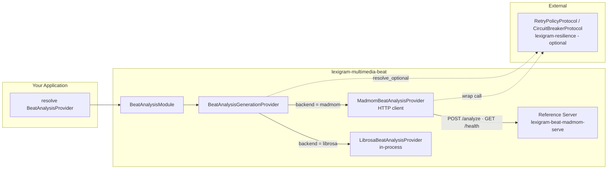

# Architecture

Internal design of `lexigram-multimedia-beat` — audio tempo/beat detection in Lexigram.

---

## Role in the System

`lexigram-multimedia-beat` is the **sync-only analysis** member of the multimedia family.
Every other subsystem produces a `MediaAsset` (a blob to store, queue, and announce); the
beat subsystem instead produces a **small pure value** — `BeatAnalysisResult`
(`tempo_bpm` + `beat_timestamps`) — that callers consume directly, typically to time video
cuts. It deliberately has no blob persistence, no cache, no event, and no `submit()` path.



**Import rule:** the package depends only on `lexigram` and `lexigram-contracts`
(plus `aiohttp`). It never imports other multimedia siblings; cross-subsystem composition
happens through the umbrella or through protocols resolved from the container.

---

## Key Components

- **`BeatAnalysisModule`** — `@module()` entry point. `configure()` wraps a
  `BeatAnalysisGenerationProvider` and exports `BeatAnalysisProvider`; `stub()` forces the
  `librosa` backend for tests.
- **`BeatAnalysisGenerationProvider`** — selects the backend from config, binds
  `BeatAnalysisConfig` and `BeatAnalysisProvider`, probes health, and resolves optional
  resilience protocols.
- **`LibrosaBeatAnalysisProvider`** — in-process CPU-only tracker. Materializes the asset
  to a temp file, runs `librosa.beat.beat_track` off the event loop, returns
  `Result[BeatAnalysisResult, MultimediaError]` (with `BeatAnalysisDecodeError` on decode
  failure).
- **`MadmomBeatAnalysisProvider`** — HTTP client for the reference server. Posts base64
  audio to `/analyze`, parses the JSON, honors retry/circuit-breaker.
- **`BeatAnalysisDecodeError`** — package leaf exception extending contracts'
  `BeatAnalysisError`.
- **`madmom_server.py`** — the reference server: aiohttp app exposing `/analyze` and
  `/health`, driven by the `lexigram-beat-madmom-serve` console script.

---

## Dependency Flow

```
BeatAnalysisConfig → BeatAnalysisGenerationProvider → BeatAnalysisProvider (backend)
        └── resolve_optional → RetryPolicyProtocol / CircuitBreakerProtocol
BeatAnalysisProvider.analyze(BeatAnalysisRequest) → Result[BeatAnalysisResult, MultimediaError]
         librosa: materialize → asyncio.to_thread(librosa.beat.beat_track)
         madmom : POST /analyze (base64)  → {tempo_bpm, beat_timestamps}
```

---

## Providers

`BeatAnalysisGenerationProvider` (name `beat`, `config_key = "multimedia_beat"`,
`config_model = BeatAnalysisConfig`) does everything in `register()`:

- `container.singleton(BeatAnalysisConfig, config)`
- resolve optional `RetryPolicyProtocol` / `CircuitBreakerProtocol`
- select the backend:
  - `backend == "librosa"` → construct `LibrosaBeatAnalysisProvider(sample_rate=...)`
  - `backend == "madmom"` → construct `MadmomBeatAnalysisProvider(base_url=..., timeout=..., retry=..., circuit_breaker=...)`
  - otherwise → raise `ProviderNotInstalledError`
- `container.singleton(BeatAnalysisProvider, self._backend)`

`boot()` is intentionally a no-op (no late wiring needed). It is exposed by the package's
`lexigram.multimedia.subsystems` entry point (`beat`) and its module via
`lexigram.multimedia.modules` (`beat`).

---

## Contracts

| Contract | Location | Implemented By |
|----------|----------|----------------|
| `BeatAnalysisProvider` | `contracts/multimedia/protocols.py` | `LibrosaBeatAnalysisProvider`, `MadmomBeatAnalysisProvider` |
| `BeatAnalysisRequest` | `contracts/multimedia/types.py` | — (input value: one `MediaAsset` + `extra`) |
| `BeatAnalysisResult` | `contracts/multimedia/types.py` | — (output value: `tempo_bpm`, `beat_timestamps`) |
| `MultimediaError` | `contracts/multimedia/exceptions.py` | err type of `analyze()` |
| `BeatAnalysisError` | `contracts/multimedia/exceptions.py` | domain base (`LEX_ERR_MM_008`) |
| `RetryPolicyProtocol` / `CircuitBreakerProtocol` | `contracts/infra/resilience/protocols.py` | optional, resolved via `resolve_optional` |

The only exception defined in-package is `BeatAnalysisDecodeError`
(`BeatAnalysisError` subclass, `LEX_ERR_MM_BEAT_003`).

---

## Lifecycle

- **register()** — bind config + selected backend; resolve resilience; fail fast on an
  unknown backend.
- **boot()** — nothing required; present for framework lifecycle symmetry.
- **health_check()** — `librosa`: reports `HEALTHY` with no network probe (construction
  success is the only verifiable signal). `madmom`: `GET {madmom_base_url}/health`;
  200 → `HEALTHY`, non-200 → `DEGRADED`, timeout/OSError/`aiohttp.ClientError` →
  `DEGRADED`.
- **shutdown()** — none needed (no held resources).

---

## Design Decisions

- **Result over exceptions.** `analyze()` returns `Result[BeatAnalysisResult, MultimediaError]`;
  a bad file or unreachable server is an expected failure the caller handles — consistent
  with `lexigram.contracts.multimedia` where `MultimediaError` is a recoverable domain error.
- **No persistence by design.** A beat result has no blob to store. Skipping storage,
  caching, events, and the task queue keeps the subsystem tiny and fast.
- **Two deployment models.** `librosa` trades accuracy for zero-ops (CPU-only, negligible
  cold start); `madmom` (RNN + HMM beating) trades ops for accuracy on hard material.
- **Model-once reference server.** `madmom_server.py` instantiates `RNNBeatProcessor()` in
  `on_startup` and reuses it — no per-request model load. The server runs in a dedicated
  venv with the `[madmom-server]` extra.
- **Optional resilience.** `resolve_optional()` means the backend gracefully skips
  retry/breaker when `lexigram-resilience` is absent instead of importing it eagerly.
  Calls chain as `retry.execute(circuit_breaker.call, self._post, payload)`, or each alone,
  or raw.
- **License caution.** The madmom implementation notes that its pinned version's license
  terms must be verified before commercial use (it lives behind the `[madmom-server]` extra).

---

## Extension Points

| Point | Mechanism |
|-------|-----------|
| New backend | Implement `BeatAnalysisProvider` and add a branch in `register()` keyed on a new `backend` value (or ship a third-party provider class via the umbrella's subsystem discovery) |
| Replace the server | Run your own `/analyze` + `/health` service behind a compatible URL; only the JSON shape is the contract |
| Resilience tuning | Configure `ResilienceConfig` (`retry:`, `circuit_breaker:` sections) — the backend adapts automatically |
| Umbrella integration | Installed alongside `lexigram-multimedia`, the umbrella wires `config.beat` and exposes `MultimediaProvider.beat` |