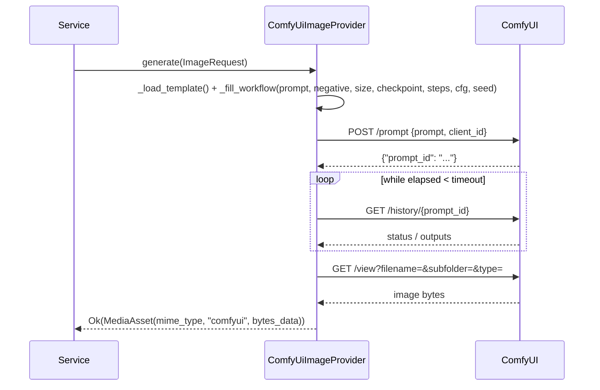

# Architecture

Internal design of `lexigram-multimedia-image` and how it fits the Lexigram multimedia subsystem.

---

## Role in the System

`lexigram-multimedia-image` is one of seven generation packages under the
`lexigram-multimedia` umbrella. It owns **still-image generation**: it turns an
`ImageRequest` into a `MediaAsset` through one of four interchangeable HTTP
backends. It depends only on `lexigram` and `lexigram-contracts` — the
`ImageProvider` protocol is the entire public boundary.

```
lexigram-contracts  ←  lexigram  ←  lexigram-multimedia-image → (entry points) lexigram-multimedia
  protocols/types/exceptions            |
                                        └── text                aiohttp
```

Backend choice is pure configuration, not code: `ImageConfig.backend` selects
the implementation at provider registration time.

---

## Key Components

| Component | File | Purpose |
|-----------|------|---------|
| `ImageModule` | `module.py` | `configure()` / `stub()` factories returning `DynamicModule` |
| `ImageGenerationProvider` | `di/provider.py` | Selects backend, resolves secrets, registers singletons, health checks |
| `LocalHttpImageProvider` | `providers/local_http.py` | Zero-extra-default: `POST /generate` on a self-hosted server |
| `OpenAIImageProvider` | `providers/openai.py` | OpenAI `/v1/images/generations` and `/v1/images/edits` |
| `StabilityImageProvider` | `providers/stability.py` | Stability SD3 API, incl. image-to-image form posts |
| `ComfyUiImageProvider` | `providers/comfyui.py` | Workflow submit → history poll → output fetch |
| `ImageGenerationTask` | `tasks.py` | `lexigram-tasks` job handler (dict in, dict out) |
| `ImageConfig` | `config.py` | Dataclass config, `config_section = "multimedia_image"` |
| `default_sdxl.json` | `workflows/` | Bundled ComfyUI workflow template with `__*__` placeholders |

---

## Dependency Flow

```
ImageModule.configure()
  └─ DynamicModule(providers=[ImageGenerationProvider(config)])
       │
       │ register(container)
       ├─ singleton(ImageConfig, config)
       ├─ resolve_optional: AsyncSecretStoreProtocol · RetryPolicyProtocol · CircuitBreakerProtocol
       ├─ switch ImageConfig.backend:
       │    local-http → LocalHttpImageProvider(base_url, timeout, retry, cb)
       │    stability  → StabilityImageProvider(api_key=resolve_credential(...), ...)
       │    openai     → OpenAIImageProvider(api_key=resolve_credential(...), model, base_url, ...)
       │    comfyui    → ComfyUiImageProvider(base_url, checkpoint, workflow_path, steps, cfg_scale, poll_interval, ...)
       │    else       → raise ProviderNotInstalledError
       ├─ singleton(ImageProvider, backend)
       └─ singleton(ImageGenerationTask, ImageGenerationTask(backend))
```

- The backend is constructed **inside** `register()` (a registrar-callback
  dependency), so the container stays stateless until registration.
- `ImageGenerationTask` and `ImageProvider` share one backend instance — the
  task reuses the same resilience wrappers as live calls.
- `boot()` is intentionally empty: all initialization already happened during
  `register()`.
- Consumers resolve `ImageProvider` and never see the concrete backend.

---

## Providers

| Entity | Registers | Notes |
|--------|-----------|-------|
| `ImageGenerationProvider` | `ImageConfig`, `ImageProvider`, `ImageGenerationTask` as singletons | Provider `name = "image"`; entry point `lexigram.multimedia.subsystems` → `image` |
| `ImageModule` | Re-exported via `lexigram.multimedia.modules` entry point `image` | Exports `[ImageProvider, ImageGenerationTask]` |

Unknown/unimplemented backends raise `ProviderNotInstalledError`
(`LEX_ERR_MM_006` from contracts) at registration — an eager, actionable
failure rather than a runtime `AttributeError`.

---

## Contracts

| Contract | Location | Implemented By |
|----------|----------|----------------|
| `ImageProvider` | `lexigram.contracts.multimedia.protocols` (`generate -> Result[MediaAsset, MultimediaError]`) | All four backends (structural) |
| `AsyncSecretStoreProtocol` | `lexigram.contracts.security.stores` | Resolved optionally; feeds `resolve_credential` |
| `RetryPolicyProtocol` | `lexigram.contracts.infra.resilience.protocols` | Optional; wraps every HTTP call |
| `CircuitBreakerProtocol` | `lexigram.contracts.infra.resilience.protocols` | Optional; wraps every HTTP call |
| `ImageRequest` / `MediaAsset` | `lexigram.contracts.multimedia.types` | Frozen dataclasses; request in, asset out |

Error values (not exceptions) are returned in the `Err` slot:
`ImageGenerationError` base (`LEX_ERR_MM_005`) with leaves
`ImageTimeoutError` (`LEX_ERR_MM_IMAGE_001`) and
`ImageGenerationAuthenticationError` (`LEX_ERR_MM_IMAGE_002`); container-level
failures use `ProviderNotInstalledError` (`LEX_ERR_MM_006`). All inherit
`MultimediaError` → `DomainError` → `LexigramError`.

---

## Generation Flow (ComfyUI path)



Execution errors are detected from either `status.status_str == "error"` or a
`"execution_error"` message in `status["messages"]` — ComfyUI reports some
failures only through the message list, so `_has_execution_error()` checks both.

---

## Lifecycle

- **register()** — bind `ImageConfig` singleton; resolve optional secret store
  and resilience protocols; construct and bind the backend + task handler.
- **boot()** — no-op by design (see Design Decisions).
- **shutdown()** — none needed; backends create short-lived `aiohttp`
  sessions per request and hold no persistent resources.
- **health_check(timeout)** — HTTP-probe `/health` (local-http) or
  `/system_stats` (comfyui); credential flag for openai/stability; `UNHEALTHY`
  if never registered; `aiohttp`/timeout failures become `DEGRADED`.

---

## Design Decisions

- **One protocol, structural typing** — all four backends implement
  `ImageProvider` without a shared base class, keeping the contracts layer
  loosely typed.
- **Backend selected in `register()`, not imported statically** — providers
  pull in their dependencies lazily (`from ... import` inside the branch), so
  installing the package never requires an SDK that a profile won't use.
- **API keys by name, resolved at registration** — OpenAIImageProvider /
  StabilityImageProvider receive a resolved `api_key` (or `""`); missing keys
  surface as 401 → `ImageGenerationAuthenticationError` at request time and as
  `DEGRADED` health, letting the app boot without secrets.
- **`Result`, never raises for expected failures** — network errors,
  timeouts, bad sizes, and unsupported reference conditioning all return
  `Err`; only configuration mistakes (`ProviderNotInstalledError`) raise.
- **`ImageGenerationTask` returns dicts** — `lexigram-tasks` result stores are
  JSON; byte blobs are persisted by the umbrella wrapper before the dict is
  built.
- **ComfyUI treated as a persistent thrall** — the provider submits, polls,
  and fetches; it never hosts a model, so there is nothing to manage in this
  process.
- **Per-operation `timeout`** — the same timeout covers submit, poll, and
  fetch; the ComfyUI poll loop bounds total wait with the same value.

---

## Extension Points

| Point | Mechanism |
|-------|-----------|
| New backend | Implement `generate()` structurally (e.g. `MyProvider` with `ImageProvider` shape) and register it — either by extending `ImageGenerationProvider`'s backend switch or by binding your own singleton under `ImageProvider` in a custom provider |
| Custom ComfyUI pipeline | `comfyui_workflow_path` pointing at your own workflow JSON using the `__*__` placeholder contract; or bundle a template in `workflows/` |
| Gateway routing | `openai_base_url` against any OpenAI-wire-compatible self-hosted gateway, including non-OpenAI models |
| Resilience | Register `RetryPolicyProtocol` / `CircuitBreakerProtocol` in the container — no code changes |
| Async jobs | Use `ImageGenerationTask.run(params)` directly, or compose `ImageProvider` behind your own task handler |
| Secrets | Provide `AsyncSecretStoreProtocol`; keys resolve by configured name |
| Umbrella orchestration | The `lexigram.multimedia.subsystems` / `lexigram.multimedia.modules` entry points let `lexigram-multimedia` pick up this package automatically |