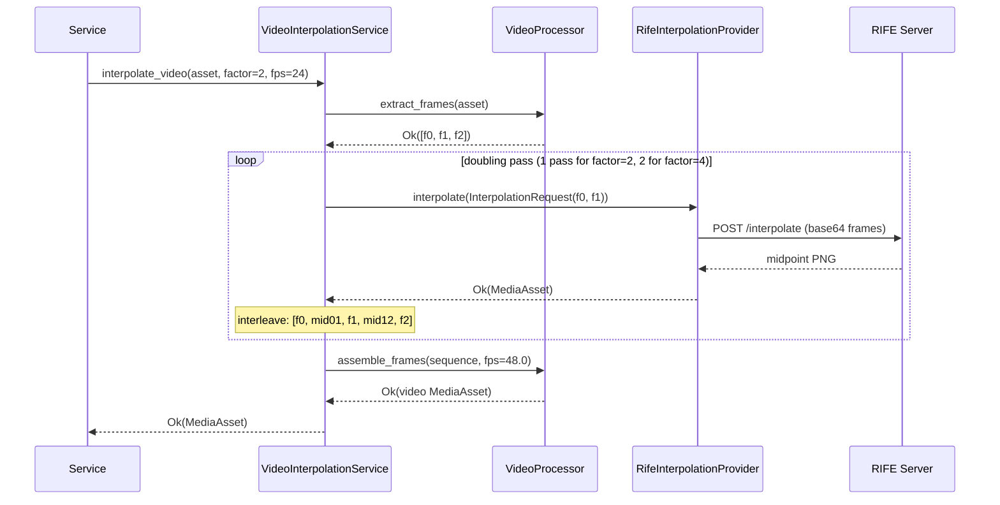

# Architecture

Internal design of `lexigram-multimedia-interpolate` and how it fits the Lexigram multimedia subsystem.

---

## Role in the System

`lexigram-multimedia-interpolate` is the frame-interpolation member of the
`lexigram-multimedia` umbrella. It owns two jobs:

1. **Frame-pair interpolation** — two `MediaAsset` frames in, one synthesized
   midpoint out, via a local RIFE reference server.
2. **Whole-video interpolation** — doubling or quadrupling a clip's frame rate
   by composing itself with a `VideoProcessor` (provided by
   `lexigram-multimedia-video`) **through contracts only**.

The package depends exclusively on `lexigram` and `lexigram-contracts` — the
only `lexigram-multimedia-video` connection is the `VideoProcessor` protocol,
never an import. The reference server (`rife_server.py`) is an optional
extra so PyTorch never contaminates the framework runtime.

```
lexigram-contracts  ←  lexigram  ←  lexigram-multimedia-interpolate → (entry points) lexigram-multimedia
                                          │
                                          ├── VideoProcessor (protocol, resolved) ── lexigram-multimedia-video
                                          └── HTTP ── RIFE server (aiohttp, [rife-server] extra)
```

---

## Key Components

| Component | File | Purpose |
|-----------|------|---------|
| `InterpolationModule` | `module.py` | `configure()` / `stub()` factories returning `DynamicModule` |
| `InterpolationGenerationProvider` | `di/provider.py` | Constructs/registers the backend + task + optional video service; health checks |
| `RifeInterpolationProvider` | `providers/rife.py` | Base64 frame payload → `POST /interpolate` → midpoint `MediaAsset` |
| `VideoInterpolationService` | `video_interpolation_service.py` | Frame extraction → N doubling passes → reassembly at higher fps |
| `InterpolationTask` | `tasks.py` | `lexigram-tasks` job handler (dict in, dict out) |
| `rife_server.py` | `servers/rife_server.py` | Reference `aiohttp` server: `RifeModel` loaded once, `/interpolate` + `/health` |
| `InterpolationConfig` | `config.py` | Dataclass config, `config_section = "multimedia_interpolate"` |

---

## Dependency Flow

```
InterpolationModule.configure()
  └─ DynamicModule(providers=[InterpolationGenerationProvider(config)])
       │
       │ register(container)
       ├─ singleton(InterpolationConfig, config)
       ├─ resolve_optional: RetryPolicyProtocol · CircuitBreakerProtocol
       ├─ switch backend == "rife" → RifeInterpolationProvider(base_url, timeout, retry, cb)
       │    else → raise ProviderNotInstalledError
       ├─ singleton(InterpolationProvider, backend)
       ├─ singleton(InterpolationTask, InterpolationTask(backend))
       └─ if resolve_optional(VideoProcessor):
              singleton(VideoInterpolationService,
                        VideoInterpolationService(interpolation_provider, video_processor))
```

- Registration order matters: `VideoInterpolationService` is registered
  **after** `InterpolationProvider` so it can reuse the exact backend instance.
- Consumers resolve `InterpolationProvider` for pair work, or
  `VideoInterpolationService` when they hold a whole video.
- `boot()` is empty — everything was already wired in `register()`.

---

## Providers

| Entity | Registers | Notes |
|--------|-----------|-------|
| `InterpolationGenerationProvider` | `InterpolationConfig`, `InterpolationProvider`, `InterpolationTask`, `VideoInterpolationService` (conditional) | Provider `name = "interpolate"`; entry point `lexigram.multimedia.subsystems` → `interpolate` |
| `InterpolationModule` | Re-exported via `lexigram.multimedia.modules` entry point `interpolate` | Exports `[InterpolationProvider, InterpolationTask]` |

The `VideoInterpolationService` registration is **conditional on
`VideoProcessor` presence** — resolve via `resolve_optional` during
`register()`. No video package, no extra registration.

---

## Contracts

| Contract | Location | Used By |
|----------|----------|---------|
| `InterpolationProvider` | `lexigram.contracts.multimedia.protocols` | `RifeInterpolationProvider` (structural impl); consumed by `VideoInterpolationService` |
| `VideoProcessor` | `lexigram.contracts.multimedia.protocols` | Optional dependency: `extract_frames`, `assemble_frames`; gates service registration |
| `RetryPolicyProtocol` / `CircuitBreakerProtocol` | `lexigram.contracts.infra.resilience.protocols` | Optional; wrap every `/interpolate` call |
| `InterpolationRequest` / `MediaAsset` | `lexigram.contracts.multimedia.types` | Frozen dataclasses; both in/out types |
| `MultimediaError` | `lexigram.contracts.multimedia.exceptions` | The `Err` type for `interpolate()` and `interpolate_video()` |

This package defines **no own exceptions** (`exceptions.py` is empty) — the
contracts' `MultimediaError` (code `LEX_ERR_MM_001`) covers all failures, and
`ProviderNotInstalledError` (`LEX_ERR_MM_006`) is raised by the provider for
unknown backends.
`rife_server.py` imports `RifeModel`/`torch` lazily inside
`on_startup` — the client package never imports them.

---

## Video Interpolation Flow



The midpoint interleaving lives in `VideoInterpolationService._double()`:
`[f0, f1, f2] → [f0, mid01, f1, mid12, f2]`. Failures short-circuit: any
`Err` from extraction, a pair interpolation, or assembly aborts the whole
video with the first error.

---

## Lifecycle

- **register()** — bind `InterpolationConfig`; resolve resilience protocols;
  construct `RifeInterpolationProvider`; bind `InterpolationProvider` +
  `InterpolationTask`; conditionally compose and bind
  `VideoInterpolationService`.
- **boot()** — no-op; no async I/O beyond `register()`.
- **shutdown()** — none; the client holds no persistent connections (per-call
  `aiohttp` sessions).
- **Server lifecycle (separate process)** — `main()` builds the `aiohttp`
  app, appends `on_startup` (model load, CUDA/CPU detection), mounts
  `/interpolate` + `/health`, and serves on port 5500.

---

## Design Decisions

- **Contracts-only cross-package composition** — `VideoInterpolationService`
  depends on `InterpolationProvider` and `VideoProcessor` protocols with
  constructor injection. There is no import of `lexigram-multimedia-video`
  anywhere (`video_interpolation_service.py` docstring states this contract
  rule explicitly).
- **`VideoInterpolationService` is deliberately not an `InterpolationProvider`**
  — different method (`interpolate_video` vs `interpolate`), different
  signature (video + factor vs two frames), mirroring the video-upscaling
  service pattern.
- **Reference server behind a lazy import + optional extra** — torch is heavy;
  `RifeModel` loads at server startup only, and the `[rife-server]` extra
  keeps framework installs lean.
- **No own exception hierarchy** — contracts' `MultimediaError` suffices for a
  two-frame client; the package leafs nothing.
- **Client must not host models** — like ComfyUI in the image package, RIFE
  runs as a persistent external process; the provider is a thin aiohttp
  client, reusing `retry`/`circuit_breaker` if present.
- **Dict-in/dict-out task handler** — `InterpolationTask` returns
  JSON-serializable shapes for `lexigram-tasks`' result store (bytes persist at
  the umbrella layer).

---

## Extension Points

| Point | Mechanism |
|-------|-----------|
| New backend | Implement the `InterpolationProvider` shape (`interpolate -> Result[MediaAsset, MultimediaError]`) and bind it as the singleton in a custom provider; the `backend` config `Literal` would need widening |
| Whole-video workflows | `VideoInterpolationService.interpolate_video(asset, factor=2\|4, fps=...)` — compose with any other `VideoProcessor` fulfillment (ffmpeg, GPU encoders) |
| Resilience | Register `RetryPolicyProtocol` / `CircuitBreakerProtocol` — automatic |
| Jobs | `InterpolationTask.run(params)` or your own handler around `InterpolationProvider` |
| Custom RIFE hosting | Point `rife_base_url` at any server speaking the base64 `/interpolate` wire contract — including vendored RIFE distributions |
| Umbrella orchestration | `lexigram.multimedia.subsystems` / `lexigram.multimedia.modules` entry points (`interpolate`) for automatic discovery by `lexigram-multimedia` |