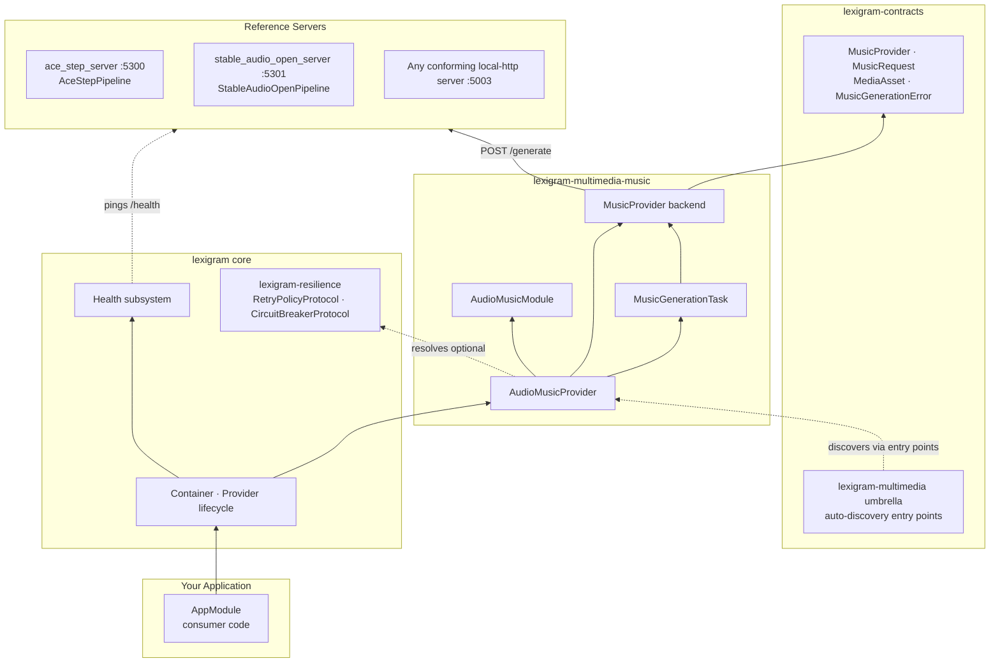

# Architecture: lexigram-multimedia-music

Internal design of the music generation subsystem — which components exist, how they wire together, and how to extend it. Verified against `src/lexigram/multimedia/music/`.

---

## Role in the System

`lexigram-multimedia-music` is a **generation subsystem** in the `lexigram-multimedia-*` family: it converts text prompts to audio bytes. It is a thin, provider-pattern layer over the `MusicProvider` contract — it owns no model weights itself. Two reference `aiohttp` servers ship alongside so self-hosted models (ACE-Step, Stable Audio Open) can be deployed out-of-process.



**Import rule:** the package imports only `lexigram`, `lexigram-contracts`, and `aiohttp`. Cross-subsystem access happens through contracts and the container — never direct imports (monorepo §1).

---

## Key Components

| Component | File | Purpose |
|-----------|------|---------|
| `AudioMusicModule` | `module.py` | `@module()` entry; `configure()` / `stub()` factory methods; exports `[MusicProvider, MusicGenerationTask]` |
| `AudioMusicProvider` | `di/provider.py` | DI provider (name `"music"`, config key `"multimedia_music"`). Builds the backend from config, binds singletons, health-check liveness |
| `MusicConfig` | `config.py` | `BaseConfig` subclass: `backend`, three base URLs, `timeout` |
| `LocalHttpMusicProvider` | `providers/local_http.py` | Zero-extra backend; talks to any self-hosted server's `/generate` |
| `AceStepMusicProvider` | `providers/ace_step.py` | ACE-Step full-song backend; reads `extra["tags"]` / `extra["lyrics"]` |
| `StableAudioOpenMusicProvider` | `providers/stable_audio_open.py` | Stable Audio Open FX/ambience backend; ignores `extra` |
| `StabilityAudioMusicProvider` | `providers/stability_audio.py` | Deliberate stub — raises `ProviderNotInstalledError` |
| `MusicGenerationTask` | `tasks.py` | `lexigram-tasks`-compatible handler; `run(params) -> dict` for JSON-safe job results |
| `ace_step_server.py` | `servers/` | Reference server entry point on `:5300` (console script `lexigram-music-ace-step-serve`) |
| `stable_audio_open_server.py` | `servers/` | Reference server entry point on `:5301` (console script `lexigram-music-stable-audio-open-serve`) |

---

## Dependency Flow

```
MusicConfig ──▶ AudioMusicProvider.register()
                    │  resolve optional: AsyncSecretStoreProtocol,
                    │                    RetryPolicyProtocol, CircuitBreakerProtocol
                    ▼
        backend branch on MusicConfig.backend
                    │
        LocalHttpMusicProvider | AceStepMusicProvider | StableAudioOpenMusicProvider
                    │  (each: aiohttp POST {base_url}/generate)
        container.singleton(MusicProvider, backend)
        container.singleton(MusicGenerationTask, task(backend=backend))
```

Consumer contract flow:

```
app.container.resolve(MusicProvider)
    → backend.generate(MusicRequest) : Result[MediaAsset, MusicGenerationError]
        → Ok(MediaAsset(mime_type, provider, bytes_data)) on HTTP 200
        → Err(MusicGenerationError) on non-200 / ClientError / TimeoutError
```

No component outside this package ever constructs a backend class — resolution goes through the `MusicProvider` contract.

---

## Providers

### `AudioMusicProvider` (DI provider)

Registers, in `register()`:

| Binding | Type | Notes |
|---------|------|-------|
| `MusicConfig` | singleton | The resolved config object |
| `MusicProvider` | singleton | The backend chosen by `config.backend` (cast to the protocol) |
| `MusicGenerationTask` | singleton | Wraps the same backend instance |

Constructor resolves optional collaborators **during `register()`** (not `boot()` — credentials/resilience must exist before the backend instance is built):

- `AsyncSecretStoreProtocol` — resolved if present (`resolve_optional`), reserved for future hosted backends.
- `RetryPolicyProtocol`, `CircuitBreakerProtocol` — injected into the backend when available; backend calls become `retry.execute(circuit_breaker.call, _post, payload)`.

The branch on `MusicConfig.backend` is an explicit if/elif ladder ending in `ProviderNotInstalledError` for unknown or unimplemented values — there is no silent fallback.

### Entry-point providers

`pyproject.toml` registers the provider and module for umbrella auto-discovery:

```
lexigram.multimedia.subsystems: music → lexigram.multimedia.music.di.provider:AudioMusicProvider
lexigram.multimedia.modules:     music → lexigram.multimedia.music.module:AudioMusicModule
```

---

## Contracts

| Contract | Lives in | Implemented by |
|----------|----------|----------------|
| `MusicProvider` | `lexigram.contracts.multimedia.protocols` | `LocalHttpMusicProvider`, `AceStepMusicProvider`, `StableAudioOpenMusicProvider` |
| `MusicRequest` | `lexigram.contracts.multimedia.types` | — (frozen dataclass: `prompt`, `duration_seconds=30.0`, `format="mp3"`, `extra`) |
| `MediaAsset` | `lexigram.contracts.multimedia.types` | — (frozen dataclass: `mime_type`, `provider`, `bytes_data`/`uri`, `metadata`; `has_bytes`/`has_uri` properties) |
| `MultimediaError` / `MusicGenerationError` / `ProviderNotInstalledError` | `lexigram.contracts.multimedia.exceptions` | — (codes `LEX_ERR_MM_001` / `_003` / `_006`) |

The package's own `exceptions.py` only re-exports `MusicGenerationError` — the hierarchy lives in contracts so callers can catch at the domain boundary without importing the extension.

---

## Lifecycle

```
Application.boot(modules=[AudioMusicModule.configure()])
  1. register(container)   — resolve MusicConfig; resolve optional collaborators;
                             construct backend; bind MusicConfig/MusicProvider/
                             MusicGenerationTask singletons; log "music_registered"
  2. boot(container)       — no-op (all I/O-free wiring done in register)
  3. health_check(timeout=5.0)
        - no backend          → UNHEALTHY
        - http backend        → GET {base_url}/health → 200 → HEALTHY, else DEGRADED
  4. shutdown()            — provider-level; backends open a fresh aiohttp session per
                             call, so there is no connection state to tear down
```

The `stub()` factory (`AudioMusicModule.stub()`) behaves identically but forces `MusicConfig(backend="local-http")` — deterministic tests with no config file.

---

## Design Decisions

- **Result, not exceptions** — `generate()` returns `Result[MediaAsset, MusicGenerationError]`. Transport failures (`aiohttp.ClientError`, `TimeoutError`) and non-200s are domain values; the only raised exception at this layer is `ProviderNotInstalledError` at registration, and it's eager ("fail at wire-up, not on first request").
- **Config-driven backend selection** — one `backend` literal switches engines; consumer code never branches. Unimplemented values fail loudly rather than silently degrading.
- **Fresh `aiohttp.ClientSession` per call** — no session state to manage across the provider lifecycle; the injected retry/circuit-breaker carries the resilience concern.
- **JSON-safe job results** — `MusicGenerationTask.run()` returns a dict (`provider`, `mime_type`, `bytes_data`, `uri`, `metadata`), never a `MediaAsset`, because `lexigram-tasks` JSON-serializes `JobResult`. Umbrella storage persistence happens before this dict is built.
- **Out-of-process models** — reference servers run in dedicated venvs (torch is heavy); the package stays dependency-lean (`aiohttp` only) and the model loads once per server startup.
- **Per-backend defaults from source semantics** — e.g. `StableAudioOpenMusicProvider` defaults `timeout=45.0` (short native window) vs `AceStepMusicProvider`'s `120.0` (full songs).
- **`extra` as the paid escape hatch** — ACE-Step's `tags`/`lyrics` vocabulary travels through `MusicRequest.extra` rather than bloating the shared contract type.

---

## Extension Points

| Point | Mechanism |
|-------|-----------|
| New hosted backend (e.g. Stability Audio API) | Implement `MusicProvider.generate()`; add a `backend` literal to `MusicConfig` and a branch in `AudioMusicProvider.register()`; replace the stub in `providers/stability_audio.py` |
| Custom self-hosted engine | Run any server exposing `POST /generate` + `GET /health` with the local-http wire shape; just point `local_http_base_url` at it |
| Custom resilience | Register `RetryPolicyProtocol` / `CircuitBreakerProtocol` in the container — every music backend picks them up automatically |
| Task pipeline | Resolve `MusicGenerationTask` from the container and submit via `lexigram-tasks`; `params` map 1:1 onto `MusicRequest` fields |
| Umbrella integration | Already wired — entry points `lexigram.multimedia.subsystems` / `lexigram.multimedia.modules` are discovered by `lexigram-multimedia` |
| Health/monitoring | `AudioMusicProvider.health_check()` participates in the framework health subsystem; no extra code needed |