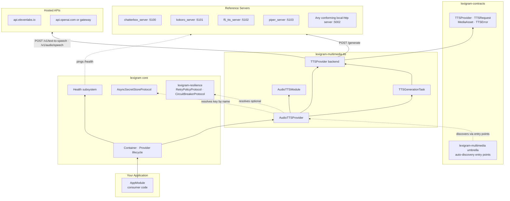

# Architecture: lexigram-multimedia-tts

Internal design of the TTS subsystem — components, wiring, lifecycle, and extension points. Verified against `src/lexigram/multimedia/tts/`.

---

## Role in the System

`lexigram-multimedia-tts` is a **generation subsystem** in the `lexigram-multimedia-*` family: it converts text to speech audio. It is a provider-pattern layer over the `TTSProvider` contract — no model weights live in the package. Four reference `aiohttp` servers ship alongside so self-hosted models (Chatterbox, Kokoro, F5-TTS, Piper) deploy out-of-process, plus `local-http` for any conforming third-party server, plus hosted API backends (ElevenLabs, OpenAI).



**Import rule:** the package imports only `lexigram`, `lexigram-contracts`, and `aiohttp`. Cross-subsystem access happens through contracts and the container.

---

## Key Components

| Component | File | Purpose |
|-----------|------|---------|
| `AudioTTSModule` | `module.py` | `@module()` entry; `configure()` / `stub()`; exports `[TTSProvider, TTSGenerationTask]` |
| `AudioTTSProvider` | `di/provider.py` | DI provider (name `"tts"`, config key `"multimedia_tts"`). Resolves secrets + resilience, builds the backend, binds singletons, health check |
| `TTSConfig` | `config.py` | `BaseConfig` subclass — `backend` + 14 backend-specific fields + `timeout` |
| `TTSGenerationTask` | `tasks.py` | `lexigram-tasks`-compatible handler; `run(params) -> dict` (JSON-safe) |
| `LocalHttpTTSProvider` | `providers/local_http.py` | Zero-extra backend; POSTs `{text, voice, format}` to any server |
| `ElevenLabsTTSProvider` | `providers/elevenlabs.py` | Hosted API; `xi-api-key` header; 401 → `TTSAuthenticationError` |
| `OpenAITTSProvider` | `providers/openai.py` | Hosted API or compatible gateway; classic payload or IndexTTS2 clone shape; JSON-relay audio URL following |
| `ChatterboxTTSProvider` | `providers/chatterbox.py` | Local server; single voice; `exaggeration`/`cfg_weight`/`temperature` knobs |
| `KokoroTTSProvider` | `providers/kokoro.py` | Local server; `voice` or `kokoro_default_voice` |
| `F5TTSProvider` | `providers/f5_tts.py` | Zero-shot cloning; requires `reference_audio_uri` + `extra["reference_text"]` |
| `PiperTTSProvider` | `providers/piper.py` | Local CPU server; `voice` or `piper_default_voice`; lightest backend |
| Reference servers ×4 | `servers/` | `chatterbox_server.py` (:5100), `kokoro_server.py` (:5101), `f5_tts_server.py` (:5102), `piper_server.py` (:5103) — console scripts `lexigram-tts-*-serve` |

---

## Dependency Flow

```
TTSConfig ──▶ AudioTTSProvider.register()
                  │  resolve_optional: AsyncSecretStoreProtocol,
                  │                    RetryPolicyProtocol, CircuitBreakerProtocol
                  ▼
        backend branch on TTSConfig.backend
                  │
        local-http | elevenlabs | openai | chatterbox | kokoro | f5-tts | piper
                  │   (elevenlabs/openai: resolve_credential → api_key)
        container.singleton(TTSProvider, backend)
        container.singleton(TTSGenerationTask, task(backend=backend))
```

Consumer contract flow:

```
app.container.resolve(TTSProvider)
    → backend.generate(TTSRequest) : Result[MediaAsset, TTSError]
        → Ok(MediaAsset(mime_type, provider, bytes_data)) on HTTP 200
        → Err(TTSError) on non-200 / ClientError / TimeoutError
        → raised TTSAuthenticationError on 401 (hosted backends)
```

No component outside the package constructs a backend class — resolution goes through the `TTSProvider` contract.

---

## Providers

### `AudioTTSProvider` (DI provider)

Registers, in `register()`:

| Binding | Type | Notes |
|---------|------|-------|
| `TTSConfig` | singleton | The resolved config object |
| `TTSProvider` | singleton | The backend chosen by `config.backend` (cast to the protocol) |
| `TTSGenerationTask` | singleton | Wraps the same backend instance |

Branches in `register()`:

- **`local-http`** — `LocalHttpTTSProvider(base_url, timeout, retry, circuit_breaker)`.
- **`elevenlabs`** — guarded import; `ImportError` → `ProviderNotInstalledError` ("install lexigram-multimedia-tts[elevenlabs]"). Then `resolve_credential(secret_store, elevenlabs_api_key_secret_name)`; missing `elevenlabs_voice_id` → `ProviderNotInstalledError` (fail fast).
- **`openai`** — `resolve_credential(secret_store, openai_api_key_secret_name)`; no voice-id requirement.
- **`chatterbox` / `kokoro` / `f5-tts` / `piper`** — plain local backend construction from their `*_base_url`/voice/tuning fields.
- **anything else** — `ProviderNotInstalledError("Unknown or unimplemented TTS backend")`.

Optional collaborators are resolved during `register()` (not `boot()`) because credentials and resilience must be known **before** the backend instance is constructed.

### Entry-point integration

```
lexigram.multimedia.subsystems: tts → lexigram.multimedia.tts.di.provider:AudioTTSProvider
lexigram.multimedia.modules:     tts → lexigram.multimedia.tts.module:AudioTTSModule
```

---

## Contracts

| Contract | Lives in | Implemented by |
|----------|----------|----------------|
| `TTSProvider` | `lexigram.contracts.multimedia.protocols` | All seven backend classes |
| `TTSRequest` | `lexigram.contracts.multimedia.types` | — (frozen dataclass: `text`, `voice`, `format="mp3"`, `reference_audio_uri`, `emotion`, `extra`) |
| `MediaAsset` | `lexigram.contracts.multimedia.types` | — (frozen dataclass with `has_bytes`/`has_uri`) |
| `MultimediaError` / `TTSError` / `ProviderNotInstalledError` | `lexigram.contracts.multimedia.exceptions` | — (codes `LEX_ERR_MM_001` / `_002` / `_006`) |
| `TTSAuthenticationError` | `lexigram.multimedia.tts.exceptions` (this package) | leaf exception, code `LEX_ERR_MM_TTS_002` — 401 from hosted APIs |

The package's `exceptions.py` adds exactly one leaf (`TTSAuthenticationError`) on top of the contracts base `TTSError`.

---

## Lifecycle

```
Application.boot(modules=[AudioTTSModule.configure()])
  1. register(container)   — resolve TTSConfig; resolve secrets + resilience;
                             build backend (may raise ProviderNotInstalledError
                             for missing extras / missing voice id);
                             bind TTSConfig/TTSProvider/TTSGenerationTask;
                             log "tts_registered" with the backend
  2. boot(container)       — no-op (wiring already done in register)
  3. health_check(timeout=5.0)
        - no backend                       → UNHEALTHY
        - http backends (local-http,
          chatterbox, kokoro, f5-tts,
          piper)                           → GET {base_url}/health (200 → HEALTHY)
        - hosted API backends (elevenlabs,
          openai)                          → credential-presence check:
                                             HEALTHY if key resolved, else DEGRADED
                                             (never a billed call)
  4. shutdown()            — per-call aiohttp sessions; nothing to tear down
```

`AudioTTSModule.stub()` forces `TTSConfig(backend="local-http")` for deterministic tests.

---

## Design Decisions

- **Result for domain failures, raise for credential errors** — transport/HTTP failures map to `Err(TTSError)`; a 401 from ElevenLabs/OpenAI raises `TTSAuthenticationError` because it's an infrastructure/configuration problem that must not be silently swallowed.
- **Secrets-by-name, never by-value** — config only carries `*_api_key_secret_name`; keys come from `AsyncSecretStoreProtocol` via `resolve_credential`. `openai_base_url` is configurable so gateways (self-hosted clone services) are first-class.
- **Escape hatch is `extra`** — F5-TTS's `reference_text` travels in `request.extra` (like ACE-Step's `tags`/`lyrics` in music), keeping the shared `TTSRequest` contract minimal.
- **URI references, not inline bytes** — F5-TTS reference audio is a URI the *server* fetches (`http(s)://` or `file://`); the wire payload never carries audio bytes.
- **"Accepted but ignored" over "dropped silently"** — Chatterbox ignores `request.voice`/`request.format` (single voice, native WAV) but documents it; local servers return WAV regardless of `format`, so the response's `mime_type` reflects reality (see the servers).
- **JSON-safe job results** — `TTSGenerationTask.run()` returns a plain dict (never a `MediaAsset`) because lexigram-tasks JSON-serializes `JobResult`; umbrella storage persists bytes before this dict is built.
- **Multi-runtime local model servers** — each model lives in its own venv/process (port per model) with a single shared wire shape (`POST /generate`, `GET /health`), so app code never imports torch.
- **Per-backend defaults** mirror actual model constraints — Piper `timeout=15.0` (sub-second, CPU), Kokoro `30.0`, F5-TTS `90.0` (voice cloning is slow); `TTSConfig.timeout` overrides globally.

---

## Extension Points

| Point | Mechanism |
|-------|-----------|
| New hosted/open-source backend | Implement `TTSProvider.generate()`; add a `backend` literal to `TTSConfig`; add a branch in `AudioTTSProvider.register()`; add any needed `*_api_key_secret_name` field |
| Custom self-hosted engine | Expose `POST /generate` + `GET /health` with the local-http wire shape; point `local_http_base_url` at it — no package changes |
| New reference server | Copy the `servers/*_server.py` pattern (aiohttp + `on_startup` model load), pick a port, add a `[project.scripts]` entry + extra |
| Secrets integration | Register `AsyncSecretStoreProtocol` in the container; hosted backends pick it up automatically via `resolve_credential` |
| Resilience | Register `RetryPolicyProtocol` / `CircuitBreakerProtocol` — every backend wraps its call automatically |
| Task pipeline | Resolve `TTSGenerationTask` and submit through `lexigram-tasks`; `params` map onto `TTSRequest` fields |
| Umbrella integration | Already wired — `lexigram.multimedia.subsystems` / `lexigram.multimedia.modules` entry points |
| Health/monitoring | `AudioTTSProvider.health_check()` participates in the framework health subsystem |