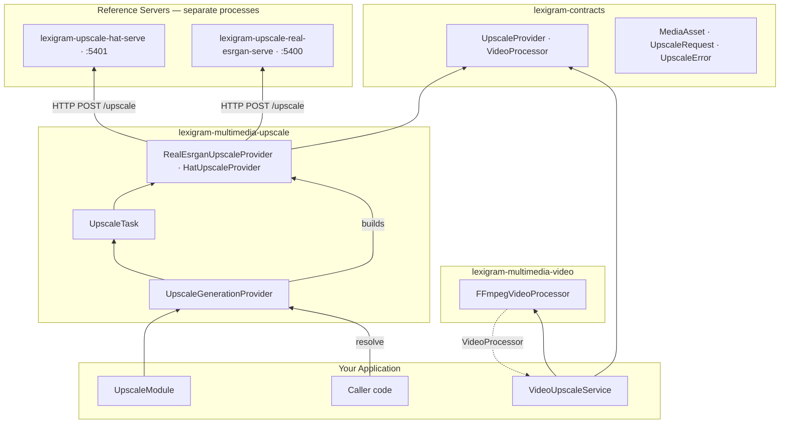

# Architecture

Internal design of `lexigram-multimedia-upscale` and how it fits into the Lexigram multimedia subsystem.

---

## Role in the System



The package is a **thin HTTP client layer**. Model weights, torch, and inference live exclusively in the reference server processes; the package speaks base64-inlined JSON over plain HTTP.

---

## Key Components

- **`UpscaleModule`** — the DI module. `configure(config)` builds a `DynamicModule` exporting `UpscaleProvider` and `UpscaleTask`; `stub()` pins the default `real-esrgan` backend for tests.
- **`UpscaleGenerationProvider`** — DI provider (`name = "upscale"`). In `register()` it resolves optional resilience/processing contracts and constructs + binds everything. Exposes `health_check()`.
- **`RealEsrganUpscaleProvider` / `HatUpscaleProvider`** — backend clients. Nearly identical wire shapes (`POST /upscale`), distinct error strings, providers `"real-esrgan"` / `"hat"` on the output asset.
- **`_asset_io.resolve_asset_bytes()`** — shared source-bytes resolution: in-memory bytes, or download `asset.uri`.
- **`UpscaleTask`** — flat-dict-to-`UpscaleRequest` adapter for the async job path.
- **`VideoUpscaleService`** — frame-extract → per-frame upscale → reassemble composition.
- **`servers/`** — reference server entry points (`lexigram-upscale-real-esrgan-serve`, `lexigram-upscale-hat-serve`).

---

## Dependency Flow

```
UpscaleRequest → UpscaleProvider (protocol) → backend client → POST /upscale → result MediaAsset
```

- Callers depend on `UpscaleProvider` from `lexigram-contracts` — never on a backend class.
- The provider does the backend selection (registry-style `if backend == ...` dispatch over `UpscaleConfig.backend`), so swapping engines is a config change.
- Optional `RetryPolicyProtocol` / `CircuitBreakerProtocol` wrap transport calls; `VideoProcessor` (when present) activates video upscaling.
- Exceptional infrastructure failures surface as `Err(UpscaleError)` values, per the multimedia domain convention.

---

## Providers

| Registration | Binding |
|--------------|---------|
| `container.singleton(UpscaleConfig, ...)` | Config object |
| `container.singleton(UpscaleProvider, backend)` | Selected backend (`RealEsrganUpscaleProvider` / `HatUpscaleProvider`) |
| `container.singleton(UpscaleTask, ...)` | Task handler wrapping the same backend |
| `container.singleton(VideoUpscaleService, ...)` | Only when a `VideoProcessor` is resolvable |

Resolved optionally at `register()`: `RetryPolicyProtocol`, `CircuitBreakerProtocol` (from `lexigram.di.provider_utils.resolve_optional`).

---

## Contracts

Used from `lexigram-contracts` (`lexigram.contracts.multimedia`):

| Contract | Location | Used by |
|----------|----------|---------|
| `UpscaleProvider` | `contracts/multimedia/protocols.py` | The service boundary; implemented by both backends |
| `VideoProcessor` | `contracts/multimedia/protocols.py` | Consumed by `VideoUpscaleService` (implemented by `lexigram-multimedia-video`) |
| `MediaAsset`, `UpscaleRequest` | `contracts/multimedia/types.py` | Request/response value objects |
| `UpscaleError` | `contracts/multimedia/exceptions.py` | Domain error (`LEX_ERR_MM_007`), re-exported by this package's `exceptions.py` |
| `ProviderNotInstalledError` | `contracts/multimedia/exceptions.py` | Raised at registration for unknown backends |

---

## Lifecycle

- **`register(container)`** — merge config, bind `UpscaleConfig`; resolve optional `RetryPolicyProtocol` / `CircuitBreakerProtocol` / `VideoProcessor`; construct the backend by `config.backend`; bind `UpscaleProvider`, `UpscaleTask`, and conditionally `VideoUpscaleService`.
- **`boot(container)`** — no-op: nothing to connect at boot; connections are per-request (`aiohttp.ClientSession` inside each call).
- **`shutdown()`** — inherited from the base `Provider`; no long-lived connections to close.
- **`health_check(timeout=5.0)`** — GET `<base_url>/health`; `200 → HEALTHY`, otherwise `DEGRADED`; no backend → `UNHEALTHY`.

---

## Design Decisions

- **HTTP-only backends.** Keeps torch/weights out of the application process; the reference servers load models once at startup (`on_startup`) and never per-request.
- **Result-based errors.** `upscale()` returns `Result[MediaAsset, UpscaleError]`; expected failures (server down, non-200, bad JSON) are values the caller handles — matching the multimedia contract convention (`MultimediaError` extends `DomainError`).
- **Symmetrical wire contract.** Both backends share the same `{"image_bytes" (base64), "scale_factor"}` request and PNG-byte response shape, so the server pair mirrors the provider pair.
- **Composition over inheritance for video.** `VideoUpscaleService` deliberately does not implement `UpscaleProvider` (`upscale_video` ≠ `upscale`), because whole-video upscaling is not a drop-in single-frame operation, and it depends on `VideoProcessor` purely through the contract — no cross-package import of `lexigram-multimedia-video`.
- **Task adapters return dicts.** `UpscaleTask.run()` flattens to a JSON-serializable dict because the `lexigram-tasks` result store serializes job results; byte persistence is the umbrella's job.

---

## Extension Points

| Point | Mechanism |
|-------|-----------|
| New super-resolution engine | Implement `UpscaleProvider` (`async upscale(...)`), construct it in a provider (or subclass `UpscaleGenerationProvider`) and bind it as `UpscaleProvider` |
| New reference server | Any HTTP server exposing `POST /upscale` + `GET /health`; add a console script in `[project.scripts]` (`lexigram-upscale-*-serve`) |
| Custom video pipeline | Provide any `VideoProcessor` implementation in the container (`lexigram-multimedia-video`'s `FFmpegVideoProcessor` is one) |
| Retry / fail-fast | Register `RetryPolicyProtocol` and `CircuitBreakerProtocol`; the provider wires them into backend calls automatically |
| Async job orchestration | Drive `UpscaleTask` directly or let the umbrella wrap it for the `submit()` job path |