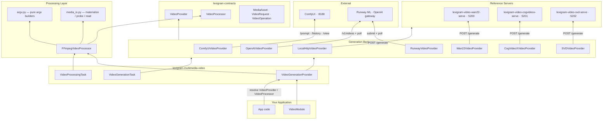

# Architecture

Internal design of `lexigram-multimedia-video` and how it fits into the Lexigram multimedia subsystem.

---

## Role in the System



Two independent surfaces: a **generation** surface (registry-dispatched backend clients over `VideoProvider`) and a **processing** surface (ffmpeg pipeline over `VideoProcessor`). They share the `MediaAsset` value object and the provider lifecycle.

---

## Key Components

### Generation

- **`VideoModule`** — DI module exporting `VideoProcessor`, `VideoProvider`, `VideoGenerationTask`, `VideoProcessingTask`. `stub()` pins `local-http` for tests.
- **`VideoGenerationProvider`** — DI provider (`name = "video"`). `register()` selects and constructs the backend, binds tasks, gate-keeps the processor on `ffmpeg` availability. Provides `health_check()`.
- **Seven backend clients** (`providers/`) — all implement `VideoProvider.generate()`:

| Client | Wire shape | Notes |
|--------|-----------|-------|
| `LocalHttpVideoProvider` | single `POST /generate` | accepts raw bytes or `{"url": ...}` responses; zero-dependency default |
| `RunwayVideoProvider` | submit (`/v1/text_to_video` / `/v1/image_to_video`) + poll (`/v1/tasks/{id}`), status `SUCCEEDED` | `VideoGenerationAuthenticationError` on 401, `VideoTimeoutError` past poll budget |
| `OpenAIVideoProvider` | submit (`/v1/videos`) + poll, status `completed` | gateway-shaped payloads; `VideoMode` derivation; per-mode validation |
| `Wan22VideoProvider` | `POST /generate` (:5200) | text-to-video + image-to-video |
| `CogVideoXVideoProvider` | `POST /generate` (:5201) | primarily text-to-video; image handling is server-side |
| `SVDVideoProvider` | `POST /generate` (:5202) | requires `image_uri`, ignores `prompt` |
| `ComfyUiVideoProvider` | `/prompt` → `/history/{id}` → `/view` | fills `default_svd.json` workflow; requires `image_uri` reachable by ComfyUI |

### Processing

- **`FFmpegVideoProcessor`** — subprocess runner for every `VideoOperation`. Bounded by a semaphore (`max_concurrent_jobs`), workdir-per-job (`temp_dir`, cleaned in `finally`), hard job timeout (`processing.timeout` → kill). Two execution paths: `_run` (plain) and `_run_streaming` (`-nostats -progress pipe:1`, parses `out_time`/`out_time_ms` into `0.0 → 1.0` callbacks).
- **`argv.py`** — **pure argv builders**, the heart of processing:
  - `build_argv(operation, input_paths, output_path, ffmpeg_binary, clip_durations, subtitle_path)` — one `match` arm per `VideoOperation` variant.
  - `build_compose_argv(operation, ...)` — `ComposeVideo` filter graph: `setpts=PTS-STARTPTS+<start>/TB` start-aligned layers, overlay enable windows `between(t,start,end)`, per-layer `fade=t=in/out` on layer PTS, whole-composition fades, base fade-out (`base_fade_out`), `adelay`+`volume`+`amix` audio layers, optional `EncodeSpec` args, fast-path plain copy for no-op composes.
  - `cues_to_srt(cues)` — SRT serialization for `BurnSubtitles`.
  - Internal tables: `_COLOR_PRESETS` (grayscale/sepia/vintage), `_POSITION_EXPR` / `_OVERLAY_POSITION_EXPR` (8 named `OverlayPosition`s).
  - Crossfade concat builds a sequential `xfade`/`acrossfade` chain with a `1/30s` epsilon for hard cuts (a real `0.0` duration silently truncates the chain in ffmpeg 6.x).
- **`media_io.py`** — asset↔filesystem bridge: `materialize_asset` (bytes→temp file, `file://` passthrough with existence check, other URIs HTTP-GET), `read_output_asset` (file→`MediaAsset` bytes), `probe_duration`, `probe_fps` (ffprobe), `materialize_frames_sequential` (`frame%06d.png` pattern for ffmpeg `-i`).

### Orchestration

- **`VideoGenerationTask`** / **`VideoProcessingTask`** — flat-dict adapters for the async job path; `_operation_from_params` reconstructs all 14 operation variants from `operation_type` (the dataclass class name) + nested asset dicts.

---

## Dependency Flow

```
VideoRequest ──► VideoProvider (protocol) ──► selected backend ──► POST /generate ──► MediaAsset
VideoOperation ─► VideoProcessor (protocol) ─► FFmpegVideoProcessor
                  └─ build_argv / build_compose_argv (pure)
                  └─ materialize_asset / probe_* (media_io)
                  └─ create_subprocess_exec ffmpeg ──► MediaAsset
```

- Backend selection is a config-key dispatch in `register()` (`backend == "local-http"` … `"comfyui"`), so adding engines never touches callers.
- The processing pipeline is split into pure argv construction and I/O-heavy execution — argv builders are trivially unit-testable without running ffmpeg.
- Everything crosses boundaries as `Result[MediaAsset, VideoGenerationError]`; infrastructure-level failures inside providers are returned as `Err` domain values, and task `run()` re-raises them so jobs fail loudly.

---

## Providers

| Registration | Binding |
|--------------|---------|
| `container.singleton(VideoConfig, ...)` | Config object |
| `container.singleton(VideoProvider, backend)` | Selected generation backend |
| `container.singleton(VideoGenerationTask, ...)` | Wraps the same backend |
| `container.singleton(VideoProcessor, FFmpegVideoProcessor)` | **Only if** `shutil.which(ffmpeg_binary)` — otherwise logs `video_processing_disabled` |
| `container.singleton(VideoProcessingTask, ...)` | Wraps the processor, same condition |

Resolved optionally at `register()`: `AsyncSecretStoreProtocol` (via `resolve_credential`), `RetryPolicyProtocol`, `CircuitBreakerProtocol` (via `resolve_optional`).

---

## Contracts

Used from `lexigram-contracts` (`lexigram.contracts.multimedia`):

| Contract | Location | Used by |
|----------|----------|---------|
| `VideoProvider` | `contracts/multimedia/protocols.py` | implemented by all 7 backends |
| `VideoProcessor` | `contracts/multimedia/protocols.py` | implemented by `FFmpegVideoProcessor`; consumed by `lexigram-multimedia-upscale`'s `VideoUpscaleService` |
| `MediaAsset`, `VideoRequest`, `VideoMode`, `VideoOperation` + variants, `TransitionSpec`, `SubtitleCue`, `ComposeLayer`, `ComposeAudioLayer`, `EncodeSpec`, `OverlayPosition` | `contracts/multimedia/types.py` | all request/response and operation value objects |
| `VideoGenerationError`, `ProviderNotInstalledError` | `contracts/multimedia/exceptions.py` | base + registration errors |

Package leaf exceptions (`exceptions.py`): `VideoTimeoutError` (`LEX_ERR_MM_VIDEO_001`), `VideoGenerationAuthenticationError` (`LEX_ERR_MM_VIDEO_002`), `VideoProcessingError` (`LEX_ERR_MM_VIDEO_003`) — all extend `VideoGenerationError`.

---

## Lifecycle

- **`register(container)`** — merge config; bind `VideoConfig`; resolve secrets/resilience; construct backend by `config.backend`; bind `VideoProvider` + `VideoGenerationTask`; conditionally bind `VideoProcessor` + `VideoProcessingTask` (ffmpeg gate).
- **`boot(container)`** — no-op: per-request connections only.
- **`shutdown()`** — inherited base behavior; no long-lived sockets (ComfyUI/Runway/OpenAI sessions are created per call).
- **`health_check(timeout=5.0)`** — HTTP backends: `GET /health` (`/system_stats` for ComfyUI), `200 → HEALTHY`; API backends: `HEALTHY` iff a credential resolved; no backend → `UNHEALTHY`.

---

## Design Decisions

- **Protocols, not a base class.** The four multimedia protocols are separate structural `Protocol`s; backends are `cast` to `VideoProvider` without inheritance (contracts' intentional shape).
- **Thin HTTP clients everywhere.** No vendor SDKs in the main dependency list — raw `aiohttp` for local servers, Runway, OpenAI, and ComfyUI alike (uniform resilience wrapping, uniform timeouts).
- **Registry-style backend dispatch.** `register()` branches over `VideoConfig.backend`; unknown values raise `ProviderNotInstalledError` at DI time with an actionable hint.
- **Secrets by name.** `AsyncSecretStoreProtocol` lookups happen once at registration; `_credential_resolved` feeds health.
- **Synchronous subprocess discipline.** One ffmpeg invocation per operation with a bounded semaphore and hard timeout — no background ffmpeg daemons, no unbounded concurrency; progress comes from `-progress pipe:1`.
- **Pure-argv/side-effecting-media split.** `argv.py` never touches disk or subprocesses — ffmpeg commands are unit-tested as data; `media_io.py` owns all filesystem/HTTP side effects.
- **Dataclass-discriminated operations.** `operation_type` (class name) round-trips through task params, matching `Timeline.from_params()` conventions elsewhere in the framework.
- **Prompt is a request, not config.** Duration/resolution/format/factors are per-request (`VideoRequest`) — config only selects the engine and its endpoints.

---

## Extension Points

| Point | Mechanism |
|-------|-----------|
| New generation engine | Implement `VideoProvider.generate()`; construct it where backends are selected (custom provider or a `VideoModule` variant) and bind as `VideoProvider` |
| New processing engine | Implement `VideoProcessor` (contract) and bind it — `VideoUpscaleService` and task adapters adapt automatically |
| New ffmpeg operation | Add the dataclass to `VideoOperation` in contracts, a `match` arm in `build_argv`, a `_materialize_inputs` case, and a `_operation_from_params` branch |
| Custom ComfyUI graph | Point `comfyui_workflow_path` at any template with the documented placeholders |
| Custom reference server | Any HTTP server speaking `POST /generate` (+ `GET /health`); add a console script (`lexigram-video-*-serve`) |
| Retry / fail-fast | Register `RetryPolicyProtocol` / `CircuitBreakerProtocol` — backend calls get wrapped automatically |
| Progress UX | Pass a `progress_callback` to `process()` |
| Async orchestration | Drive `VideoGenerationTask` / `VideoProcessingTask` directly or via the umbrella's `submit()` job path |