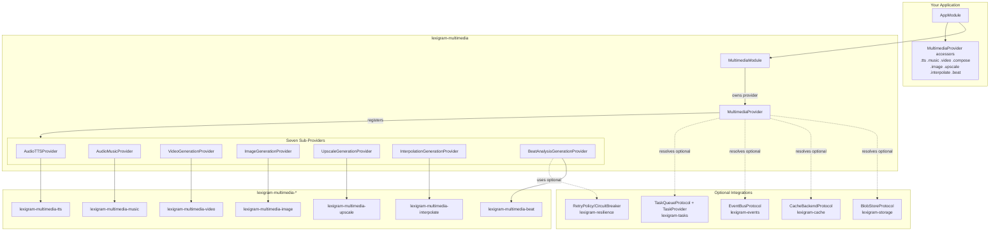

# Architecture

Internal design of `lexigram-multimedia` — the orchestration umbrella for the multimedia subsystem.

---

## Role in the System

`lexigram-multimedia` is the **composition layer** that turns seven independently
installable generation packages into one DI graph consumable from an application. It owns
no generation logic itself: it registers each sibling sub-provider, resolves optional
cross-cutting services (storage, cache, events, tasks), and exposes a unified accessor
surface.



**Import rule:** the umbrella imports only from `lexigram`, `lexigram-contracts`, and the
sibling packages it declares as dependencies. It imports `lexigram-tasks` and
`lexigram-storage` types inside methods (lazy) so optional integration is graceful.

---

## Key Components

- **`MultimediaModule`** — the `@module()` DI entry point. `configure()` returns a
  `DynamicModule` with a `MultimediaProvider` and exports all seven protocols;
  `stub()` imports every subsystem's stub module.
- **`MultimediaProvider`** — the conductor. Owns seven sub-provider instances, binds
  `MultimediaConfig`, delegates their `register()`/`boot()`/`shutdown()`/`health_check()`,
  and exposes accessor properties.
- **`SubsystemAccessor`** — generic sync/queued facade over one backend. Adds cache lookups,
  `MultimediaGenerationEvent` publishing, and idempotent `submit()`.
- **`VideoAccessor`** — composes a generation accessor and a processing accessor for video,
  plus whole-video upscale/interpolate delegations.
- **`ComposeAccessor`** — sync `render()` and queued `submit_render()` for `Timeline`.
- **`BeatAccessor`** — thin sync-only delegate returning a `BeatAnalysisResult`.
- **`Timeline` / `TimelineRenderTask`** — mutable composition builder and its queued render
  handler.
- **`storage/normalize`** — `normalize_asset_dict`, `normalize_operation_assets`,
  `normalize_timeline_assets` upload bytes to blob storage and swap them for URIs.
- **`stores/idempotency`** — `InMemoryIdempotencyStoreFallback`, used only when no
  `IdempotencyStoreProtocol` is bound.

---

## Dependency Flow

```
contract → sub-provider → accessor (storage/cache/events) → your service
        └── normalize → blob storage
        └── submit() ──> IdempotentTaskManager → task queue → task handler → assets
```

The umbrella wires this in two phases:

1. **register()** — binds `MultimediaConfig`, instantiates each sub-provider from its typed
   config sub-object, calls each `sub.register(container)` (which binds its protocol), then
   discovers extra subsystems via the `lexigram.multimedia.subsystems` entry-point group
   (skipping the core names in `CORE_SUBSYSTEMS`).
2. **boot()** — cleanly resolves `BlobStoreProtocol`, `CacheBackendProtocol`,
   `EventBusProtocol`; then `_wire_task_manager()` binds handlers if tasks are available.

---

## Providers

| Provider | Registers in `register()` |
|----------|---------------------------|
| `AudioTTSProvider` | `TTSProvider`, TTS backend (from `config.tts`) |
| `AudioMusicProvider` | `MusicProvider`, music backend |
| `VideoGenerationProvider` | `VideoProvider`, `VideoProcessor`, video backend + ffmpeg processing |
| `ImageGenerationProvider` | `ImageProvider`, image backend |
| `UpscaleGenerationProvider` | `UpscaleProvider`, upscale backend (+ optional video upscale service) |
| `InterpolationGenerationProvider` | `InterpolationProvider`, interpolation backend (+ optional video interpolation service) |
| `BeatAnalysisGenerationProvider` | `BeatAnalysisProvider`, librosa/madmom backend |

The umbrella also registers each task handler via `task_provider.register_handler(...)`
when `lexigram-tasks` is present: `tts_generation`, `music_generation`, `video_generation`,
`video_processing`, `upscale_generation`, `interpolate_generation`, `timeline_render`.

---

## Contracts

All protocols and value types come from `lexigram.contracts.multimedia`
(`protocols.py`, `types.py`, `exceptions.py`).

| Protocol | Purpose | Implemented By |
|----------|---------|----------------|
| `TTSProvider` | `generate(TTSRequest) -> Result[MediaAsset, MultimediaError]` | TTS backend |
| `MusicProvider` | `generate(MusicRequest)` | Music backend |
| `VideoProvider` | `generate(VideoRequest)` | Video backend |
| `VideoProcessor` | `process(operation)` / `extract_frames` / `assemble_frames` | FFmpeg processor |
| `ImageProvider` | `generate(ImageRequest)` | Image backend |
| `UpscaleProvider` | `upscale(UpscaleRequest)` | Upscale backend |
| `InterpolationProvider` | `interpolate(InterpolationRequest)` | Interpolation backend |
| `BeatAnalysisProvider` | `analyze(BeatAnalysisRequest) -> Result[BeatAnalysisResult,_]` | librosa/madmom |

**Key value types:** `MediaAsset` (bytes or URI), `JobHandle` (`job_id`, `status`,
`is_duplicate`), `VideoOperation` (union of `Trim`, `Concat`, `ComposeVideo`,
`OverlayText`, `OverlayImage`, `BurnSubtitles`, `MuxAudio`, `Transcode`, `Crop`,
`ColorFilter`, `RawFilter`, …), `TransitionSpec`, `SubtitleCue`, `ComposeLayer`,
`EncodeSpec`.

**Exceptions:** `MultimediaError` (base, `LEX_ERR_MM_001`) and leaves `TTSError`,
`MusicGenerationError`, `VideoGenerationError`, `ImageGenerationError`, `UpscaleError`,
`BeatAnalysisError`, `ProviderNotInstalledError` (`LEX_ERR_MM_006`).

---

## Lifecycle

- **register(container)** — bind `MultimediaConfig`; instantiate + register the seven
  sub-providers; discover extra subsystems via entry points.
- **boot(container)** — resolve optional `BlobStoreProtocol` / `CacheBackendProtocol` /
  `EventBusProtocol`; `_wire_task_manager()` binds `IdempotentTaskManager` and task handlers.
- **shutdown()** — call `shutdown()` on every sub-provider in reverse, then clear
  `_sub_providers`.
- **health_check()** — aggregate each sub-provider's `HealthCheckResult`; reports
  `HEALTHY` when all healthy, `DEGRADED` when any component is degraded.

Resolutions happen on `boot()`, **not** `register()`, because `Application.start()` runs the
"register all providers" phase before "boot all providers" — a peer provider (e.g.
`lexigram-storage`) may not have bound `BlobStoreProtocol` yet during this provider's
`register()`.

---

## Design Decisions

- **Hardcoded core wiring over pure entry-point discovery.** The seven siblings each need a
  typed config sub-object from `MultimediaConfig`, which a generic entry-point loop cannot
  supply — so `register()` instantiates them explicitly (mirroring how `AIProvider`
  hardcodes llm/vector/rag), while still **also** discovering non-core subsystems via entry
  points.
- **Namespace-package sharing.** `multimedia/__init__.py` calls
  `pkgutil.extend_path()` so sibling wheels co-exist under `lexigram.multimedia.*`.
- **Result, not exceptions.** Generation failures are `Err(MultimediaError)` values —
  expected, recoverable domain failures.
- **Graceful optional integrations.** Storage/cache/events/tasks are resolved in `boot()`
  inside `try/except`; absence degrades features (no `submit()`) instead of halting startup.
- **`JobHandle` decouples callers from `lexigram-tasks`.** It wraps
  `IdempotencyResult` so consumers never import task types.
- **Bytes-vs-URI normalization.** `MediaAsset` carries either, and the umbrella normalizes
  to URI across the queue boundary because task results serialize to JSON.

---

## Extension Points

| Point | Mechanism |
|-------|-----------|
| Add a subsystem | Ship a package exposing a `lexigram.multimedia.subsystems` entry point pointing at a provider class (auto-registered in `boot`) |
| Add a module stub | Expose a `lexigram.multimedia.modules` entry point; `MultimediaModule.stub()` loads it automatically |
| Custom backend | Use the sibling package's provider/backend config (`e.g. tts.backend = "my-backend"`) |
| Custom caching | Bind a `CacheBackendProtocol` and set `cache_results: true` |
| Result observability | Bind an `EventBusProtocol`; successful accessor `generate()` publishes `MultimediaGenerationEvent` |
| Resilience | Bind `RetryPolicyProtocol` / `CircuitBreakerProtocol` for resilient HTTP backends |
| Custom accessor | Subclass/instantiate `SubsystemAccessor`, `VideoAccessor`, `ComposeAccessor`, or `BeatAccessor` directly with your own backend |